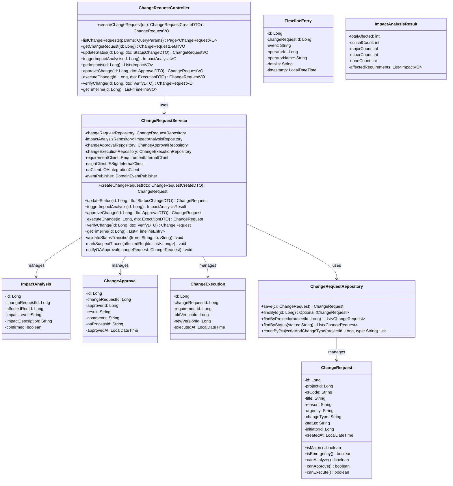
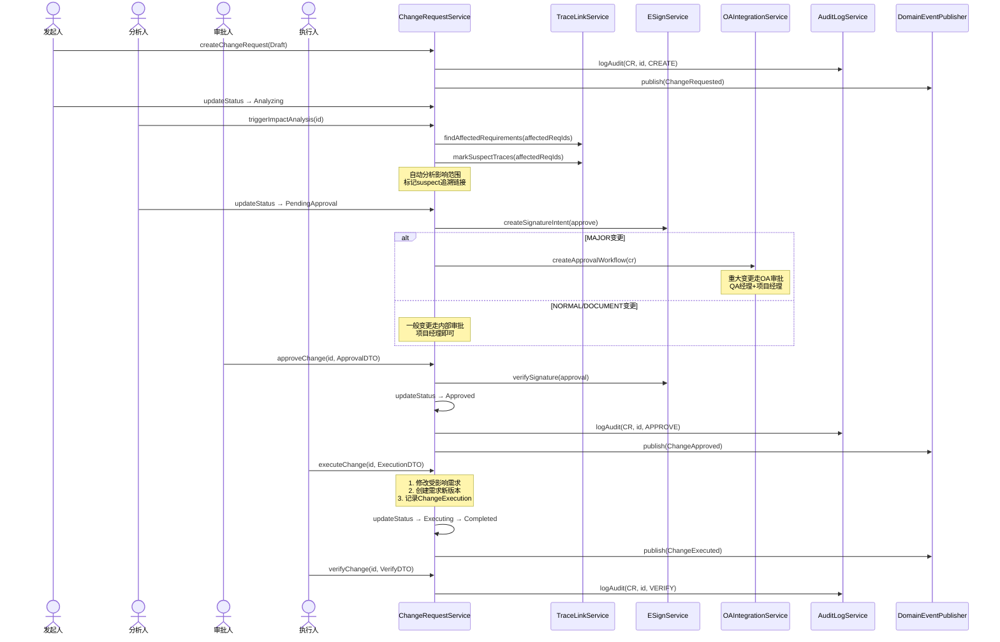
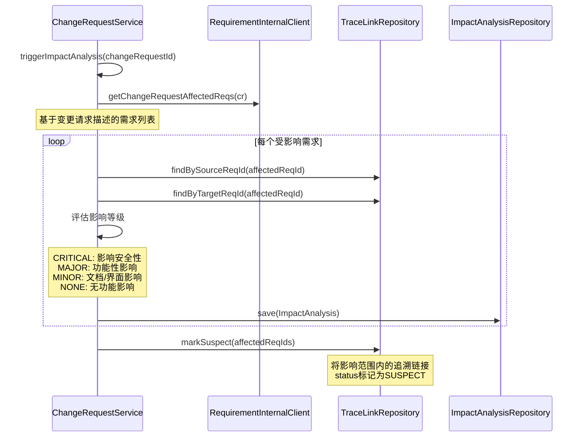

# Med-RMS 详细设计 — 变更管理模块（chg-mgr）

> 文档版本：v1.3 | 编制日期：2026-05-22 | 基线：概要设计 v1.2 + 系统架构 v1.1
> 技术栈：MyBatis-Plus 3.5.x

---

## 1. 模块概述

### 1.1 职责边界

变更管理模块负责需求变更的全生命周期管理，从变更请求创建、影响分析、审批、执行到验证，确保所有变更受控且可追溯，满足 ISO 13485 变更控制要求。

**核心职责**：
- 变更请求创建与管理（CR编号自动生成）
- 影响分析（自动识别受影响需求，标记 suspect 追溯链接）
- 变更审批（对接OA审批流 / 内部审批）
- 变更执行与验证
- 变更时间线记录

### 1.2 与其他模块交互

| 交互模块 | 交互方式 | 说明 |
|----------|----------|------|
| req-mgr | 领域事件 | 变更执行时修改需求内容，触发版本创建 |
| trace-mgr | 领域事件 | 变更请求标记 suspect 追溯链接 |
| e-sign | 内部接口 | 变更审批触发电子签名 |
| compliance | 领域事件 | 变更执行写入审计日志 |
| proj-mgr | 领域事件 | DCP门控校验变更完成情况 |
| report | 领域事件 | 变更统计更新 |
| e-sign（JWT黑名单） | 内部接口 | 用户登出时，认证模块调用e-sign模块的JwtBlacklistService.addToBlacklist(token, expiry)将JWT加入黑名单；所有需要认证的API调用时通过JwtBlacklistService.isBlacklisted(token)校验 |

---

## 2. 类图



---

## 3. 核心流程时序图

### 3.1 变更请求完整流程



### 3.2 影响分析流程



---

## 4. 服务接口伪代码

### 4.1 ChangeRequestService.createChangeRequest()

```java
@Transactional
public ChangeRequest createChangeRequest(ChangeRequestCreateDTO dto) {
    // 1. 参数校验
    Assert.hasText(dto.getTitle(), "变更标题不能为空");
    Assert.hasText(dto.getReason(), "变更原因不能为空");
    Assert.isTrue(VALID_CHANGE_TYPES.contains(dto.getChangeType()), "变更类型无效");
    Assert.isTrue(VALID_URGENCIES.contains(dto.getUrgency()), "紧急度无效");

    // 2. 创建变更请求
    ChangeRequest cr = new ChangeRequest();
    cr.setProjectId(dto.getProjectId());
    cr.setCrCode(generateCrCode(dto.getProjectId())); // CR-{项目编号}-{序号}
    cr.setTitle(dto.getTitle());
    cr.setReason(dto.getReason());
    cr.setUrgency(dto.getUrgency());
    cr.setChangeType(dto.getChangeType());
    cr.setStatus("Draft");
    cr.setInitiatorId(SecurityContext.getCurrentUserId());
    cr.setCreatedAt(LocalDateTime.now());
    changeRequestRepository.save(cr);

    // 3. 紧急变更特殊处理
    if ("EMERGENCY".equals(dto.getChangeType())) {
        // 紧急变更直接进入执行状态，事后补审批
        cr.setStatus("Executing");
        auditLogService.log("CHANGE_REQUEST", cr.getId(), "EMERGENCY_EXECUTE",
            null, JsonUtils.toJson(cr), "紧急变更，事后补审批");
    }

    // 4. 审计日志
    auditLogService.log("CHANGE_REQUEST", cr.getId(), "CREATE",
        null, JsonUtils.toJson(cr), "创建变更请求");

    // 5. 发布领域事件
    eventPublisher.publish(new ChangeRequested(cr.getId(),
        cr.getProjectId(), cr.getChangeType(), cr.getInitiatorId()));

    return cr;
}
```

### 4.2 ChangeRequestService.approveChange()

```java
@Transactional
public ChangeRequest approveChange(Long id, ApprovalDTO dto) {
    ChangeRequest cr = changeRequestRepository.findById(id)
        .orElseThrow(() -> new BusinessException(030501, "变更请求不存在"));

    // 1. 状态校验
    Assert.isTrue("PendingApproval".equals(cr.getStatus()),
        "仅待审批状态可审批");

    // 2. 权限校验
    if ("MAJOR".equals(cr.getChangeType())) {
        // 重大变更需QA经理审批
        Assert.isTrue(hasRole("QA_MANAGER"),
            "重大变更需QA经理审批");
    }

    // 3. 电子签名校验
    esignClient.verifySignature(dto.getSignatureId());

    // 4. 创建审批记录
    ChangeApproval approval = new ChangeApproval();
    approval.setChangeRequestId(id);
    approval.setApproverId(SecurityContext.getCurrentUserId());
    approval.setResult(dto.getResult());
    approval.setComments(dto.getComments());
    approval.setOaProcessId(dto.getOaProcessId());
    approval.setApprovedAt(LocalDateTime.now());
    changeApprovalRepository.save(approval);

    // 5. 更新变更请求状态
    if ("APPROVED".equals(dto.getResult())) {
        cr.setStatus("Approved");
    } else if ("REJECTED".equals(dto.getResult())) {
        cr.setStatus("Rejected");
    }
    changeRequestRepository.save(cr);

    // 6. 审计日志
    auditLogService.log("CHANGE_REQUEST", id, "APPROVE",
        null, JsonUtils.toJson(approval), "变更审批: " + dto.getResult());

    // 7. 发布领域事件
    if ("APPROVED".equals(dto.getResult())) {
        eventPublisher.publish(new ChangeApproved(id, cr.getProjectId()));
    }

    return cr;
}
```

### 4.3 ChangeRequestService.executeChange()

```java
@Transactional
public ChangeRequest executeChange(Long id, ExecutionDTO dto) {
    ChangeRequest cr = changeRequestRepository.findById(id)
        .orElseThrow(() -> new BusinessException(030501, "变更请求不存在"));

    Assert.isTrue("Approved".equals(cr.getStatus()), "仅已批准变更可执行");

    // 1. 执行变更：为每个受影响需求创建新版本
    List<ImpactAnalysis> impacts = impactAnalysisRepository
        .findByChangeRequestId(id);

    for (ImpactAnalysis impact : impacts) {
        if (impact.isConfirmed()) {
            // 创建需求新版本（调用 req-mgr 内部接口）
            RequirementVersionVO newVersion = requirementClient
                .createVersion(impact.getAffectedReqId(),
                    new VersionCreateDTO("变更执行: " + cr.getCrCode()));

            // 记录执行
            ChangeExecution execution = new ChangeExecution();
            execution.setChangeRequestId(id);
            execution.setRequirementId(impact.getAffectedReqId());
            execution.setOldVersionId(impact.getAffectedReqVersionId());
            execution.setNewVersionId(newVersion.getId());
            execution.setExecutedAt(LocalDateTime.now());
            changeExecutionRepository.save(execution);

            // 清除 suspect 标记
            traceLinkService.clearSuspectMark(impact.getAffectedReqId());
        }
    }

    // 2. 更新状态
    cr.setStatus("Executing");
    changeRequestRepository.save(cr);

    // 3. 审计日志
    auditLogService.log("CHANGE_REQUEST", id, "EXECUTE",
        null, JsonUtils.toJson(dto), "执行变更");

    // 4. 发布领域事件
    eventPublisher.publish(new ChangeExecuted(id, cr.getProjectId()));

    return cr;
}
```

---

## 4.1 变更发起前置条件

> **变更记录**：2026-06-01 | Claude | 新增 | 明确基线化前置条件，对齐PRD§7.4.1验收标准

**核心规则**：
- **已基线化需求（Baseline状态）**：修改必须走变更流程（CR）
- **未基线化需求（Draft/Submitted/Approved等状态）**：直接编辑，编辑后状态退回草稿，重新走评审流程

**创建变更申请的前置校验**：

| 校验项 | 不通过时的处理 |
|-------|---------------|
| 需求必须已基线化（status='Baseline'） | 拒绝创建CR，提示"未基线化需求请直接编辑，无需发起变更" |
| 需求必须存在 | 提示"需求不存在" |

---

## 5. 状态机详细转换规则

| From | To | 触发条件 | 前置校验 | 产生事件 |
|------|----|----------|----------|----------|
| Draft | Analyzing | 点击"开始分析" | 需求必须已基线化 | — |
| Analyzing | PendingApproval | 完成影响分析 | 至少1项影响分析已确认 | — |
| Analyzing | Draft | 取消分析 | — | — |
| PendingApproval | Approved | 审批通过 | MAJOR需QA经理签名; 电子签名已验证 | ChangeApproved |
| PendingApproval | Rejected | 审批驳回 | — | — |
| Approved | Executing | 开始执行 | 审批已通过 | — |
| Executing | Completed | 执行完成 | 所有受影响需求已更新版本 | ChangeExecuted |
| Draft | Cancelled | 取消变更 | — | — |
| Analyzing | Cancelled | 取消变更 | — | — |

---

## 6. 审批策略矩阵

| 变更类型 | 审批人 | 审批方式 | 签名要求 |
|----------|--------|----------|----------|
| MAJOR | QA经理 + 项目经理 | OA审批流 | 双人签名 |
| NORMAL | 项目经理 | 内部审批 | 单人签名 |
| DOCUMENT | 需求工程师 | 内部审批 | 单人签名 |
| EMERGENCY | 事后补审批 | 先执行后审批 | 事后补签名 |

---

## 7. 变更记录

| 版本 | 日期 | 变更内容 | 变更原因 | 修订人 |
|------|------|----------|----------|--------|
| v1.0 | 2026-05-22 | 初始版本 | 详细设计交付 | Gao |
| v1.1 | 2026-05-22 | 技术栈从JPA/Hibernate改为MyBatis-Plus 3.5.x，对齐系统架构§4.1 | M-01：技术栈标注不一致 | Gao |
| v1.1 | 2026-05-22 | 跨模块协作补充JWT黑名单协作说明 | M-03：其他模块未体现JWT黑名单协作 | Gao |
| v1.2 | 2026-06-01 | 新增§4.1变更发起前置条件，明确基线化前置要求；状态转换规则补充"需求必须已基线化"前置校验 | 与PRD§7.4.1对齐，补充业务规则说明 | Claude |
| v1.3 | 2026-06-06 | v1.47 变更管理域 4 P0 修复：① **P0#4 TimelineEntry 实体**（BUG #142）新建 `ChangeTimelineEntry` 实体 + `ChangeTimelineMapper`（selectByChangeId），`ChangeService.recordTimeline()` 私有方法在 CREATED/SUBMITTED/APPROVED/REJECTED/EXECUTED/EMERGENCY_EXECUTED 7 个状态转换点统一记录；Controller 新增 `GET /changes/{id}/timeline` 端点；DDL 131 建 t_change_timeline 表 + 3 索引（含 signatureId 字段关联 Part 11 签名）；② **P0#7 电子签名集成**（BUG #115）`approveChange` 加 signatureId 参数，MAJOR 变更必须传 signatureId 否则抛 `param` 异常（Part 11 §11.50/§11.70）；`ChangeApproval` 实体写入 signatureId；SIGNED 时间线记录关联签名；③ **P0#6 双签锁定**（BUG #118）`executeChange` 对 MAJOR/CRITICAL 变更校验 ≥2 个不同 approver 签署（Part 11 §11.200）；`ChangeApprovalMapper` 加 `selectByChangeId` 查唯一 approver 数；④ **P0#6 OA 集成**（BUG #120）新建 `OaIntegrationService`（mock 模式：生成 OA-WF-xxx workflowId + 缓存 + 发 outbox 事件 + 记录时间线 EVENT_OA_DISPATCHED）；`ChangeService.createChangeRequest` 对 MAJOR 变更或 EMERGENCY 紧急度自动推 OA 审批流；支持 onOaApprovalCallback 接收 OA 回写；端到端验证：创建 MAJOR 变更 id=76 → 时间线含 `OA_DISPATCHED` 事件 + workflowId；创建 NORMAL+NORMAL 变更 id=79 → 时间线仅 `CREATED`（不触发 OA） | 修复《详细设计偏差分析报告》§3.3 变更管理域 4 个 P0 | Claude |
