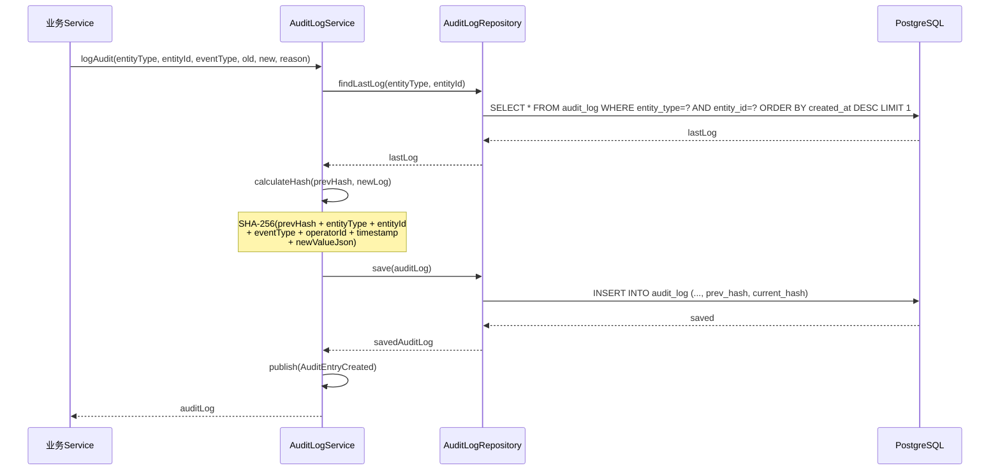
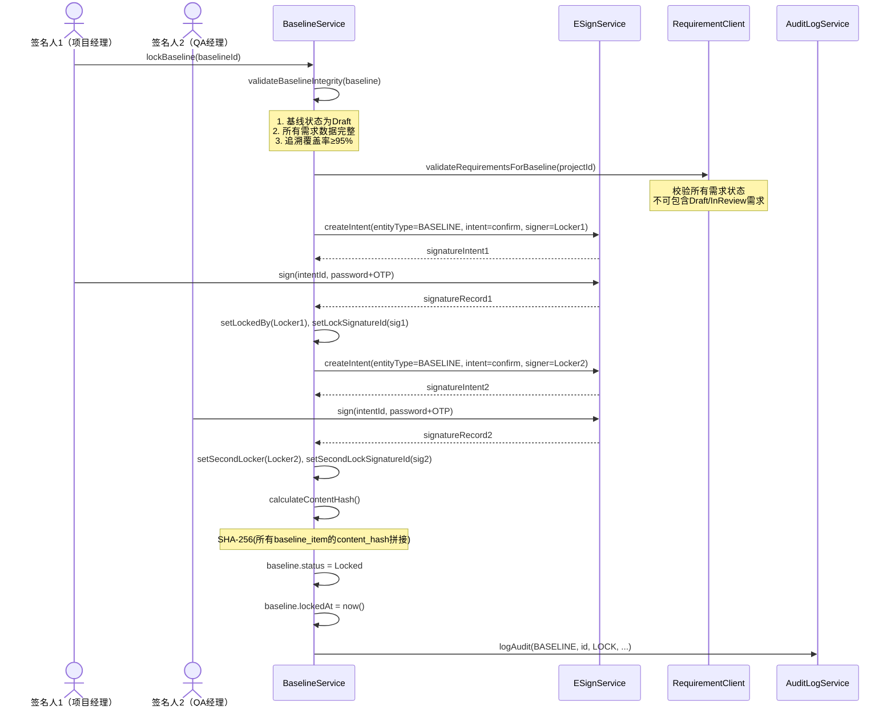
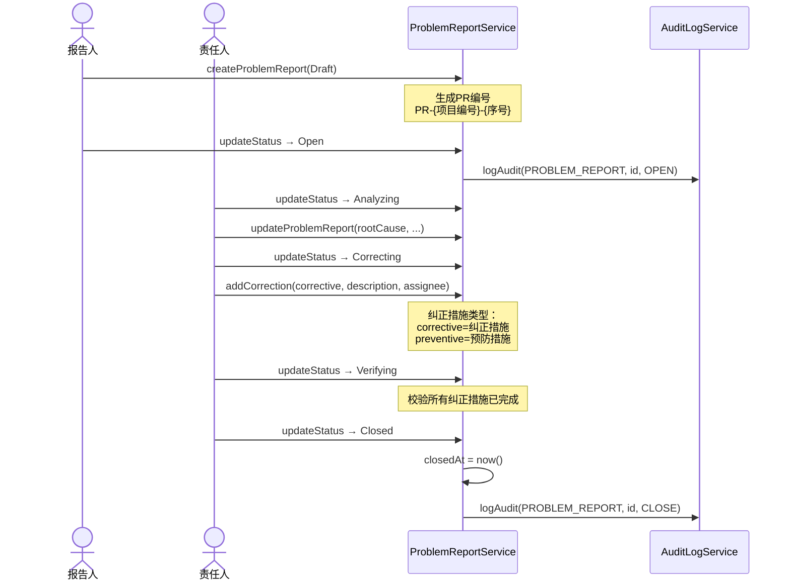

# Med-RMS 详细设计 — 合规管理模块（compliance）

> 文档版本：v1.2 | 编制日期：2026-05-22 | 基线：概要设计 v1.2 + 系统架构 v1.1
> 技术栈：MyBatis-Plus 3.5.x

---

## 1. 模块概述

### 1.1 职责边界

合规管理是 Med-RMS 最核心的合规保障模块，涵盖审计日志、SOUP 管理、安全分类、基线管理、法规映射、问题报告和 IEC 62304 合规检查，是满足 21 CFR Part 11 / IEC 62304 / ISO 13485 / NMPA eRPS 的核心支撑。

**核心职责**：
- 审计日志管理（追加只写 + 哈希链 + 永久保留）
- SOUP（第三方软件）登记与审查
- 安全分类管理（IEC 62304 Class A/B/C）
- 基线管理（双人签名锁定 + SHA-256 对比）
- 法规映射管理
- 问题报告管理（ISO 13485 纠正预防措施）
- IEC 62304 合规检查清单

### 1.2 与其他模块交互

| 交互模块 | 交互方式 | 说明 |
|----------|----------|------|
| e-sign | 内部接口 | 基线锁定/解锁需双人签名 |
| req-mgr | 领域事件 | 基线包含需求数据，锁定校验需求状态 |
| trace-mgr | 领域事件订阅 | 追溯链接变更影响基线完整性 |
| chg-mgr | 领域事件 | 变更执行写入审计日志 |
| report | 领域事件 | 合规数据变更触发统计更新 |
| risk-mgr | 领域事件 | 安全分类关联风险管理 |
| e-sign（JWT黑名单） | 内部接口 | 用户登出时，认证模块调用e-sign模块的JwtBlacklistService.addToBlacklist(token, expiry)将JWT加入黑名单；所有需要认证的API调用时通过JwtBlacklistService.isBlacklisted(token)校验 |

---

## 2. 类图

```mermaid
classDiagram
    class AuditLogController {
        +listAuditLogs(params: QueryParams) Page~AuditLogVO~
        +getEntityAuditLogs(entityType: String, entityId: Long) List~AuditLogVO~
        +verifyHashChain(dto: HashVerifyDTO) VerifyResultVO
    }

    class SoupController {
        +createSoup(dto: SoupCreateDTO) SoupVO
        +listSoup(params: QueryParams) Page~SoupVO~
        +updateSoup(id: Long, dto: SoupUpdateDTO) SoupVO
        +reviewSoup(id: Long, dto: ReviewDTO) SoupVO
    }

    class SafetyClassificationController {
        +listClassifications(params: QueryParams) List~SafetyClassificationVO~
        +createClassification(dto: SafetyClassificationDTO) SafetyClassificationVO
    }

    class BaselineController {
        +createBaseline(dto: BaselineCreateDTO) BaselineVO
        +listBaselines(params: QueryParams) Page~BaselineVO~
        +getBaseline(id: Long) BaselineDetailVO
        +lockBaseline(id: Long) BaselineVO
        +unlockBaseline(id: Long, dto: UnlockDTO) BaselineVO
        +compareBaselines(id: Long, targetId: Long) BaselineDiffVO
    }

    class ProblemReportController {
        +createProblemReport(dto: ProblemReportCreateDTO) ProblemReportVO
        +listProblemReports(params: QueryParams) Page~ProblemReportVO~
        +getProblemReport(id: Long) ProblemReportDetailVO
        +updateStatus(id: Long, dto: StatusChangeDTO) ProblemReportVO
        +addCorrection(id: Long, dto: CorrectionDTO) CorrectionVO
        +listCorrections(id: Long) List~CorrectionVO~
    }

    class Iec62304Controller {
        +getChecklist(projectId: Long) List~ChecklistItemVO~
        +assessClause(projectId: Long, dto: AssessmentDTO) ChecklistItemVO
    }

    class AuditLogService {
        -auditLogRepository: AuditLogRepository
        +logAudit(entityType: String, entityId: Long, eventType: String, oldValue: String, newValue: String, reason: String) AuditLog
        +queryAuditLogs(params: QueryParams) Page~AuditLog~
        +queryByEntity(entityType: String, entityId: Long) List~AuditLog~
        +verifyHashChain(entityType: String, entityId: Long) VerifyResultVO
        -calculateHash(prevHash: String, log: AuditLog) String
    }

    class AuditLog {
        -id: Long
        -entityType: String
        -entityId: Long
        -eventType: String
        -operatorId: Long
        -operatorName: String
        -oldValueJson: String
        -newValueJson: String
        -reason: String
        -prevHash: String
        -currentHash: String
        -createdAt: LocalDateTime
    }

    class SoupService {
        -soupRepository: SoupRepository
        +createSoup(dto: SoupCreateDTO) SoupRecord
        +updateSoup(id: Long, dto: SoupUpdateDTO) SoupRecord
        +reviewSoup(id: Long, dto: ReviewDTO) SoupRecord
        +listSoup(params: QueryParams) Page~SoupRecord~
    }

    class SoupRecord {
        -id: Long
        -projectId: Long
        -name: String
        -version: String
        -supplier: String
        -purpose: String
        -license: String
        -safetyClass: String
        -status: String
        -relatedReqIds: String
        -lastReviewDate: LocalDate
        -reviewResult: String
        -anomalyReviewRecord: String
        -createdBy: Long
        -createdAt: LocalDateTime
        -updatedBy: Long
        -updatedAt: LocalDateTime
    }

    class BaselineService {
        -baselineRepository: BaselineRepository
        -baselineItemRepository: BaselineItemRepository
        -esignClient: ESignInternalClient
        +createBaseline(dto: BaselineCreateDTO) Baseline
        +lockBaseline(id: Long) Baseline
        +unlockBaseline(id: Long, dto: UnlockDTO) Baseline
        +compareBaselines(sourceId: Long, targetId: Long) BaselineDiffVO
        -validateBaselineIntegrity(baseline: Baseline) void
        -calculateItemHash(itemId: Long) String
    }

    class Baseline {
        -id: Long
        -projectId: Long
        -name: String
        -description: String
        -status: String
        -lockedBy: Long
        -lockedAt: LocalDateTime
        -lockSignatureId: Long
        -secondLockerId: Long
        -secondLockSignatureId: Long
        -comparisonAlgorithm: String
        -createdBy: Long
        -createdAt: LocalDateTime
        -updatedBy: Long
        -updatedAt: LocalDateTime
    }

    class BaselineItem {
        -id: Long
        -baselineId: Long
        -requirementId: Long
        -versionId: Long
        -contentHash: String
        -includedAt: LocalDateTime
    }

    class ProblemReportService {
        -problemReportRepository: ProblemReportRepository
        -correctionRepository: PrCorrectionRepository
        +createProblemReport(dto: ProblemReportCreateDTO) ProblemReport
        +updateStatus(id: Long, dto: StatusChangeDTO) ProblemReport
        +addCorrection(id: Long, dto: CorrectionDTO) PrCorrection
        +listCorrections(id: Long) List~PrCorrection~
    }

    class ProblemReport {
        -id: Long
        -projectId: Long
        -prCode: String
        -title: String
        -description: String
        -source: String
        -severity: String
        -status: String
        -relatedReqId: Long
        -relatedSoupId: Long
        -rootCause: String
        -correctiveAction: String
        -reporterId: Long
        -ownerId: Long
        -reportedAt: LocalDateTime
        -closedAt: LocalDateTime
    }

    class PrCorrection {
        -id: Long
        -problemReportId: Long
        -actionType: String
        -description: String
        -assigneeId: Long
        -dueDate: LocalDate
        -status: String
        -completedAt: LocalDateTime
        -createdAt: LocalDateTime
    }

    class Iec62304Checklist {
        -id: Long
        -projectId: Long
        -clauseNo: String
        -clauseTitle: String
        -complianceStatus: String
        -evidence: String
        -gaps: String
        -assessorId: Long
        -assessedAt: LocalDateTime
    }

    AuditLogController --> AuditLogService : uses
    SoupController --> SoupService : uses
    BaselineController --> BaselineService : uses
    ProblemReportController --> ProblemReportService : uses
    Iec62304Controller --> Iec62304Checklist : manages
    AuditLogService --> AuditLog : manages
    SoupService --> SoupRecord : manages
    BaselineService --> Baseline : manages
    BaselineService --> BaselineItem : manages
    ProblemReportService --> ProblemReport : manages
    ProblemReportService --> PrCorrection : manages
```



---

## 3. 核心流程时序图

### 3.1 审计日志写入流程（哈希链）



### 3.2 基线锁定流程（双人签名）



### 3.3 问题报告处理流程



---

## 4. 服务接口伪代码

### 4.1 AuditLogService.logAudit()

```java
@Transactional
public AuditLog logAudit(String entityType, Long entityId, String eventType,
                          String oldValueJson, String newValueJson, String reason) {
    // 1. 获取前一条日志（计算哈希链）
    AuditLog lastLog = auditLogRepository
        .findLastLog(entityType, entityId)
        .orElse(null);

    String prevHash = (lastLog != null) ? lastLog.getCurrentHash() : "GENESIS";

    // 2. 构建审计日志
    AuditLog log = new AuditLog();
    log.setEntityType(entityType);
    log.setEntityId(entityId);
    log.setEventType(eventType);
    log.setOperatorId(SecurityContext.getCurrentUserId());
    log.setOperatorName(SecurityContext.getCurrentUserName());
    log.setOldValueJson(oldValueJson);
    log.setNewValueJson(newValueJson);
    log.setReason(reason);
    log.setPrevHash(prevHash);
    log.setCreatedAt(LocalDateTime.now());

    // 3. 计算当前哈希
    String hashInput = prevHash + "|" + entityType + "|" + entityId + "|"
        + eventType + "|" + log.getOperatorId() + "|"
        + log.getCreatedAt().toString() + "|" + newValueJson;
    log.setCurrentHash(sha256(hashInput));

    // 4. 保存（触发器保证不可UPDATE/DELETE）
    auditLogRepository.save(log);

    // 5. 发布领域事件
    eventPublisher.publish(new AuditEntryCreated(log.getId(),
        entityType, entityId, eventType));

    return log;
}
```

### 4.2 AuditLogService.verifyHashChain()

```java
public VerifyResultVO verifyHashChain(String entityType, Long entityId) {
    List<AuditLog> logs = auditLogRepository
        .findByEntityTypeAndEntityIdOrderByCreatedAtAsc(entityType, entityId);

    if (logs.isEmpty()) {
        return new VerifyResultVO(true, "无审计日志记录", 0);
    }

    int brokenAtIndex = -1;
    String expectedPrevHash = "GENESIS";

    for (int i = 0; i < logs.size(); i++) {
        AuditLog log = logs.get(i);

        // 校验 prevHash 连续性
        if (!expectedPrevHash.equals(log.getPrevHash())) {
            brokenAtIndex = i;
            break;
        }

        // 校验 currentHash 正确性
        String hashInput = log.getPrevHash() + "|" + log.getEntityType() + "|"
            + log.getEntityId() + "|" + log.getEventType() + "|"
            + log.getOperatorId() + "|" + log.getCreatedAt().toString() + "|"
            + log.getNewValueJson();
        String expectedHash = sha256(hashInput);

        if (!expectedHash.equals(log.getCurrentHash())) {
            brokenAtIndex = i;
            break;
        }

        expectedPrevHash = log.getCurrentHash();
    }

    boolean isValid = (brokenAtIndex == -1);
    return new VerifyResultVO(isValid,
        isValid ? "哈希链完整" : "哈希链断裂于第" + (brokenAtIndex + 1) + "条记录",
        logs.size());
}
```

### 4.3 BaselineService.lockBaseline()

```java
@Transactional
public Baseline lockBaseline(Long id) {
    Baseline baseline = baselineRepository.findById(id)
        .orElseThrow(() -> new BusinessException(040501, "基线不存在"));

    Assert.isTrue("Draft".equals(baseline.getStatus()), "仅Draft状态可锁定");

    // 1. 校验基线完整性
    validateBaselineIntegrity(baseline);

    // 2. 双人签名锁定
    // 签名人1（项目经理）
    SignatureIntentVO intent1 = esignClient.createIntent(
        "BASELINE", id, "confirm", baseline.getCreatedBy());
    // 签名人2（QA经理）— 需从项目成员中查找QA经理
    Long qaManagerId = getProjectQAManager(baseline.getProjectId());
    SignatureIntentVO intent2 = esignClient.createIntent(
        "BASELINE", id, "confirm", qaManagerId);

    // 3. 计算内容哈希
    List<BaselineItem> items = baselineItemRepository
        .findByBaselineId(id);
    String contentHash = calculateBaselineContentHash(items);

    // 4. 更新基线
    baseline.setStatus("Locked");
    baseline.setLockedAt(LocalDateTime.now());
    baseline.setComparisonAlgorithm("sha256");
    baselineRepository.save(baseline);

    // 5. 审计日志
    auditLogService.log("BASELINE", id, "LOCK",
        null, JsonUtils.toJson(baseline), "基线锁定（双人签名）");

    return baseline;
}
```

### 4.4 BaselineService.compareBaselines()

```java
public BaselineDiffVO compareBaselines(Long sourceId, Long targetId) {
    Baseline source = baselineRepository.findById(sourceId)
        .orElseThrow(() -> new BusinessException(040501, "源基线不存在"));
    Baseline target = baselineRepository.findById(targetId)
        .orElseThrow(() -> new BusinessException(040501, "目标基线不存在"));

    List<BaselineItem> sourceItems = baselineItemRepository.findByBaselineId(sourceId);
    List<BaselineItem> targetItems = baselineItemRepository.findByBaselineId(targetId);

    // 构建需求ID→版本ID映射
    Map<Long, Long> sourceMap = sourceItems.stream()
        .collect(Collectors.toMap(BaselineItem::getRequirementId, BaselineItem::getVersionId));
    Map<Long, Long> targetMap = targetItems.stream()
        .collect(Collectors.toMap(BaselineItem::getRequirementId, BaselineItem::getVersionId));

    List<BaselineDiffVO.DiffEntry> diffs = new ArrayList<>();

    // 新增的需求
    Set<Long> added = new HashSet<>(targetMap.keySet());
    added.removeAll(sourceMap.keySet());
    for (Long reqId : added) {
        diffs.add(new BaselineDiffVO.DiffEntry(reqId, "ADDED", null, targetMap.get(reqId)));
    }

    // 删除的需求
    Set<Long> removed = new HashSet<>(sourceMap.keySet());
    removed.removeAll(targetMap.keySet());
    for (Long reqId : removed) {
        diffs.add(new BaselineDiffVO.DiffEntry(reqId, "REMOVED", sourceMap.get(reqId), null));
    }

    // 修改的需求（版本不同）
    Set<Long> common = new HashSet<>(sourceMap.keySet());
    common.retainAll(targetMap.keySet());
    for (Long reqId : common) {
        if (!sourceMap.get(reqId).equals(targetMap.get(reqId))) {
            diffs.add(new BaselineDiffVO.DiffEntry(reqId, "MODIFIED",
                sourceMap.get(reqId), targetMap.get(reqId)));
        }
    }

    return new BaselineDiffVO(sourceId, targetId, diffs);
}
```

---

## 5. 审计日志哈希链算法

### 5.1 哈希计算公式

```
currentHash = SHA-256(
    prevHash + "|" +
    entityType + "|" +
    entityId + "|" +
    eventType + "|" +
    operatorId + "|" +
    timestamp(ISO 8601) + "|" +
    newValueJson
)
```

### 5.2 首条记录

```
prevHash = "GENESIS" (固定常量)
```

### 5.3 校验流程

1. 按创建时间升序获取某实体的所有审计日志
2. 首条 prevHash 必须为 "GENESIS"
3. 每条的 currentHash 必须等于按公式重新计算的结果
4. 每条的 prevHash 必须等于前一条的 currentHash
5. 任何不一致即为哈希链断裂

---

## 6. 基线内容哈希算法

```
contentHash = SHA-256(
    sort(baselineItems)
        .map(item -> item.requirementId + ":" + item.versionId + ":" + item.contentHash)
        .join("|")
)
```

---

## 7. IEC 62304 检查清单结构

| 条款号 | 条款标题 | 检查要点 | 证据来源 |
|--------|----------|----------|----------|
| 5.1.1 | 软件开发计划 | 是否制定SDP | 项目文档 |
| 5.1.2 | 保持计划更新 | SDP是否随开发更新 | 变更记录 |
| 5.1.3 | 软件开发计划参考 | SDP是否引用其他计划 | 文档引用 |
| 5.2.1 | 软件需求分析 | SRS是否完整 | 需求管理 |
| 5.2.2 | 软件需求内容 | 需求是否包含功能/性能/接口 | 需求内容 |
| 5.2.3 | 需求可追溯 | 追溯矩阵是否完整 | 追溯管理 |
| 5.3.1 | 软件架构设计 | 是否有架构文档 | 系统架构 |
| 5.3.2 | 架构需求覆盖 | 架构是否覆盖所有需求 | 追溯管理 |
| 5.3.3 | SOUP接口规范 | SOUP接口是否定义 | SOUP管理 |
| 5.3.4 | 架构验证 | 架构是否经验证 | 评审记录 |
| 5.5.1 | 软件集成测试 | 是否有集成测试计划 | 测试用例 |
| 5.5.2 | 集成测试通过 | 集成测试是否通过 | 测试结果 |
| 5.6.1 | 软件验证测试 | 是否有验证测试计划 | 测试用例 |
| 5.6.2 | 验证测试通过 | 验证测试是否通过 | 测试结果 |
| 5.6.3 | 验证证据保留 | 验证证据是否保留 | 文件管理 |
| 5.7.1 | 软件确认测试 | 是否有确认测试 | 测试用例 |
| 5.7.2 | 确认测试通过 | 确认测试是否通过 | 测试结果 |
| 6.1 | 软件维护计划 | 是否有维护计划 | 项目文档 |
| 7.1.1 | 风险管理 | 是否执行风险管理 | 风险管理 |
| 7.1.2 | 风险控制措施 | 是否有风险控制 | 风险管理 |
| 8.1.1 | 配置管理 | 是否有配置管理 | 基线管理 |
| 8.1.2 | 变更控制 | 是否有变更控制 | 变更管理 |
| 9.1 | 问题解决 | 是否有问题报告 | 问题报告 |
| 9.2 | 问题分析 | 是否有根因分析 | 问题报告 |
| 9.3 | 纠正措施 | 是否有纠正措施 | 纠正措施 |
| 9.4 | 纠正措施验证 | 纠正措施是否验证 | 纠正措施 |
| 9.5 | 问题解决记录 | 是否保留问题记录 | 审计日志 |
| 9.6 | 问题趋势分析 | 是否分析问题趋势 | 统计报表 |
| 9.7 | SOUP问题 | SOUP异常是否记录 | SOUP管理 |
| 9.8 | SOUP补丁 | SOUP补丁是否评估 | SOUP管理 |

---

## 8. 变更记录

| 版本 | 日期 | 变更内容 | 变更原因 | 修订人 |
|------|------|----------|----------|--------|
| v1.0 | 2026-05-22 | 初始版本 | 详细设计交付 | Gao |
| v1.1 | 2026-05-22 | 技术栈从JPA/Hibernate改为MyBatis-Plus 3.5.x，对齐系统架构§4.1 | M-01：技术栈标注不一致 | Gao |
| v1.1 | 2026-05-22 | 跨模块协作补充JWT黑名单协作说明 | M-03：其他模块未体现JWT黑名单协作 | Gao |
| v1.2 | 2026-06-06 | v1.47 合规管理域 1 P0 修复：① **P0#6 Baseline 双签锁定**（BUG #119）`Baseline` 实体加 4 字段 `lockUser1Id / lockSignatureId1 / lockUser2Id / lockSignatureId2`（Part 11 §11.200 双签控制），DDL 132 加 4 列 + 4 注释；`BaselineService.createBaseline` 状态由 LOCKED 改为 DRAFT（必须经双签锁定才能 LOCKED）；新增 `lockBaseline(baselineId, user1Id, signatureId1, user2Id, signatureId2)` 方法校验 4 重：user1≠user2 && sig1≠null && sig2≠null && sig1≠sig2 + 状态必须 DRAFT；`BaselineController` 新增 `POST /baselines/{id}/lock` 端点；端到端验证：创建基线 id=52 status=DRAFT → 同人双签被拒 → 同 sig 双签被拒 → 缺 sig 被拒 → 合法双签 status=LOCKED + 4 字段正确写入 → 重复锁定被拒（7 场景全过） | 修复《详细设计偏差分析报告》§3.4 合规管理域 1 个 P0（Baseline 双签锁定） | Claude |
