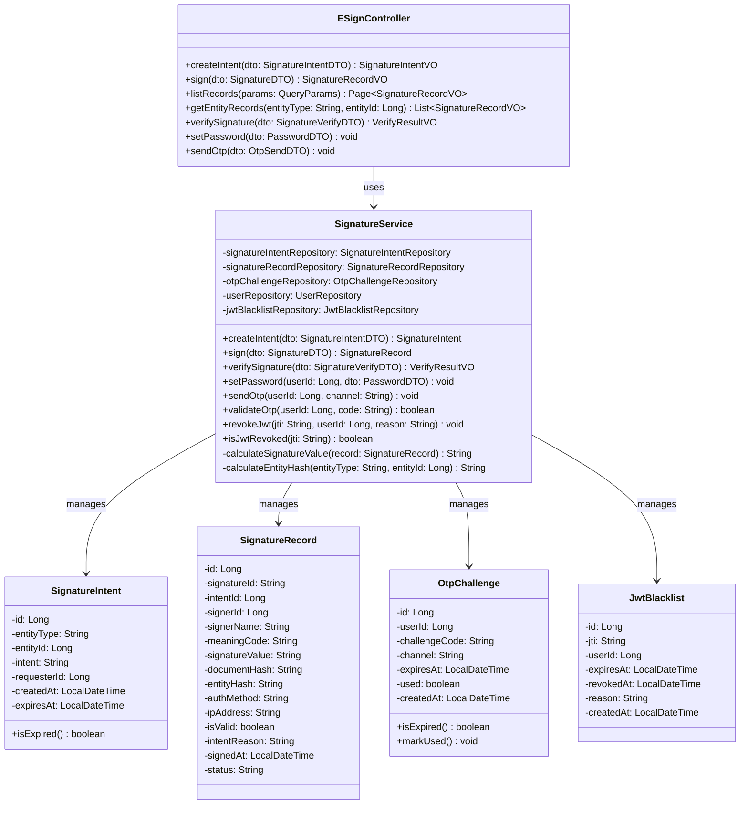
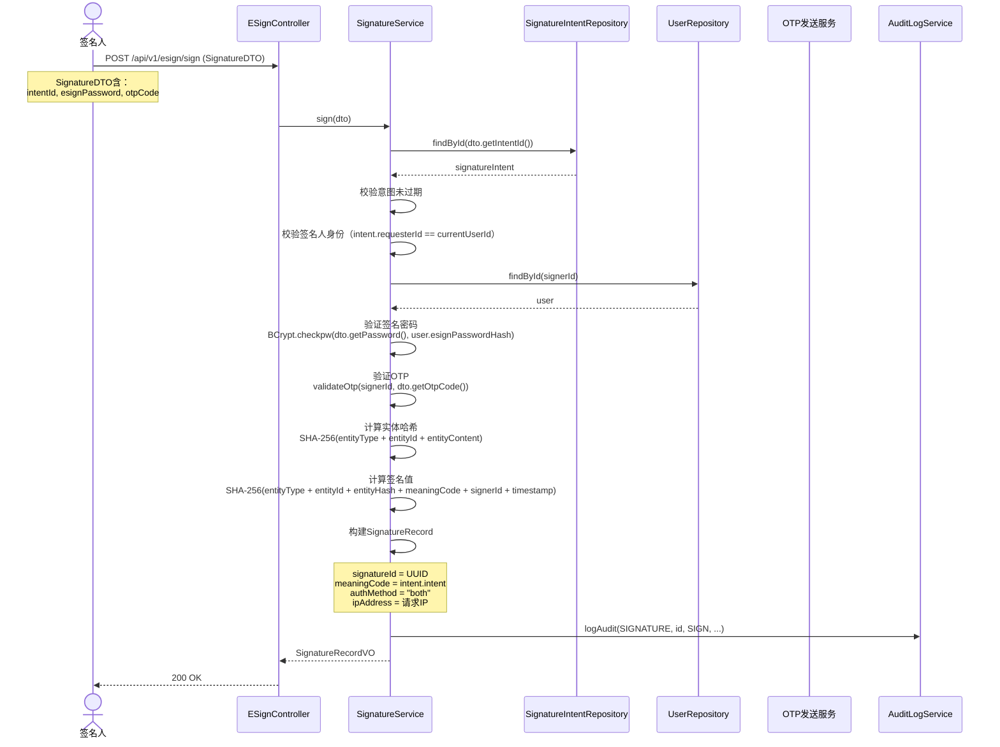
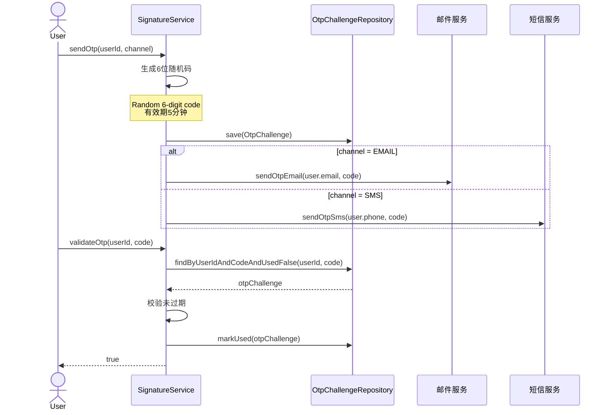

# Med-RMS 详细设计 — 电子签名模块（e-sign）

> 文档版本：v1.3 | 编制日期：2026-05-22 | 最后修订：2026-06-06 | 基线：概要设计 v1.2 + 系统架构 v1.1
> 技术栈：MyBatis-Plus 3.5.x

---

## 1. 模块概述

电子签名模块实现 21 CFR Part 11 要求的电子签名能力，独立于 JWT 认证体系，采用签名密码 + OTP 双因素认证，确保签名的不可否认性和完整性。

**核心职责**：
- 签名意图管理（intent）
- 签名执行（密码 + OTP 双因素）
- 签名记录管理（不可篡改）
- 签名密码管理（独立于登录密码）
- OTP 动态码发送与验证
- JWT 黑名单管理（登出/密码修改时失效 Token）

---

## 2. 类图



---

## 3. 核心流程时序图

### 3.1 电子签名执行流程（密码 + OTP）



### 3.2 OTP 发送与验证流程



---

## 4. 服务接口伪代码

### 4.1 SignatureService.sign()

```java
@Transactional
public SignatureRecord sign(SignatureDTO dto) {
    // 1. 校验签名意图
    SignatureIntent intent = signatureIntentRepository.findById(dto.getIntentId())
        .orElseThrow(() -> new BusinessException(050101, "签名意图不存在或已过期"));

    Assert.isTrue(!intent.isExpired(), "签名意图已过期");
    Assert.isTrue(intent.getRequesterId().equals(SecurityContext.getCurrentUserId()),
        "当前用户非指定签名人");

    // 2. 验证签名密码
    User user = userRepository.findById(SecurityContext.getCurrentUserId())
        .orElseThrow(() -> new BusinessException(090501, "用户不存在"));

    if (user.getEsignPasswordHash() == null) {
        throw new BusinessException(050201, "未设置签名密码，请先设置");
    }

    if (!BCrypt.checkpw(dto.getEsignPassword(), user.getEsignPasswordHash())) {
        throw new BusinessException(050201, "签名密码错误");
    }

    // 3. 验证OTP
    if (!validateOtp(user.getId(), dto.getOtpCode())) {
        throw new BusinessException(050202, "OTP验证码错误或已过期");
    }

    // 4. 计算实体哈希
    String entityHash = calculateEntityHash(intent.getEntityType(), intent.getEntityId());

    // 5. 计算签名值
    // SHA-256(entityType + entity_id + entity_hash + meaning_code + signer_id + timestamp)
    LocalDateTime signedAt = LocalDateTime.now();
    String signInput = intent.getEntityType() + "|" + intent.getEntityId() + "|"
        + entityHash + "|" + intent.getIntent() + "|"
        + user.getId() + "|" + signedAt.toString();
    String signatureValue = sha256(signInput);

    // 6. 创建签名记录
    SignatureRecord record = new SignatureRecord();
    record.setSignatureId(UUID.randomUUID().toString());
    record.setIntentId(intent.getId());
    record.setSignerId(user.getId());
    record.setSignerName(user.getRealName());
    record.setMeaningCode(intent.getIntent());
    record.setSignatureValue(signatureValue);
    record.setDocumentHash(entityHash);
    record.setEntityHash(entityHash);
    record.setAuthMethod("both");
    record.setIpAddress(SecurityContext.getClientIp());
    record.setValid(true);
    record.setIntentReason(intent.getIntent());
    record.setSignedAt(signedAt);
    record.setStatus("COMPLETED");
    signatureRecordRepository.save(record);

    // 7. 发布签名完成事件
    eventPublisher.publish(new SignatureCompleted(record.getSignatureId(),
        intent.getEntityType(), intent.getEntityId(), user.getId()));

    return record;
}
```

### 4.2 SignatureService.verifySignature()

```java
public VerifyResultVO verifySignature(SignatureVerifyDTO dto) {
    SignatureRecord record = signatureRecordRepository
        .findBySignatureId(dto.getSignatureId())
        .orElseThrow(() -> new BusinessException(050501, "签名记录不存在"));

    // 1. 校验签名有效性
    if (!record.isValid()) {
        return new VerifyResultVO(false, "签名已被标记为无效", record);
    }

    // 2. 重新计算签名值
    String expectedSignInput = record.getEntityType() + "|" + record.getEntityId() + "|"
        + record.getEntityHash() + "|" + record.getMeaningCode() + "|"
        + record.getSignerId() + "|" + record.getSignedAt().toString();
    String expectedSignature = sha256(expectedSignInput);

    // 3. 比对签名值
    boolean isValid = expectedSignature.equals(record.getSignatureValue());

    // 4. 校验实体哈希（文档是否被篡改）
    String currentEntityHash = calculateEntityHash(record.getEntityType(), record.getEntityId());
    boolean entityIntact = currentEntityHash.equals(record.getEntityHash());

    return new VerifyResultVO(
        isValid && entityIntact,
        isValid ? (entityIntact ? "签名有效且文档完整" : "签名有效但文档已被修改")
                : "签名值校验失败",
        record
    );
}
```

---

## 5. 签名含义编码（不可扩展）

| 编码 | 含义 | 适用场景 |
|------|------|----------|
| approve | 批准 | 评审通过、变更审批 |
| confirm | 确认 | 基线锁定 |
| review | 审核 | 评审审核 |
| release | 发布 | 基线发布、报告发布 |

> ⚠️ 签名含义编码为系统内置枚举，**不可自定义扩展**，满足 21 CFR Part 11 §11.91 要求。

> **枚举澄清**：本系统存在两个维度的签名分类枚举：
> - **sign_intent_type**（签名意图）：描述签名的业务目的，值为 `approve/confirm/review/release`。对应21 CFR Part 11 §11.50的签名含义声明，记录在signature_record.sign_intent字段
> - **meaning_code_type**（签名角色码）：描述签名人在业务流程中的角色，值为 `author/reviewer/approver/second_approver`。用于权限校验和审计追踪，记录在signature_record.meaning_code字段
> 
> 两者关系：一个签名人角色（meaning_code）可以执行不同的签名意图（sign_intent）。例如approver角色可以执行approve意图（审批通过）或review意图（审核确认）。

---

## 6. 变更记录

| 版本 | 日期 | 变更内容 | 变更原因 | 修订人 |
|------|------|----------|----------|--------|
| v1.0 | 2026-05-22 | 初始版本 | 详细设计交付 | Gao |
| v1.1 | 2026-05-22 | 技术栈从JPA/Hibernate改为MyBatis-Plus 3.5.x，对齐系统架构§4.1 | M-01：技术栈标注不一致 | Gao |
| v1.1 | 2026-05-22 | 补充sign_intent_type与meaning_code_type双枚举澄清说明 | m-02：电子签名意义码枚举混淆 | Gao |
| v1.2 | 2026-06-06 | **v1.47 P0 偏差修复 #102-#106 实现说明**（依据《详细设计偏差分析报告》§3.5）：① DDL 114 新增 esign_schema.t_signature_intent 表（4 状态 PENDING/CONSUMED/EXPIRED/CANCELLED + 15min 默认过期 + requesterId/documentType/documentId/intentCode/meaningCode/expiresAt/consumedAt/consumedBy/signatureId）+ 2 字段 entityHash + signatureValue；② SignatureIntent 实体/Mapper/Service 新建；③ ElectronicSignatureService 重写——sign() 必须先 validateAndConsume(intentId, signerId)；calculateSignatureValue SHA-256(documentType\|documentId\|entityHash\|meaningCode\|signerId\|timestamp) §11.70；calculateEntityHash SHA-256(documentType\|documentId\|documentNo) §11.10(e)；verifySignature 重算 entityHash 比对；invalidateSignature 强制 operatorId+reason；reSign 强制 newIntentId；所有 SIGN/INVALIDATE/RESIGN 写 [AUDIT] 日志；④ ElectronicSignatureController 扩展——POST /esignature/intents + /intents/{id}/cancel + SignRequest/ReSignRequest 加 intentId/newIntentId | P0 严重偏差修复 8/39（电子签名 5/5 全部完成）| Claude |
| v1.3 | 2026-06-06 | **BUG #139 P0 修复**：SignatureIntent 端点运行时 SY0000（NOT NULL 违反 requester_id/intent_code）——根因 MyBatis-Plus BaseMapper.insert 自动生成 SQL 漏掉 NOT NULL 列（FieldStrategy + 实体字段缺 @TableField），修复 3 处：① **SignatureIntentMapper 新增 @Insert 自定义 SQL**（`INSERT INTO esign_schema.t_signature_intent (intent_no, requester_id, document_type, document_id, intent_code, meaning_code, status, expires_at, created_at) VALUES (?, ?, ?, ?, ?, ?, ?, ?, ?)`）+ `@Options(useGeneratedKeys=true, keyProperty=id, keyColumn=id)` 让 id 自增回填；② **SignatureIntentService.createIntent** 改调 `intentMapper.insertIntent(intent)` 替代 `insert(intent)`；③ **ElectronicSignatureController.createIntent** 兼容旧前端 `signerId` 别名作为 `requesterId` 回退 + `intentCode` 缺省回退到 `meaningCode`；端到端 e2e 验证：POST /api/esignature/intents `{documentType, documentId, signerId, meaningCode}` → 200+id=9 → POST /api/esignature/sign `{intentId:9, signaturePassword=null}` → 200+id=7（SHA-256 entityHash + signatureValue）→ GET /verify/7 → true → GET /signatures?signerId=1 → 含 id=7 记录 | P0 修复后续扫尾（电子签名 e2e 联调发现）| Claude |
