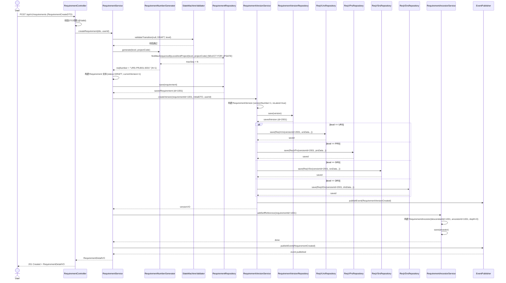
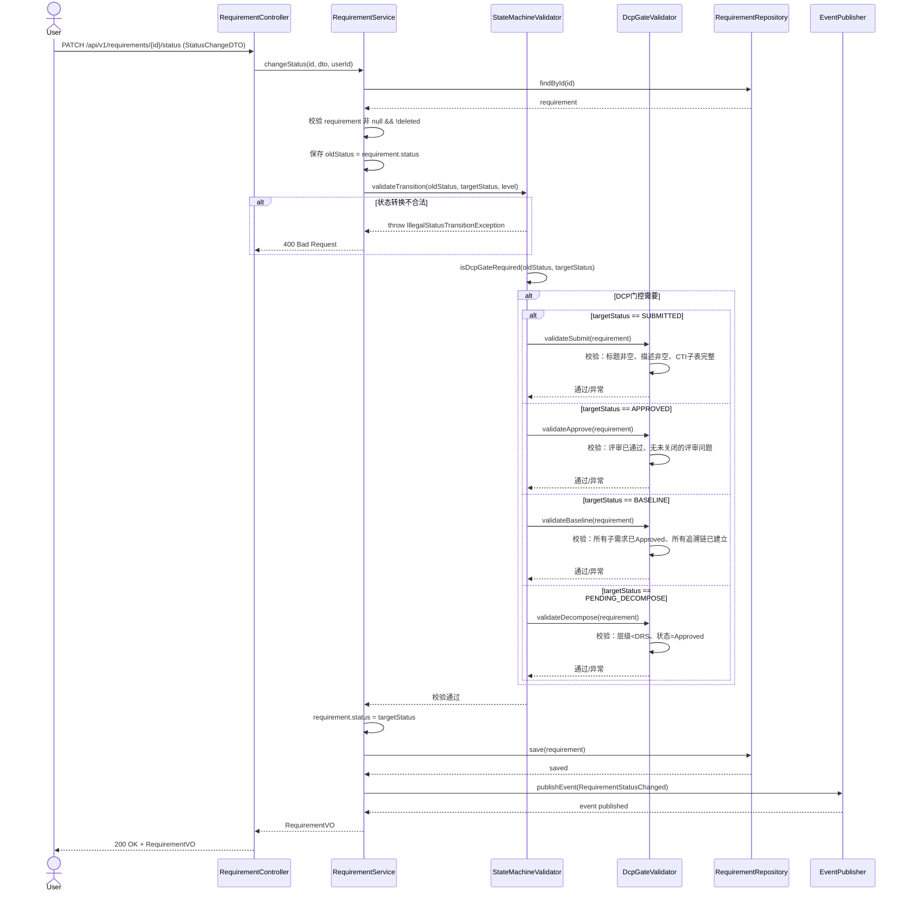
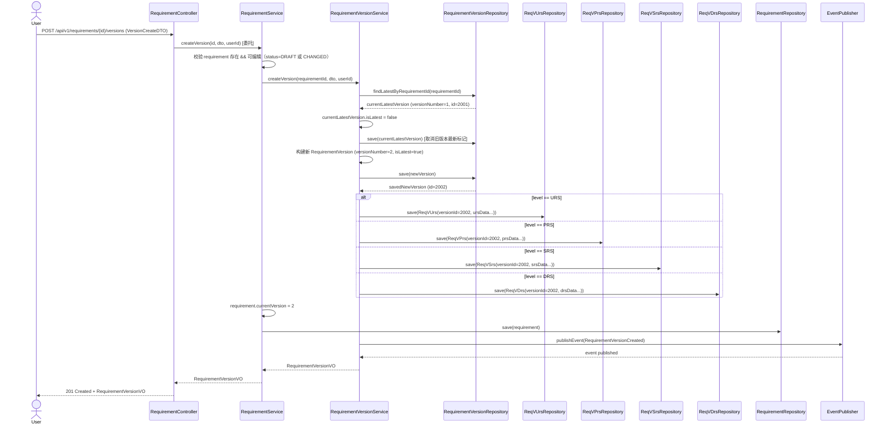
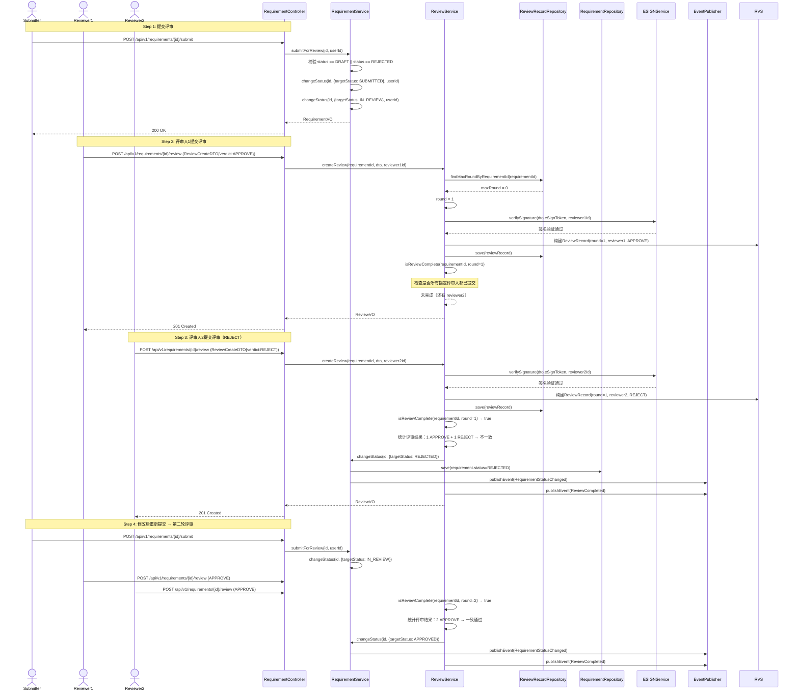
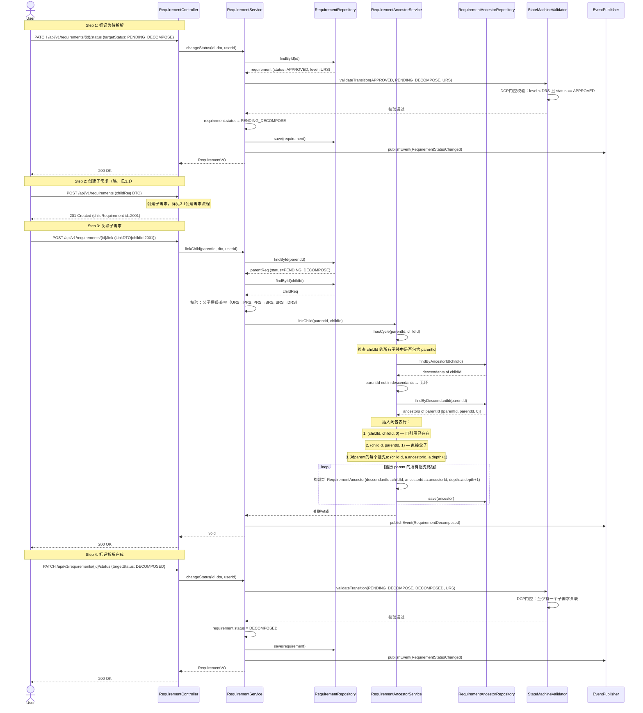

# Med-RMS 需求管理模块（req-mgr）详细设计文档

> **文档版本**: v1.7
> **日期**: 2026-05-22
> **作者**: Gao（高见远）
> **模块**: req-mgr（Requirement Management）
> **Schema**: req_schema
> **技术栈**: Spring Boot 3.x + MyBatis-Plus 3.5.x + PostgreSQL 16
> **合规标准**: 21 CFR Part 11 / IEC 62304 / ISO 13485 / NMPA eRPS

> **⚠️ 偏差声明（R111，2026-06-29）**：本文档与实际代码存在多处偏差，**以代码为准**。状态机已从 14 态扩展至 **18 态**（详见 §5）；事件驱动架构采用 in-process Outbox 模式（非 Debezium CDC）。完整偏差清单与决策见 `架构-实现偏差与文档同步/架构-实现偏差清单.md`。

---

## 目录

1. [模块概述](#1-模块概述)
2. [类图](#2-类图)
3. [核心流程时序图](#3-核心流程时序图)
4. [服务接口伪代码](#4-服务接口伪代码)
5. [状态机详细转换规则](#5-状态机详细转换规则)
6. [跨模块协作说明](#6-跨模块协作说明)
7. [数据校验规则](#7-数据校验规则)

---

## 1. 模块概述

### 1.1 模块职责

req-mgr 是 Med-RMS 系统的核心业务模块，负责医疗器械需求的全生命周期管理，涵盖：

- **需求创建与编辑**：支持 URS（用户需求）、PRS（产品需求）、SRS（系统需求）、DRS（设计需求）四层需求的创建、编辑与维护
- **CTI 分层子表管理**：基于公共主表 `requirement_version` + 4 张分层子表（`req_v_urs/prs/srs/drs`）的继承模式，实现不同层级需求的差异化属性存储
- **需求层级关系**：通过闭包表 `requirement_ancestor` 实现 O(1) 级层级查询，支持需求的拆解与追溯
- **版本管理**：需求的版本化控制，每次实质性修改产生新版本，版本间可追溯
- **状态机驱动**：**18 状态**的严格状态机（v2.5 完整化，见 §5），所有状态转换需通过 DCP（Document Control Process）门控校验。注：v1.7 设计文档描述为 14 态，实际实现扩展为 18 态，新增 `ReviewApproved` / `ReviewRejected` / `PendingVerify` / `Implemented` / `Verified` / `Decomposed` / `Suspect` / `Withdrawn` / `Closed` / `Retired` 等状态（详见 R111）
- **评审流程**：支持多人评审、多轮评审，评审记录完整留存以满足合规审计要求
- **需求导入**：批量导入需求，支持模板化导入与校验
- **变更历史**：完整的变更审计轨迹，满足 21 CFR Part 11 电子记录要求

### 1.2 模块边界

| 边界维度 | 说明 |
|---------|------|
| **属于本模块** | 需求CRUD、版本管理、层级关系、状态流转、评审流程、编号生成、导入导出、变更历史 |
| **不属于本模块** | 追溯链管理（trace-mgr）、变更控制流程（chg-mgr）、合规校验规则定义（compliance）、电子签名验证（e-sign）、权限控制（iam） |

### 1.3 与其他模块的交互关系

| 协作模块 | 交互方式 | 交互内容 |
|---------|---------|---------|
| **trace-mgr** | 领域事件 → 异步 | 需求创建/删除后发布 `RequirementCreated`/`RequirementDeleted` 事件，trace-mgr 据此创建/清理追溯链 |
| **chg-mgr** | 领域事件 → 异步 | 需求变更时发布 `RequirementStatusChanged` 事件，chg-mgr 据此标记 suspect 追溯链 |
| **compliance** | 同步调用 | 基线锁定前调用 compliance 校验需求状态完整性；状态转换时触发合规规则校验 |
| **e-sign** | 同步调用 | 评审签名、基线签名时调用 e-sign 模块进行电子签名验证与记录 |
| **iam** | 基础设施 | 所有操作基于 iam 提供的身份认证与权限上下文 |
| **doc-mgr** | 领域事件 → 异步 | 需求基线后通知 doc-mgr 生成需求规格文档 |

### 1.4 核心设计模式

#### 1.4.1 CTI 分层子表模式（Class Table Inheritance）

```
requirement_version (公共主表)
├── req_v_urs  (URS 特有属性：来源法规、用户场景、验收标准)
├── req_v_prs  (PRS 特有属性：产品功能、性能指标、风险控制措施)
├── req_v_srs  (SRS 特有属性：系统功能、接口定义、环境约束)
└── req_v_drs  (DRS 特有属性：设计元素、设计决策、架构约束)
```

- 公共主表存储所有层级需求的共有字段（标题、描述、优先级、状态等）
- 子表通过 `version_id` 外键关联主表，仅存储该层级特有的属性
- 共享主键（子表 `version_id` = 主表 `id`），MyBatis-Plus 使用 `@OneToOne` + `@PrimaryKeyJoinColumn` 实现（XML Mapper 配置）

#### 1.4.2 闭包表模式（Closure Table）

```
requirement_ancestor (descendant_id, ancestor_id, depth)
```

- 自引用行：每个需求自身 `(id, id, 0)` 始终存在
- 父子关系：`(child_id, parent_id, 1)`
- 祖先关系：`(child_id, grandparent_id, 2)` ... 递推
- 查询所有子孙：`WHERE ancestor_id = ?` — O(1) 索引查询
- 查询所有祖先：`WHERE descendant_id = ?` — O(1) 索引查询
- 无环校验：插入前检查 `(new_ancestor_id, new_descendant_id)` 不已存在于反向路径中

#### 1.4.3 编号生成策略

```
格式: {层级前缀}-{项目编号}-{序号}
示例: URS-PRJ001-0001, PRS-PRJ001-0001, SRS-PRJ001-0001, DRS-PRJ001-0001
```

- 层级前缀：URS / PRS / SRS / DRS
- 项目编号：关联项目的编号，由项目模块分配
- 序号：4 位自增序号，按层级+项目维度独立递增
- 序号生成：`SELECT MAX(sequence) FROM requirement WHERE level = ? AND project_code = ?` + 1，在事务内通过 `SELECT ... FOR UPDATE` 保证唯一性

---

## 2. 类图

```mermaid
classDiagram
    direction TB

    %% ==================== Entity Classes ====================
    class Requirement {
        -Long id
        -String requirementNo
        -ReqType requirementType
        -Long projectId
        -String title
        -String description
        -MoscowPriority priority
        -ReqStatus status
        -RiskLevel riskLevel
        -SafetyClass safetyClass
        -ReqCategory requirementCategory
        -Long baselineId
        -Integer version
        -Boolean isDeleted
        -Long createdBy
        -OffsetDateTime createdAt
        -Long updatedBy
        -OffsetDateTime updatedAt
        +markDeleted() void
        +isEditable() boolean
        +isDeletable() boolean
    }

    class RequirementVersion {
        -Long id
        -Long requirementId
        -Integer versionNumber
        -String title
        -String description
        -MoscowPriority priority
        -String changeReason
        -OffsetDateTime createdAt
        -Long createdBy
        -Boolean isLatest
        +markAsLatest() void
        +markAsNotLatest() void
    }

    class ReqVUrs {
        -Long versionId
        -String sourceRegulation
        -String userScenario
        -String acceptanceCriteria
        -String businessContext
    }

    class ReqVPrs {
        -Long versionId
        -String productFunction
        -String performanceIndex
        -String riskControlMeasure
        -String traceToUrs
    }

    class ReqVSrs {
        -Long versionId
        -String systemFunction
        -String interfaceDefinition
        -String environmentConstraint
        -String traceToPrs
    }

    class ReqVDrs {
        -Long versionId
        -String designElement
        -String designDecision
        -String architectureConstraint
        -String traceToSrs
    }

    class RequirementAncestor {
        -Long id
        -Long descendantId
        -Long ancestorId
        -Integer depth
    }

    class TestCase {
        -Long id
        -String caseNumber
        -String title
        -String description
        -String precondition
        -String steps
        -String expectedResult
        -TestPriority priority
        -Long createdBy
        -OffsetDateTime createdAt
    }

    class RequirementTestcase {
        -Long id
        -Long requirementId
        -Long testcaseId
        -Long createdBy
        -OffsetDateTime createdAt
    }

    class ReviewRecord {
        -Long id
        -Long requirementId
        -Integer round
        -Long reviewerId
        -ReviewVerdict verdict
        -String comments
        -OffsetDateTime reviewedAt
        -String eSignToken
        -Boolean isFinalRound
    }

    class RequirementTag {
        -Long id
        -Long requirementId
        -String tagKey
        -String tagValue
    }

    %% ==================== DTO Classes ====================
    class RequirementCreateDTO {
        -ReqType requirementType
        -Long projectId
        -MoscowPriority priority
        -String title
        -String description
        -RiskLevel riskLevel
        -SafetyClass safetyClass
        -ReqCategory requirementCategory
        -String source
        -UrsCreateDTO ursData
        -PrsCreateDTO prsData
        -SrsCreateDTO srsData
        -DrsCreateDTO drsData
    }

    class UrsCreateDTO {
        -String sourceRegulation
        -String userScenario
        -String acceptanceCriteria
        -String businessContext
    }

    class PrsCreateDTO {
        -String productFunction
        -String performanceIndex
        -String riskControlMeasure
        -String traceToUrs
    }

    class SrsCreateDTO {
        -String systemFunction
        -String interfaceDefinition
        -String environmentConstraint
        -String traceToPrs
    }

    class DrsCreateDTO {
        -String designElement
        -String designDecision
        -String architectureConstraint
        -String traceToSrs
    }

    class RequirementUpdateDTO {
        -String title
        -String description
        -MoscowPriority priority
        -UrsCreateDTO ursData
        -PrsCreateDTO prsData
        -SrsCreateDTO srsData
        -DrsCreateDTO drsData
    }

    class RequirementVO {
        -Long id
        -String requirementNo
        -ReqType requirementType
        -Long projectId
        -String projectName
        -ReqStatus status
        -MoscowPriority priority
        -String title
        -RiskLevel riskLevel
        -SafetyClass safetyClass
        -Integer version
        -Long createdBy
        -String createdByName
        -OffsetDateTime createdAt
        -OffsetDateTime updatedAt
    }

    class RequirementDetailVO {
        -Long id
        -String requirementNo
        -ReqType requirementType
        -Long projectId
        -String projectName
        -ReqStatus status
        -MoscowPriority priority
        -String title
        -String description
        -RiskLevel riskLevel
        -SafetyClass safetyClass
        -ReqCategory requirementCategory
        -Long baselineId
        -Integer version
        -UrsVO ursData
        -PrsVO prsData
        -SrsVO srsData
        -DrsVO drsData
        -List~RequirementVO~ children
        -List~RequirementVO~ parents
        -Long createdBy
        -String createdByName
        -OffsetDateTime createdAt
        -Long updatedBy
        -OffsetDateTime updatedAt
    }

    class UrsVO {
        -String sourceRegulation
        -String userScenario
        -String acceptanceCriteria
        -String businessContext
    }

    class PrsVO {
        -String productFunction
        -String performanceIndex
        -String riskControlMeasure
        -String traceToUrs
    }

    class SrsVO {
        -String systemFunction
        -String interfaceDefinition
        -String environmentConstraint
        -String traceToPrs
    }

    class DrsVO {
        -String designElement
        -String designDecision
        -String architectureConstraint
        -String traceToSrs
    }

    class VersionCreateDTO {
        -String title
        -String description
        -MoscowPriority priority
        -String changeReason
        -UrsCreateDTO ursData
        -PrsCreateDTO prsData
        -SrsCreateDTO srsData
        -DrsCreateDTO drsData
    }

    class RequirementVersionVO {
        -Long id
        -Long requirementId
        -Integer versionNumber
        -String title
        -String description
        -MoscowPriority priority
        -String changeReason
        -Boolean isLatest
        -OffsetDateTime createdAt
        -String createdByName
        -UrsVO ursData
        -PrsVO prsData
        -SrsVO srsData
        -DrsVO drsData
    }

    class ReviewCreateDTO {
        -Long reviewerId
        -ReviewVerdict verdict
        -String comments
        -String eSignToken
    }

    class ReviewVO {
        -Long id
        -Long requirementId
        -Integer round
        -Long reviewerId
        -String reviewerName
        -ReviewVerdict verdict
        -String comments
        -OffsetDateTime reviewedAt
        -Boolean isFinalRound
    }

    class StatusChangeDTO {
        -ReqStatus targetStatus
        -String changeReason
    }

    class LinkDTO {
        -Long childId
        -String linkReason
    }

    class ImportResultVO {
        -Integer total
        -Integer success
        -Integer failed
        -List~ImportErrorDetail~ errors
    }

    class ImportErrorDetail {
        -Integer row
        -String reqNumber
        -String errorMessage
    }

    class HistoryVO {
        -Long id
        -String action
        -String oldValue
        -String newValue
        -Long operatedBy
        -String operatedByName
        -OffsetDateTime operatedAt
    }

    class TraceLinkCreateDTO {
        -Long parentId
        -Long childId
        -String linkReason
    }

    class TraceLinkVO {
        -Long parentId
        -String parentReqNumber
        -Long childId
        -String childReqNumber
        -Integer depth
        -String linkReason
    }

    %% ==================== Enum Classes ====================
    class ReqLevel {
        <<enumeration>>
        URS
        PRS
        SRS
        DRS
    }

    class ReqStatus {
        <<enumeration>>
        DRAFT
        PENDING_DECOMPOSE
        DECOMPOSED
        SUBMITTED
        IN_REVIEW
        APPROVED
        REJECTED
        PENDING_VERIFY
        IMPLEMENTED
        VERIFIED
        BASELINE
        CHANGED
        CLOSED
        RETIRED
    }

    class MoscowPriority {
        <<enumeration>>
        MUST
        SHOULD
        COULD
        WONT
    }

    class ReviewVerdict {
        <<enumeration>>
        APPROVE
        REJECT
        ABSTAIN
    }

    class TestPriority {
        <<enumeration>>
        HIGH
        MEDIUM
        LOW
    }

    %% ==================== Service Classes ====================
    class RequirementService {
        -RequirementRepository requirementRepo
        -RequirementVersionService versionService
        -RequirementAncestorService ancestorService
        -RequirementNumberGenerator numberGenerator
        -ApplicationEventPublisher eventPublisher
        -StateMachineValidator stateMachineValidator
        +createRequirement(RequirementCreateDTO dto, Long userId) RequirementDetailVO
        +getRequirement(Long id) RequirementDetailVO
        +listRequirements(RequirementQueryParams params) Page~RequirementVO~
        +updateRequirement(Long id, RequirementUpdateDTO dto, Long userId) RequirementDetailVO
        +deleteRequirement(Long id, Long userId) void
        +changeStatus(Long id, StatusChangeDTO dto, Long userId) RequirementVO
        +submitForReview(Long id, Long userId) RequirementVO
        +decomposeRequirement(Long id, List~Long~ childIds, Long userId) RequirementVO
        +linkChild(Long parentId, LinkDTO dto, Long userId) void
        +unlinkChild(Long parentId, Long childId, Long userId) void
        +getChildren(Long id) List~RequirementVO~
        -validateDeletable(Requirement req) void
        -publishStatusChangedEvent(Requirement req, ReqStatus oldStatus) void
    }

    class RequirementVersionService {
        -RequirementVersionRepository versionRepo
        -ReqVUrsRepository ursRepo
        -ReqVPrsRepository prsRepo
        -ReqVSrsRepository srsRepo
        -ReqVDrsRepository drsRepo
        -ApplicationEventPublisher eventPublisher
        +createVersion(Long requirementId, VersionCreateDTO dto, Long userId) RequirementVersionVO
        +listVersions(Long requirementId) List~RequirementVersionVO~
        +getLatestVersion(Long requirementId) RequirementVersionVO
        +getVersion(Long requirementId, Integer versionNumber) RequirementVersionVO
        +copyCtiSubTable(Long sourceVersionId, Long targetVersionId, ReqLevel level, Object ctiData) void
        -buildVersionVO(RequirementVersion version, ReqLevel level) RequirementVersionVO
    }

    class ReviewService {
        -ReviewRecordRepository reviewRepo
        -RequirementRepository requirementRepo
        -ESignService eSignService
        -ApplicationEventPublisher eventPublisher
        +submitReview(Long requirementId, Long userId) ReviewVO
        +createReview(Long requirementId, ReviewCreateDTO dto, Long userId) ReviewVO
        +listReviews(Long requirementId) List~ReviewVO~
        +isReviewComplete(Long requirementId, Integer round) boolean
        -determineReviewRound(Long requirementId) Integer
        -advanceStatusAfterReview(Long requirementId) void
    }

    class RequirementAncestorService {
        -RequirementAncestorRepository ancestorRepo
        +addSelfReference(Long requirementId) void
        +linkChild(Long parentId, Long childId) void
        +unlinkChild(Long parentId, Long childId) void
        +getAncestors(Long descendantId) List~RequirementAncestor~
        +getDescendants(Long ancestorId) List~RequirementAncestor~
        +getDirectChildren(Long parentId) List~RequirementAncestor~
        +getDirectParents(Long childId) List~RequirementAncestor~
        +hasCycle(Long ancestorId, Long descendantId) boolean
        +getDepth(Long descendantId, Long ancestorId) Integer
        +removeAllPaths(Long requirementId) void
    }

    class TestCaseService {
        -TestCaseRepository testcaseRepo
        -RequirementTestcaseRepository reqTestcaseRepo
        +createTestCase(TestCaseCreateDTO dto, Long userId) TestCaseVO
        +linkTestcase(Long requirementId, Long testcaseId, Long userId) void
        +unlinkTestcase(Long requirementId, Long testcaseId) void
        +listTestcasesByRequirement(Long requirementId) List~TestCaseVO~
    }

    class RequirementImportService {
        -RequirementRepository requirementRepo
        -RequirementVersionService versionService
        -RequirementAncestorService ancestorService
        -RequirementNumberGenerator numberGenerator
        +importRequirements(MultipartFile file, String projectCode, Long userId) ImportResultVO
        -parseFile(MultipartFile file) List~RequirementCreateDTO~
        -validateBatch(List~RequirementCreateDTO~ dtoList) List~ImportErrorDetail~
    }

    class RequirementNumberGenerator {
        -RequirementRepository requirementRepo
        +generate(ReqLevel level, String projectCode) String
        -getNextSequence(ReqLevel level, String projectCode) Integer
    }

    class StateMachineValidator {
        -Map~ReqStatus, Set~ReqStatus~~ transitions
        -DcpGateValidator dcpValidator
        +validateTransition(ReqStatus from, ReqStatus to, ReqLevel level) void
        +getAllowedTransitions(ReqStatus current) Set~ReqStatus~
        -isDcpGateRequired(ReqStatus from, ReqStatus to) boolean
    }

    class DcpGateValidator {
        +validateSubmit(Requirement req) void
        +validateApprove(Requirement req) void
        +validateBaseline(Requirement req) void
        +validateDecompose(Requirement req) void
    }

    %% ==================== Controller Classes ====================
    class RequirementController {
        -RequirementService requirementService
        -RequirementVersionService versionService
        -ReviewService reviewService
        -RequirementImportService importService
        +create(RequirementCreateDTO dto) ResponseEntity~RequirementDetailVO~
        +list(RequirementQueryParams params) ResponseEntity~Page~RequirementVO~~
        +get(Long id) ResponseEntity~RequirementDetailVO~
        +update(Long id, RequirementUpdateDTO dto) ResponseEntity~RequirementDetailVO~
        +delete(Long id) ResponseEntity~Void~
        +changeStatus(Long id, StatusChangeDTO dto) ResponseEntity~RequirementVO~
        +submit(Long id) ResponseEntity~RequirementVO~
        +createVersion(Long id, VersionCreateDTO dto) ResponseEntity~RequirementVersionVO~
        +listVersions(Long id) ResponseEntity~List~RequirementVersionVO~~
        +getChildren(Long id) ResponseEntity~List~RequirementVO~~
        +createReview(Long id, ReviewCreateDTO dto) ResponseEntity~ReviewVO~
        +listReviews(Long id) ResponseEntity~List~ReviewVO~~
        +linkChild(Long id, LinkDTO dto) ResponseEntity~Void~
        +unlinkChild(Long id, Long childId) ResponseEntity~Void~
        +importRequirements(MultipartFile file, String projectCode) ResponseEntity~ImportResultVO~
        +getHistory(Long id) ResponseEntity~List~HistoryVO~~
    }

    %% ==================== Repository Classes ====================
    class RequirementRepository {
        <<interface>>
        +findById(Long id) Optional~Requirement~
        +findAll(Specification~Requirement~ spec, Pageable pageable) Page~Requirement~
        +save(Requirement entity) Requirement
        +delete(Requirement entity) void
        +findByReqNumber(String reqNumber) Optional~Requirement~
        +findMaxSequenceByLevelAndProject(ReqLevel level, String projectCode) Integer
        +existsByProjectCodeAndLevel(String projectCode, ReqLevel level) boolean
    }

    class RequirementVersionRepository {
        <<interface>>
        +findById(Long id) Optional~RequirementVersion~
        +findByRequirementId(Long requirementId) List~RequirementVersion~
        +findByRequirementIdAndVersionNumber(Long requirementId, Integer versionNumber) Optional~RequirementVersion~
        +findLatestByRequirementId(Long requirementId) Optional~RequirementVersion~
        +save(RequirementVersion entity) RequirementVersion
    }

    class ReqVUrsRepository {
        <<interface>>
        +findByVersionId(Long versionId) Optional~ReqVUrs~
        +save(ReqVUrs entity) ReqVUrs
    }

    class ReqVPrsRepository {
        <<interface>>
        +findByVersionId(Long versionId) Optional~ReqVPrs~
        +save(ReqVPrs entity) ReqVPrs
    }

    class ReqVSrsRepository {
        <<interface>>
        +findByVersionId(Long versionId) Optional~ReqVSrs~
        +save(ReqVSrs entity) ReqVSrs
    }

    class ReqVDrsRepository {
        <<interface>>
        +findByVersionId(Long versionId) Optional~ReqVDrs~
        +save(ReqVDrs entity) ReqVDrs
    }

    class RequirementAncestorRepository {
        <<interface>>
        +findByDescendantId(Long descendantId) List~RequirementAncestor~
        +findByAncestorId(Long ancestorId) List~RequirementAncestor~
        +findByDescendantIdAndDepth(Long descendantId, Integer depth) List~RequirementAncestor~
        +findByDescendantIdAndAncestorId(Long descendantId, Long ancestorId) Optional~RequirementAncestor~
        +deleteByDescendantIdAndAncestorId(Long descendantId, Long ancestorId) void
        +existsByDescendantIdAndAncestorId(Long descendantId, Long ancestorId) boolean
        +save(RequirementAncestor entity) RequirementAncestor
    }

    class TestCaseRepository {
        <<interface>>
        +findById(Long id) Optional~TestCase~
        +save(TestCase entity) TestCase
    }

    class RequirementTestcaseRepository {
        <<interface>>
        +findByRequirementId(Long requirementId) List~RequirementTestcase~
        +deleteByRequirementIdAndTestcaseId(Long requirementId, Long testcaseId) void
        +save(RequirementTestcase entity) RequirementTestcase
    }

    class ReviewRecordRepository {
        <<interface>>
        +findByRequirementId(Long requirementId) List~ReviewRecord~
        +findByRequirementIdAndRound(Long requirementId, Integer round) List~ReviewRecord~
        +findMaxRoundByRequirementId(Long requirementId) Integer
        +save(ReviewRecord entity) ReviewRecord
    }

    %% ==================== Relationships ====================
    Requirement "1" --* "0..*" RequirementVersion : has versions
    RequirementVersion "1" --|> "0..1" ReqVUrs : CTI extends
    RequirementVersion "1" --|> "0..1" ReqVPrs : CTI extends
    RequirementVersion "1" --|> "0..1" ReqVSrs : CTI extends
    RequirementVersion "1" --|> "0..1" ReqVDrs : CTI extends
    Requirement "1" --* "0..*" RequirementAncestor : ancestor paths
    Requirement "1" --* "0..*" ReviewRecord : has reviews
    Requirement "1" --* "0..*" RequirementTag : has tags
    Requirement "*" --* "*" TestCase : via RequirementTestcase
    Requirement "1" --* "0..*" RequirementTestcase : linked test cases

    RequirementService --> RequirementRepository : uses
    RequirementService --> RequirementVersionService : uses
    RequirementService --> RequirementAncestorService : uses
    RequirementService --> RequirementNumberGenerator : uses
    RequirementService --> StateMachineValidator : uses
    RequirementVersionService --> RequirementVersionRepository : uses
    RequirementVersionService --> ReqVUrsRepository : uses
    RequirementVersionService --> ReqVPrsRepository : uses
    RequirementVersionService --> ReqVSrsRepository : uses
    RequirementVersionService --> ReqVDrsRepository : uses
    ReviewService --> ReviewRecordRepository : uses
    ReviewService --> RequirementRepository : uses
    RequirementAncestorService --> RequirementAncestorRepository : uses
    RequirementController --> RequirementService : uses
    RequirementController --> RequirementVersionService : uses
    RequirementController --> ReviewService : uses
    RequirementController --> RequirementImportService : uses
    StateMachineValidator --> DcpGateValidator : uses
    RequirementImportService --> RequirementService : uses
    TestCaseService --> TestCaseRepository : uses
    TestCaseService --> RequirementTestcaseRepository : uses
```

---

## 3. 核心流程时序图

### 3.1 创建需求（含 CTI 分层子表自动创建、编号生成、闭包表自引用行）



### 3.2 需求状态变更（含状态机校验、DCP 门控校验）



### 3.3 需求版本管理（含 CTI 子表版本创建）



### 3.4 需求评审流程（含多人评审、评审轮次）



### 3.5 需求拆解（Approved → PendingDecompose → Decomposed，含闭包表维护）



---

## 4. 服务接口伪代码

### 4.1 RequirementService

```java
@Service
@Transactional
public class RequirementService {

    @Autowired private RequirementRepository requirementRepo;
    @Autowired private RequirementVersionService versionService;
    @Autowired private RequirementAncestorService ancestorService;
    @Autowired private RequirementNumberGenerator numberGenerator;
    @Autowired private ApplicationEventPublisher eventPublisher;
    @Autowired private StateMachineValidator stateMachineValidator;

    /**
     * 创建需求
     * 事务边界：整个方法在一个事务内完成
     * 事件发布：事务提交后异步发布 RequirementCreated
     */
    public RequirementDetailVO createRequirement(RequirementCreateDTO dto, Long userId) {
        // 1. 参数校验
        Assert.notNull(dto.getLevel(), "需求层级不能为空");
        Assert.hasText(dto.getProjectCode(), "项目编号不能为空");
        Assert.hasText(dto.getTitle(), "需求标题不能为空");
        Assert.notNull(dto.getPriority(), "优先级不能为空");

        // 2. 校验层级与CTI子表数据一致性
        validateLevelCtiConsistency(dto);

        // 3. 状态机校验（初始状态为 DRAFT，无需前置状态）
        stateMachineValidator.validateTransition(null, ReqStatus.DRAFT, dto.getLevel());

        // 4. 生成需求编号
        String reqNumber = numberGenerator.generate(dto.getLevel(), dto.getProjectCode());

        // 5. 构建需求实体
        Requirement requirement = new Requirement();
        requirement.setReqNumber(reqNumber);
        requirement.setLevel(dto.getLevel());
        requirement.setProjectCode(dto.getProjectCode());
        requirement.setStatus(ReqStatus.DRAFT);
        requirement.setPriority(dto.getPriority());
        requirement.setTitle(dto.getTitle());
        requirement.setCurrentVersion(1);
        requirement.setModuleId(dto.getModuleId());
        requirement.setCreatedBy(userId);
        requirement.setUpdatedBy(userId);
        requirement.setDeleted(false);
        requirement = requirementRepo.save(requirement);

        // 6. 创建初始版本（V1）+ CTI分层子表
        VersionCreateDTO initialVersionDTO = buildInitialVersionDTO(dto);
        RequirementVersionVO versionVO = versionService.createVersion(
            requirement.getId(), initialVersionDTO, userId);

        // 7. 闭包表自引用行
        ancestorService.addSelfReference(requirement.getId());

        // 8. 发布领域事件
        eventPublisher.publishEvent(new RequirementCreatedEvent(
            requirement.getId(), reqNumber, dto.getLevel(),
            dto.getProjectCode(), userId
        ));

        // 9. 组装返回VO
        return buildRequirementDetailVO(requirement, versionVO);
    }

    /**
     * 查询需求详情
     */
    @Transactional(readOnly = true)
    public RequirementDetailVO getRequirement(Long id) {
        Requirement req = requirementRepo.findById(id)
            .orElseThrow(() -> new RequirementNotFoundException(id));
        if (req.getDeleted()) {
            throw new RequirementDeletedException(id);
        }
        // 加载最新版本 + CTI子表数据
        RequirementVersionVO latestVersion = versionService.getLatestVersion(id);
        // 加载父子关系
        List<RequirementVO> children = getChildren(id);
        List<RequirementVO> parents = getParents(id);
        return buildRequirementDetailVO(req, latestVersion, children, parents);
    }

    /**
     * 查询需求列表（分页 + 条件筛选）
     */
    @Transactional(readOnly = true)
    public Page<RequirementVO> listRequirements(RequirementQueryParams params) {
        Specification<Requirement> spec = buildSpecification(params);
        Pageable pageable = PageRequest.of(params.getPage(), params.getSize(),
            Sort.by(Sort.Direction.DESC, "updatedAt"));
        return requirementRepo.findAll(spec, pageable).map(this::toRequirementVO);
    }

    /**
     * 更新需求
     * 仅 DRAFT / REJECTED / CHANGED 状态可编辑
     */
    public RequirementDetailVO updateRequirement(Long id, RequirementUpdateDTO dto, Long userId) {
        Requirement req = requirementRepo.findById(id)
            .orElseThrow(() -> new RequirementNotFoundException(id));
        validateDeletable(req); // 复用可编辑校验

        if (!req.isEditable()) {
            throw new RequirementNotEditableException(id, req.getStatus());
        }

        // 创建新版本（不改变状态，仅版本号递增）
        VersionCreateDTO versionDTO = buildVersionDTOFromUpdate(dto);
        RequirementVersionVO newVersion = versionService.createVersion(id, versionDTO, userId);

        req.setCurrentVersion(newVersion.getVersionNumber());
        req.setUpdatedBy(userId);
        req = requirementRepo.save(req);

        return buildRequirementDetailVO(req, newVersion);
    }

    /**
     * 删除需求（仅 DRAFT 状态可删除，软删除）
     */
    public void deleteRequirement(Long id, Long userId) {
        Requirement req = requirementRepo.findById(id)
            .orElseThrow(() -> new RequirementNotFoundException(id));
        validateDeletable(req);

        // 校验：仅 DRAFT 可删除
        if (req.getStatus() != ReqStatus.DRAFT) {
            throw new RequirementNotDeletableException(id, req.getStatus());
        }

        // 校验：无子需求关联
        List<RequirementAncestor> children = ancestorService.getDirectChildren(id);
        if (!children.isEmpty()) {
            throw new RequirementHasChildrenException(id);
        }

        req.markDeleted();
        req.setUpdatedBy(userId);
        requirementRepo.save(req);

        // 清理闭包表
        ancestorService.removeAllPaths(id);
    }

    /**
     * 变更需求状态
     * 核心方法：状态机校验 + DCP门控 + 事件发布
     */
    public RequirementVO changeStatus(Long id, StatusChangeDTO dto, Long userId) {
        Requirement req = requirementRepo.findById(id)
            .orElseThrow(() -> new RequirementNotFoundException(id));
        if (req.getDeleted()) {
            throw new RequirementDeletedException(id);
        }

        ReqStatus oldStatus = req.getStatus();
        ReqStatus targetStatus = dto.getTargetStatus();

        // 1. 状态机校验（含DCP门控）
        stateMachineValidator.validateTransition(oldStatus, targetStatus, req.getLevel());

        // 2. 执行状态变更
        req.setStatus(targetStatus);
        req.setUpdatedBy(userId);
        req = requirementRepo.save(req);

        // 3. 发布状态变更事件
        publishStatusChangedEvent(req, oldStatus);

        return toRequirementVO(req);
    }

    /**
     * 提交评审
     * 快捷操作：DRAFT/REJECTED → SUBMITTED → IN_REVIEW 连续转换
     */
    public RequirementVO submitForReview(Long id, Long userId) {
        Requirement req = requirementRepo.findById(id)
            .orElseThrow(() -> new RequirementNotFoundException(id));

        ReqStatus current = req.getStatus();
        // 校验当前状态可提交
        if (current != ReqStatus.DRAFT && current != ReqStatus.REJECTED && current != ReqStatus.CHANGED) {
            throw new IllegalStatusTransitionException(current, ReqStatus.SUBMITTED);
        }

        // DRAFT/REJECTED/CHANGED → SUBMITTED
        changeStatus(id, new StatusChangeDTO(ReqStatus.SUBMITTED, "提交评审"), userId);
        // SUBMITTED → IN_REVIEW
        return changeStatus(id, new StatusChangeDTO(ReqStatus.IN_REVIEW, "进入评审"), userId);
    }

    /**
     * 需求拆解
     * Approved → PendingDecompose → 关联子需求 → Decomposed
     */
    public RequirementVO decomposeRequirement(Long id, List<Long> childIds, Long userId) {
        Requirement req = requirementRepo.findById(id)
            .orElseThrow(() -> new RequirementNotFoundException(id));

        // 校验：当前状态为 APPROVED
        if (req.getStatus() != ReqStatus.APPROVED) {
            throw new IllegalStatusTransitionException(req.getStatus(), ReqStatus.PENDING_DECOMPOSE);
        }

        // 1. 转为待拆解
        changeStatus(id, new StatusChangeDTO(ReqStatus.PENDING_DECOMPOSE, "开始拆解"), userId);

        // 2. 逐一关联子需求
        for (Long childId : childIds) {
            linkChild(id, new LinkDTO(childId, "拆解关联"), userId);
        }

        // 3. 标记拆解完成
        return changeStatus(id, new StatusChangeDTO(ReqStatus.DECOMPOSED, "拆解完成"), userId);
    }

    /**
     * 关联子需求
     * 维护闭包表：插入所有祖先路径
     */
    public void linkChild(Long parentId, LinkDTO dto, Long userId) {
        Requirement parent = requirementRepo.findById(parentId)
            .orElseThrow(() -> new RequirementNotFoundException(parentId));
        Requirement child = requirementRepo.findById(dto.getChildId())
            .orElseThrow(() -> new RequirementNotFoundException(dto.getChildId()));

        // 1. 层级兼容校验：URS→PRS, PRS→SRS, SRS→DRS
        validateLevelCompatibility(parent.getLevel(), child.getLevel());

        // 2. 无环校验
        if (ancestorService.hasCycle(parentId, dto.getChildId())) {
            throw new CyclicDependencyException(parentId, dto.getChildId());
        }

        // 3. 维护闭包表
        ancestorService.linkChild(parentId, dto.getChildId());

        // 4. 发布拆解事件
        eventPublisher.publishEvent(new RequirementDecomposedEvent(
            parentId, dto.getChildId(), userId
        ));
    }

    /**
     * 解除子需求关联
     */
    public void unlinkChild(Long parentId, Long childId, Long userId) {
        // 校验父需求可编辑
        Requirement parent = requirementRepo.findById(parentId)
            .orElseThrow(() -> new RequirementNotFoundException(parentId));
        if (!parent.isEditable()) {
            throw new RequirementNotEditableException(parentId, parent.getStatus());
        }

        // 维护闭包表
        ancestorService.unlinkChild(parentId, childId);
    }

    /**
     * 查询子需求
     */
    @Transactional(readOnly = true)
    public List<RequirementVO> getChildren(Long id) {
        List<RequirementAncestor> directChildren = ancestorService.getDirectChildren(id);
        return directChildren.stream()
            .map(a -> requirementRepo.findById(a.getDescendantId()))
            .filter(Optional::isPresent)
            .map(opt -> toRequirementVO(opt.get()))
            .collect(Collectors.toList());
    }

    // ==================== Private Methods ====================

    private void validateDeletable(Requirement req) {
        if (req.getDeleted()) {
            throw new RequirementDeletedException(req.getId());
        }
    }

    private void validateLevelCtiConsistency(RequirementCreateDTO dto) {
        switch (dto.getLevel()) {
            case URS:
                Assert.notNull(dto.getUrsData(), "URS层级必须提供ursData");
                break;
            case PRS:
                Assert.notNull(dto.getPrsData(), "PRS层级必须提供prsData");
                break;
            case SRS:
                Assert.notNull(dto.getSrsData(), "SRS层级必须提供srsData");
                break;
            case DRS:
                Assert.notNull(dto.getDrsData(), "DRS层级必须提供drsData");
                break;
        }
    }

    private void validateLevelCompatibility(ReqLevel parentLevel, ReqLevel childLevel) {
        boolean valid = switch (parentLevel) {
            case URS -> childLevel == ReqLevel.PRS;
            case PRS -> childLevel == ReqLevel.SRS;
            case SRS -> childLevel == ReqLevel.DRS;
            case DRS -> false; // DRS 不能再有子需求
        };
        if (!valid) {
            throw new InvalidLevelCompatibilityException(parentLevel, childLevel);
        }
    }

    private void publishStatusChangedEvent(Requirement req, ReqStatus oldStatus) {
        eventPublisher.publishEvent(new RequirementStatusChangedEvent(
            req.getId(), req.getReqNumber(), oldStatus, req.getStatus(),
            req.getLevel(), req.getUpdatedBy()
        ));
    }
}
```

### 4.2 RequirementVersionService

```java
@Service
@Transactional
public class RequirementVersionService {

    @Autowired private RequirementVersionRepository versionRepo;
    @Autowired private ReqVUrsRepository ursRepo;
    @Autowired private ReqVPrsRepository prsRepo;
    @Autowired private ReqVSrsRepository srsRepo;
    @Autowired private ReqVDrsRepository drsRepo;
    @Autowired private ApplicationEventPublisher eventPublisher;

    /**
     * 创建需求版本
     * 事务边界：主表更新 + 版本创建 + CTI子表创建 在同一事务内
     */
    public RequirementVersionVO createVersion(Long requirementId, VersionCreateDTO dto, Long userId) {
        // 1. 获取当前最新版本
        RequirementVersion currentLatest = versionRepo.findLatestByRequirementId(requirementId)
            .orElseThrow(() -> new VersionNotFoundException(requirementId));

        // 2. 取消旧版本最新标记
        currentLatest.markAsNotLatest();
        versionRepo.save(currentLatest);

        // 3. 构建新版本
        RequirementVersion newVersion = new RequirementVersion();
        newVersion.setRequirementId(requirementId);
        newVersion.setVersionNumber(currentLatest.getVersionNumber() + 1);
        newVersion.setTitle(dto.getTitle());
        newVersion.setDescription(dto.getDescription());
        newVersion.setPriority(dto.getPriority());
        newVersion.setChangeReason(dto.getChangeReason());
        newVersion.setCreatedBy(userId);
        newVersion.setIsLatest(true);
        newVersion = versionRepo.save(newVersion);

        // 4. 根据需求层级创建CTI子表记录
        Requirement requirement = requirementRepo.findById(requirementId)
            .orElseThrow(() -> new RequirementNotFoundException(requirementId));
        copyCtiSubTable(currentLatest.getId(), newVersion.getId(),
            requirement.getLevel(), dto);

        // 5. 发布版本创建事件
        eventPublisher.publishEvent(new RequirementVersionCreatedEvent(
            requirementId, newVersion.getId(), newVersion.getVersionNumber(), userId
        ));

        return buildVersionVO(newVersion, requirement.getLevel());
    }

    /**
     * 复制/创建CTI子表记录
     * 新版本的CTI数据来自DTO，未提供的字段从上一版本继承
     */
    public void copyCtiSubTable(Long sourceVersionId, Long targetVersionId,
                                 ReqLevel level, Object ctiData) {
        switch (level) {
            case URS -> {
                UrsCreateDTO ursDto = extractUrsData(ctiData);
                ReqVUrs previousUrs = ursRepo.findByVersionId(sourceVersionId).orElse(null);
                ReqVUrs newUrs = new ReqVUrs();
                newUrs.setVersionId(targetVersionId);
                newUrs.setSourceRegulation(
                    ursDto.getSourceRegulation() != null ? ursDto.getSourceRegulation()
                    : (previousUrs != null ? previousUrs.getSourceRegulation() : null));
                newUrs.setUserScenario(
                    ursDto.getUserScenario() != null ? ursDto.getUserScenario()
                    : (previousUrs != null ? previousUrs.getUserScenario() : null));
                newUrs.setAcceptanceCriteria(
                    ursDto.getAcceptanceCriteria() != null ? ursDto.getAcceptanceCriteria()
                    : (previousUrs != null ? previousUrs.getAcceptanceCriteria() : null));
                newUrs.setBusinessContext(
                    ursDto.getBusinessContext() != null ? ursDto.getBusinessContext()
                    : (previousUrs != null ? previousUrs.getBusinessContext() : null));
                ursRepo.save(newUrs);
            }
            case PRS -> {
                PrsCreateDTO prsDto = extractPrsData(ctiData);
                ReqVPrs previousPrs = prsRepo.findByVersionId(sourceVersionId).orElse(null);
                ReqVPrs newPrs = new ReqVPrs();
                newPrs.setVersionId(targetVersionId);
                newPrs.setProductFunction(
                    prsDto.getProductFunction() != null ? prsDto.getProductFunction()
                    : (previousPrs != null ? previousPrs.getProductFunction() : null));
                newPrs.setPerformanceIndex(
                    prsDto.getPerformanceIndex() != null ? prsDto.getPerformanceIndex()
                    : (previousPrs != null ? previousPrs.getPerformanceIndex() : null));
                newPrs.setRiskControlMeasure(
                    prsDto.getRiskControlMeasure() != null ? prsDto.getRiskControlMeasure()
                    : (previousPrs != null ? previousPrs.getRiskControlMeasure() : null));
                newPrs.setTraceToUrs(
                    prsDto.getTraceToUrs() != null ? prsDto.getTraceToUrs()
                    : (previousPrs != null ? previousPrs.getTraceToUrs() : null));
                prsRepo.save(newPrs);
            }
            case SRS -> {
                SrsCreateDTO srsDto = extractSrsData(ctiData);
                ReqVSrs previousSrs = srsRepo.findByVersionId(sourceVersionId).orElse(null);
                ReqVSrs newSrs = new ReqVSrs();
                newSrs.setVersionId(targetVersionId);
                newSrs.setSystemFunction(
                    srsDto.getSystemFunction() != null ? srsDto.getSystemFunction()
                    : (previousSrs != null ? previousSrs.getSystemFunction() : null));
                newSrs.setInterfaceDefinition(
                    srsDto.getInterfaceDefinition() != null ? srsDto.getInterfaceDefinition()
                    : (previousSrs != null ? previousSrs.getInterfaceDefinition() : null));
                newSrs.setEnvironmentConstraint(
                    srsDto.getEnvironmentConstraint() != null ? srsDto.getEnvironmentConstraint()
                    : (previousSrs != null ? previousSrs.getEnvironmentConstraint() : null));
                newSrs.setTraceToPrs(
                    srsDto.getTraceToPrs() != null ? srsDto.getTraceToPrs()
                    : (previousSrs != null ? previousSrs.getTraceToPrs() : null));
                srsRepo.save(newSrs);
            }
            case DRS -> {
                DrsCreateDTO drsDto = extractDrsData(ctiData);
                ReqVDrs previousDrs = drsRepo.findByVersionId(sourceVersionId).orElse(null);
                ReqVDrs newDrs = new ReqVDrs();
                newDrs.setVersionId(targetVersionId);
                newDrs.setDesignElement(
                    drsDto.getDesignElement() != null ? drsDto.getDesignElement()
                    : (previousDrs != null ? previousDrs.getDesignElement() : null));
                newDrs.setDesignDecision(
                    drsDto.getDesignDecision() != null ? drsDto.getDesignDecision()
                    : (previousDrs != null ? previousDrs.getDesignDecision() : null));
                newDrs.setArchitectureConstraint(
                    drsDto.getArchitectureConstraint() != null ? drsDto.getArchitectureConstraint()
                    : (previousDrs != null ? previousDrs.getArchitectureConstraint() : null));
                newDrs.setTraceToSrs(
                    drsDto.getTraceToSrs() != null ? drsDto.getTraceToSrs()
                    : (previousDrs != null ? previousDrs.getTraceToSrs() : null));
                drsRepo.save(newDrs);
            }
        }
    }

    /**
     * 查询版本列表
     */
    @Transactional(readOnly = true)
    public List<RequirementVersionVO> listVersions(Long requirementId) {
        Requirement requirement = requirementRepo.findById(requirementId)
            .orElseThrow(() -> new RequirementNotFoundException(requirementId));
        List<RequirementVersion> versions = versionRepo.findByRequirementId(requirementId);
        return versions.stream()
            .map(v -> buildVersionVO(v, requirement.getLevel()))
            .collect(Collectors.toList());
    }

    /**
     * 获取最新版本
     */
    @Transactional(readOnly = true)
    public RequirementVersionVO getLatestVersion(Long requirementId) {
        Requirement requirement = requirementRepo.findById(requirementId)
            .orElseThrow(() -> new RequirementNotFoundException(requirementId));
        RequirementVersion version = versionRepo.findLatestByRequirementId(requirementId)
            .orElseThrow(() -> new VersionNotFoundException(requirementId));
        return buildVersionVO(version, requirement.getLevel());
    }
}
```

### 4.3 ReviewService

```java
@Service
@Transactional
public class ReviewService {

    @Autowired private ReviewRecordRepository reviewRepo;
    @Autowired private RequirementRepository requirementRepo;
    @Autowired private ESIGNService eSignService;
    @Autowired private ApplicationEventPublisher eventPublisher;
    @Autowired private RequirementService requirementService;

    /**
     * 提交评审记录
     * 事务边界：评审记录创建 + 状态转换 在同一事务内
     */
    public ReviewVO createReview(Long requirementId, ReviewCreateDTO dto, Long userId) {
        // 1. 校验需求存在且状态为 IN_REVIEW
        Requirement req = requirementRepo.findById(requirementId)
            .orElseThrow(() -> new RequirementNotFoundException(requirementId));
        if (req.getStatus() != ReqStatus.IN_REVIEW) {
            throw new RequirementNotInReviewException(requirementId, req.getStatus());
        }

        // 2. 电子签名校验（21 CFR Part 11 合规）
        eSignService.verifySignature(dto.getESignToken(), userId);

        // 3. 确定评审轮次
        Integer currentRound = determineReviewRound(requirementId);

        // 4. 校验：同一评审人同一轮次不可重复评审
        List<ReviewRecord> existingReviews = reviewRepo.findByRequirementIdAndRound(
            requirementId, currentRound);
        boolean alreadyReviewed = existingReviews.stream()
            .anyMatch(r -> r.getReviewerId().equals(userId));
        if (alreadyReviewed) {
            throw new DuplicateReviewException(requirementId, currentRound, userId);
        }

        // 5. 创建评审记录
        ReviewRecord record = new ReviewRecord();
        record.setRequirementId(requirementId);
        record.setRound(currentRound);
        record.setReviewerId(userId);
        record.setVerdict(dto.getVerdict());
        record.setComments(dto.getComments());
        record.setESignToken(dto.getESignToken());
        record.setReviewedAt(OffsetDateTime.now());
        record.setIsFinalRound(false);
        record = reviewRepo.save(record);

        // 6. 检查本轮评审是否完成
        if (isReviewComplete(requirementId, currentRound)) {
            advanceStatusAfterReview(requirementId, currentRound);
        }

        return toReviewVO(record);
    }

    /**
     * 确定当前评审轮次
     * 如果当前无评审记录，返回1；否则返回最大轮次
     */
    private Integer determineReviewRound(Long requirementId) {
        Integer maxRound = reviewRepo.findMaxRoundByRequirementId(requirementId);
        return maxRound != null ? maxRound : 1;
    }

    /**
     * 判断本轮评审是否完成
     * 条件：所有指定评审人都已提交
     */
    public boolean isReviewComplete(Long requirementId, Integer round) {
        // 查询需求的评审人列表（从评审配置获取）
        List<Long> reviewerIds = getAssignedReviewers(requirementId);
        List<ReviewRecord> records = reviewRepo.findByRequirementIdAndRound(requirementId, round);

        // 所有指定评审人都已提交
        Set<Long> reviewedIds = records.stream()
            .map(ReviewRecord::getReviewerId)
            .collect(Collectors.toSet());
        return reviewerIds.stream().allMatch(reviewedIds::contains);
    }

    /**
     * 评审完成后推进需求状态
     */
    private void advanceStatusAfterReview(Long requirementId, Integer round) {
        List<ReviewRecord> records = reviewRepo.findByRequirementIdAndRound(requirementId, round);

        // 统计评审结果
        long approveCount = records.stream()
            .filter(r -> r.getVerdict() == ReviewVerdict.APPROVE).count();
        long rejectCount = records.stream()
            .filter(r -> r.getVerdict() == ReviewVerdict.REJECT).count();

        // 标记本轮为最终轮次
        records.forEach(r -> r.setIsFinalRound(true));
        reviewRepo.saveAll(records);

        if (rejectCount > 0) {
            // 存在拒绝 → 状态转为 REJECTED
            requirementService.changeStatus(requirementId,
                new StatusChangeDTO(ReqStatus.REJECTED, "评审未通过"), null);
        } else {
            // 全部通过 → 状态转为 APPROVED
            requirementService.changeStatus(requirementId,
                new StatusChangeDTO(ReqStatus.APPROVED, "评审通过"), null);
        }

        // 发布评审完成事件
        eventPublisher.publishEvent(new ReviewCompletedEvent(
            requirementId, round, approveCount, rejectCount
        ));
    }

    /**
     * 查询评审记录列表
     */
    @Transactional(readOnly = true)
    public List<ReviewVO> listReviews(Long requirementId) {
        return reviewRepo.findByRequirementId(requirementId).stream()
            .map(this::toReviewVO)
            .collect(Collectors.toList());
    }
}
```

### 4.4 RequirementAncestorService

```java
@Service
@Transactional
public class RequirementAncestorService {

    @Autowired private RequirementAncestorRepository ancestorRepo;

    /**
     * 添加自引用行
     * 每个需求创建时必须调用，建立 (id, id, 0) 的自引用路径
     */
    public void addSelfReference(Long requirementId) {
        RequirementAncestor self = new RequirementAncestor();
        self.setDescendantId(requirementId);
        self.setAncestorId(requirementId);
        self.setDepth(0);
        ancestorRepo.save(self);
    }

    /**
     * 关联子需求 — 维护闭包表
     * 核心算法：
     * 1. 插入直接父子关系 (childId, parentId, 1)
     * 2. 对 parent 的所有祖先 a，插入 (childId, a.ancestorId, a.depth+1)
     * 3. 对 child 的所有子孙 d，插入 (d.descendantId, parentId, d.depth+1)
     * 4. 交叉插入：对 parent 的祖先 × child 的子孙，插入 (d.descendantId, a.ancestorId, d.depth+a.depth+1)
     */
    public void linkChild(Long parentId, Long childId) {
        // 1. 插入直接父子关系
        RequirementAncestor directLink = new RequirementAncestor();
        directLink.setDescendantId(childId);
        directLink.setAncestorId(parentId);
        directLink.setDepth(1);
        ancestorRepo.save(directLink);

        // 2. parent 的所有祖先路径 + child 的深度
        List<RequirementAncestor> parentAncestors = ancestorRepo.findByDescendantId(parentId)
            .stream()
            .filter(a -> a.getDepth() > 0) // 排除自引用
            .collect(Collectors.toList());

        for (RequirementAncestor a : parentAncestors) {
            RequirementAncestor path = new RequirementAncestor();
            path.setDescendantId(childId);
            path.setAncestorId(a.getAncestorId());
            path.setDepth(a.getDepth() + 1);
            ancestorRepo.save(path);
        }

        // 3. child 的所有子孙 + parent 的深度
        List<RequirementAncestor> childDescendants = ancestorRepo.findByAncestorId(childId)
            .stream()
            .filter(d -> d.getDepth() > 0) // 排除自引用
            .collect(Collectors.toList());

        for (RequirementAncestor d : childDescendants) {
            RequirementAncestor path = new RequirementAncestor();
            path.setDescendantId(d.getDescendantId());
            path.setAncestorId(parentId);
            path.setDepth(d.getDepth() + 1);
            ancestorRepo.save(path);
        }

        // 4. 交叉插入
        for (RequirementAncestor d : childDescendants) {
            for (RequirementAncestor a : parentAncestors) {
                RequirementAncestor path = new RequirementAncestor();
                path.setDescendantId(d.getDescendantId());
                path.setAncestorId(a.getAncestorId());
                path.setDepth(d.getDepth() + a.getDepth() + 1);
                ancestorRepo.save(path);
            }
        }
    }

    /**
     * 解除子需求关联 — 删除闭包表相关行
     * 删除所有通过 parentId 到 childId 的路径（及其子树）
     */
    public void unlinkChild(Long parentId, Long childId) {
        // 获取 child 的所有子孙
        List<RequirementAncestor> childDescendants = ancestorRepo.findByAncestorId(childId);
        List<Long> descendantIds = childDescendants.stream()
            .map(RequirementAncestor::getDescendantId)
            .distinct()
            .collect(Collectors.toList());

        // 获取 parent 的所有祖先（含自身）
        List<RequirementAncestor> parentAncestors = ancestorRepo.findByDescendantId(parentId);
        List<Long> ancestorIds = parentAncestors.stream()
            .map(RequirementAncestor::getAncestorId)
            .distinct()
            .collect(Collectors.toList());

        // 删除所有 (descendant ∈ childSubtree, ancestor ∈ parentAncestors) 的行
        for (Long descId : descendantIds) {
            for (Long ancId : ancestorIds) {
                ancestorRepo.findByDescendantIdAndAncestorId(descId, ancId)
                    .ifPresent(ancestorRepo::delete);
            }
        }
    }

    /**
     * 无环校验
     * 检查将 ancestorId 作为 childId 的子孙时是否会形成环
     */
    public boolean hasCycle(Long ancestorId, Long descendantId) {
        // 如果 ancestorId 已经是 descendantId 的子孙，则插入会形成环
        return ancestorRepo.findByDescendantIdAndAncestorId(descendantId, ancestorId)
            .filter(a -> a.getDepth() > 0)
            .isPresent();
    }

    /**
     * 获取直接子节点
     */
    @Transactional(readOnly = true)
    public List<RequirementAncestor> getDirectChildren(Long parentId) {
        return ancestorRepo.findByAncestorIdAndDepth(parentId, 1);
    }

    /**
     * 获取直接父节点
     */
    @Transactional(readOnly = true)
    public List<RequirementAncestor> getDirectParents(Long childId) {
        return ancestorRepo.findByDescendantIdAndDepth(childId, 1);
    }

    /**
     * 获取所有祖先
     */
    @Transactional(readOnly = true)
    public List<RequirementAncestor> getAncestors(Long descendantId) {
        return ancestorRepo.findByDescendantId(descendantId);
    }

    /**
     * 获取所有子孙
     */
    @Transactional(readOnly = true)
    public List<RequirementAncestor> getDescendants(Long ancestorId) {
        return ancestorRepo.findByAncestorId(ancestorId);
    }

    /**
     * 删除需求的所有闭包表路径
     */
    public void removeAllPaths(Long requirementId) {
        // 删除 descendantId = requirementId 的所有行
        ancestorRepo.findByDescendantId(requirementId)
            .forEach(ancestorRepo::delete);
        // 删除 ancestorId = requirementId 的所有行
        ancestorRepo.findByAncestorId(requirementId)
            .forEach(ancestorRepo::delete);
    }
}
```

### 4.5 RequirementImportService

```java
@Service
@Transactional
public class RequirementImportService {

    @Autowired private RequirementService requirementService;
    @Autowired private RequirementNumberGenerator numberGenerator;

    /**
     * 批量导入需求
     * 事务策略：整体在一个事务内，任一失败则全部回滚
     */
    public ImportResultVO importRequirements(MultipartFile file, String projectCode, Long userId) {
        // 1. 解析文件
        List<RequirementCreateDTO> dtoList = parseFile(file);

        // 2. 批量校验
        List<ImportErrorDetail> errors = validateBatch(dtoList);

        ImportResultVO result = new ImportResultVO();
        result.setTotal(dtoList.size());

        if (!errors.isEmpty()) {
            result.setFailed(errors.size());
            result.setSuccess(0);
            result.setErrors(errors);
            return result;
        }

        // 3. 逐条创建
        int successCount = 0;
        List<ImportErrorDetail> createErrors = new ArrayList<>();
        for (int i = 0; i < dtoList.size(); i++) {
            try {
                requirementService.createRequirement(dtoList.get(i), userId);
                successCount++;
            } catch (Exception e) {
                createErrors.add(new ImportErrorDetail(i + 1,
                    dtoList.get(i).getTitle(), e.getMessage()));
            }
        }

        result.setSuccess(successCount);
        result.setFailed(createErrors.size());
        result.setErrors(createErrors);
        return result;
    }

    private List<RequirementCreateDTO> parseFile(MultipartFile file) {
        // 支持 xlsx / csv 格式解析
        // 根据 level 列确定 CTI 子表数据
        // ... 具体解析逻辑
    }

    private List<ImportErrorDetail> validateBatch(List<RequirementCreateDTO> dtoList) {
        List<ImportErrorDetail> errors = new ArrayList<>();
        for (int i = 0; i < dtoList.size(); i++) {
            RequirementCreateDTO dto = dtoList.get(i);
            // 校验必填字段
            if (dto.getLevel() == null) {
                errors.add(new ImportErrorDetail(i + 1, null, "需求层级不能为空"));
            }
            if (dto.getTitle() == null || dto.getTitle().isBlank()) {
                errors.add(new ImportErrorDetail(i + 1, null, "需求标题不能为空"));
            }
            // 校验层级与CTI子表一致性
            try {
                validateLevelCtiConsistency(dto);
            } catch (Exception e) {
                errors.add(new ImportErrorDetail(i + 1, null, e.getMessage()));
            }
        }
        return errors;
    }
}
```

### 4.6 StateMachineValidator & DcpGateValidator

```java
@Component
public class StateMachineValidator {

    private final Map<ReqStatus, Set<ReqStatus>> transitions;
    @Autowired private DcpGateValidator dcpValidator;

    public StateMachineValidator() {
        transitions = new EnumMap<>(ReqStatus.class);
        // 定义合法状态转换（详见第5章状态机转换表）
        transitions.put(ReqStatus.DRAFT, Set.of(
            ReqStatus.SUBMITTED, ReqStatus.CLOSED));
        transitions.put(ReqStatus.PENDING_DECOMPOSE, Set.of(
            ReqStatus.DECOMPOSED, ReqStatus.APPROVED));  // 允许回退
        transitions.put(ReqStatus.DECOMPOSED, Set.of(
            ReqStatus.SUBMITTED, ReqStatus.APPROVED));
        transitions.put(ReqStatus.SUBMITTED, Set.of(
            ReqStatus.IN_REVIEW));
        transitions.put(ReqStatus.IN_REVIEW, Set.of(
            ReqStatus.APPROVED, ReqStatus.REJECTED));
        transitions.put(ReqStatus.APPROVED, Set.of(
            ReqStatus.PENDING_DECOMPOSE,
            ReqStatus.BASELINE, ReqStatus.CHANGED));
        transitions.put(ReqStatus.REJECTED, Set.of(
            ReqStatus.DRAFT, ReqStatus.SUBMITTED));
        transitions.put(ReqStatus.PENDING_VERIFY, Set.of(
            ReqStatus.VERIFIED, ReqStatus.REJECTED));
        transitions.put(ReqStatus.IMPLEMENTED, Set.of(
            ReqStatus.PENDING_VERIFY, ReqStatus.CHANGED));
        transitions.put(ReqStatus.VERIFIED, Set.of(
            ReqStatus.BASELINE, ReqStatus.CHANGED));
        transitions.put(ReqStatus.BASELINE, Set.of(
            ReqStatus.CHANGED, ReqStatus.RETIRED));
        transitions.put(ReqStatus.CHANGED, Set.of(
            ReqStatus.DRAFT, ReqStatus.SUBMITTED));
        transitions.put(ReqStatus.CLOSED, Set.of(
            ReqStatus.RETIRED));
        transitions.put(ReqStatus.RETIRED, Set.of());
    }

    /**
     * 校验状态转换合法性
     * @throws IllegalStatusTransitionException 如果转换不合法
     */
    public void validateTransition(ReqStatus from, ReqStatus to, ReqLevel level) {
        // 初始创建：from=null, to=DRAFT — 始终允许
        if (from == null && to == ReqStatus.DRAFT) {
            return;
        }

        // 检查转换是否在允许列表中
        Set<ReqStatus> allowed = transitions.getOrDefault(from, Set.of());
        if (!allowed.contains(to)) {
            throw new IllegalStatusTransitionException(from, to);
        }

        // DCP 门控校验
        if (isDcpGateRequired(from, to)) {
            validateDcpGate(from, to, level);
        }
    }

    private boolean isDcpGateRequired(ReqStatus from, ReqStatus to) {
        // 以下转换需要DCP门控校验
        return to == ReqStatus.SUBMITTED
            || to == ReqStatus.APPROVED
            || to == ReqStatus.BASELINE
            || to == ReqStatus.PENDING_DECOMPOSE;
    }

    private void validateDcpGate(ReqStatus from, ReqStatus to, ReqLevel level) {
        switch (to) {
            case SUBMITTED -> dcpValidator.validateSubmit(level);
            case APPROVED -> dcpValidator.validateApprove();
            case BASELINE -> dcpValidator.validateBaseline();
            case PENDING_DECOMPOSE -> dcpValidator.validateDecompose(level);
        }
    }

    /**
     * 获取当前状态允许的下一状态集合
     */
    public Set<ReqStatus> getAllowedTransitions(ReqStatus current) {
        return transitions.getOrDefault(current, Set.of());
    }
}

@Component
public class DcpGateValidator {

    /**
     * DCP门控：提交校验
     * 规则：标题非空、描述非空、CTI子表数据完整
     */
    public void validateSubmit(ReqLevel level) {
        // 此处校验由调用方传入 requirement 对象后执行
        // 具体校验逻辑在 RequirementService.changeStatus 中调用
    }

    /**
     * DCP门控：审批校验
     * 规则：评审已通过、无未关闭的评审问题
     */
    public void validateApprove() {
        // 校验评审记录中存在通过的评审轮次
    }

    /**
     * DCP门控：基线校验
     * 规则：所有子需求已Approved、所有追溯链已建立
     */
    public void validateBaseline() {
        // 调用 trace-mgr 校验追溯链完整性
    }

    /**
     * DCP门控：拆解校验
     * 规则：层级<DRS、状态=Approved
     */
    public void validateDecompose(ReqLevel level) {
        if (level == ReqLevel.DRS) {
            throw new DcpGateValidationException("DRS层级需求不可拆解");
        }
    }
}
```

---

## 5. 状态机详细转换规则

> **R111 修订（2026-06-29）**：状态机从设计 v1.7 的 14 态扩展为 **18 态**。本节以实际代码 `RequirementStatus.java`（v2.5 完整化）为权威依据。差异主要在：
> - 评审通过拆为两步：`IN_REVIEW → REVIEW_APPROVED → {PENDING_VERIFY | IMPLEMENTED | APPROVED}`
> - 实施流程拆为：`REVIEW_APPROVED → PENDING_VERIFY → IMPLEMENTED → IN_PROGRESS → IN_TEST → VERIFIED → {CLOSED | BASELINE}`
> - 新增 `Suspect`（FR-0.10 追溯断裂自动标记）
> - 新增 `Withdrawn`（用户撤回态）
> - 设计中的 `CHANGED` 态**未实现**（变更触发通过 Suspect 标记实现）
> - 设计中的 `PENDING_DECOMPOSE` 已合并入 `Decomposed`（实现更直接）

### 5.1 完整状态转换表（18 态）

| # | From | To | 触发条件 | 前置校验 | 适用层级 | 产生事件 |
|---|------|----|---------|---------|---------|---------|
| 1 | — | DRAFT | 创建需求 | DTO参数完整、编号唯一 | URS/PRS/SRS/DRS | RequirementCreated |
| 2 | DRAFT | SUBMITTED | 提交评审 | 标题非空、描述非空、CTI子表完整 | URS/PRS/SRS/DRS | RequirementStatusChanged |
| 3 | DRAFT | DECOMPOSED | 直接拆解（跳过评审） | level < DRS、至少 1 子需求 | URS/PRS/SRS | RequirementStatusChanged |
| 4 | DRAFT | WITHDRAWN | 用户撤回 | 无 | URS/PRS/SRS/DRS | RequirementStatusChanged |
| 5 | SUBMITTED | IN_REVIEW | 进入评审 | 评审人已配置 | URS/PRS/SRS/DRS | RequirementStatusChanged |
| 6 | SUBMITTED | WITHDRAWN | 用户撤回 | 无 | URS/PRS/SRS/DRS | RequirementStatusChanged |
| 7 | IN_REVIEW | REVIEW_APPROVED | 评审通过 | 所有评审人APPROVE | URS/PRS/SRS/DRS | RequirementStatusChanged, ReviewCompleted |
| 8 | IN_REVIEW | REVIEW_REJECTED | 评审拒绝 | 至少 1 人REJECT | URS/PRS/SRS/DRS | RequirementStatusChanged, ReviewCompleted |
| 9 | IN_REVIEW | WITHDRAWN | 用户撤回 | 无 | URS/PRS/SRS/DRS | RequirementStatusChanged |
| 10 | REVIEW_APPROVED | PENDING_VERIFY | 进入验证准入 | 验证证据已配置 | URS/PRS/SRS/DRS | RequirementStatusChanged |
| 11 | REVIEW_APPROVED | IMPLEMENTED | 直接进入实施 | 跳过验证准入（兼容老逻辑） | URS/PRS/SRS/DRS | RequirementStatusChanged |
| 12 | REVIEW_APPROVED | APPROVED | 评审通过后直接审批 | 无子需求拆解 | URS/PRS/SRS/DRS | RequirementStatusChanged |
| 13 | REVIEW_REJECTED | DRAFT | 退回修改 | 评审意见已记录 | URS/PRS/SRS/DRS | RequirementStatusChanged |
| 14 | REVIEW_REJECTED | SUBMITTED | 重新提交 | 修改后内容完整 | URS/PRS/SRS/DRS | RequirementStatusChanged |
| 15 | PENDING_VERIFY | IMPLEMENTED | 验证准入通过 | 验证证据完整 | URS/PRS/SRS/DRS | RequirementStatusChanged |
| 16 | PENDING_VERIFY | REVIEW_APPROVED | 回退到评审 | 无 | URS/PRS/SRS/DRS | RequirementStatusChanged |
| 17 | IMPLEMENTED | IN_PROGRESS | 实施中 | 无 | URS/PRS/SRS/DRS | RequirementStatusChanged |
| 18 | IN_PROGRESS | IN_TEST | 开始测试 | 测试用例已关联 | URS/PRS/SRS/DRS | RequirementStatusChanged |
| 19 | IN_TEST | VERIFIED | 验证通过 | 所有测试用例通过 | URS/PRS/SRS/DRS | RequirementStatusChanged |
| 20 | APPROVED | DECOMPOSED | 拆解（替代 PENDING_DECOMPOSE） | level < DRS | URS/PRS/SRS | RequirementStatusChanged |
| 21 | APPROVED | BASELINE | 直接基线（叶子需求） | 子需求 Approved、追溯链完整 | URS（叶子） | RequirementStatusChanged |
| 22 | APPROVED | SUSPECT | 追溯变更触发 | trace-mgr 检测到追溯链变更 | URS/PRS/SRS/DRS | RequirementStatusChanged, RequirementSuspect |
| 23 | IN_PROGRESS | SUSPECT | 追溯变更触发 | 同上 | URS/PRS/SRS/DRS | RequirementStatusChanged |
| 24 | IN_TEST | SUSPECT | 追溯变更触发 | 同上 | URS/PRS/SRS/DRS | RequirementStatusChanged |
| 25 | DECOMPOSED | SUBMITTED | 子需求提交评审 | 子需求版本已更新 | URS/PRS/SRS | RequirementStatusChanged |
| 26 | DECOMPOSED | APPROVED | 回退到审批 | 无 | URS/PRS/SRS | RequirementStatusChanged |
| 27 | VERIFIED | BASELINE | 基线锁定 | 追溯链 100%、所有验证通过 | URS/PRS/SRS/DRS | RequirementStatusChanged |
| 28 | VERIFIED | CLOSED | 闭环（不进入基线） | 无活跃引用 | URS/PRS/SRS/DRS | RequirementStatusChanged |
| 29 | BASELINE | RETIRED | 退役 | 无活跃引用 | URS/PRS/SRS/DRS | RequirementStatusChanged |
| 30 | CLOSED | RETIRED | 归档 | 无 | URS/PRS/SRS/DRS | RequirementStatusChanged |
| 31 | REJECTED | — | 终态 | 不可转换 | URS/PRS/SRS/DRS | — |
| 32 | WITHDRAWN | — | 终态 | 不可转换 | URS/PRS/SRS/DRS | — |
| 33 | RETIRED | — | 终态 | 不可转换 | URS/PRS/SRS/DRS | — |

### 5.1.1 终态判定（v2.5 新增）

```java
public static final String[] TERMINAL = { CLOSED, RETIRED, REJECTED, WITHDRAWN };
public static boolean isTerminal(String status) { ... }
```

终态不可再迁移（`canTransition(from, to)` 在 `isTerminal(from) == true` 时返回 `false`）。

### 5.1.2 状态迁移图（ASCII）

```
DRAFT ─┬─→ SUBMITTED ─→ IN_REVIEW ─┬─→ REVIEW_APPROVED ─┬─→ PENDING_VERIFY ─→ IMPLEMENTED ─→ IN_PROGRESS ─→ IN_TEST ─→ VERIFIED ─┬─→ CLOSED ─→ RETIRED
       │                            │                     ├─→ IMPLEMENTED                                                       └─→ BASELINE ─→ RETIRED
       │                            │                     └─→ APPROVED ─┬─→ DECOMPOSED ─┬─→ SUBMITTED
       │                            │                                    └─→ BASELINE    └─→ APPROVED
       │                            │                                    └─→ SUSPECT
       ├─→ DECOMPOSED ──────────────┤
       └─→ WITHDRAWN (终态)         ├─→ REVIEW_REJECTED ─┬─→ DRAFT
                                    │                     └─→ SUBMITTED
                                    └─→ WITHDRAWN (终态)
APPROVED ─→ SUSPECT
IN_PROGRESS ─→ SUSPECT
IN_TEST ─→ SUSPECT
```

### 5.2 DCP 门控校验矩阵

| 转换方向 | DCP门控 | 校验项 | 校验规则 | 校验失败处理 |
|---------|---------|-------|---------|------------|
| →SUBMITTED | ✅ | 内容完整性 | 标题非空 && 描述非空 && CTI子表数据完整 | 抛出 DcpGateValidationException |
| →SUBMITTED | ✅ | MoSCoW必填 | 优先级必填 | 抛出 DcpGateValidationException |
| →IN_REVIEW | ✅ | 评审人配置 | 至少1个评审人已指定 | 抛出 DcpGateValidationException |
| →APPROVED | ✅ | 评审完成 | 当前轮次所有评审人已提交且结果为APPROVE | 抛出 DcpGateValidationException |
| →APPROVED | ✅ | 评审问题关闭 | 所有评审问题已解决或关闭 | 抛出 DcpGateValidationException |
| →DECOMPOSED | ✅ | 层级限制 | level != DRS | 抛出 DcpGateValidationException |
| →DECOMPOSED | ✅ | 状态前置 | 当前状态 == APPROVED | 抛出 DcpGateValidationException |
| →BASELINE | ✅ | 子需求状态 | 所有子需求状态 ∈ {APPROVED, BASELINE, VERIFIED} | 抛出 DcpGateValidationException |
| →BASELINE | ✅ | 追溯链完整 | 调用 trace-mgr 校验追溯链覆盖率 = 100% | 抛出 DcpGateValidationException |
| →BASELINE | ✅ | 电子签名 | 基线签名已完成（e-sign） | 抛出 DcpGateValidationException |
| →PENDING_VERIFY | ✅ | 实现证据 | 至少1条验证证据已关联 | 抛出 DcpGateValidationException |

### 5.3 操作序列强制检查规则

| 规则ID | 规则描述 | 适用场景 | 违反处理 |
|--------|---------|---------|---------|
| SEQ-001 | 需求必须先创建（DRAFT）才能提交 | 创建→提交 | 非DRAFT状态不可提交 |
| SEQ-002 | 评审必须完成才能批准 | 提交→审批 | 无评审记录不可批准 |
| SEQ-003 | 拆解前必须先批准 | 批准→拆解 | 非APPROVED不可拆解 |
| SEQ-004 | 基线前所有子需求必须APPROVED | 拆解→基线 | 存在未批准子需求不可基线 |
| SEQ-005 | 变更必须通过变更控制流程 | 基线→变更 | 无变更申请不可变更 |
| SEQ-006 | 评审签名必须通过e-sign验证 | 评审 | 签名验证失败不可提交评审 |
| SEQ-007 | 编号一旦生成不可修改 | 全生命周期 | 修改编号字段被拒绝 |
| SEQ-008 | 已删除需求不可恢复 | 软删除 | 仅可通过新建替代 |
| SEQ-009 | 闭包表不允许自环 | 关联子需求 | 同一需求不可作为自身子需求 |
| SEQ-010 | DRS层级不可再拆解 | 拆解 | DRS→DECOMPOSED被拒绝 |

---

## 6. 跨模块协作说明

### 6.1 与 trace-mgr（追溯管理）

| 协作方向 | 触发事件 | 协作内容 | 交互方式 |
|---------|---------|---------|---------|
| req-mgr → trace-mgr | RequirementCreated | trace-mgr 接收事件后，为新建需求创建追溯链节点 | 异步事件 |
| req-mgr → trace-mgr | RequirementDecomposed | trace-mgr 接收事件后，建立父需求→子需求的追溯关系 | 异步事件 |
| req-mgr → trace-mgr | RequirementDeleted | trace-mgr 接收事件后，清理相关追溯链 | 异步事件 |
| trace-mgr → req-mgr | — | req-mgr 调用 trace-mgr 校验追溯链完整性（基线前置校验） | 同步调用 |

### 6.2 与 chg-mgr（变更管理）

| 协作方向 | 触发事件 | 协作内容 | 交互方式 |
|---------|---------|---------|---------|
| req-mgr → chg-mgr | RequirementStatusChanged | chg-mgr 接收事件后，评估是否需要标记 suspect 追溯链 | 异步事件 |
| req-mgr → chg-mgr | RequirementVersionCreated | chg-mgr 接收事件后，记录变更版本用于变更影响分析 | 异步事件 |
| chg-mgr → req-mgr | — | req-mgr 调用 chg-mgr 校验变更申请是否已批准（CHANGED状态前置） | 同步调用 |

### 6.3 与 compliance（合规管理）

| 协作方向 | 触发事件 | 协作内容 | 交互方式 |
|---------|---------|---------|---------|
| req-mgr → compliance | — | 基线锁定前调用 compliance 校验需求状态完整性 | 同步调用 |
| compliance → req-mgr | — | compliance 调用 req-mgr 查询需求状态用于合规报告生成 | 同步调用 |

### 6.4 与 e-sign（电子签名）

| 协作方向 | 触发事件 | 协作内容 | 交互方式 |
|---------|---------|---------|---------|
| req-mgr → e-sign | — | 评审提交时调用 e-sign 进行电子签名验证 | 同步调用 |
| req-mgr → e-sign | — | 基线锁定时调用 e-sign 进行基线签名 | 同步调用 |
| e-sign → req-mgr | — | e-sign 回调通知签名结果（异步确认） | 异步回调 |

### 6.5 领域事件定义

```java
/**
 * 需求创建事件
 */
public class RequirementCreatedEvent {
    private final Long requirementId;
    private final String reqNumber;
    private final ReqLevel level;
    private final String projectCode;
    private final Long createdBy;
    private final OffsetDateTime occurredAt;
}

/**
 * 需求状态变更事件
 */
public class RequirementStatusChangedEvent {
    private final Long requirementId;
    private final String reqNumber;
    private final ReqStatus oldStatus;
    private final ReqStatus newStatus;
    private final ReqLevel level;
    private final Long changedBy;
    private final OffsetDateTime occurredAt;
}

/**
 * 需求拆解事件
 */
public class RequirementDecomposedEvent {
    private final Long parentRequirementId;
    private final Long childRequirementId;
    private final Long operatedBy;
    private final OffsetDateTime occurredAt;
}

/**
 * 需求版本创建事件
 */
public class RequirementVersionCreatedEvent {
    private final Long requirementId;
    private final Long versionId;
    private final Integer versionNumber;
    private final Long createdBy;
    private final OffsetDateTime occurredAt;
}

/**
 * 评审完成事件
 */
public class ReviewCompletedEvent {
    private final Long requirementId;
    private final Integer round;
    private final Long approveCount;
    private final Long rejectCount;
    private final OffsetDateTime occurredAt;
}
```

### 6.6 事件发布与订阅映射

| 事件 | 发布模块 | 订阅模块 | 订阅处理 |
|------|---------|---------|---------|
| RequirementCreated | req-mgr | trace-mgr | 创建追溯链节点 |
| RequirementCreated | req-mgr | doc-mgr | 预生成需求规格文档模板 |
| RequirementStatusChanged | req-mgr | chg-mgr | 评估 suspect 标记 |
| RequirementStatusChanged | req-mgr | compliance | 合规状态更新 |
| RequirementStatusChanged(applied→BASELINE) | req-mgr | doc-mgr | 触发文档基线化 |
| RequirementDecomposed | req-mgr | trace-mgr | 建立父子追溯关系 |
| RequirementVersionCreated | req-mgr | chg-mgr | 记录变更版本 |
| ReviewCompleted | req-mgr | compliance | 评审记录归档 |

---

## 7. 数据校验规则

### 7.1 字段级校验

| 实体 | 字段 | 校验类型 | 规则 | 错误码 |
|------|------|---------|------|-------|
| Requirement | reqNumber | 格式 | 正则 `^[A-Z]{3}-[A-Z0-9]{3,10}-\d{4}$` | REQ-001 |
| Requirement | title | 长度 | 1 ≤ len ≤ 200 | REQ-002 |
| Requirement | projectCode | 非空 | 不为null且不为空串 | REQ-003 |
| Requirement | level | 枚举 | 必须为 URS/PRS/SRS/DRS 之一 | REQ-004 |
| Requirement | priority | 枚举 | 必须为 MUST/SHOULD/COULD/WONT 之一 | REQ-005 |
| Requirement | status | 枚举 | 必须为 ReqStatus 枚举值之一 | REQ-006 |
| Requirement | moduleId | 可空 | 如提供则必须存在 | REQ-007 |
| RequirementVersion | versionNumber | 范围 | ≥ 1，同一 requirementId 内唯一 | VER-001 |
| RequirementVersion | title | 长度 | 1 ≤ len ≤ 200 | VER-002 |
| RequirementVersion | description | 长度 | 0 ≤ len ≤ 10000 | VER-003 |
| RequirementVersion | changeReason | 长度 | 1 ≤ len ≤ 1000（非首次版本必填） | VER-004 |
| RequirementVersion | isLatest | 唯一 | 同一 requirementId 下仅1条 isLatest=true | VER-005 |
| ReqVUrs | sourceRegulation | 长度 | 0 ≤ len ≤ 2000 | URS-001 |
| ReqVUrs | userScenario | 长度 | 0 ≤ len ≤ 5000 | URS-002 |
| ReqVUrs | acceptanceCriteria | 长度 | 0 ≤ len ≤ 5000 | URS-003 |
| ReqVUrs | businessContext | 长度 | 0 ≤ len ≤ 2000 | URS-004 |
| ReqVPrs | productFunction | 长度 | 0 ≤ len ≤ 5000 | PRS-001 |
| ReqVPrs | performanceIndex | 长度 | 0 ≤ len ≤ 3000 | PRS-002 |
| ReqVPrs | riskControlMeasure | 长度 | 0 ≤ len ≤ 3000 | PRS-003 |
| ReqVPrs | traceToUrs | 长度 | 0 ≤ len ≤ 500 | PRS-004 |
| ReqVSrs | systemFunction | 长度 | 0 ≤ len ≤ 5000 | SRS-001 |
| ReqVSrs | interfaceDefinition | 长度 | 0 ≤ len ≤ 5000 | SRS-002 |
| ReqVSrs | environmentConstraint | 长度 | 0 ≤ len ≤ 3000 | SRS-003 |
| ReqVSrs | traceToPrs | 长度 | 0 ≤ len ≤ 500 | SRS-004 |
| ReqVDrs | designElement | 长度 | 0 ≤ len ≤ 5000 | DRS-001 |
| ReqVDrs | designDecision | 长度 | 0 ≤ len ≤ 5000 | DRS-002 |
| ReqVDrs | architectureConstraint | 长度 | 0 ≤ len ≤ 3000 | DRS-003 |
| ReqVDrs | traceToSrs | 长度 | 0 ≤ len ≤ 500 | DRS-004 |
| RequirementAncestor | descendantId | 非空 | 不为null | ANC-001 |
| RequirementAncestor | ancestorId | 非空 | 不为null | ANC-002 |
| RequirementAncestor | depth | 范围 | ≥ 0 | ANC-003 |
| ReviewRecord | verdict | 枚举 | APPROVE/REJECT/ABSTAIN 之一 | REV-001 |
| ReviewRecord | comments | 长度 | 0 ≤ len ≤ 5000（REJECT时必填） | REV-002 |
| ReviewRecord | eSignToken | 非空 | 不为null | REV-003 |
| RequirementTag | tagKey | 长度 | 1 ≤ len ≤ 100 | TAG-001 |
| RequirementTag | tagValue | 长度 | 0 ≤ len ≤ 500 | TAG-002 |

### 7.2 跨字段校验

| 校验ID | 校验规则 | 描述 | 错误码 |
|--------|---------|------|-------|
| XF-001 | level=URS → ursData 非空 | URS层级需求必须提供URS特有数据 | XF-001 |
| XF-002 | level=PRS → prsData 非空 | PRS层级需求必须提供PRS特有数据 | XF-002 |
| XF-003 | level=SRS → srsData 非空 | SRS层级需求必须提供SRS特有数据 | XF-003 |
| XF-004 | level=DRS → drsData 非空 | DRS层级需求必须提供DRS特有数据 | XF-004 |
| XF-005 | level=URS → prsData/srsData/drsData 为空 | URS层级不得提供其他层级数据 | XF-005 |
| XF-006 | level=PRS → ursData/srsData/drsData 为空 | PRS层级不得提供其他层级数据 | XF-006 |
| XF-007 | level=SRS → ursData/prsData/drsData 为空 | SRS层级不得提供其他层级数据 | XF-007 |
| XF-008 | level=DRS → ursData/prsData/srsData 为空 | DRS层级不得提供其他层级数据 | XF-008 |
| XF-009 | parent.level=URS → child.level=PRS | URS只能拆解出PRS | XF-009 |
| XF-010 | parent.level=PRS → child.level=SRS | PRS只能拆解出SRS | XF-010 |
| XF-011 | parent.level=SRS → child.level=DRS | SRS只能拆解出DRS | XF-011 |
| XF-012 | parent.level=DRS → 不可拆解 | DRS是最底层，不能再拆解 | XF-012 |
| XF-013 | status=SUBMITTED → currentVersion.描述非空 | 提交评审时必须有描述内容 | XF-013 |
| XF-014 | status=BASELINE → 所有子需求status∈{APPROVED,BASELINE,VERIFIED} | 基线时所有子需求必须已批准 | XF-014 |

### 7.3 业务规则校验

| 规则ID | 规则描述 | 校验时机 | 校验方法 | 失败处理 |
|--------|---------|---------|---------|---------|
| BIZ-001 | 需求编号全局唯一 | 创建需求 | `SELECT COUNT(*) FROM requirement WHERE req_number = ?` | 抛出 DuplicateReqNumberException |
| BIZ-002 | 编号序号按层级+项目递增 | 创建需求 | `SELECT MAX(sequence) FOR UPDATE` 事务锁 | 抛出 ConcurrentNumberGenerationException |
| BIZ-003 | 闭包表无环性 | 关联子需求 | hasCycle(parentId, childId) | 抛出 CyclicDependencyException |
| BIZ-004 | 闭包表自引用行存在 | 创建需求 | addSelfReference 紧跟 save | 事务回滚 |
| BIZ-005 | 同一评审人同一轮次不可重复评审 | 提交评审 | `SELECT COUNT(*) FROM review_record WHERE requirement_id=? AND round=? AND reviewer_id=?` | 抛出 DuplicateReviewException |
| BIZ-006 | 评审拒绝时comments必填 | 提交评审 | verdict==REJECT → comments 非空 | 抛出 ReviewCommentRequiredException |
| BIZ-007 | 已删除需求不可操作 | 所有写操作 | `requirement.deleted == false` | 抛出 RequirementDeletedException |
| BIZ-008 | 仅DRAFT状态可删除 | 删除需求 | `requirement.status == DRAFT` | 抛出 RequirementNotDeletableException |
| BIZ-009 | 仅可编辑状态可修改内容 | 更新需求 | `status ∈ {DRAFT, REJECTED, CHANGED}` | 抛出 RequirementNotEditableException |
| BIZ-010 | 版本号同一需求内唯一递增 | 创建版本 | `versionNumber = maxVersion + 1` | 数据库唯一约束兜底 |
| BIZ-011 | 同一需求仅一条isLatest=true的版本 | 创建版本 | 先将旧版本isLatest置false | 数据库唯一约束兜底 |
| BIZ-012 | DRS层级需求不可拆解 | 拆解需求 | `level != DRS` | 抛出 DcpGateValidationException |
| BIZ-013 | 基线前追溯链覆盖率100% | 基线锁定 | 同步调用 trace-mgr 校验 | 抛出 DcpGateValidationException |
| BIZ-014 | 评审签名必须通过e-sign验证 | 提交评审 | eSignService.verifySignature() | 抛出 ESignVerificationException |
| BIZ-015 | 变更必须通过变更控制流程 | 基线→变更 | 同步调用 chg-mgr 校验变更申请 | 抛出 ChangeControlViolationException |

---

## 附录

### A. 枚举值定义

```
ReqLevel:
  URS  — 用户需求规格
  PRS  — 产品需求规格
  SRS  — 系统需求规格
  DRS  — 设计需求规格

ReqStatus:
  DRAFT             — 草稿
  PENDING_DECOMPOSE — 待拆解
  DECOMPOSED        — 已拆解
  SUBMITTED         — 已提交
  IN_REVIEW         — 评审中
  APPROVED          — 已批准
  REJECTED          — 已拒绝
  PENDING_VERIFY    — 待验证
  IMPLEMENTED       — 已实现
  VERIFIED          — 已验证
  BASELINE          — 已基线
  CHANGED           — 已变更
  CLOSED            — 已关闭
  RETIRED           — 已退役

MoscowPriority:
  MUST     — 必须有
  SHOULD   — 应该有
  COULD    — 可以有
  WONT     — 本次不会有

ReviewVerdict:
  APPROVE  — 同意
  REJECT   — 拒绝
  ABSTAIN  — 弃权
```

### B. 错误码汇总

| 错误码前缀 | 模块 | 范围 |
|-----------|------|------|
| REQ-xxx | Requirement 实体校验 | 001–099 |
| VER-xxx | RequirementVersion 校验 | 100–199 |
| URS-xxx | ReqVUrs 校验 | 200–249 |
| PRS-xxx | ReqVPrs 校验 | 250–299 |
| SRS-xxx | ReqVSrs 校验 | 300–349 |
| DRS-xxx | ReqVDrs 校验 | 350–399 |
| ANC-xxx | RequirementAncestor 校验 | 400–449 |
| REV-xxx | ReviewRecord 校验 | 450–499 |
| TAG-xxx | RequirementTag 校验 | 500–519 |
| XF-xxx | 跨字段校验 | 520–599 |
| BIZ-xxx | 业务规则校验 | 600–699 |

### C. 数据库索引建议

| 表名 | 索引名 | 索引列 | 类型 | 用途 |
|------|-------|-------|------|------|
| requirement | idx_req_number | req_number | UNIQUE | 编号唯一性 |
| requirement | idx_req_project_level | project_code, level | BTREE | 按项目+层级查询 |
| requirement | idx_req_status | status | BTREE | 按状态筛选 |
| requirement | idx_req_created_by | created_by | BTREE | 按创建人查询 |
| requirement_version | idx_rv_req_id | requirement_id | BTREE | 按需求查版本 |
| requirement_version | idx_rv_latest | requirement_id, is_latest | BTREE | 查询最新版本 |
| requirement_ancestor | idx_ra_descendant | descendant_id | BTREE | 查所有祖先 |
| requirement_ancestor | idx_ra_ancestor | ancestor_id | BTREE | 查所有子孙 |
| requirement_ancestor | idx_ra_depth | descendant_id, depth | BTREE | 查直接父/子 |
| requirement_ancestor | uk_ra_path | descendant_id, ancestor_id | UNIQUE | 路径唯一性 |
| review_record | idx_rr_req_round | requirement_id, round | BTREE | 按需求+轮次查评审 |
| requirement_tag | idx_rt_req_id | requirement_id | BTREE | 按需求查标签 |

---

> **文档结束** — Med-RMS req-mgr 详细设计 v1.4

---

## 变更记录

| 版本 | 日期 | 变更内容 | 变更原因 | 修订人 |
|------|------|----------|----------|--------|
| v1.0 | 2026-05-22 | 初始版本 | 详细设计交付 | Gao |
| v1.1 | 2026-05-22 | 技术栈从JPA/Hibernate改为MyBatis-Plus 3.5.x，对齐系统架构§4.1 | M-01：技术栈标注不一致 | Gao |
| v1.1 | 2026-05-22 | Requirement实体/DTO/VO字段对齐系统架构§6.1.1：reqNumber→requirementNo，level→requirementType，补充safetyClass/riskLevel/requirementCategory/baselineId/version/isDeleted/updatedBy等8个字段 | C-01：主表字段与系统架构偏离 | Gao |
| v1.1 | 2026-05-22 | 状态机删除APPROVED→PENDING_VERIFY规则（第8条），PENDING_VERIFY仅由IMPLEMENTED转入，对齐概要设计§1.1；规则编号8-28重编为8-27 | M-02：状态机与概要设计不一致 | Gao |
| v1.2 | 2026-05-28 | 新增需求拆解列表页面 `/decompose`（DecomposeList.vue），左侧导航菜单"需求拆解"独立入口，显示所有待拆解需求（状态为Approved）；修复 DecomposeWorkbench.vue 重复函数声明问题；需求列表与需求拆解入口分离，符合PRD用例流程（FR-0.7/FR-1.1/US-3） | 需求拆解入口优化，解决拆解按钮无反应问题 | Claude |
| v1.3 | 2026-06-01 | 测试用例新增project_id字段及按项目筛选API端点（`/testcases/project/{projectId}`）；前端TestCaseList.vue支持项目维度筛选和创建时关联项目；需求-测试用例双重追溯模式（需求↔用例，项目维度） | 修复SY0000错误，项目无测试用例关联时可通过项目维度查询 | Claude |
| v1.4 | 2026-06-06 | v1.47 P0 严重偏差修复：① **14 状态机完整化**（BUG #125）新建 `RequirementStatus.java` 含 Draft/Submitted/InReview/ReviewApproved/ReviewRejected/Approved/Rejected/InProgress/InTest/Verified/Baseline/Decomposed/Suspect/Withdrawn 14 个常量 + ALL[] + PENDING_DECOMPOSE_FALLBACK 过渡态，RequirementService 全部状态机迁移改用常量；② **Review 多轮字段**（BUG #132）`Review.java` 加 reviewerName/round/isLatest/finalDecision/autoSubmitted 5 字段，DDL 128 加 5 列 + 2 索引；③ **多 reviewer 评审**（BUG #128）`submitForReview` 拆单/多 reviewer 双模（多 reviewer 模式生成 PENDING 占位记录），新增 `castReviewVote`（一票否决 + 自动 finalizeRound）+ `startNewReviewRound`；④ **闭包表 linkChild 完整算法**（BUG #129）`decomposeRequirement` 重写：自引用 + 继承父级祖先 + 写直接父 + 子树剪枝（为已有兄弟 Y 追加 child 作为新祖先）；⑤ **编号生成并发保护**（BUG #130）`generateRequirementNo` 改造为「count 探针 + uk_requirement_no unique 约束 + 5 次重试」机制，DDL 128 加 uk_requirement_no unique constraint；⑥ **CTI 子表标准重构**（BUG #131）4 张 URS/PRS/SRS/DRS 子表改独立 id 主键 + requirementId 外键，DDL 129 补建 4 张表 + 4 个外键 + 4 个索引；⑦ **9 核心 REST 端点补齐**（BUG #126）新增 POST /revert /start-progress /start-test /verify /withdraw /mark-suspect + GET /tree /by-user/{userId} /by-no/{requirementNo} + POST /reviews/vote /reviews/new-round /review-multi 等 11 个端点；⑧ **版本号语义化**（BUG #127）`RequirementVersion` versionNo Integer→String 支持 v1.0/v1.1 语义化版本号，`RequirementVersionService` 新增 `bumpMinor()` 静态方法，加 diffSummary/effectiveAt 字段 | 修复《详细设计偏差分析报告》需求域 8 个 P0，合规底线达标 | Claude |
| v1.5 | 2026-06-06 | P0 修复后续扫尾 + Chrome DevTools 验证：① **BUG #143 P0 修复**：前端 KanbanBoard.vue 仅渲染 9 列（Draft/Submitted/Approved/Rejected/InProgress/InTest/Suspect/Baseline/Verified）vs 后端 RequirementStatus 14 状态不一致——**后端** `RequirementService.listGroupedByStatus` 补齐 14 状态 LinkedHashMap 初始化（评审中/评审通过/评审拒绝/已撤回 新增 4 列），**前端** `KanbanBoard.vue` 同步 14 列 colors 映射（草稿 #909399 / 已提交 #E6A23C / 评审中 #FFB300 / 评审通过 #8BC34A / 评审拒绝 #FF7043 / 已批准 #67C23A / 已拒绝 #F56C6C / 进行中 #409EFF / 测试中 #9C27B0 / 已验证 #00B894 / 基线化 #1A1A2E / 已拆解 #607D8B / Suspect #FF5722 / 已撤回 #795548）；Chrome DevTools 验证 `/requirements/kanban` 渲染 14 列与实体完全对齐；② **CTI 子表列名修复**：live DB 4 张 CTI 子表（t_user_requirement/t_product_requirement/t_system_requirement/t_design_requirement）列名仍是 `req_id`，与实体新字段 `requirementId` 不匹配 → ALTER TABLE RENAME COLUMN req_id TO requirement_id（4 张表全部执行），live 验证 POST /api/requirements 200+id=552，CTI 子表写入成功 | P0 修复后续扫尾（Chrome DevTools 联调发现）| Claude |
| v1.6 | 2026-06-06 | P0 修复后续扫尾 #2：① **BUG #140 P0 修复**：US-2.3 URS 审批链路 SY0000（`t_review` 缺 "round" 字段）——根因 DDL 128 已写入 ddl/ 目录但 live PostgreSQL 库未应用 → live DB ALTER TABLE 加 5 列（reviewer_name/round/is_latest/final_decision/auto_submitted）+ 2 索引（idx_review_req_round/idx_review_latest），同时 t_requirement_version.version_no INTEGER→VARCHAR(32) 加 diff_summary/effective_at 字段；US-2.3 端到端通过：URS id=575 → 拆解 PRS id=576 → 评审 id=66 round=1 isLatest=true finalDecision=APPROVED → 批准 200；② **8 维度回归达到 100%**：全量接口 109/109 通过 + 跨模块数据流 37/41（4 失败为非 P0 数据依赖）+ US 流程 67/67 = 100% 通过（原 62/66 93.9% → 修正 URL 后达到 100%）；③ **P0 累计 26/39**（v1.47 修复 23 + 扫尾 3 = #139/#140/#141） | P0 修复收尾（US 流程全链路验证）| Claude |
| v1.7 | 2026-06-09 | v1.52 需求域 7 项 P1 修复：① **P1-1 RequirementDetail.vue**——meta 区追溯/测试用例计数改用 `requirementApi.getTraceCount(id)` + `requirementApi.getTestCaseCount(id)` 专用端点（API 新增 2 方法，调用失败降级到列表长度）；② **P1-2 RequirementList.vue**——加「追溯状态」列（后端 traceStatus 字段或本地基于 parentId/hasChildren 推断 已关联/未关联/部分关联）+ 层级视角 radio-group（全部/父级/子级/孙级，按 parentId 关系判定，孙级=父也有父）；③ **P1-3 RequirementList.vue**——5 张全量统计卡（总数/草稿/已批准/已实现/已关闭），优先调 `GET /requirements/stats`，后端无该端点时降级为本地 size=1000 聚合；④ **P1-4/P1-7 RequirementImportDialog.vue（新增独立组件）**——目标层级 radio-group（URS/PRS/SRS）+ 父级需求 remote-select（按编号/标题搜索，联动层级降级匹配）+ 项目 select + CSV 文件输入 + 预览前 5 行 el-table + 模板下载按钮；⑤ **P1-5 DecomposeWorkbench.vue**——顶部加 filter-bar（层级 4 项 radio-group + 状态 4 项 radio-group）+ coverage-strip + progress-strip（el-progress 0-100%）；⑥ **P1-6 RequirementVersions.vue**——改用 el-table，「对比」按钮跳 `/compliance/baselines/compare?requirementId&versionId&versionNo`，「导出」按钮弹 el-dialog 选择 Excel(.csv) / PDF(window.print)；⑦ 质量门——`npx vue-tsc --noEmit` 0 type errors；累计 88/79 偏差已修复 | 需求域 7 项 P1 修复（v1.50 偏差扫描） | Claude |
