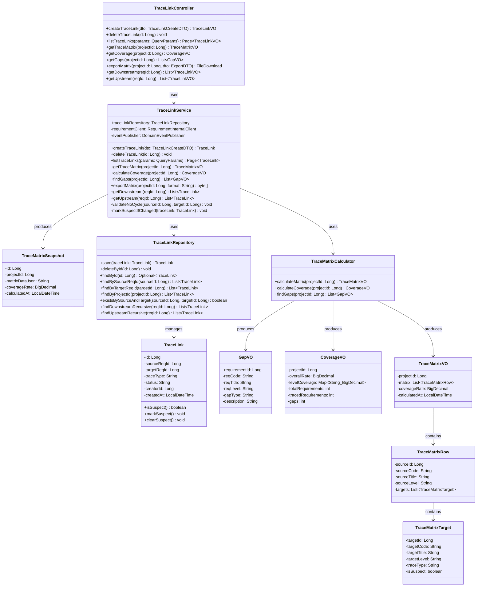
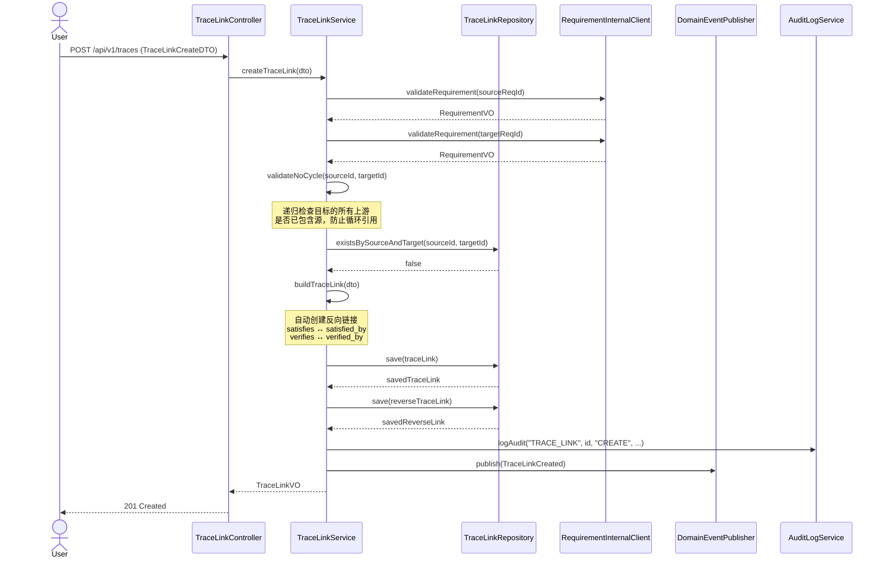
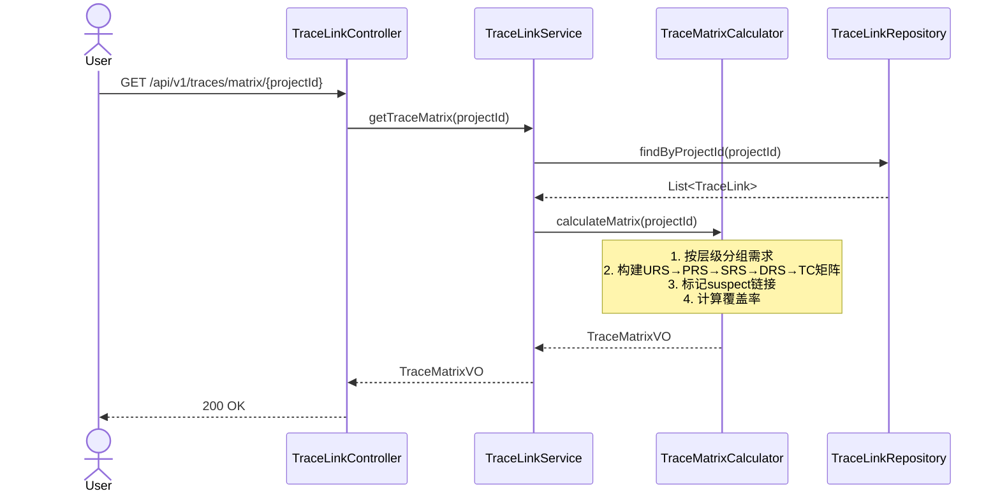
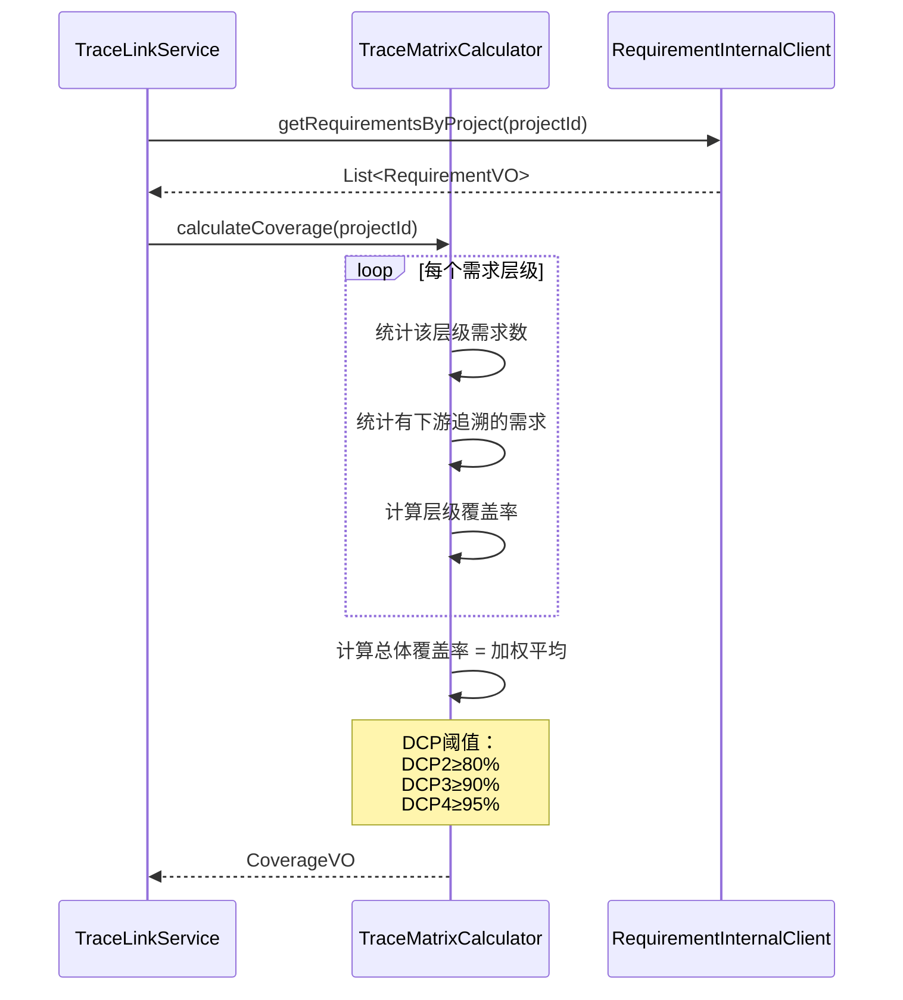

# Med-RMS 详细设计 — 追溯管理模块（trace-mgr）

> 文档版本：v1.3 | 编制日期：2026-05-22 | 基线：概要设计 v1.2 + 系统架构 v1.1
> 技术栈：MyBatis-Plus 3.5.x

---

## 1. 模块概述

### 1.1 职责边界

追溯管理模块负责需求之间、需求与测试用例之间的双向追溯关系管理，确保 IEC 62304 要求的完整追溯链（URS↔PRS↔SRS↔DRS↔TC）。

**核心职责**：
- 创建/删除追溯链接（需求↔需求、需求↔测试用例）
- 维护追溯矩阵（二维矩阵展示需求覆盖）
- 计算追溯覆盖率（按项目、按层级统计）
- 检测追溯缺口（未被追溯覆盖的需求）
- 导出追溯矩阵报告

**边界**：
- 不负责需求内容的创建/修改（req-mgr 职责）
- 不负责变更影响分析（chg-mgr 职责）
- 通过领域事件与 req-mgr/compliance/report 协作

### 1.2 与其他模块交互

| 交互模块 | 交互方式 | 说明 |
|----------|----------|------|
| req-mgr | 领域事件订阅 | 监听 RequirementApproved 事件，提醒建立下游追溯 |
| compliance | 领域事件发布 | 发布 TraceLinkCreated/Removed 事件，供基线/合规校验 |
| report | 领域事件发布 | 发布追溯变更事件，触发统计快照更新 |
| chg-mgr | 领域事件订阅 | 监听 ChangeRequested 事件，标记 suspect 追溯链接 |

---

## 2. 类图



---

## 3. 核心流程时序图

### 3.1 创建追溯链接



### 3.2 查询追溯矩阵



### 3.3 追溯覆盖率计算



---

## 4. 服务接口伪代码

### 4.1 TraceLinkService.createTraceLink()

```java
@Transactional
public TraceLink createTraceLink(TraceLinkCreateDTO dto) {
    // 1. 参数校验
    Assert.notNull(dto.getSourceReqId(), "源需求ID不能为空");
    Assert.notNull(dto.getTargetReqId(), "目标需求ID不能为空");
    Assert.isTrue(!dto.getSourceReqId().equals(dto.getTargetReqId()), "不能创建自引用追溯");
    Assert.isTrue(VALID_TRACE_TYPES.contains(dto.getTraceType()), "追溯类型无效");

    // 2. 校验需求存在性
    RequirementVO source = requirementClient.validateRequirement(dto.getSourceReqId());
    RequirementVO target = requirementClient.validateRequirement(dto.getTargetReqId());

    // 3. 校验追溯方向合法性（层级约束）
    validateTraceDirection(source.getLevel(), target.getLevel(), dto.getTraceType());

    // 4. 校验无环
    validateNoCycle(dto.getSourceReqId(), dto.getTargetReqId());

    // 5. 校验不重复
    Assert.isTrue(
        !traceLinkRepository.existsBySourceAndTarget(dto.getSourceReqId(), dto.getTargetReqId()),
        "追溯链接已存在"
    );

    // 6. 创建正向链接
    TraceLink forward = new TraceLink();
    forward.setSourceReqId(dto.getSourceReqId());
    forward.setTargetReqId(dto.getTargetReqId());
    forward.setTraceType(dto.getTraceType());
    forward.setStatus("ACTIVE");
    forward.setCreatorId(SecurityContext.getCurrentUserId());
    forward.setCreatedAt(LocalDateTime.now());
    traceLinkRepository.save(forward);

    // 7. 自动创建反向链接
    TraceLink reverse = new TraceLink();
    reverse.setSourceReqId(dto.getTargetReqId());
    reverse.setTargetReqId(dto.getSourceReqId());
    reverse.setTraceType(getReverseTraceType(dto.getTraceType()));
    reverse.setStatus("ACTIVE");
    reverse.setCreatorId(SecurityContext.getCurrentUserId());
    reverse.setCreatedAt(LocalDateTime.now());
    traceLinkRepository.save(reverse);

    // 8. 审计日志
    auditLogService.log("TRACE_LINK", forward.getId(), "CREATE",
        null, JsonUtils.toJson(forward), "创建追溯链接");

    // 9. 发布领域事件
    eventPublisher.publish(new TraceLinkCreated(forward.getId(),
        dto.getSourceReqId(), dto.getTargetReqId(), dto.getTraceType()));

    return forward;
}
```

### 4.2 TraceLinkService.validateNoCycle()

```java
private void validateNoCycle(Long sourceId, Long targetId) {
    // 递归查找目标的所有上游（祖先）
    // 如果祖先中已包含sourceId，说明会形成环
    Set<Long> visited = new HashSet<>();
    Queue<Long> queue = new LinkedList<>();
    queue.add(targetId);

    while (!queue.isEmpty()) {
        Long currentId = queue.poll();
        if (visited.contains(currentId)) continue;
        visited.add(currentId);

        List<TraceLink> upstreamLinks = traceLinkRepository
            .findByTargetReqId(currentId);

        for (TraceLink link : upstreamLinks) {
            if (link.getSourceReqId().equals(sourceId)) {
                throw new BusinessException(020203, "闭环检测：追溯链接会形成环");
            }
            queue.add(link.getSourceReqId());
        }
    }
}
```

### 4.3 TraceMatrixCalculator.calculateCoverage()

```java
public CoverageVO calculateCoverage(Long projectId) {
    List<RequirementVO> requirements = requirementClient
        .getRequirementsByProject(projectId);

    Map<String, Integer> levelTotal = new HashMap<>();
    Map<String, Integer> levelTraced = new HashMap<>();

    for (RequirementVO req : requirements) {
        String level = req.getLevel();
        levelTotal.merge(level, 1, Integer::sum);

        List<TraceLink> downstream = traceLinkRepository
            .findBySourceReqId(req.getId());
        boolean hasActiveTrace = downstream.stream()
            .anyMatch(t -> "ACTIVE".equals(t.getStatus()));

        if (hasActiveTrace) {
            levelTraced.merge(level, 1, Integer::sum);
        }
    }

    Map<String, BigDecimal> levelCoverage = new HashMap<>();
    for (String level : levelTotal.keySet()) {
        int total = levelTotal.getOrDefault(level, 0);
        int traced = levelTraced.getOrDefault(level, 0);
        levelCoverage.put(level, total > 0
            ? BigDecimal.valueOf(traced).divide(BigDecimal.valueOf(total), 4, RoundingMode.HALF_UP)
            : BigDecimal.ZERO);
    }

    int totalAll = requirements.size();
    int tracedAll = (int) requirements.stream()
        .filter(req -> !traceLinkRepository.findBySourceReqId(req.getId()).isEmpty())
        .count();

    CoverageVO vo = new CoverageVO();
    vo.setProjectId(projectId);
    vo.setOverallRate(totalAll > 0
        ? BigDecimal.valueOf(tracedAll).divide(BigDecimal.valueOf(totalAll), 4, RoundingMode.HALF_UP)
        : BigDecimal.ZERO);
    vo.setLevelCoverage(levelCoverage);
    vo.setTotalRequirements(totalAll);
    vo.setTracedRequirements(tracedAll);
    return vo;
}
```

---

## 5. 追溯方向约束规则

### 5.1 合法追溯方向

| 源层级 | 目标层级 | 追溯类型 | 说明 |
|--------|----------|----------|------|
| URS | PRS | satisfies | 用户需求→产品需求 |
| PRS | URS | satisfied_by | 产品需求→用户需求（反向） |
| PRS | SRS | satisfies | 产品需求→系统需求 |
| SRS | PRS | satisfied_by | 系统需求→产品需求（反向） |
| SRS | DRS | satisfies | 系统需求→设计需求 |
| DRS | SRS | satisfied_by | 设计需求→系统需求（反向） |
| SRS | TC | verifies | 系统需求→测试用例 |
| TC | SRS | verified_by | 测试用例→系统需求（反向） |
| DRS | TC | verifies | 设计需求→测试用例 |
| TC | DRS | verified_by | 测试用例→设计需求（反向） |

### 5.2 非法追溯方向

| 源层级 | 目标层级 | 原因 |
|--------|----------|------|
| URS | SRS | 跨层级追溯不合法，需经过PRS |
| URS | DRS | 跨层级追溯不合法，需经过PRS→SRS |
| PRS | DRS | 跨层级追溯不合法，需经过SRS |
| 同层级内 | 同层级内 | 同层级需求不建立追溯 |

---

## 6. 跨模块协作

### 6.1 领域事件

| 事件名 | 触发时机 | 订阅方 | 载荷 |
|--------|----------|--------|------|
| TraceLinkCreated | 创建追溯链接 | compliance, report | traceLinkId, sourceReqId, targetReqId, traceType |
| TraceLinkRemoved | 删除追溯链接 | compliance, report | traceLinkId, sourceReqId, targetReqId |
| TraceCoverageUpdated | 覆盖率变化 | proj-mgr(DCP校验) | projectId, oldRate, newRate |

### 6.2 订阅的领域事件

| 事件名 | 发布方 | 处理逻辑 |
|--------|--------|----------|
| RequirementApproved | req-mgr | 提醒建立下游追溯链接 |
| ChangeRequested | chg-mgr | 标记影响范围内的追溯链接为 suspect |
| RequirementRetired | req-mgr | 将关联追溯链接标记为 INACTIVE |

### 6.3 跨模块协作补充

- 与e-sign（JWT黑名单）：用户登出时，认证模块调用e-sign模块的JwtBlacklistService.addToBlacklist(token, expiry)将JWT加入黑名单；所有需要认证的API调用时通过JwtBlacklistService.isBlacklisted(token)校验

---

## 7. 数据校验规则

### 7.1 字段级校验

| 字段 | 规则 |
|------|------|
| sourceReqId | NOT NULL, 需求必须存在 |
| targetReqId | NOT NULL, 需求必须存在, ≠ sourceReqId |
| traceType | NOT NULL, 枚举值: satisfies/satisfied_by/verifies/verified_by |
| status | 枚举值: ACTIVE/INACTIVE/SUSPECT |

### 7.2 跨字段校验

| 规则 | 说明 |
|------|------|
| 层级方向 | 源层级和目标层级必须相邻且方向合法 |
| 唯一性 | 同一对(sourceReqId, targetReqId)不可重复创建 |
| 无环性 | 不允许创建形成环的追溯链接 |

### 7.3 业务规则

| 规则 | 说明 |
|------|------|
| DCP覆盖率阈值 | DCP2≥80%, DCP3≥90%, DCP4≥95% |
| suspect标记 | 变更请求影响的需求，其关联追溯标记为suspect |
| 反向链接自动创建 | 创建正向链接时自动创建反向链接 |

---

## 8. 变更记录

| 版本 | 日期 | 变更内容 | 变更原因 | 修订人 |
|------|------|----------|----------|--------|
| v1.0 | 2026-05-22 | 初始版本 | 详细设计交付 | Gao |
| v1.1 | 2026-05-22 | 技术栈从JPA/Hibernate改为MyBatis-Plus 3.5.x，对齐系统架构§4.1 | M-01：技术栈标注不一致 | Gao |
| v1.1 | 2026-05-22 | 跨模块协作补充JWT黑名单协作说明 | M-03：其他模块未体现JWT黑名单协作 | Gao |
| v1.2 | 2026-06-06 | v1.47 P0 严重偏差修复：① **TraceLink 通用追溯链接**（BUG #133）新建 TraceLink.java + TraceLinkMapper.java + TraceLinkController.java（linkType=DECOMPOSE/REFINES/DEPENDS/CONFLICTS/REUSES/VERIFIES 6 类型 + sourceType/targetType 双端），DDL 130 建 t_trace_link 通用追溯表 + 4 索引 + 1 unique 部分索引；② **9 CRUD 端点补齐**（BUG #134）TraceLinkController 8 个 REST 端点：POST/PUT/DELETE/GET /{id}、GET 列表/按源/按目标/check-cycle；③ **无环校验**（BUG #135）createTraceLink 加 wouldCreateCycle DFS（target 能否通过 TraceLink 边 + 闭包表祖先边反向到达 source），仅对 DECOMPOSE/REFINES 纵向类型生效；④ **矩阵算法改进**（BUG #136）getTraceMatrix 改造为单次 selectList 拉全项目需求 + 闭包表关联，O(N) 而非 N+1；⑤ **领域事件**（BUG #137）TraceLink 创建/更新/删除发 outbox 事件（TraceLinkCreated/Updated/Deleted）；⑥ **SQL 注入修复**（BUG #138）countWithChildren 的 inSql 字符串拼接 childType 改为 exists 子查询参数化 r2.requirement_type = {0}；⑦ 老 API 兼容：addHorizontalRelation / addTestCaseTrace 内部改走 TraceLink 并保留老表写入 | 修复《详细设计偏差分析报告》追溯管理域 6 个 P0 | Claude |
| v1.3 | 2026-06-09 | v1.55 追溯模块 5 页面差异修复：① **后端 4 新接口** TraceLinkController 新增 `GET /trace-links/by-pair`（按 source/target 对查询），TraceabilityController 新增 `POST /traceability/gaps/ignore` + `GET /traceability/gaps/ignored`（缺口忽略），新增 `POST /traceability/import/preview` + 补全 `POST /traceability/import`（导入预览/提交）；② **新表 t_trace_gap_ignored**（DDL 140）+ 实体 TraceGapIgnored + Mapper，含 (project_id, gap_type, requirement_id) 唯一索引；③ **TraceGap 优先级字段** `priority: MUST/SHOULD/COULD` 与 `status: PENDING/IGNORED/FIXED` 上行到前端；④ **前端 5 页面** TraceGraph（边层 SVG + 节点点击/hover + 搜索 + URS/PRS/SRS/DRS 过滤）、TraceMatrix（详情对话框 + 链路删除 + 创建链路子对话框 + 搜索）、TraceCoverage（IEC 表改 7 列生命周期 + 5-tab 联动）、TraceGaps（3 步修复向导 + 🤖 自动修复 + 单条/批量忽略 + 取消忽略）、TraceImport（5 步流程 + 数据校验 + 错误报告下载 + 项目选择）；⑤ **全 5 页** 补面包屑「追溯管理 / [页面名]」 | 修复《追溯图谱与交互原型差异比对》5 页面 P0/P1/P2 偏差 | Claude |
