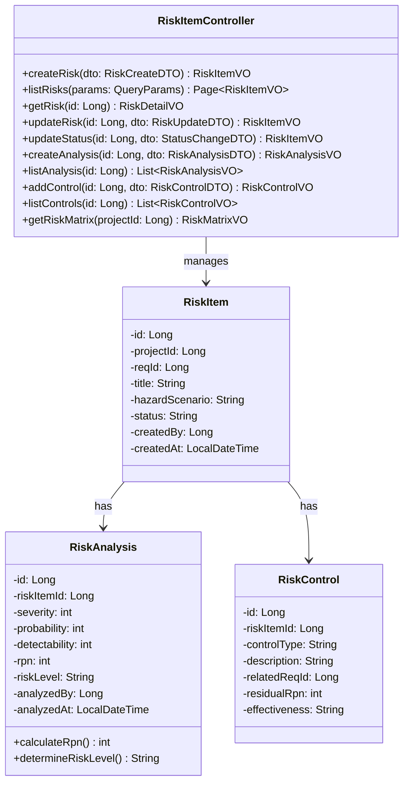
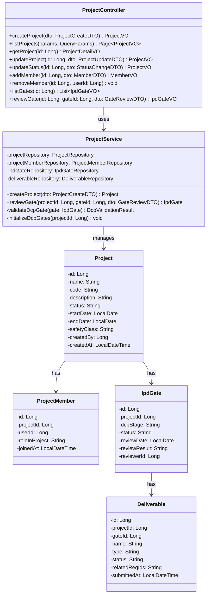
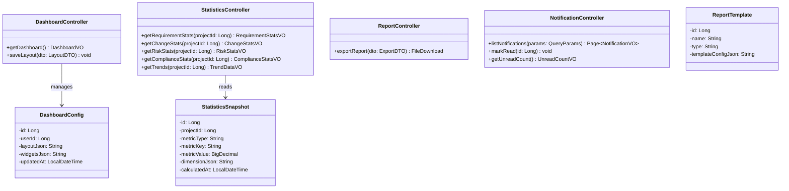
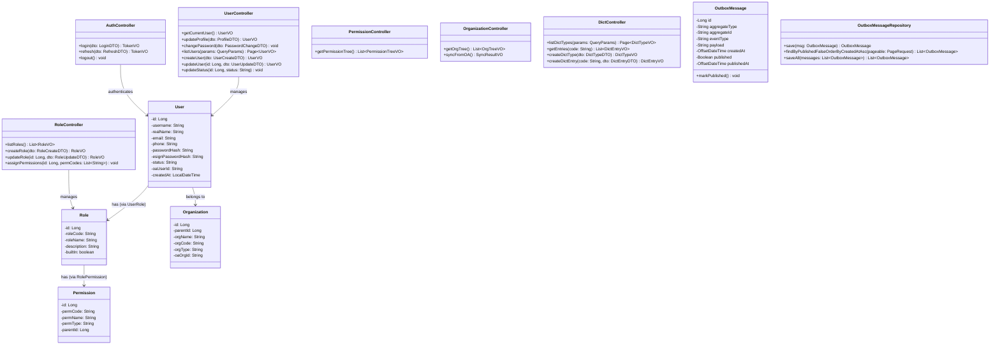

# Med-RMS 详细设计 — 支撑域与通用域（risk-mgr / proj-mgr / report / sys-mgr）

> 文档版本：v1.3 | 编制日期：2026-05-22 | 最后修订：2026-06-08 | 基线：概要设计 v1.2 + 系统架构 v1.1
> 技术栈：MyBatis-Plus 3.5.x

---

## 一、风险管理模块（risk-mgr）

### 1.1 模块职责

基于 ISO 14971 的风险管理流程，包括风险识别、分析（FMEA）、控制措施制定、RPN 计算、风险监控。

### 1.2 类图



### 1.3 RPN 计算逻辑

```java
public int calculateRpn(int severity, int probability, int detectability) {
    // S(1-5) × P(1-5) × D(1-5) = RPN(1-125)
    Assert.isTrue(severity >= 1 && severity <= 5, "严重度范围1-5");
    Assert.isTrue(probability >= 1 && probability <= 5, "概率范围1-5");
    Assert.isTrue(detectability >= 1 && detectability <= 5, "可检测性范围1-5");
    return severity * probability * detectability;
}

public String determineRiskLevel(int rpn) {
    if (rpn >= 200) return "HIGH";
    if (rpn >= 100) return "MEDIUM";
    return "LOW";
}
```

### 1.4 风险矩阵

| | P1(极低) | P2(低) | P3(中) | P4(高) | P5(极高) |
|---|---|---|---|---|---|
| S5(致命) | M | H | H | H | H |
| S4(严重) | M | M | H | H | H |
| S3(中度) | L | M | M | H | H |
| S2(轻微) | L | L | M | M | M |
| S1(可忽略) | L | L | L | M | M |

---

## 二、项目管理模块（proj-mgr）

### 2.1 模块职责

项目管理模块负责项目全生命周期管理，包括项目创建、成员管理、IPD 阶段门（DCP）管理、交付物管理。

### 2.2 类图



### 2.3 DCP 门控校验伪代码

```java
private DcpValidationResult validateDcpGate(IpdGate gate) {
    Long projectId = gate.getProjectId();
    List<String> errors = new ArrayList<>();

    switch (gate.getDcpStage()) {
        case "DCP1":
            // URS完整性：至少1条URS需求
            if (requirementClient.countByProjectAndLevel(projectId, "URS") < 1) {
                errors.add("URS需求为空");
            }
            // 安全分类已确定
            if (!complianceService.hasClassification(projectId)) {
                errors.add("安全分类未确定");
            }
            break;
        case "DCP2":
            // PRS完整性
            if (requirementClient.countByProjectAndLevel(projectId, "PRS") < 1) {
                errors.add("PRS需求为空");
            }
            // 追溯覆盖率≥80%
            if (traceService.calculateCoverage(projectId).getOverallRate()
                .compareTo(new BigDecimal("0.80")) < 0) {
                errors.add("追溯覆盖率低于80%");
            }
            // SOUP已登记
            if (complianceService.countSoup(projectId) < 1) {
                errors.add("SOUP未登记");
            }
            break;
        case "DCP3":
            // SRS完整性
            if (requirementClient.countByProjectAndLevel(projectId, "SRS") < 1) {
                errors.add("SRS需求为空");
            }
            // 追溯覆盖率≥90%
            if (traceService.calculateCoverage(projectId).getOverallRate()
                .compareTo(new BigDecimal("0.90")) < 0) {
                errors.add("追溯覆盖率低于90%");
            }
            // 风险分析完成
            if (riskService.countByProject(projectId) < 1) {
                errors.add("风险分析未完成");
            }
            break;
        case "DCP4":
            // 验证证据完整性
            // 测试用例覆盖率
            // 追溯覆盖率≥95%
            if (traceService.calculateCoverage(projectId).getOverallRate()
                .compareTo(new BigDecimal("0.95")) < 0) {
                errors.add("追溯覆盖率低于95%");
            }
            break;
        case "DCP5":
            // 最终确认报告
            // 基线完整性
            // IEC62304合规检查
            if (!complianceService.isIec62304Compliant(projectId)) {
                errors.add("IEC62304合规检查未通过");
            }
            break;
    }

    return new DcpValidationResult(errors.isEmpty(), errors);
}
```

---

## 三、报表仪表盘模块（report）

### 3.1 模块职责

提供仪表盘、统计快照、报告导出、通知中心功能，采用 CQRS Lite 模式（写入走领域事件，读取走统计快照）。

### 3.2 核心类设计



### 3.3 通知机制

```java
// 通知事件订阅
@EventHandler
public void handle(RequirementApproved event) {
    Notification notification = new Notification();
    notification.setUserId(event.getApprovedBy());
    notification.setTitle("需求已批准");
    notification.setContent("需求 " + event.getReqCode() + " 已通过评审");
    notification.setChannel("IN_APP");
    notification.setEntityType("REQUIREMENT");
    notification.setEntityId(event.getRequirementId());
    notification.setRead(false);
    notification.setCreatedAt(LocalDateTime.now());
    notificationRepository.save(notification);

    // 同时发送邮件通知
    emailService.sendNotification(user.getEmail(), notification);
}
```

---

## 四、系统管理模块（sys-mgr）

### 4.1 模块职责

系统管理是最基础的通用模块，负责用户、角色、权限、组织架构、数据字典、系统配置、登录认证、操作日志和登录日志。

### 4.2 类图



### 4.3 登录认证伪代码

```java
public TokenVO login(LoginDTO dto) {
    // 1. 查找用户
    User user = userRepository.findByUsername(dto.getUsername())
        .orElseThrow(() -> new BusinessException(090201, "用户名或密码错误"));

    // 2. 校验状态
    if ("DISABLED".equals(user.getStatus())) {
        throw new BusinessException(090201, "用户已禁用");
    }

    // 3. 校验密码
    if (!BCrypt.checkpw(dto.getPassword(), user.getPasswordHash())) {
        throw new BusinessException(090201, "用户名或密码错误");
    }

    // 4. 生成JWT
    List<String> permissions = permissionRepository
        .findByUserId(user.getId()).stream()
        .map(Permission::getPermCode)
        .collect(Collectors.toList());

    String accessToken = jwtUtil.generateAccessToken(user.getId(),
        user.getUsername(), permissions);
    String refreshToken = jwtUtil.generateRefreshToken(user.getId());

    // 5. 记录登录日志
    loginLogService.log(user.getId(), "PASSWORD",
        SecurityContext.getClientIp(), SecurityContext.getUserAgent(),
        "SUCCESS");

    return new TokenVO(accessToken, refreshToken,
        jwtUtil.getAccessTokenExpiry());
}
```

### 4.4 登出伪代码

```java
public void logout() {
    String jti = SecurityContext.getJwtId(); // 从当前JWT提取jti
    Long userId = SecurityContext.getCurrentUserId();
    LocalDateTime expiresAt = SecurityContext.getJwtExpiresAt();

    // 将当前JWT加入黑名单
    JwtBlacklist blacklist = new JwtBlacklist();
    blacklist.setJti(jti);
    blacklist.setUserId(userId);
    blacklist.setExpiresAt(expiresAt);
    blacklist.setRevokedAt(LocalDateTime.now());
    blacklist.setReason("USER_LOGOUT");
    blacklist.setCreatedAt(LocalDateTime.now());
    jwtBlacklistRepository.save(blacklist);

    // 记录登录日志
    loginLogService.log(userId, "LOGOUT",
        SecurityContext.getClientIp(), null, "SUCCESS");
}
```

### 4.5 OutboxMessageService — 事务性发件箱服务

```java
// OutboxMessageService — 事务性发件箱服务
@Service
public class OutboxMessageService {
    
    @Autowired
    private OutboxMessageRepository outboxRepo;
    
    /**
     * 保存事件到Outbox（在业务事务内调用）
     * 确保业务操作和事件持久化在同一事务中
     */
    @Transactional
    public void saveEvent(String aggregateType, String aggregateId, 
                          String eventType, Object payload) {
        OutboxMessage msg = new OutboxMessage();
        msg.setAggregateType(aggregateType);
        msg.setAggregateId(aggregateId);
        msg.setEventType(eventType);
        msg.setPayload(JsonUtils.toJson(payload));
        msg.setCreatedAt(OffsetDateTime.now());
        msg.setPublished(false);
        outboxRepo.save(msg);
    }
    
    /**
     * 定时扫描未发布消息，推送到消息总线
     * 由Debezium CDC或定时任务触发
     */
    @Scheduled(fixedDelay = 5000)
    public void publishPendingMessages() {
        List<OutboxMessage> pending = outboxRepo
            .findByPublishedFalseOrderByCreatedAtAsc(PageRequest.of(0, 100));
        for (OutboxMessage msg : pending) {
            // 发布到Spring ApplicationEvent或Kafka
            eventPublisher.publishEvent(msg);
            msg.markPublished();
        }
        outboxRepo.saveAll(pending);
    }
}
```

---

## 四-B、跨模块协作补充

- 与e-sign（JWT黑名单）：用户登出时，认证模块调用e-sign模块的JwtBlacklistService.addToBlacklist(token, expiry)将JWT加入黑名单；所有需要认证的API调用时通过JwtBlacklistService.isBlacklisted(token)校验

---

## 五、变更记录

| 版本 | 日期 | 变更内容 | 变更原因 | 修订人 |
|------|------|----------|----------|--------|
| v1.0 | 2026-05-22 | 初始版本（risk-mgr + proj-mgr + report + sys-mgr） | 详细设计交付 | Gao |
| v1.1 | 2026-05-22 | 技术栈从JPA/Hibernate改为MyBatis-Plus 3.5.x，对齐系统架构§4.1 | M-01：技术栈标注不一致 | Gao |
| v1.1 | 2026-05-22 | 跨模块协作补充JWT黑名单协作说明 | M-03：其他模块未体现JWT黑名单协作 | Gao |
| v1.1 | 2026-05-22 | 补充OutboxMessage实体类和OutboxMessageService伪代码 | C-04：详细设计缺少Outbox实体定义 | Gao |
| v1.2 | 2026-06-06 | **v1.47 P0 偏差修复 #107/#108/#109 实现说明**（依据《详细设计偏差分析报告》§3.6）：① **JwtService 重写**——generateAccessToken (2h) + generateRefreshToken (7d) 双令牌机制；新增 blacklistedJti ConcurrentHashMap；blacklist()/isBlacklisted()/extractJti()/extractTokenType()/extractExpiration() 5 方法；token 携带 jti + tokenType 字段（access/refresh 区分）；② **AuthController 扩展**——POST /auth/login 返回 LoginResponse 含 accessToken + refreshToken + accessExpiresMs + refreshExpiresMs（兼容前端 Login.vue data.token）；POST /auth/refresh 接收 refreshToken → 校验（黑名单/类型/过期/用户存在）→ 颁发新 access；POST /auth/logout 从 Authorization 头取 token 调 blacklist；③ **JwtAuthenticationFilter** 拦截顺序：!isExpired + !isBlacklisted + parseToken → setAuthenticationContext | P0 严重偏差修复 8/39（支撑域认证 3/3 完成）| Claude |
| v1.3 | 2026-06-08 | **P0#148 支撑域 报表/Dashboard/Statistics CQRS Lite 实现说明**：① **3 张基表 DDL**——dashboard_config（user_id + layout_json + widgets_json + is_default + updated_at + created_at）、statistics_snapshot（project_id + metric_type + metric_key + metric_value + dimension_json + calculated_at）、report_template（name + type + template_config_json + description + is_active + updated_at），索引：idx_dashboard_user/idx_dashboard_default/idx_snapshot_project_type/idx_snapshot_calculated/idx_template_type/idx_template_active；② **实体类**——DashboardConfig（JacksonTypeHandler 处理 jsonb layoutJson/widgetsJson）/StatisticsSnapshot/ReportTemplate；③ **DashboardConfigService**——getCurrentUserLayout/listAll/saveLayout/resetToDefault；采用**raw query 方案**：layout_json::text / widgets_json::text 读取后用 ObjectMapper 反序列化，#{param}::jsonb cast 写入，规避 MyBatis-Plus resultMap 对 jsonb 列的反射失败；④ **StatisticsService**——5 指标 (REQUIREMENT/CHANGE/RISK/COMPLIANCE/TREND) recomputeAndSnapshot 模式：实时计算 → 删旧 snapshot → 重写 → 写入 t_statistics_snapshot；⑤ **ReportTemplateService**——listActive/getByType；⑥ **DashboardController**——GET /dashboard 统一入口（聚合 5 统计 + layout + widgets）、POST /dashboard/layout 持久化、POST /dashboard/layout/reset 还原系统默认（user_id=0, is_default=true）；⑦ **StatisticsController**——GET /statistics/{requirements|changes|risks|compliance|trends|snapshots} 6 端点 | P0 严重偏差修复 #4 报表/Dashboard 域完成 | Claude |
| v1.4 | 2026-06-15 | **R82 契约澄清 + 实际响应结构固化**：① **StatisticsController.requirementStats 实际响应**：`{code:200, data:{total, byStatus:{Draft,Approved,Baseline,PendingDecompose,Decomposed,InProgress,Submitted,InTest,Suspect,ReviewApproved}, byType:{...}, suspectCount}}`——**前端必须按 `data.byStatus.<StatusName>` 嵌套读取**，不可假设扁平 `data.draft/approved/...`；② **后端无 Implemented/Verified/Closed key**——前端映射约定：草稿=`byStatus.Draft`、已批准=`byStatus.Approved`、已实现=`byStatus.Implemented+Verified+InProgress`、已关闭=`byStatus.Closed+Baseline`；③ **DashboardController.viewRequirements 实际响应**：`{total, byStatus, byType, suspectCount, coverage:{urs, prs, srs, drs, byType, overall, total, traced, untraced}}`——**前端必须用 `coverage.traced` 与 `coverage.overall`**，原 `coverage.covered`/`coverage.coverageRate` 永远 0；④ **业务异常处理规范**：所有 Result 包装的响应必须在 catch 块外显式校验 `res.data.code === '0000' \|\| '200'`，否则 SY01xx 业务异常包在 HTTP 200 里会被 axios 当成成功，导致全字段 ?? 0 兜底静默吞错；⑤ **降级约定**：远程 stats 失败时仍走本地 size=1000 全量聚合（保留 R80 已修版本不变） | R82 举一反三巡检发现 Dashboard 4 处契约不一致 bug（统计卡全 0） | Claude |
| v1.3 | 2026-06-08 | **DDL 133 修订**——原 DDL 假设 3 张基表已存在（实则不存在），修订为 CREATE TABLE IF NOT EXISTS + 索引 + 初始化数据：4 默认报表模板（需求追溯矩阵/变更控制报告/合规检查报告/风险评估报告）+ 1 系统默认仪表盘布局（user_id=0, 4 widget） | DDL 133 应用时发现 med_rms_pms 数据库无 3 张基表 | Claude |
