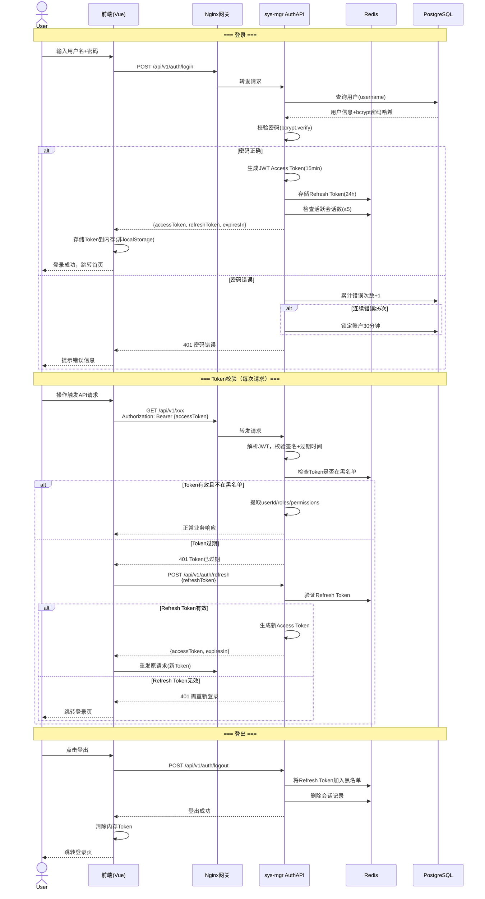
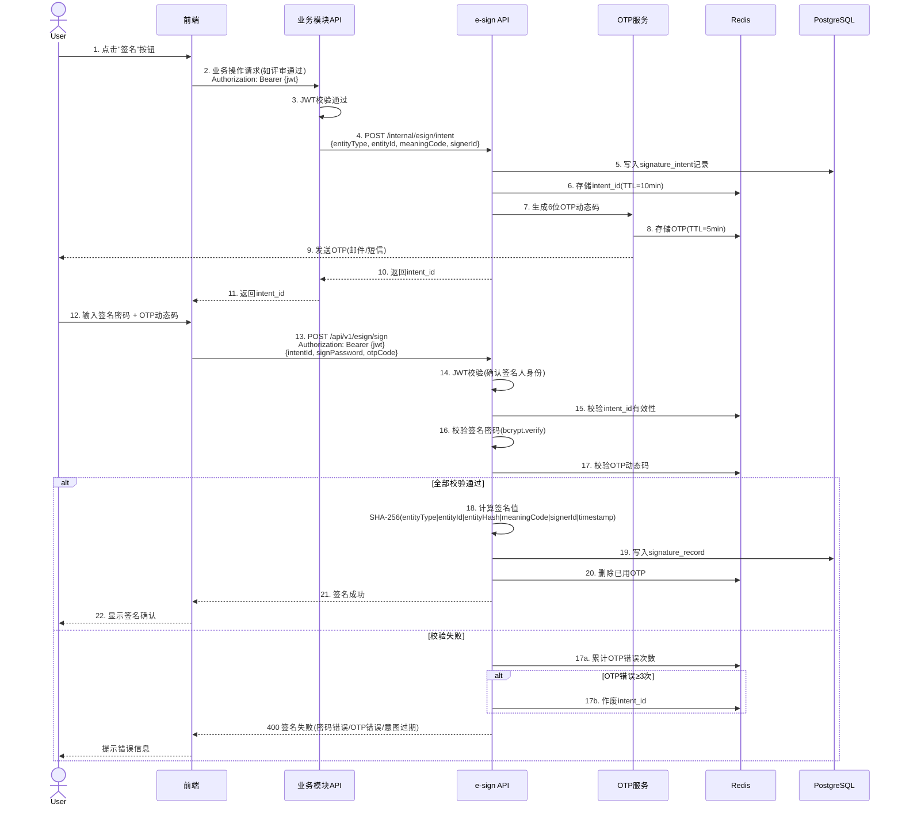
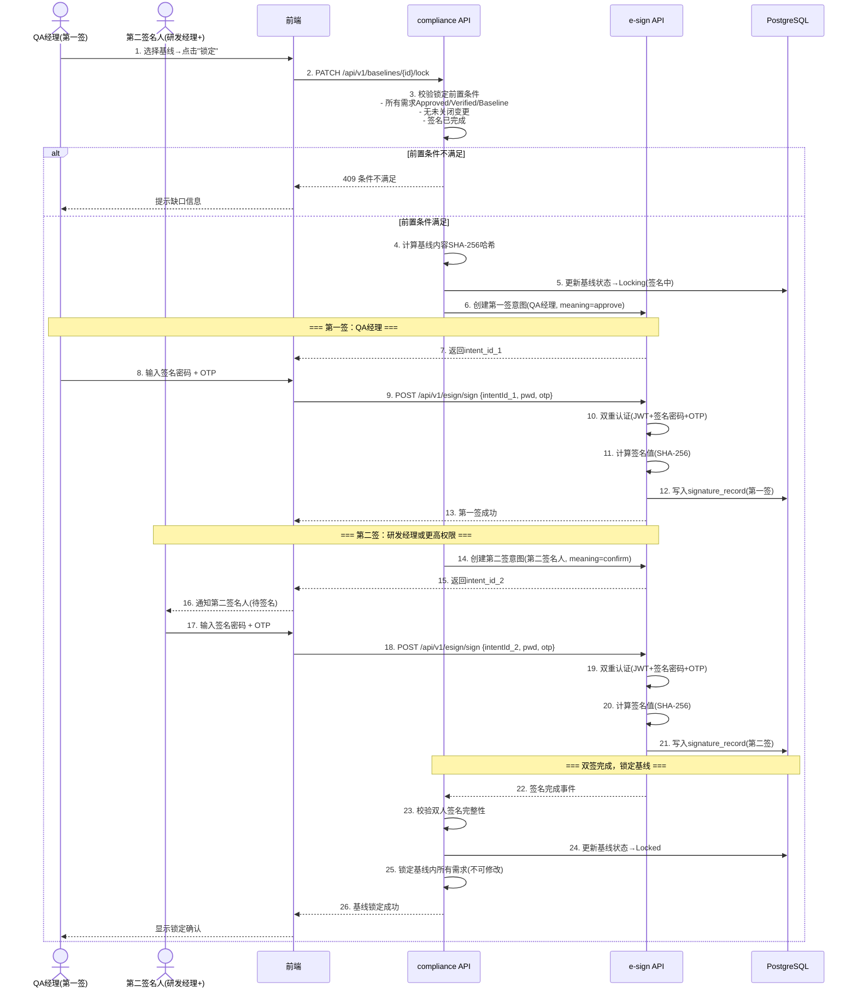

# 权限流程设计

> 文档版本：v1.0 | 编制日期：2026-05-22 | 最后修订：2026-05-22 | 基线：概要设计 v1.1

---

## 1. 权限模型总览

### 1.1 RBAC 4级权限控制体系

Med-RMS 采用基于角色的访问控制（RBAC）模型，实现菜单权限、按钮权限、API权限、数据权限四层纵深防御：

```
用户(User) ──M:N──→ 角色(Role) ──M:N──→ 权限点(Permission) ──1:N──→ 资源(Resource)
```

| 层级 | 校验位置 | 粒度 | 实现方式 | 失效行为 |
|------|----------|------|----------|----------|
| **菜单权限** | 前端路由守卫 | 页面级 | 登录时构建动态路由表，无权限菜单不渲染 | 路由不可访问 |
| **按钮权限** | 前端指令 `v-permission` | 操作级 | 按钮级权限码绑定，无权限按钮不渲染 | 按钮不可见 |
| **API权限** | 后端 Spring Security 拦截器 | 接口级 | `@PreAuthorize("hasPermission(#permCode)")` | 返回 403 |
| **数据权限** | 后端 MyBatis 拦截器 | 数据行级 | SQL 自动追加数据范围过滤条件 | 数据行不可见 |

### 1.2 内置角色定义（8类）

| 角色编码 | 角色名称 | 职责范围 | 数据范围 | 特殊权限 |
|----------|----------|----------|----------|----------|
| `ADMIN` | 系统管理员 | 全系统管理：用户/角色/配置/字典 | 全部项目 | 跨项目访问、系统配置 |
| `QA_MGR` | QA经理 | 评审/合规/审计/签名/基线管理 | 所属项目 | 基线锁定/解锁、审计日志查看、DCP评审 |
| `PM` | 项目经理 | 项目级管理：需求审批/基线/门控 | 所属项目 | DCP门控评审、需求审批、成员管理 |
| `RE` | 需求工程师 | 需求创建/编辑/追溯 | 所属项目（自己创建的） | Draft需求编辑 |
| `REVIEWER` | 评审专家 | 需求评审/签名确认 | 被分配的需求 | 评审签名 |
| `RISK_MGR` | 风险管理 | 风险创建/分析/控制措施/状态变更 | 所属项目 | 风险RPN评估 |
| `COMPLIANCE` | 合规人员 | 合规审计/SOUP/安全分类 | 所属项目 | 审计日志查看 |
| `VIEWER` | 只读用户 | 查看/导出 | 授权项目 | 仅查看导出 |

### 1.3 角色-权限矩阵

> ✅ = 允许 | ❌ = 禁止 | 🔒 = 仅限自身创建 | ⭐ = 特殊授权

| 权限码 | ADMIN | QA_MGR | PM | RE | REVIEWER | RISK_MGR | COMPLIANCE | VIEWER |
|--------|:-----:|:------:|:--:|:--:|:--------:|:--------:|:----------:|:------:|
| **菜单权限** | | | | | | | | |
| sys:user:list | ✅ | ❌ | ❌ | ❌ | ❌ | ❌ | ❌ | ❌ |
| sys:role:list | ✅ | ❌ | ❌ | ❌ | ❌ | ❌ | ❌ | ❌ |
| sys:config:list | ✅ | ❌ | ❌ | ❌ | ❌ | ❌ | ❌ | ❌ |
| sys:dict:list | ✅ | ❌ | ❌ | ❌ | ❌ | ❌ | ❌ | ❌ |
| sys:org:list | ✅ | ✅ | ✅ | ❌ | ❌ | ❌ | ❌ | ❌ |
| proj:list | ✅ | ✅ | ✅ | ✅ | ❌ | ✅ | ✅ | ✅ |
| proj:create | ✅ | ❌ | ✅ | ❌ | ❌ | ❌ | ❌ | ❌ |
| proj:update | ✅ | ❌ | ✅ | ❌ | ❌ | ❌ | ❌ | ❌ |
| proj:member | ✅ | ❌ | ✅ | ❌ | ❌ | ❌ | ❌ | ❌ |
| req:list | ✅ | ✅ | ✅ | ✅ | ✅ | ✅ | ✅ | ✅ |
| req:create | ✅ | ❌ | ✅ | ✅ | ❌ | ❌ | ❌ | ❌ |
| req:update | ✅ | ✅ | ✅ | 🔒 | ❌ | ❌ | ❌ | ❌ |
| req:delete | ✅ | ❌ | ✅ | 🔒 | ❌ | ❌ | ❌ | ❌ |
| req:submit | ✅ | ❌ | ✅ | ✅ | ❌ | ❌ | ❌ | ❌ |
| req:review | ✅ | ✅ | ✅ | ❌ | ✅ | ❌ | ❌ | ❌ |
| req:status | ✅ | ✅ | ✅ | 🔒 | ❌ | ❌ | ❌ | ❌ |
| req:import | ✅ | ❌ | ✅ | ✅ | ❌ | ❌ | ❌ | ❌ |
| trace:list | ✅ | ✅ | ✅ | ✅ | ✅ | ✅ | ✅ | ✅ |
| trace:create | ✅ | ❌ | ✅ | ✅ | ❌ | ❌ | ❌ | ❌ |
| trace:delete | ✅ | ❌ | ✅ | 🔒 | ❌ | ❌ | ❌ | ❌ |
| trace:matrix | ✅ | ✅ | ✅ | ✅ | ✅ | ✅ | ✅ | ✅ |
| trace:gaps | ✅ | ✅ | ✅ | ✅ | ✅ | ✅ | ✅ | ✅ |
| chg:list | ✅ | ✅ | ✅ | ✅ | ❌ | ✅ | ✅ | ✅ |
| chg:create | ✅ | ❌ | ✅ | ✅ | ❌ | ❌ | ❌ | ❌ |
| chg:analyze | ✅ | ✅ | ✅ | ❌ | ❌ | ✅ | ❌ | ❌ |
| chg:approve | ✅ | ✅ | ✅ | ❌ | ❌ | ❌ | ❌ | ❌ |
| chg:execute | ✅ | ❌ | ✅ | ❌ | ❌ | ❌ | ❌ | ❌ |
| audit:read | ✅ | ✅ | ❌ | ❌ | ❌ | ❌ | ✅ | ❌ |
| audit:verify | ✅ | ✅ | ❌ | ❌ | ❌ | ❌ | ✅ | ❌ |
| soup:list | ✅ | ✅ | ✅ | ✅ | ❌ | ❌ | ✅ | ✅ |
| soup:create | ✅ | ✅ | ❌ | ❌ | ❌ | ❌ | ✅ | ❌ |
| soup:update | ✅ | ✅ | ❌ | ❌ | ❌ | ❌ | ✅ | ❌ |
| soup:review | ✅ | ✅ | ❌ | ❌ | ❌ | ❌ | ✅ | ❌ |
| safety:read | ✅ | ✅ | ✅ | ❌ | ❌ | ✅ | ✅ | ✅ |
| safety:create | ✅ | ✅ | ❌ | ❌ | ❌ | ✅ | ✅ | ❌ |
| baseline:list | ✅ | ✅ | ✅ | ✅ | ❌ | ❌ | ✅ | ✅ |
| baseline:create | ✅ | ✅ | ✅ | ❌ | ❌ | ❌ | ❌ | ❌ |
| baseline:lock | ✅ | ⭐ | ❌ | ❌ | ❌ | ❌ | ❌ | ❌ |
| baseline:unlock | ✅ | ⭐ | ❌ | ❌ | ❌ | ❌ | ❌ | ❌ |
| baseline:compare | ✅ | ✅ | ✅ | ✅ | ❌ | ❌ | ✅ | ✅ |
| esign:intent | ✅ | ✅ | ✅ | ❌ | ✅ | ❌ | ❌ | ❌ |
| esign:sign | ✅ | ✅ | ✅ | ❌ | ✅ | ❌ | ❌ | ❌ |
| esign:read | ✅ | ✅ | ✅ | ✅ | ✅ | ✅ | ✅ | ✅ |
| esign:verify | ✅ | ✅ | ✅ | ✅ | ✅ | ✅ | ✅ | ✅ |
| esign:pwd | ✅ | ✅ | ✅ | ❌ | ✅ | ❌ | ❌ | ❌ |
| esign:otp | ✅ | ✅ | ✅ | ❌ | ✅ | ❌ | ❌ | ❌ |
| risk:list | ✅ | ✅ | ✅ | ✅ | ❌ | ✅ | ✅ | ✅ |
| risk:create | ✅ | ❌ | ✅ | ❌ | ❌ | ✅ | ❌ | ❌ |
| risk:update | ✅ | ❌ | ✅ | ❌ | ❌ | ✅ | ❌ | ❌ |
| risk:analyze | ✅ | ✅ | ❌ | ❌ | ❌ | ✅ | ❌ | ❌ |
| risk:control | ✅ | ❌ | ✅ | ❌ | ❌ | ✅ | ❌ | ❌ |
| risk:status | ✅ | ✅ | ✅ | ❌ | ❌ | ✅ | ❌ | ❌ |
| proj:gate:review | ✅ | ✅ | ⭐ | ❌ | ❌ | ❌ | ❌ | ❌ |
| pr:list | ✅ | ✅ | ✅ | ✅ | ❌ | ✅ | ✅ | ✅ |
| pr:create | ✅ | ✅ | ✅ | ❌ | ❌ | ✅ | ✅ | ❌ |
| pr:status | ✅ | ✅ | ✅ | ❌ | ❌ | ✅ | ✅ | ❌ |
| pr:correction | ✅ | ✅ | ✅ | ❌ | ❌ | ✅ | ✅ | ❌ |
| report:dashboard | ✅ | ✅ | ✅ | ✅ | ❌ | ✅ | ✅ | ✅ |
| report:stats | ✅ | ✅ | ✅ | ✅ | ❌ | ✅ | ✅ | ✅ |
| report:export | ✅ | ✅ | ✅ | ✅ | ❌ | ✅ | ✅ | ✅ |
| compliance:iec62304 | ✅ | ✅ | ✅ | ❌ | ❌ | ❌ | ✅ | ❌ |
| regulation:read | ✅ | ✅ | ✅ | ❌ | ❌ | ❌ | ✅ | ✅ |

---

## 2. 认证流程时序图

### 2.1 JWT 认证流程



### 2.2 电子签名双认证流程（JWT + 签名密码 + OTP）



### 2.3 基线锁定双人签名流程



---

## 3. 权限校验伪代码（Java风格）

### 3.1 API权限校验拦截器

```java
/**
 * API权限校验拦截器
 * 在Spring Security过滤器链中执行，校验用户是否持有指定权限码
 */
@Component
public class PermissionInterceptor extends OncePerRequestFilter {

    @Autowired
    private PermissionService permissionService;

    @Autowired
    private JwtTokenProvider jwtTokenProvider;

    @Override
    protected void doFilterInternal(HttpServletRequest request,
                                     HttpServletResponse response,
                                     FilterChain filterChain) throws ServletException, IOException {
        // 1. 提取权限码（从注解或配置中获取）
        String permCode = extractPermCode(request);
        if (permCode == null) {
            filterChain.doFilter(request, response);
            return;
        }

        // 2. 从JWT中提取用户ID
        String token = extractToken(request);
        if (token == null || !jwtTokenProvider.validateToken(token)) {
            sendError(response, 401, "SY0400", "未认证（Token缺失或过期）");
            return;
        }

        Long userId = jwtTokenProvider.getUserIdFromToken(token);

        // 3. 校验权限
        if (!checkPermission(userId, permCode)) {
            sendError(response, 403, "SY0401", "无权限访问");
            return;
        }

        filterChain.doFilter(request, response);
    }

    /**
     * 核心权限校验方法
     * @param userId   用户ID
     * @param permCode 权限码（如 req:create, baseline:lock）
     * @return true=有权限, false=无权限
     */
    public boolean checkPermission(Long userId, String permCode) {
        // Step 1: 获取用户所有角色
        List<String> roleCodes = permissionService.getUserRoleCodes(userId);
        if (roleCodes.isEmpty()) {
            return false;
        }

        // Step 2: 系统管理员直接放行
        if (roleCodes.contains("ADMIN")) {
            return true;
        }

        // Step 3: 获取角色关联的所有权限码
        Set<String> permCodes = permissionService.getPermissionCodesByRoles(roleCodes);

        // Step 4: 匹配权限码（支持通配符，如 req:* 匹配所有需求权限）
        return permCodes.contains(permCode) || matchWildcard(permCodes, permCode);
    }

    private boolean matchWildcard(Set<String> permCodes, String target) {
        String[] parts = target.split(":");
        if (parts.length == 2) {
            return permCodes.contains(parts[0] + ":*");
        }
        return false;
    }
}
```

### 3.2 数据权限过滤

```java
/**
 * 数据权限过滤 - MyBatis拦截器
 * 根据用户角色自动追加数据范围过滤条件
 */
@Intercepts({
    @Signature(type = Executor.class, method = "query", args = {
        MappedStatement.class, Object.class, RowBounds.class, ResultHandler.class
    })
})
@Component
public class DataScopeInterceptor implements Interceptor {

    @Autowired
    private PermissionService permissionService;

    @Override
    public Object intercept(Invocation invocation) throws Throwable {
        // 1. 获取当前登录用户
        Long userId = SecurityContextHolder.getCurrentUserId();
        if (userId == null) {
            return invocation.proceed();
        }

        // 2. 获取用户角色
        List<String> roleCodes = permissionService.getUserRoleCodes(userId);

        // 3. 系统管理员不做数据过滤
        if (roleCodes.contains("ADMIN")) {
            return invocation.proceed();
        }

        // 4. 获取数据范围
        DataScope dataScope = getDataScope(roleCodes);

        // 5. 获取原始SQL，追加过滤条件
        Object parameter = invocation.getArgs()[1];
        BoundSql boundSql = ((MappedStatement) invocation.getArgs()[0]).getBoundSql(parameter);
        String originalSql = boundSql.getSql();

        String filteredSql = filterByDataScope(userId, originalSql, dataScope);

        // 6. 替换SQL执行
        // ... (通过反射修改BoundSql)
        return invocation.proceed();
    }

    /**
     * 根据数据范围过滤查询
     * @param userId   当前用户ID
     * @param query    原始SQL查询
     * @param dataScope 数据范围枚举
     * @return 追加过滤条件后的SQL
     */
    public String filterByDataScope(Long userId, String query, DataScope dataScope) {
        String filterCondition = switch (dataScope) {
            case ALL -> "1=1";  // 无过滤

            case DEPT -> {
                // 部门级：仅可见本部门数据
                Long deptId = permissionService.getUserDeptId(userId);
                yield "dept_id = " + deptId;
            }

            case DEPT_AND_SUB -> {
                // 部门及下级：本部门+所有子部门
                List<Long> deptIds = permissionService.getSubDeptIds(
                    permissionService.getUserDeptId(userId)
                );
                yield "dept_id IN (" + join(deptIds) + ")";
            }

            case PROJECT -> {
                // 项目级：仅可见所属项目的数据
                List<Long> projectIds = permissionService.getUserProjectIds(userId);
                yield "project_id IN (" + join(projectIds) + ")";
            }

            case SELF -> {
                // 仅本人：仅可见自己创建的数据
                yield "created_by = " + userId;
            }
        };

        // 追加WHERE条件
        return query.toLowerCase().contains("where")
            ? query + " AND " + filterCondition
            : query + " WHERE " + filterCondition;
    }

    private DataScope getDataScope(List<String> roleCodes) {
        if (roleCodes.contains("ADMIN")) return DataScope.ALL;
        if (roleCodes.contains("QA_MGR") || roleCodes.contains("PM")) return DataScope.PROJECT;
        if (roleCodes.contains("RE")) return DataScope.PROJECT;  // RE在项目范围内，但只能编辑自己的
        if (roleCodes.contains("RISK_MGR") || roleCodes.contains("COMPLIANCE")) return DataScope.PROJECT;
        if (roleCodes.contains("VIEWER")) return DataScope.PROJECT;
        return DataScope.SELF;
    }
}
```

### 3.3 菜单权限动态路由

```java
/**
 * 菜单权限动态路由构建
 * 用户登录后，根据角色权限动态生成前端路由表
 */
@Service
public class MenuRouterService {

    @Autowired
    private PermissionService permissionService;

    @Autowired
    private MenuRepository menuRepository;

    /**
     * 构建用户菜单树
     * @param userId 用户ID
     * @return 菜单树（仅包含有权限的菜单）
     */
    public List<MenuTreeNode> buildMenuTree(Long userId) {
        // 1. 获取用户所有权限码
        Set<String> permCodes = permissionService.getUserPermCodes(userId);

        // 2. 查询所有启用的菜单
        List<Menu> allMenus = menuRepository.findAllEnabled();

        // 3. 过滤有权限的菜单
        List<Menu> authorizedMenus = allMenus.stream()
            .filter(menu -> hasMenuPermission(menu, permCodes))
            .collect(Collectors.toList());

        // 4. 构建菜单树（保留父节点即使子节点部分有权限）
        return buildTree(authorizedMenus);
    }

    private boolean hasMenuPermission(Menu menu, Set<String> permCodes) {
        // 菜单的permCode为null表示公开页面（如首页）
        if (menu.getPermCode() == null) return true;
        // 系统管理员拥有所有菜单权限
        if (permCodes.contains("*")) return true;
        // 精确匹配或通配符匹配
        return permCodes.contains(menu.getPermCode());
    }

    private List<MenuTreeNode> buildTree(List<Menu> menus) {
        // 按parentId分组，递归构建树
        Map<Long, List<Menu>> grouped = menus.stream()
            .collect(Collectors.groupingBy(Menu::getParentId));

        return menus.stream()
            .filter(m -> m.getParentId() == 0L) // 根节点
            .map(m -> toTreeNode(m, grouped))
            .sorted(Comparator.comparing(MenuTreeNode::getSort))
            .collect(Collectors.toList());
    }

    private MenuTreeNode toTreeNode(Menu menu, Map<Long, List<Menu>> grouped) {
        MenuTreeNode node = new MenuTreeNode();
        node.setId(menu.getId());
        node.setName(menu.getRouteName());
        node.setPath(menu.getPath());
        node.setComponent(menu.getComponent());
        node.setMeta(new MenuMeta(menu.getTitle(), menu.getIcon()));

        // 递归构建子菜单
        List<Menu> children = grouped.getOrDefault(menu.getId(), List.of());
        node.setChildren(children.stream()
            .map(c -> toTreeNode(c, grouped))
            .sorted(Comparator.comparing(MenuTreeNode::getSort))
            .collect(Collectors.toList()));

        return node;
    }
}
```

### 3.4 按钮权限指令

```java
/**
 * 后端按钮权限校验（对应前端 v-permission 指令）
 * 在Controller方法上使用 @HasButtonPerm 注解
 */
@Target(ElementType.METHOD)
@Retention(RetentionPolicy.RUNTIME)
@PreAuthorize("@buttonPermChecker.hasPerm(#permCode)")
public @interface HasButtonPerm {
    String value(); // 权限码，如 "req:submit"
}

/**
 * 按钮权限校验器
 */
@Component("buttonPermChecker")
public class ButtonPermissionChecker {

    @Autowired
    private PermissionService permissionService;

    /**
     * 校验按钮权限
     * @param permCode 权限码
     * @return true=有权限, false=无权限
     */
    public boolean hasPerm(String permCode) {
        Long userId = SecurityContextHolder.getCurrentUserId();
        if (userId == null) return false;

        // 复用API权限校验逻辑
        return permissionService.checkPermission(userId, permCode);
    }
}

// === 前端Vue指令（参考）===
// <template>
//   <el-button v-permission="'req:submit'" @click="handleSubmit">提交</el-button>
//   <el-button v-permission="'baseline:lock'" @click="handleLock">锁定基线</el-button>
// </template>
//
// Vue.directive('permission', {
//   mounted(el, binding) {
//     const permCode = binding.value;
//     const userPerms = store.state.user.permissions; // 从Vuex获取
//     if (!userPerms.includes(permCode) && !userPerms.includes('*')) {
//       el.parentNode?.removeChild(el); // 无权限则移除按钮
//     }
//   }
// });
```

---

## 4. 数据权限设计

### 4.1 数据范围枚举

```java
/**
 * 数据范围枚举
 * 定义不同角色的数据可见范围
 */
public enum DataScope {
    ALL,            // 全部数据（系统管理员）
    DEPT,           // 本部门数据
    DEPT_AND_SUB,   // 本部门及下级部门数据
    PROJECT,        // 所属项目数据
    SELF;           // 仅本人数据
}
```

### 4.2 数据权限过滤规则（按模块）

| 模块 | 过滤字段 | 角色→数据范围映射 | 说明 |
|------|----------|-------------------|------|
| **需求管理** | `project_id`, `created_by` | ADMIN→ALL, QA_MGR→PROJECT, PM→PROJECT, RE→PROJECT(仅编辑自己的Draft) | RE在项目范围内可查看全部，但只能编辑自己创建的Draft需求 |
| **追溯管理** | `project_id` | 同需求管理 | 追溯链接跟随需求的项目隔离 |
| **变更管理** | `project_id` | ADMIN→ALL, QA_MGR→PROJECT, PM→PROJECT | 变更请求在项目范围内可见 |
| **合规管理** | | | |
| ├ 审计日志 | `project_id`(通过实体关联) | ADMIN→ALL, QA_MGR→PROJECT, COMPLIANCE→PROJECT | 审计日志通过实体归属项目过滤 |
| ├ SOUP | `project_id` | ADMIN→ALL, QA_MGR→PROJECT, COMPLIANCE→PROJECT | SOUP按项目隔离 |
| ├ 安全分类 | `project_id` | ADMIN→ALL, QA_MGR→PROJECT, RISK_MGR→PROJECT, COMPLIANCE→PROJECT | 安全分类按项目隔离 |
| └ 基线 | `project_id` | ADMIN→ALL, QA_MGR→PROJECT, PM→PROJECT | 基线在项目范围内管理 |
| **电子签名** | `signer_id` | ADMIN→ALL, 本人→SELF | 签名记录按签名人过滤，但业务模块可查询关联实体的签名 |
| **风险管理** | `project_id` | ADMIN→ALL, RISK_MGR→PROJECT, PM→PROJECT | 风险项按项目隔离 |
| **项目管理** | `project_id`(成员表) | ADMIN→ALL, PM→PROJECT(所属), 其他角色→PROJECT(所属) | 项目成员关联表决定可见项目 |
| **报表仪表盘** | `project_id` | 同各模块规则 | 报表数据聚合受底层模块数据权限约束 |
| **系统管理** | 无项目隔离 | ADMIN→ALL, 其他角色→不可访问 | 系统管理模块仅系统管理员可操作 |

### 4.3 项目成员数据隔离

```java
/**
 * 项目成员数据隔离服务
 * 核心原则：用户只能访问自己所属项目的数据
 */
@Service
public class ProjectDataIsolationService {

    @Autowired
    private ProjectMemberRepository memberRepository;

    /**
     * 校验用户是否属于指定项目
     * @param userId    用户ID
     * @param projectId 项目ID
     * @return true=属于, false=不属于
     */
    public boolean belongsToProject(Long userId, Long projectId) {
        // 系统管理员跨项目访问
        if (isAdmin(userId)) return true;
        // 检查项目成员表
        return memberRepository.existsByUserIdAndProjectId(userId, projectId);
    }

    /**
     * 获取用户可访问的所有项目ID
     * @param userId 用户ID
     * @return 项目ID列表
     */
    public List<Long> getAccessibleProjectIds(Long userId) {
        if (isAdmin(userId)) {
            // 系统管理员可访问所有Active项目
            return projectRepository.findAllActiveIds();
        }
        return memberRepository.findProjectIdsByUserId(userId);
    }

    /**
     * 校验数据操作的项目归属
     * 在创建/修改数据时，确保操作者属于目标项目
     * @param userId    操作人ID
     * @param projectId 目标项目ID
     * @throws BusinessException SY0401 如果不属于该项目
     */
    public void checkProjectAccess(Long userId, Long projectId) {
        if (!belongsToProject(userId, projectId)) {
            throw new BusinessException("SY0401", "无权限访问该项目数据");
        }
    }

    /**
     * 创建人权限校验（需求工程师专属规则）
     * 需求工程师只能编辑自己创建的Draft状态需求
     * @param userId     操作人ID
     * @param createdBy  需求创建人ID
     * @param status     需求状态
     * @param roleCodes  操作人角色列表
     * @return true=可编辑, false=不可编辑
     */
    public boolean canEditOwnRequirement(Long userId, Long createdBy,
                                          String status, List<String> roleCodes) {
        // 项目经理及以上角色可编辑项目内所有需求
        if (roleCodes.contains("PM") || roleCodes.contains("QA_MGR") || roleCodes.contains("ADMIN")) {
            return true;
        }
        // 需求工程师只能编辑自己创建的Draft状态需求
        if (roleCodes.contains("RE")) {
            return createdBy.equals(userId) && "Draft".equals(status);
        }
        return false;
    }
}
```

---

## 5. 特殊权限场景

### 5.1 基线锁定/解锁权限（QA经理专属）

| 操作 | 允许角色 | 前置条件 | 审计记录 |
|------|----------|----------|----------|
| 基线锁定 | QA_MGR（第一签）+ 第二签名人（研发经理或更高权限） | 所有需求Approved/Verified/Baseline；无未关闭变更；签名已完成 | 写入审计日志 + 签名记录 |
| 基线解锁 | QA经理 | 记录解锁原因 | 写入审计日志 + 触发告警 |
| 基线对比 | QA_MGR, PM, COMPLIANCE, VIEWER | 基线已创建 | 读取操作，无需审计 |

```java
/**
 * 基线锁定/解锁权限校验
 */
@Service
public class BaselinePermissionChecker {

    public void checkLockPermission(Long userId) {
        List<String> roles = getRoleCodes(userId);
        if (!roles.contains("QA_MGR") && !roles.contains("ADMIN")) {
            throw new BusinessException("SY0402", "基线锁定仅QA经理可操作");
        }
    }

    public void checkUnlockPermission(Long userId) {
        List<String> roles = getRoleCodes(userId);
        if (!roles.contains("QA_MGR") && !roles.contains("ADMIN")) {
            throw new BusinessException("SY0402", "基线解锁仅QA经理可操作");
        }
    }

    public void checkSecondSignerRole(Long userId) {
        List<String> roles = getRoleCodes(userId);
        // 第二签名人必须是研发经理、QA经理、项目经理或系统管理员
        if (!roles.contains("PM") && !roles.contains("QA_MGR") && !roles.contains("ADMIN")) {
            throw new BusinessException("SY0402", "第二签名人需为研发经理或更高权限角色");
        }
    }
}
```

### 5.2 审计日志查看权限（合规人员 + QA经理）

| 操作 | 允许角色 | 数据范围 | 说明 |
|------|----------|----------|------|
| 查询审计日志 | QA_MGR, COMPLIANCE, ADMIN | 所属项目 | 只读，不可修改/删除 |
| 哈希链校验 | QA_MGR, COMPLIANCE, ADMIN | 所属项目 | 触发完整性校验任务 |
| 导出审计日志 | QA_MGR, COMPLIANCE, ADMIN | 所属项目 | 用于合规审计报告 |

**关键约束**：
- 审计日志无 UPDATE/DELETE 接口
- 数据库层触发器阻止 UPDATE/DELETE 操作
- 审计日志表仅有 INSERT 权限
- 项目经理（PM）无审计日志查看权限，需通过QA经理获取

### 5.3 电子签名权限（签名人必须是指定角色）

| 签名场景 | 允许的签名角色 | 签名意图(meaningCode) | 签名人数 | 权限校验 |
|----------|---------------|----------------------|----------|----------|
| 需求评审通过 | REVIEWER | `review` | ≥1位评审人 | 必须是被分配的评审人 |
| 需求批准 | PM, QA_MGR | `approve` | 1人 | 必须是项目级PM或QA |
| 变更审批 | PM, QA_MGR | `approve` | 按审批链 | 审批链各节点指定角色 |
| 重大变更审批 | QA_MGR + 研发总监 | `approve` | 3人签名 | 必须通过OA审批流 |
| 验证确认 | RE, DEV | `confirm` | 1人 | 验证人角色校验 |
| 基线锁定（第一签） | QA_MGR | `approve` | 1人 | 仅QA经理 |
| 基线锁定（第二签） | PM/QA_MGR/研发经理 | `confirm` | 1人 | 第二签名人权限校验 |
| 发布签署 | 研发总监 + QA_MGR | `approve` | 2人 | DCP5门控评审 |

```java
/**
 * 电子签名角色校验
 */
@Service
public class EsignRoleChecker {

    /**
     * 校验签名人是否有权对指定场景签名
     * @param signerId    签名人ID
     * @param entityType  签名实体类型
     * @param meaningCode 签名意图
     * @param context     签名上下文(如评审ID、基线ID)
     */
    public void checkSignerRole(Long signerId, String entityType,
                                 String meaningCode, SignContext context) {
        List<String> roles = getRoleCodes(signerId);

        switch (entityType + ":" + meaningCode) {
            case "Requirement:review":
                // 评审签名：必须是被分配的评审人
                if (!isAssignedReviewer(signerId, context.getReviewId())) {
                    throw new BusinessException("ES0204", "签名人与评审人不匹配");
                }
                break;

            case "Requirement:approve":
                // 需求批准签名：PM或QA经理
                if (!roles.contains("PM") && !roles.contains("QA_MGR") && !roles.contains("ADMIN")) {
                    throw new BusinessException("SY0402", "需求批准签名需项目经理或QA经理角色");
                }
                break;

            case "Baseline:approve":
                // 基线锁定第一签：仅QA经理
                if (!roles.contains("QA_MGR") && !roles.contains("ADMIN")) {
                    throw new BusinessException("SY0402", "基线锁定签名仅QA经理可操作");
                }
                break;

            case "Baseline:confirm":
                // 基线锁定第二签：PM/QA经理/研发经理
                if (!roles.contains("PM") && !roles.contains("QA_MGR") && !roles.contains("ADMIN")) {
                    throw new BusinessException("SY0402", "基线确认签名需研发经理或更高权限");
                }
                break;

            case "ChangeRequest:approve":
                // 变更审批签名：按变更类型校验
                validateChangeApproval(signerId, roles, context);
                break;

            default:
                throw new BusinessException("ES0205", "不支持的签名场景");
        }
    }
}
```

### 5.4 DCP门控评审权限（项目经理 + QA经理）

| DCP | 自动校验 | 人工评审角色 | 审批权限 |
|-----|----------|-------------|----------|
| DCP1 | 系统自动 | PM + QA_MGR | Go/Conditional Go/No Go |
| DCP2 | 系统自动 | PM + QA_MGR | Go/Conditional Go/No Go |
| DCP3 | 系统自动 | PM + QA_MGR | Go/Conditional Go/No Go |
| DCP4 | 系统自动 | PM + QA_MGR | Go/Conditional Go/No Go |
| DCP5 | 系统自动 | 研发总监 + QA_MGR | Go/Conditional Go/No Go |

```java
/**
 * DCP门控评审权限校验
 */
@Service
public class DcpPermissionChecker {

    public void checkDcpReviewPermission(Long userId, String dcpLevel) {
        List<String> roles = getRoleCodes(userId);

        // DCP5需要研发总监+QA经理，其他DCP需要PM+QA经理
        if ("DCP5".equals(dcpLevel)) {
            if (!roles.contains("QA_MGR") && !roles.contains("ADMIN")) {
                throw new BusinessException("SY0402", "DCP5评审需QA经理或研发总监角色");
            }
        } else {
            if (!roles.contains("PM") && !roles.contains("QA_MGR") && !roles.contains("ADMIN")) {
                throw new BusinessException("SY0402", "DCP评审需项目经理或QA经理角色");
            }
        }
    }

    /**
     * DCP评审必须双人确认
     * 项目经理评审 + QA经理评审，缺一不可
     */
    public void checkDualApproval(IpdGate gate) {
        boolean pmApproved = gate.getReviews().stream()
            .anyMatch(r -> hasRole(r.getReviewerId(), "PM") && "Go".equals(r.getResult()));
        boolean qaApproved = gate.getReviews().stream()
            .anyMatch(r -> hasRole(r.getReviewerId(), "QA_MGR") && "Go".equals(r.getResult()));

        if (!pmApproved || !qaApproved) {
            throw new BusinessException("PJ0301", "DCP评审需项目经理和QA经理双重确认");
        }
    }
}
```

---

## QMS 变更记录

| 版本 | 变更日期 | 变更内容 | 变更原因 | 修订人 |
|------|----------|----------|----------|--------|
| v1.0 | 2026-05-22 | 初始版本 | — | Alice |
