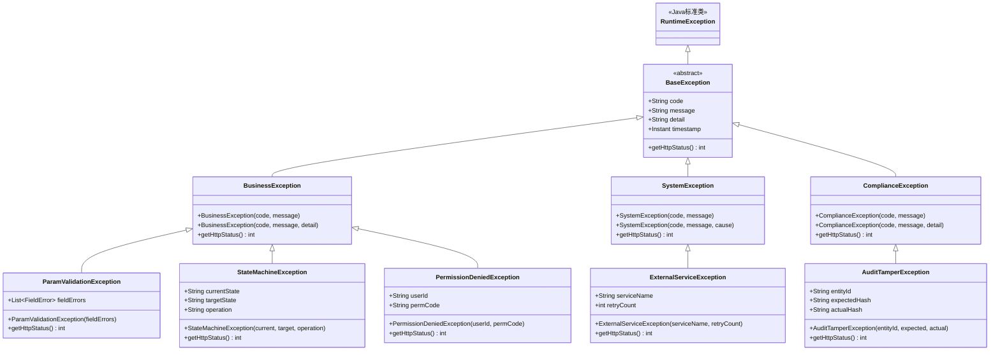

# 异常容错设计

> 文档版本：v1.0 | 编制日期：2026-05-22 | 最后修订：2026-05-22 | 基线：概要设计 v1.1

---

## 1. 全局异常体系

### 1.1 异常类层次图



### 1.2 异常类详细定义

| 异常类 | 字段 | 构造方法 | 使用场景 | HTTP状态 |
|--------|------|----------|----------|----------|
| **BaseException** | code, message, detail, timestamp | (code, message) | 所有业务异常基类，抽象类 | 由子类决定 |
| **BusinessException** | 继承Base | (code, message) / (code, message, detail) | 通用业务规则违反（编号重复、数据冲突等） | 400/409 |
| **SystemException** | 继承Base + cause | (code, message) / (code, message, cause) | 系统级错误（数据库异常、配置缺失等） | 500/503 |
| **ComplianceException** | 继承Base | (code, message) / (code, message, detail) | 合规约束违反（审计篡改、签名无效等） | 409/500 |
| **ParamValidationException** | 继承Base + fieldErrors | (fieldErrors) | 请求参数校验失败（@Valid注解触发） | 400 |
| **StateMachineException** | 继承Base + currentState, targetState, operation | (current, target, operation) | 状态机非法转换 | 409 |
| **PermissionDeniedException** | 继承Base + userId, permCode | (userId, permCode) | API权限不足 | 403 |
| **ExternalServiceException** | 继承Base + serviceName, retryCount | (serviceName, retryCount) | 外部服务调用失败（OA、MinIO等） | 502 |
| **AuditTamperException** | 继承Base + entityId, expectedHash, actualHash | (entityId, expected, actual) | 审计日志哈希链校验失败 | 500 |

### 1.3 全局异常处理器

```java
@RestControllerAdvice
public class GlobalExceptionHandler {

    // 参数校验异常
    @ExceptionHandler(ParamValidationException.class)
    public ResponseEntity<ApiResponse<Void>> handleParamValidation(ParamValidationException e) {
        return ResponseEntity.status(400).body(
            ApiResponse.error("SY0100", "请求参数校验失败", e.getFieldErrors())
        );
    }

    // 状态机异常
    @ExceptionHandler(StateMachineException.class)
    public ResponseEntity<ApiResponse<Void>> handleStateMachine(StateMachineException e) {
        return ResponseEntity.status(409).body(
            ApiResponse.error(e.getCode(), e.getMessage(), e.getDetail())
        );
    }

    // 权限异常
    @ExceptionHandler(PermissionDeniedException.class)
    public ResponseEntity<ApiResponse<Void>> handlePermission(PermissionDeniedException e) {
        return ResponseEntity.status(403).body(
            ApiResponse.error("SY0401", "无权限访问", null)
        );
    }

    // 业务异常
    @ExceptionHandler(BusinessException.class)
    public ResponseEntity<ApiResponse<Void>> handleBusiness(BusinessException e) {
        return ResponseEntity.status(e.getHttpStatus()).body(
            ApiResponse.error(e.getCode(), e.getMessage(), e.getDetail())
        );
    }

    // 合规异常
    @ExceptionHandler(ComplianceException.class)
    public ResponseEntity<ApiResponse<Void>> handleCompliance(ComplianceException e) {
        // 合规异常必须记录审计日志
        auditLogger.error("COMPLIANCE_VIOLATION: code={}, msg={}", e.getCode(), e.getMessage());
        return ResponseEntity.status(e.getHttpStatus()).body(
            ApiResponse.error(e.getCode(), e.getMessage(), null)
        );
    }

    // 外部服务异常
    @ExceptionHandler(ExternalServiceException.class)
    public ResponseEntity<ApiResponse<Void>> handleExternal(ExternalServiceException e) {
        return ResponseEntity.status(502).body(
            ApiResponse.error(e.getCode(), "外部服务不可用，请稍后重试", null)
        );
    }

    // 兜底异常
    @ExceptionHandler(Exception.class)
    public ResponseEntity<ApiResponse<Void>> handleUnknown(Exception e) {
        log.error("未处理异常", e);
        return ResponseEntity.status(500).body(
            ApiResponse.error("SY0800", "系统内部错误", null)
        );
    }
}
```

---

## 2. 接口异常码体系

### 2.1 错误码规则

6位错误码结构：`{模块2位}{类型2位}{序号2位}`

| 模块代码 | 模块名称 | 编号前缀 |
|----------|----------|----------|
| 01 | 需求管理(req-mgr) | RQ |
| 02 | 追溯管理(trace-mgr) | TR |
| 03 | 变更管理(chg-mgr) | CH |
| 04 | 合规管理(compliance) | CP |
| 05 | 电子签名(e-sign) | ES |
| 06 | 风险管理(risk-mgr) | RK |
| 07 | 项目管理(proj-mgr) | PJ |
| 08 | 报表仪表盘(report) | RP |
| 09 | 系统管理(sys-mgr) | SY |

| 错误类别 | 含义 | 编号 |
|----------|------|------|
| 01 | 参数校验错误 | 01 |
| 02 | 业务规则错误 | 02 |
| 03 | 状态机错误 | 03 |
| 04 | 权限错误 | 04 |
| 05 | 数据不存在 | 05 |
| 06 | 数据冲突 | 06 |
| 07 | 外部服务错误 | 07 |
| 08 | 系统内部错误 | 08 |

### 2.2 完整错误码表

#### 2.2.1 系统管理模块（SY）

| 错误码 | HTTP状态 | 错误信息 | 处理建议 |
|--------|----------|----------|----------|
| SY0100 | 400 | 请求参数校验失败 | 检查请求参数格式和必填项 |
| SY0101 | 400 | 必填参数缺失 | 补充缺失的必填参数 |
| SY0102 | 400 | 参数格式错误 | 检查参数格式是否符合要求 |
| SY0103 | 400 | 分页参数超出范围 | page≥1, size范围1-100 |
| SY0400 | 401 | 未认证（Token缺失或过期） | 重新登录或刷新Token |
| SY0401 | 403 | 无权限访问 | 联系管理员分配对应角色权限 |
| SY0402 | 403 | 角色权限不足 | 需要更高级别角色才能执行此操作 |
| SY0403 | 403 | 数据权限不足 | 无权访问该项目的数据 |
| SY0500 | 404 | 资源不存在 | 检查请求的资源ID是否正确 |
| SY0600 | 409 | 资源冲突（重复创建） | 资源已存在，无需重复创建 |
| SY0700 | 502 | 外部服务不可用 | 稍后重试，若持续失败联系运维 |
| SY0800 | 500 | 系统内部错误 | 联系运维排查 |
| SY0801 | 500 | 数据库操作失败 | 联系运维检查数据库状态 |
| SY0802 | 503 | 服务暂时不可用（熔断） | 等待服务恢复后重试 |
| SY0803 | 429 | 请求频率超限 | 降低请求频率，默认100次/分钟 |

#### 2.2.2 需求管理模块（RQ）

| 错误码 | HTTP状态 | 错误信息 | 处理建议 |
|--------|----------|----------|----------|
| RQ0100 | 400 | 需求标题格式错误 | 标题1-200字符，不允许纯空格 |
| RQ0101 | 400 | 需求描述格式错误 | 描述10-5000字符 |
| RQ0102 | 400 | 需求编号格式错误 | 系统自动生成，不可手动修改 |
| RQ0103 | 400 | 优先级值不合法 | 枚举值：MUST/SHOULD/COULD/WONT |
| RQ0104 | 400 | 需求层级不合法 | 枚举值：URS/PRS/SRS/DRS |
| RQ0200 | 400 | 需求编号已存在 | 检查是否重复创建 |
| RQ0201 | 400 | 需求标题不能为空 | 填写需求标题 |
| RQ0202 | 400 | 需求层级与类型不匹配 | URS不适用PendingDecompose状态 |
| RQ0203 | 400 | 项目状态不允许创建需求 | 项目需为Active状态 |
| RQ0300 | 409 | 需求状态不允许此操作 | 检查当前状态和目标状态是否合法 |
| RQ0301 | 409 | 草稿状态才可删除 | 仅Draft状态的需求可删除 |
| RQ0302 | 409 | 已提交状态才可分配评审 | 需求需先提交评审 |
| RQ0303 | 409 | DCP门控校验未通过 | 补全缺失字段后再提交 |
| RQ0304 | 409 | 评审轮次超过限制(3轮) | 联系QA经理仲裁 |
| RQ0500 | 404 | 需求不存在 | 检查需求ID是否正确 |
| RQ0600 | 409 | 需求已被其他用户修改（乐观锁冲突） | 刷新页面后重试 |
| RQ0601 | 409 | 评审已存在，不可重复发起 | 需先完成当前评审 |

#### 2.2.3 追溯管理模块（TR）

| 错误码 | HTTP状态 | 错误信息 | 处理建议 |
|--------|----------|----------|----------|
| TR0100 | 400 | 追溯类型参数错误 | 枚举值：satisfies/verified_by/specified_by |
| TR0200 | 400 | 追溯类型不合法 | 检查追溯类型是否符合规则 |
| TR0201 | 400 | 不允许自引用追溯 | 源需求和目标需求不能相同 |
| TR0202 | 400 | 追溯链接已存在 | 同一对源-目标不可重复创建追溯 |
| TR0203 | 400 | 追溯目标需求状态不允许创建追溯 | 目标需求需为Approved状态 |
| TR0500 | 404 | 追溯链接不存在 | 检查追溯链接ID |
| TR0600 | 409 | 追溯目标需求状态不允许创建追溯 | 需求需处于允许追溯的状态 |

#### 2.2.4 变更管理模块（CH）

| 错误码 | HTTP状态 | 错误信息 | 处理建议 |
|--------|----------|----------|----------|
| CH0100 | 400 | 变更请求参数格式错误 | 检查请求参数格式 |
| CH0200 | 400 | 变更类型不合法 | 枚举值：major/minor/document/emergency |
| CH0201 | 400 | 变更原因不能为空 | 填写变更原因 |
| CH0202 | 400 | 影响分析数据不完整 | 完成影响分析后再审批 |
| CH0203 | 400 | 紧急变更需24h内补审批 | 先执行后需在24h内完成审批流程 |
| CH0300 | 409 | 变更状态不允许此操作 | 检查当前变更状态 |
| CH0301 | 409 | 变更审批中，不可修改 | 等待审批完成 |
| CH0302 | 409 | 基线已锁定，需先解锁 | 联系QA经理解锁基线 |
| CH0500 | 404 | 变更请求不存在 | 检查变更请求ID |

#### 2.2.5 合规管理模块（CP）

| 错误码 | HTTP状态 | 错误信息 | 处理建议 |
|--------|----------|----------|----------|
| CP0100 | 400 | 合规模块参数格式错误 | 检查请求参数格式 |
| CP0200 | 400 | 审计日志不可修改或删除 | 审计日志仅追加只写 |
| CP0201 | 400 | SOUP信息不完整 | 补全SOUP必填信息 |
| CP0202 | 400 | 安全分类级别不合法 | 枚举值：Class_A/Class_B/Class_C |
| CP0203 | 400 | 问题报告信息不完整 | 补全问题报告必填信息 |
| CP0204 | 400 | IEC62304检查清单评估数据不完整 | 补全评估数据 |
| CP0300 | 409 | 基线已锁定，不可修改 | 联系QA经理解锁基线 |
| CP0301 | 409 | 审计日志哈希链校验失败 | 立即排查审计日志是否被篡改 |
| CP0302 | 409 | 基线锁定需双人签名 | 需QA经理+第二签名人双人签名 |
| CP0303 | 409 | 问题报告状态不允许此操作 | 检查问题报告当前状态 |
| CP0500 | 404 | 合规资源不存在 | 检查资源ID |
| CP0600 | 409 | SOUP记录已存在 | 检查是否重复登记 |
| CP0601 | 409 | 问题报告编号已存在 | 检查编号是否重复 |

#### 2.2.6 电子签名模块（ES）

| 错误码 | HTTP状态 | 错误信息 | 处理建议 |
|--------|----------|----------|----------|
| ES0100 | 400 | 签名请求参数格式错误 | 检查请求参数格式 |
| ES0200 | 400 | 签名密码错误 | 重新输入签名密码 |
| ES0201 | 400 | OTP动态码错误 | 重新获取并输入OTP |
| ES0202 | 400 | OTP已过期 | 重新发送OTP（5分钟有效期） |
| ES0203 | 400 | 签名意图已失效 | 重新发起签名意图（10分钟有效期） |
| ES0204 | 400 | 签名人与评审人不匹配 | 签名人必须是该操作的指定角色 |
| ES0205 | 400 | 不支持的签名场景 | 检查签名场景是否合法 |
| ES0300 | 409 | 签名已完成，不可重复签名 | 签名记录已存在 |
| ES0500 | 404 | 签名意图不存在 | 检查intent_id是否正确 |
| ES0600 | 409 | 文档已被修改，签名无效 | 刷新文档后重新签名 |

#### 2.2.7 风险管理模块（RK）

| 错误码 | HTTP状态 | 错误信息 | 处理建议 |
|--------|----------|----------|----------|
| RK0100 | 400 | 风险参数格式错误 | 检查请求参数格式 |
| RK0200 | 400 | 严重度/概率/可检测性值超出范围(1-5) | S/P/D值必须在1-5范围内 |
| RK0201 | 400 | RPN计算结果不一致 | S×P×D应等于RPN |
| RK0300 | 409 | 风险状态不允许此操作 | 检查当前风险状态 |
| RK0301 | 409 | 高风险项必须填写控制措施 | RPN≥200的风险项必须定义控制措施 |

#### 2.2.8 项目管理模块（PJ）

| 错误码 | HTTP状态 | 错误信息 | 处理建议 |
|--------|----------|----------|----------|
| PJ0100 | 400 | 项目参数格式错误 | 检查请求参数格式 |
| PJ0200 | 400 | 项目编码已存在 | 检查项目编码是否重复 |
| PJ0201 | 400 | 项目成员角色不合法 | 检查成员角色编码 |
| PJ0300 | 409 | 项目状态不允许此操作 | 检查项目当前状态 |
| PJ0301 | 409 | DCP门控条件未满足 | 补全缺失的DCP条件 |
| PJ0500 | 404 | 项目不存在 | 检查项目ID |
| PJ0600 | 409 | 项目成员已存在 | 不可重复添加成员 |

#### 2.2.9 报表仪表盘模块（RP）

| 错误码 | HTTP状态 | 错误信息 | 处理建议 |
|--------|----------|----------|----------|
| RP0100 | 400 | 报表参数格式错误 | 检查请求参数格式 |
| RP0200 | 400 | 导出格式不支持 | 支持：PDF/EXCEL/NMPA_ERPS |
| RP0500 | 404 | 报表数据不存在 | 检查项目ID和时间范围 |
| RP0700 | 502 | 报表生成服务不可用 | 稍后重试 |

---

## 3. 数据校验错误处理

### 3.1 字段校验（@Valid注解错误码映射）

```java
/**
 * 字段校验错误码自动映射
 * Jakarta Validation注解 → 错误码映射表
 */
@Component
public class FieldValidationMapper {

    private static final Map<String, String> ANNOTATION_CODE_MAP = Map.of(
        "NotNull",   "SY0101",  // 必填参数缺失
        "NotBlank",  "SY0101",  // 必填参数缺失
        "NotEmpty",  "SY0101",  // 必填参数缺失
        "Size",      "SY0102",  // 参数格式错误(长度)
        "Min",       "SY0102",  // 参数格式错误(最小值)
        "Max",       "SY0102",  // 参数格式错误(最大值)
        "Pattern",   "SY0102",  // 参数格式错误(正则)
        "Email",     "SY0102"   // 参数格式错误(邮箱)
    );

    /**
     * 将@Valid校验结果映射为错误码
     */
    public List<FieldError> mapErrors(ConstraintViolationException ex) {
        return ex.getConstraintViolations().stream()
            .map(v -> {
                String annotation = v.getConstraintDescriptor()
                    .getAnnotation().annotationType().getSimpleName();
                String code = ANNOTATION_CODE_MAP.getOrDefault(annotation, "SY0100");
                String field = v.getPropertyPath().toString();
                return new FieldError(code, field, v.getMessage());
            })
            .collect(Collectors.toList());
    }
}

/**
 * 字段错误DTO
 */
@Data
@AllArgsConstructor
public class FieldError {
    private String code;      // 错误码，如 SY0101
    private String field;     // 字段名，如 title
    private String message;   // 错误信息
}
```

### 3.2 跨字段校验

```java
/**
 * 跨字段校验服务
 * 处理涉及多个字段关联关系的业务校验
 */
@Service
public class CrossFieldValidator {

    /**
     * 状态转换合法性校验
     * @param current 当前状态
     * @param target  目标状态
     * @param level   需求层级(URS/PRS/SRS/DRS)
     * @param context 操作上下文
     */
    public void validateStateTransition(String current, String target,
                                         String level, OperationContext context) {
        // 层级特有状态校验
        if ("PendingDecompose".equals(target) || "Decomposed".equals(target)) {
            if (!"PRS".equals(level) && !"SRS".equals(level)) {
                throw new StateMachineException(current, target,
                    "PendingDecompose/Decomposed仅PRS/SRS层级适用");
            }
        }
        if ("PendingVerify".equals(target) || "Verified".equals(target)) {
            if (!"SRS".equals(level) && !"DRS".equals(level)) {
                throw new StateMachineException(current, target,
                    "PendingVerify/Verified仅SRS/DRS层级适用");
            }
        }

        // 状态转换方向校验（不可跳步）
        Map<String, Set<String>> allowedTransitions = Map.of(
            "Draft",           Set.of("Submitted"),
            "Submitted",       Set.of("InReview"),
            "InReview",        Set.of("Approved", "Rejected"),
            "Rejected",        Set.of("Draft"),
            "Approved",        Set.of("PendingDecompose", "Implemented", "Retired"),
            "PendingDecompose",Set.of("Decomposed"),
            "Decomposed",      Set.of("Implemented"),
            "Implemented",     Set.of("PendingVerify", "Closed", "Retired"),
            "PendingVerify",   Set.of("Verified"),
            "Verified",        Set.of("Baseline", "Closed"),
            "Baseline",        Set.of("Changed", "Closed"),
            "Changed",         Set.of("Draft")
        );

        Set<String> allowed = allowedTransitions.get(current);
        if (allowed == null || !allowed.contains(target)) {
            throw new StateMachineException(current, target,
                "状态不允许从 " + current + " 转换为 " + target);
        }
    }

    /**
     * CTI子表一致性校验
     * 校验SOUP的CTI（Commercial Third-party Integration）子表与主表一致
     * @param soup SOUP主表数据
     * @param ctiList CTI子表数据
     */
    public void validateCtiConsistency(Soup soup, List<SoupCti> ctiList) {
        // 安全分类为Class A时，CTI子表可为空
        if ("Class_A".equals(soup.getSafetyClass())) {
            return;
        }

        // Class B/C必须有至少一条CTI记录
        if (ctiList == null || ctiList.isEmpty()) {
            throw new BusinessException("CP0201",
                "Class B/C的SOUP必须登记至少一条CTI信息");
        }

        // CTI的SOUP ID必须与主表一致
        for (SoupCti cti : ctiList) {
            if (!cti.getSoupId().equals(soup.getId())) {
                throw new BusinessException("CP0201",
                    "CTI子表与SOUP主表ID不匹配");
            }
        }
    }
}
```

### 3.3 批量操作部分失败策略

```java
/**
 * 批量导入部分失败策略
 * 采用"尽力而为"模式：成功的行正常写入，失败的行记录错误信息
 */
@Service
public class BatchImportStrategy {

    /**
     * 批量导入需求
     * @param projectId  项目ID
     * @param importList  导入数据列表
     * @return ImportResultVO 包含成功数、失败数、失败详情
     */
    @Transactional
    public ImportResultVO batchImport(Long projectId, List<RequirementImportDTO> importList) {
        int successCount = 0;
        int failCount = 0;
        List<ImportErrorDetail> errors = new ArrayList<>();

        for (int i = 0; i < importList.size(); i++) {
            RequirementImportDTO dto = importList.get(i);
            try {
                // 逐条校验+创建，单条失败不影响其他行
                validateAndCreate(projectId, dto);
                successCount++;
            } catch (BusinessException e) {
                failCount++;
                errors.add(new ImportErrorDetail(
                    i + 1,  // 行号（从1开始）
                    dto.getTitle(),
                    e.getCode(),
                    e.getMessage()
                ));
            } catch (Exception e) {
                failCount++;
                errors.add(new ImportErrorDetail(
                    i + 1,
                    dto.getTitle(),
                    "SY0800",
                    "系统错误：" + e.getMessage()
                ));
            }
        }

        // 如果全部失败，回滚整个事务
        if (successCount == 0 && failCount > 0) {
            throw new BusinessException("RQ0100", "全部行校验失败，请检查数据后重试");
        }

        // 部分成功：提交成功的事务，返回失败详情
        return new ImportResultVO(successCount, failCount, errors);
    }
}

/**
 * 批量导入结果VO
 */
@Data
@AllArgsConstructor
public class ImportResultVO {
    private int successCount;               // 成功数
    private int failCount;                  // 失败数
    private List<ImportErrorDetail> errors;  // 失败详情
}

/**
 * 导入错误详情
 */
@Data
@AllArgsConstructor
public class ImportErrorDetail {
    private int rowNumber;     // 行号
    private String title;      // 需求标题（用于定位）
    private String errorCode;  // 错误码
    private String message;    // 错误信息
}
```

---

## 4. 断网重试策略

### 4.1 前端重试策略（Axios拦截器）

```javascript
/**
 * Axios重试拦截器
 * 处理网络异常和服务端5xx错误的自动重试
 */
import axios from 'axios';

const httpClient = axios.create({
    baseURL: '/api/v1',
    timeout: 30000,        // 默认30秒超时
    maxRetries: 3,         // 最大重试次数
    retryDelay: 1000,      // 初始重试延迟(ms)
    retryBackoff: 2,       // 退避倍数
});

// 请求拦截器：附加幂等键
httpClient.interceptors.request.use(config => {
    // 写操作自动附加幂等键
    if (['post', 'put', 'patch', 'delete'].includes(config.method)) {
        config.headers['X-Idempotency-Key'] = generateIdempotencyKey(config);
    }
    return config;
});

// 响应拦截器：自动重试
httpClient.interceptors.response.use(
    response => response,
    async error => {
        const config = error.config;
        if (!config) return Promise.reject(error);

        config.__retryCount = config.__retryCount || 0;

        // 判断是否需要重试
        const shouldRetry = isRetryable(error) && config.__retryCount < (config.maxRetries || 3);
        if (!shouldRetry) return Promise.reject(error);

        config.__retryCount++;

        // 指数退避延迟
        const delay = (config.retryDelay || 1000) *
            Math.pow(config.retryBackoff || 2, config.__retryCount - 1);

        console.warn(`请求失败，${delay}ms后第${config.__retryCount}次重试...`, error.message);

        await sleep(delay);
        return httpClient(config);
    }
);

// 可重试的条件
function isRetryable(error) {
    // 网络断开
    if (!error.response) return true;
    // 5xx服务端错误
    if (error.response.status >= 500 && error.response.status !== 503) return true;
    // 429限流
    if (error.response.status === 429) {
        const retryAfter = error.response.headers['retry-after'];
        if (retryAfter) {
            error.config.retryDelay = parseInt(retryAfter) * 1000;
        }
        return true;
    }
    // 408请求超时
    if (error.response.status === 408) return true;
    // 401不重试（需要刷新Token或重新登录）
    // 403不重试（权限问题）
    // 404/409等客户端错误不重试
    return false;
}

// 幂等键生成
function generateIdempotencyKey(config) {
    return `${crypto.randomUUID()}_${config.method}_${config.url}`;
}

function sleep(ms) {
    return new Promise(resolve => setTimeout(resolve, ms));
}
```

### 4.2 后端重试策略（Spring Retry + Outbox补偿）

```java
/**
 * 后端重试策略
 * 使用Spring Retry处理瞬时故障，Outbox模式保证最终一致性
 */
@Service
public class RetryableService {

    /**
     * 外部服务调用（带重试）
     * 适用于OA服务、邮件服务等外部调用
     */
    @Retryable(
        value = {ExternalServiceException.class, RestClientException.class},
        maxAttempts = 3,
        backoff = @Backoff(
            delay = 1000,          // 初始延迟1秒
            multiplier = 2,       // 指数退避倍数
            maxDelay = 10000      // 最大延迟10秒
        ),
        recover = "recoverExternalCall"  // 重试耗尽后的兜底方法
    )
    public <T> T callExternalService(Supplier<T> supplier, String serviceName) {
        try {
            return supplier.get();
        } catch (Exception e) {
            throw new ExternalServiceException(serviceName, 0);
        }
    }

    /**
     * 重试耗尽后的兜底方法
     * 将操作写入Outbox表，等待补偿任务处理
     */
    @Transactional
    public <T> T recoverExternalService(Exception e, Supplier<T> supplier, String serviceName) {
        log.error("外部服务[{}]调用失败，写入Outbox等待补偿", serviceName, e);

        // 写入Outbox补偿记录
        OutboxMessage outbox = OutboxMessage.builder()
            .aggregateType(serviceName)
            .payload(serializePayload(supplier))
            .status(OutboxStatus.PENDING)
            .retryCount(0)
            .maxRetryCount(5)
            .nextRetryAt(Instant.now().plusSeconds(60))
            .createdAt(Instant.now())
            .build();
        outboxRepository.save(outbox);

        throw new ExternalServiceException(serviceName, 3);
    }
}

/**
 * Outbox补偿定时任务
 * 定期扫描待补偿的Outbox记录并重试
 */
@Component
public class OutboxCompensationJob {

    @Scheduled(fixedDelay = 60000) // 每分钟扫描一次
    @Transactional
    public void compensate() {
        List<OutboxMessage> pendingMessages = outboxRepository
            .findByStatusAndNextRetryAtBefore(OutboxStatus.PENDING, Instant.now());

        for (OutboxMessage msg : pendingMessages) {
            try {
                executeOutboxMessage(msg);
                msg.setStatus(OutboxStatus.COMPLETED);
                msg.setCompletedAt(Instant.now());
            } catch (Exception e) {
                msg.setRetryCount(msg.getRetryCount() + 1);
                if (msg.getRetryCount() >= msg.getMaxRetryCount()) {
                    msg.setStatus(OutboxStatus.DEAD_LETTER);
                    alertService.sendAlert("Outbox补偿失败", msg.toString());
                } else {
                    // 指数退避：1min, 5min, 15min, 60min, 240min
                    long delayMinutes = (long) Math.pow(4, msg.getRetryCount());
                    msg.setNextRetryAt(Instant.now().plusSeconds(delayMinutes * 60));
                }
            }
            outboxRepository.save(msg);
        }
    }
}
```

### 4.3 幂等性设计

```java
/**
 * 幂等性设计
 * 通过幂等键确保重复请求不会产生副作用
 *
 * 幂等键组成：请求ID + 操作类型 + 实体ID
 * 格式：{requestId}:{operationType}:{entityId}
 * 示例：req-abc123:req:create:proj-001
 */
@Component
public class IdempotencyService {

    @Autowired
    private RedisTemplate<String, String> redisTemplate;

    private static final Duration IDEMPOTENCY_TTL = Duration.ofHours(24);

    /**
     * 校验并记录幂等键
     * @param idempotencyKey 幂等键
     * @return true=首次请求(放行), false=重复请求(拒绝)
     */
    public boolean checkAndRecord(String idempotencyKey) {
        Boolean isFirst = redisTemplate.opsForValue()
            .setIfAbsent("idempotent:" + idempotencyKey, "1", IDEMPOTENCY_TTL);
        return Boolean.TRUE.equals(isFirst);
    }

    /**
     * 生成幂等键
     * @param requestId    请求ID（前端生成的UUID）
     * @param operationType 操作类型（如 req:create, chg:approve）
     * @param entityId     实体ID（项目ID/需求ID等，可为空）
     */
    public String generateKey(String requestId, String operationType, String entityId) {
        if (entityId != null) {
            return requestId + ":" + operationType + ":" + entityId;
        }
        return requestId + ":" + operationType;
    }

    /**
     * 幂等性拦截器
     * 在Controller层拦截重复请求
     */
    @Target(ElementType.METHOD)
    @Retention(RetentionPolicy.RUNTIME)
    public @interface Idempotent {
        String operationType();
        String entityIdParam() default "";  // SpEL表达式，从参数中提取实体ID
    }
}

/**
 * 幂等性AOP切面
 */
@Aspect
@Component
public class IdempotentAspect {

    @Autowired
    private IdempotencyService idempotencyService;

    @Around("@annotation(idempotent)")
    public Object checkIdempotency(ProceedingJoinPoint pjp, Idempotent idempotent) throws Throwable {
        HttpServletRequest request = getCurrentRequest();
        String requestId = request.getHeader("X-Idempotency-Key");

        if (requestId == null || requestId.isEmpty()) {
            // 写操作必须提供幂等键
            if (!"GET".equalsIgnoreCase(request.getMethod())) {
                throw new BusinessException("SY0101", "写操作必须提供X-Idempotency-Key");
            }
            return pjp.proceed();
        }

        String entityId = extractEntityId(pjp, idempotent.entityIdParam());
        String key = idempotencyService.generateKey(requestId, idempotent.operationType(), entityId);

        if (!idempotencyService.checkAndRecord(key)) {
            throw new BusinessException("SY0600", "重复请求，请勿重复提交");
        }

        return pjp.proceed();
    }
}
```

---

## 5. 事务回滚规则

### 5.1 单模块事务边界（@Transactional）

```java
/**
 * 单模块事务边界定义
 *
 * 规则：
 * 1. 写操作（CREATE/UPDATE/DELETE）使用 @Transactional
 * 2. 读操作（READ）使用 @Transactional(readOnly = true)
 * 3. 事务注解标注在Service层方法上，不标注在Controller或Repository
 * 4. 事务传播行为默认 REQUIRED，嵌套调用共享同一事务
 */
@Service
public class RequirementService {

    // 创建需求 - 事务边界
    @Transactional(isolation = Isolation.READ_COMMITTED)
    public RequirementVO create(RequirementCreateDTO dto) {
        // 1. 校验项目状态
        // 2. 生成需求编号
        // 3. 写入需求表
        // 4. 写入审计日志（同一事务）
        // 5. 写入Outbox事件（同一事务）
        // 任何步骤失败，整体回滚
    }

    // 状态变更 - 事务边界
    @Transactional(isolation = Isolation.READ_COMMITTED)
    public RequirementVO changeStatus(Long id, StatusChangeDTO dto) {
        // 1. 查询需求（加乐观锁）
        // 2. 状态机校验
        // 3. DCP门控校验
        // 4. 更新状态（version+1）
        // 5. 写入审计日志
        // 6. 写入Outbox事件
        // 7. 触发后续操作（如签名意图创建，在同一事务中）
    }

    // 读操作 - 只读事务
    @Transactional(readOnly = true)
    public Page<RequirementVO> list(QueryParams params) {
        // 仅查询，无写操作
    }
}
```

### 5.2 跨模块最终一致性（Outbox + CDC）

```java
/**
 * 跨模块最终一致性方案
 * 使用Transactional Outbox模式 + Debezium CDC
 *
 * 原理：
 * 1. 业务操作和事件写入Outbox表在同一事务中（保证原子性）
 * 2. Debezium监听Outbox表的变更，将事件发布到Kafka
 * 3. 下游模块消费Kafka事件，更新本地数据
 * 4. 通过消息确认机制保证至少一次投递
 *
 *                ┌──────────────────────┐
 *                │   业务模块Service     │
 *                │  @Transactional      │
 *                │  1.业务操作          │
 *                │  2.写入Outbox        │──┐
 *                └──────────────────────┘  │ 同一事务
 *                         │                │
 *                    PostgreSQL              │
 *                         │                │
 *                    Debezium CDC           │
 *                         │                │
 *                      Kafka ──────────────┘
 *                    ╱       ╲
 *            消费者1          消费者2
 *         (trace-mgr)     (compliance)
 */

/**
 * Outbox消息实体
 */
@Entity
@Table(name = "outbox_message", schema = "sys_schema")
public class OutboxMessage {

    @Id
    @GeneratedValue(strategy = GenerationType.IDENTITY)
    private Long id;

    private String aggregateType;     // 聚合类型（如 Requirement）
    private String aggregateId;       // 聚合ID
    private String eventType;         // 事件类型（如 RequirementApproved）
    private String payload;           // 事件载荷(JSON)
    private String traceId;           // 链路追踪ID

    @Enumerated(EnumType.STRING)
    private OutboxStatus status;      // PENDING/COMPLETED/DEAD_LETTER

    private Instant createdAt;
    private Instant completedAt;
    private Integer retryCount;
    private Integer maxRetryCount;
    private Instant nextRetryAt;
}

public enum OutboxStatus {
    PENDING,        // 待投递
    COMPLETED,      // 已投递
    DEAD_LETTER     // 死信（投递失败，需人工介入）
}
```

### 5.3 补偿事务设计（Saga模式简化版）

```java
/**
 * 补偿事务设计 - Saga模式简化版
 * 用于跨模块操作的补偿回滚
 *
 * 与标准Saga模式的区别：
 * - 不使用独立编排器，而是在Service层内联补偿逻辑
 * - 补偿操作通过Outbox异步执行
 * - 支持人工介入的死信处理
 */
@Service
public class SagaCompensationService {

    /**
     * 基线锁定Saga流程
     * 步骤1: 校验前置条件
     * 步骤2: 计算基线哈希
     * 步骤3: 第一签(QA经理)
     * 步骤4: 第二签(研发经理)
     * 步骤5: 锁定基线
     * 步骤6: 锁定基线内需求
     *
     * 失败补偿：
     * - 步骤3失败：回滚步骤1-2（无副作用）
     * - 步骤4失败：标记第一签为"孤立"，记录待清理
     * - 步骤5失败：标记所有签名为"孤立"，记录待清理
     * - 步骤6失败：回滚步骤5（解锁基线），标记签名为"孤立"
     */
    @Transactional
    public BaselineVO lockBaseline(Long baselineId, Long qaMgrId, Long secondSignerId) {
        List<SagaStep> steps = List.of(
            SagaStep.of("validatePreconditions", () -> validateBaselinePreconditions(baselineId)),
            SagaStep.of("computeBaselineHash", () -> computeBaselineHash(baselineId)),
            SagaStep.of("firstSignature", () -> createFirstSignature(baselineId, qaMgrId)),
            SagaStep.of("secondSignature", () -> createSecondSignature(baselineId, secondSignerId)),
            SagaStep.of("lockBaseline", () -> updateBaselineStatus(baselineId, "Locked")),
            SagaStep.of("lockRequirements", () -> lockBaselineRequirements(baselineId))
        );

        return executeSaga(steps, baselineId);
    }

    /**
     * 执行Saga流程
     * 任一步骤失败，按逆序执行已完成步骤的补偿操作
     */
    private <T> T executeSaga(List<SagaStep> steps, Long sagaId) {
        List<CompletedStep> completed = new ArrayList<>();

        try {
            for (SagaStep step : steps) {
                Object result = step.execute();
                completed.add(new CompletedStep(step.getName(), result));
            }
            return (T) completed.get(completed.size() - 1).getResult();
        } catch (Exception e) {
            // 按逆序执行补偿
            for (int i = completed.size() - 1; i >= 0; i--) {
                try {
                    compensate(completed.get(i).getName(), sagaId);
                } catch (Exception compEx) {
                    log.error("补偿操作失败: step={}, sagaId={}", completed.get(i).getName(), sagaId, compEx);
                    // 补偿失败写入死信队列
                    deadLetterService.record(sagaId, completed.get(i).getName(), compEx);
                }
            }
            throw e;
        }
    }

    /**
     * 补偿操作映射
     */
    private void compensate(String stepName, Long sagaId) {
        switch (stepName) {
            case "firstSignature":
                // 标记签名为"孤立"
                signatureService.markOrphaned(sagaId);
                break;
            case "secondSignature":
                signatureService.markOrphaned(sagaId);
                break;
            case "lockBaseline":
                // 回滚基线状态为Draft
                baselineService.updateStatus(sagaId, "Draft");
                break;
            case "lockRequirements":
                // 解锁基线内需求
                baselineService.unlockRequirements(sagaId);
                break;
            // 步骤1-2无副作用，无需补偿
            default:
                break;
        }
    }
}
```

### 5.4 事务隔离级别选择

| 模块/场景 | 隔离级别 | 原因 |
|-----------|----------|------|
| 需求创建/更新 | READ_COMMITTED | 默认级别，避免脏读，性能与一致性平衡 |
| 需求状态变更 | READ_COMMITTED + 乐观锁 | 乐观锁（version字段）防止并发状态变更，避免丢失更新 |
| 审计日志写入 | READ_COMMITTED | 追加只写操作，无并发冲突 |
| 电子签名 | READ_COMMITTED | 签名意图校验通过Redis保证原子性 |
| 基线锁定 | READ_COMMITTED + 乐观锁 | 基线状态变更需乐观锁保护 |
| 批量导入 | READ_COMMITTED | 批量操作逐条处理，单条失败不影响整体 |
| 报表查询 | READ_COMMITTED (readOnly) | 只读事务，允许并行读取 |
| 余额/计数器更新 | SERIALIZABLE | 无此场景（Med-RMS无余额类操作） |

> **说明**：Med-RMS不存在高并发写竞争场景（用户量≤100，并发≤50 QPS），READ_COMMITTED + 乐观锁足以满足需求。不建议使用REPEATABLE_READ或SERIALIZABLE，因为会增大死锁概率。

---

## 6. 外部服务容错

### 6.1 OA服务调用超时/降级策略

```java
/**
 * OA服务调用容错配置
 * 使用Resilience4j实现熔断、限流、降级
 */
@Configuration
public class OaServiceCircuitBreakerConfig {

    @Bean
    public CircuitBreaker oaCircuitBreaker() {
        CircuitBreakerConfig config = CircuitBreakerConfig.custom()
            .failureRateThreshold(50)           // 失败率50%时打开熔断器
            .slowCallRateThreshold(80)          // 慢调用率80%时打开熔断器
            .slowCallDurationThreshold(Duration.ofSeconds(5)) // 慢调用阈值5秒
            .waitDurationInOpenState(Duration.ofSeconds(30))  // 熔断器打开后等待30秒
            .permittedNumberOfCallsInHalfOpenState(3)          // 半开状态允许3次调用
            .slidingWindowType(CircuitBreakerConfig.SlidingWindowType.COUNT_BASED)
            .slidingWindowSize(10)             // 滑动窗口大小10次
            .build();

        return CircuitBreaker.of("oaService", config);
    }
}

/**
 * OA服务降级策略
 */
@Service
public class OaServiceWrapper {

    @Autowired
    private CircuitBreaker oaCircuitBreaker;

    @Autowired
    private OaClient oaClient;

    /**
     * 创建OA审批流程（带熔断降级）
     */
    public OaApprovalResult createApproval(OaApprovalRequest request) {
        return Decorators.ofSupplier(() -> oaClient.createApproval(request))
            .withCircuitBreaker(oaCircuitBreaker)
            .withFallback(this::createApprovalFallback)
            .get();
    }

    /**
     * 降级策略：OA不可用时，创建内部审批记录，等待OA恢复后同步
     */
    private OaApprovalResult createApprovalFallback(Exception e) {
        log.warn("OA服务不可用，启用降级策略：创建内部审批记录", e);

        // 1. 创建内部审批记录（状态：PENDING_OA_SYNC）
        InternalApproval internal = InternalApproval.builder()
            .sourceType("OA_FALLBACK")
            .payload(request)
            .status("PENDING_OA_SYNC")
            .createdAt(Instant.now())
            .build();
        internalApprovalRepository.save(internal);

        // 2. 写入Outbox，等待OA恢复后补偿
        outboxService.publish("OaApprovalSync", internal.getId(), request);

        // 3. 返回降级结果
        return OaApprovalResult.fallback(internal.getId(), "OA服务降级，审批已在内部创建");
    }

    /**
     * OA审批状态回调（带超时兜底）
     * OA回调可能延迟，设置轮询兜底
     */
    @Scheduled(fixedDelay = 300000) // 每5分钟轮询一次
    public void pollOaApprovalStatus() {
        List<InternalApproval> pendingApprovals = internalApprovalRepository
            .findByStatusAndCreatedAtBefore("PENDING_OA_SYNC",
                Instant.now().minusSeconds(300)); // 至少5分钟前创建的

        for (InternalApproval approval : pendingApprovals) {
            try {
                OaApprovalStatus status = oaClient.getApprovalStatus(approval.getOaId());
                if ("COMPLETED".equals(status.getStatus())) {
                    approval.setStatus("APPROVED");
                    approval.setOaResult(status.getResult());
                    internalApprovalRepository.save(approval);
                }
            } catch (Exception e) {
                // 轮询失败，保持PENDING_OA_SYNC状态
                log.warn("OA审批状态轮询失败: id={}", approval.getId(), e);
            }
        }

        // 超时24小时未同步的OA审批，标记为需人工处理
        List<InternalApproval> expiredApprovals = internalApprovalRepository
            .findByStatusAndCreatedAtBefore("PENDING_OA_SYNC",
                Instant.now().minus(Duration.ofHours(24)));
        for (InternalApproval approval : expiredApprovals) {
            approval.setStatus("OA_SYNC_EXPIRED");
            internalApprovalRepository.save(approval);
            alertService.sendAlert("OA审批同步超时", approval.toString());
        }
    }
}
```

### 6.2 MinIO文件上传重试

```java
/**
 * MinIO文件上传容错策略
 */
@Service
public class MinioUploadService {

    private static final int MAX_RETRY = 3;
    private static final long INITIAL_DELAY_MS = 1000;

    /**
     * 上传文件（带重试）
     * 策略：指数退避重试3次，失败后写入待上传队列
     */
    public String uploadFile(String bucket, String objectKey, InputStream data, long size) {
        Exception lastException = null;

        for (int attempt = 1; attempt <= MAX_RETRY; attempt++) {
            try {
                // 每次重试重新创建InputStream（InputStream不可复用）
                InputStream retryStream = markableStream(data, size);
                minioClient.putObject(PutObjectArgs.builder()
                    .bucket(bucket)
                    .object(objectKey)
                    .stream(retryStream, size, -1)
                    .build());
                return objectKey;
            } catch (Exception e) {
                lastException = e;
                log.warn("MinIO上传失败(第{}/{}次): objectKey={}", attempt, MAX_RETRY, objectKey, e);

                if (attempt < MAX_RETRY) {
                    long delay = INITIAL_DELAY_MS * (1L << (attempt - 1)); // 1s, 2s, 4s
                    sleep(delay);
                }
            }
        }

        // 重试耗尽：写入待上传队列
        log.error("MinIO上传重试耗尽，写入待上传队列: objectKey={}", objectKey, lastException);
        PendingUpload pending = PendingUpload.builder()
            .bucket(bucket)
            .objectKey(objectKey)
            .fileData(toByteArray(data))
            .fileSize(size)
            .status("PENDING")
            .retryCount(0)
            .createdAt(Instant.now())
            .build();
        pendingUploadRepository.save(pending);

        throw new ExternalServiceException("MinIO", MAX_RETRY);
    }

    /**
     * 待上传队列补偿任务
     */
    @Scheduled(fixedDelay = 60000) // 每分钟扫描
    @Transactional
    public void compensatePendingUploads() {
        List<PendingUpload> pending = pendingUploadRepository
            .findByStatusAndRetryCountLessThan("PENDING", 5);

        for (PendingUpload upload : pending) {
            try {
                minioClient.putObject(PutObjectArgs.builder()
                    .bucket(upload.getBucket())
                    .object(upload.getObjectKey())
                    .stream(new ByteArrayInputStream(upload.getFileData()),
                            upload.getFileSize(), -1)
                    .build());
                upload.setStatus("COMPLETED");
                upload.setCompletedAt(Instant.now());
            } catch (Exception e) {
                upload.setRetryCount(upload.getRetryCount() + 1);
                log.warn("待上传队列重试失败: objectKey={}, retryCount={}",
                    upload.getObjectKey(), upload.getRetryCount(), e);
                if (upload.getRetryCount() >= 5) {
                    upload.setStatus("DEAD_LETTER");
                    alertService.sendAlert("MinIO上传持续失败", upload.toString());
                }
            }
            pendingUploadRepository.save(upload);
        }
    }
}
```

### 6.3 Debezium CDC中断恢复

```java
/**
 * Debezium CDC中断恢复策略
 *
 * Debezium通过PostgreSQL的WAL逻辑解码捕获数据变更。
 * 中断恢复依赖PostgreSQL的LSN（Log Sequence Number）机制：
 * Debezium定期将已处理的LSN写入offset存储，中断后从上次offset继续消费。
 */

/**
 * CDC监控与恢复配置
 */
@Configuration
public class DebeziumCdcConfig {

    /**
     * Debezium引擎配置
     */
    @Bean
    public io.debezium.engine.DebeziumEngine<ChangeEvent<String, String>> debeziumEngine() {
        Properties props = new Properties();
        // 连接器配置
        props.setProperty("name", "med-rms-cdc");
        props.setProperty("connector.class", "io.debezium.connector.postgresql.PostgresConnector");

        // PostgreSQL连接
        props.setProperty("database.hostname", "${POSTGRES_HOST}");
        props.setProperty("database.port", "5432");
        props.setProperty("database.dbname", "med_rms");
        props.setProperty("database.user", "debezium");
        props.setProperty("database.password", "${DEBEZIUM_PASSWORD}");

        // 复制槽配置（中断恢复关键）
        props.setProperty("slot.name", "med_rms_cdc_slot");
        props.setProperty("slot.drop.on.stop", "false");  // 停止时不删除复制槽
        props.setProperty("plugin.name", "pgoutput");

        // Offset存储（中断恢复关键）
        props.setProperty("offset.storage", "io.debezium.storage.file.history.FileOffsetBackingStore");
        props.setProperty("offset.storage.file.filename", "/data/debezium/offsets.dat");
        props.setProperty("offset.flush.interval.ms", "10000"); // 每10秒刷盘offset

        // Schema历史
        props.setProperty("schema.history.internal", "io.debezium.storage.file.history.FileSchemaHistory");
        props.setProperty("schema.history.internal.file.filename", "/data/debezium/schema_history.dat");

        // 监听的表
        props.setProperty("table.include.list",
            "sys_schema.outbox_message,req_schema.requirement,compliance_schema.audit_log");

        // 快照配置
        props.setProperty("snapshot.mode", "schema_only"); // 不做全量快照，仅从WAL增量

        return io.debezium.engine.DebeziumEngine.create(io.debezium.engine.ChangeEvent.class)
            .using(props)
            .notifier(this::handleCdcNotification)
            .build();
    }

    /**
     * CDC中断恢复监控
     */
    @Scheduled(fixedDelay = 300000) // 每5分钟检查一次
    public void monitorCdcHealth() {
        // 1. 检查Debezium引擎状态
        DebeziumEngineStatus status = debeziumEngine.getStatus();
        if (status.isStopped()) {
            log.error("Debezium引擎已停止，尝试重启...");
            alertService.sendAlert("Debezium CDC引擎停止", "引擎状态: " + status);
            // 重启引擎
            restartDebeziumEngine();
        }

        // 2. 检查复制槽状态
        ReplicationSlotStatus slotStatus = postgresAdmin.checkReplicationSlot("med_rms_cdc_slot");
        if (slotStatus.isInactive()) {
            log.warn("CDC复制槽不活跃，重新激活...");
            postgresAdmin.activateReplicationSlot("med_rms_cdc_slot");
        }

        // 3. 检查WAL积压（复制槽延迟过大说明CDC消费不过来）
        long lagBytes = slotStatus.getLagBytes();
        if (lagBytes > 100 * 1024 * 1024) { // > 100MB
            log.warn("CDC消费延迟过大: lag={}MB", lagBytes / 1024 / 1024);
            alertService.sendAlert("CDC消费延迟告警",
                "WAL积压: " + (lagBytes / 1024 / 1024) + "MB");
        }
    }
}
```

---

## QMS 变更记录

| 版本 | 变更日期 | 变更内容 | 变更原因 | 修订人 |
|------|----------|----------|----------|--------|
| v1.0 | 2026-05-22 | 初始版本 | — | Alice |
