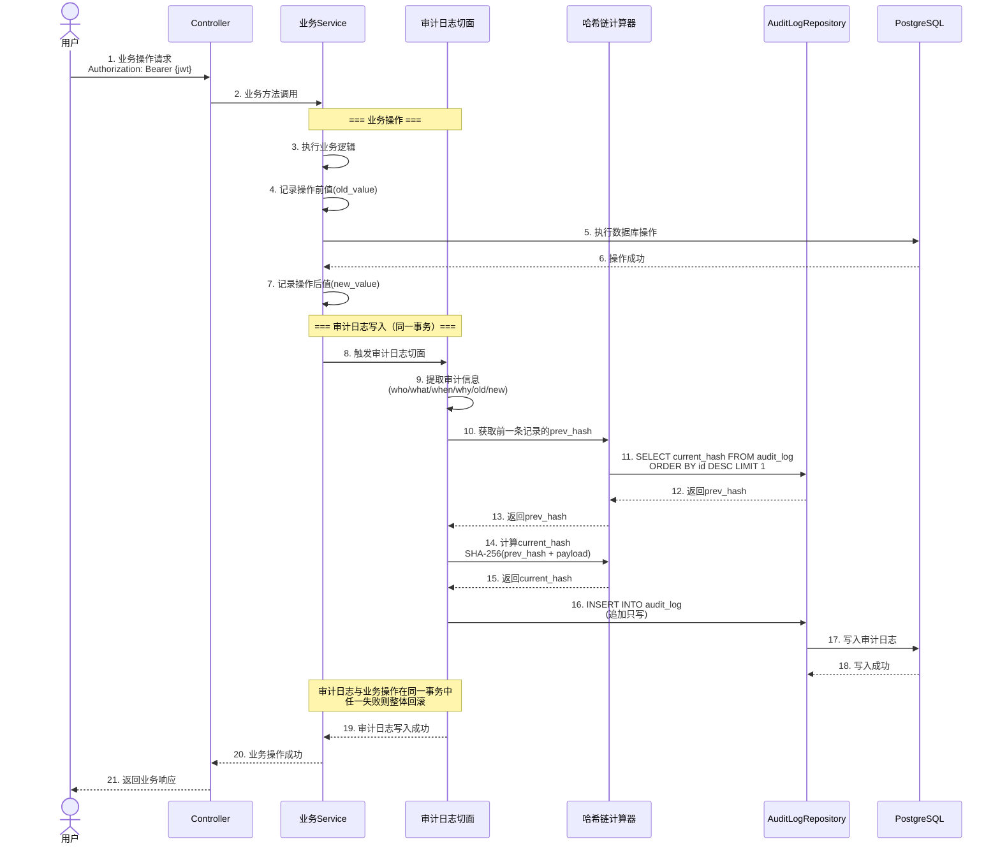

# 日志审计设计

> 文档版本：v1.1 | 编制日期：2026-05-22 | 最后修订：2026-05-22 | 基线：概要设计 v1.1

---

## 1. 操作日志设计

### 1.1 操作日志表（sys_schema.operation_log）

| 字段名 | 类型 | 约束 | 说明 |
|--------|------|------|------|
| id | BIGINT | PK, AUTO_INCREMENT | 日志ID |
| user_id | BIGINT | NOT NULL | 操作人ID |
| username | VARCHAR(64) | NOT NULL | 操作人用户名（冗余，避免关联查询） |
| real_name | VARCHAR(64) | | 操作人姓名 |
| module | VARCHAR(32) | NOT NULL | 操作模块（req/trace/chg/compliance/esign/risk/proj/report/sys） |
| action | VARCHAR(64) | NOT NULL | 操作类型（CREATE/UPDATE/DELETE/IMPORT/EXPORT/LOGIN/LOGOUT） |
| target_type | VARCHAR(64) | | 操作对象类型（Requirement/TraceLink/ChangeRequest/Baseline等） |
| target_id | VARCHAR(64) | | 操作对象ID |
| target_name | VARCHAR(256) | | 操作对象名称/编号 |
| method | VARCHAR(8) | NOT NULL | HTTP方法（GET/POST/PUT/PATCH/DELETE） |
| url | VARCHAR(512) | NOT NULL | 请求URL |
| ip | VARCHAR(45) | | 客户端IP（支持IPv6） |
| user_agent | VARCHAR(512) | | 浏览器UA |
| request_params | TEXT | | 请求参数（脱敏后） |
| response_code | INT | | 响应状态码 |
| duration | INT | | 响应耗时(ms) |
| status | VARCHAR(16) | NOT NULL, DEFAULT 'SUCCESS' | 操作结果（SUCCESS/FAIL） |
| error_msg | TEXT | | 失败原因 |
| project_id | BIGINT | | 关联项目ID |
| created_at | TIMESTAMP | NOT NULL, DEFAULT NOW() | 操作时间 |

**索引设计**：

```sql
-- 按操作人查询
CREATE INDEX idx_oplog_user_id ON sys_schema.operation_log(user_id, created_at DESC);
-- 按模块+操作类型查询
CREATE INDEX idx_oplog_module_action ON sys_schema.operation_log(module, action, created_at DESC);
-- 按操作对象查询
CREATE INDEX idx_oplog_target ON sys_schema.operation_log(target_type, target_id, created_at DESC);
-- 按项目查询
CREATE INDEX idx_oplog_project ON sys_schema.operation_log(project_id, created_at DESC);
-- 按时间范围查询
CREATE INDEX idx_oplog_created_at ON sys_schema.operation_log(created_at DESC);
```

**数据保留策略**：在线1年，超期归档至冷存储，归档后保留3年。

### 1.2 日志采集方式（AOP切面 + 注解）

```java
/**
 * 操作日志注解
 * 标注在Controller方法上，AOP切面自动采集操作日志
 */
@Target(ElementType.METHOD)
@Retention(RetentionPolicy.RUNTIME)
public @interface OperationLog {
    /** 操作模块 */
    String module();
    /** 操作类型 */
    OperationType action();
    /** 操作对象类型（SpEL表达式，如 "#dto.class.simpleName"） */
    String targetType() default "";
    /** 操作对象ID（SpEL表达式，如 "#id"） */
    String targetId() default "";
    /** 操作对象名称（SpEL表达式，如 "#dto.title"） */
    String targetName() default "";
    /** 是否记录请求参数 */
    boolean logParams() default true;
    /** 是否记录响应结果 */
    boolean logResult() default false;
    /** 需脱敏的字段名列表 */
    String[] sensitiveFields() default {"password", "signPassword", "otpCode"};
}

/**
 * 操作类型枚举
 */
public enum OperationType {
    CREATE,     // 创建
    UPDATE,     // 更新
    DELETE,     // 删除
    IMPORT,     // 导入
    EXPORT,     // 导出
    LOGIN,     // 登录
    LOGOUT,    // 登出
    SUBMIT,    // 提交
    APPROVE,   // 审批
    REJECT,    // 驳回
    SIGN,      // 签名
    LOCK,      // 锁定
    UNLOCK,    // 解锁
    REVIEW,    // 评审
    VERIFY     // 验证
}
```

### 1.3 日志记录伪代码

```java
/**
 * 操作日志AOP切面
 * 在Controller方法执行前后采集操作日志
 */
@Aspect
@Component
@Slf4j
public class OperationLogAspect {

    @Autowired
    private OperationLogService operationLogService;

    @Autowired
    private SensitiveDataMasker masker;

    /**
     * 环绕通知：采集操作日志
     */
    @Around("@annotation(operationLog)")
    public Object around(ProceedingJoinPoint pjp, OperationLog operationLog) throws Throwable {
        long startTime = System.currentTimeMillis();
        Object result = null;
        String status = "SUCCESS";
        String errorMsg = null;
        int responseCode = 200;

        try {
            result = pjp.proceed();
            return result;
        } catch (BusinessException e) {
            status = "FAIL";
            responseCode = e.getHttpStatus();
            errorMsg = e.getMessage();
            throw e;
        } catch (Exception e) {
            status = "FAIL";
            responseCode = 500;
            errorMsg = e.getMessage();
            throw e;
        } finally {
            try {
                long duration = System.currentTimeMillis() - startTime;
                recordLog(pjp, operationLog, result, status, errorMsg, responseCode, duration);
            } catch (Exception ex) {
                // 日志采集失败不能影响业务
                log.error("操作日志采集失败", ex);
            }
        }
    }

    /**
     * 记录操作日志
     */
    private void recordLog(ProceedingJoinPoint pjp, OperationLog annotation,
                            Object result, String status, String errorMsg,
                            int responseCode, long duration) {
        HttpServletRequest request = getCurrentRequest();

        // 构建日志实体
        OperationLogEntity log = new OperationLogEntity();

        // 基础信息
        log.setUserId(SecurityContextHolder.getCurrentUserId());
        log.setUsername(SecurityContextHolder.getCurrentUsername());
        log.setRealName(SecurityContextHolder.getCurrentRealName());

        // 操作信息
        log.setModule(annotation.module());
        log.setAction(annotation.action().name());
        log.setTargetType(parseSpEL(annotation.targetType(), pjp));
        log.setTargetId(parseSpEL(annotation.targetId(), pjp));
        log.setTargetName(parseSpEL(annotation.targetName(), pjp));

        // 请求信息
        log.setMethod(request.getMethod());
        log.setUrl(request.getRequestURI());
        log.setIp(getClientIp(request));
        log.setUserAgent(request.getHeader("User-Agent"));

        // 请求参数（脱敏）
        if (annotation.logParams()) {
            String params = serializeParams(pjp.getArgs());
            log.setRequestParams(masker.mask(params, annotation.sensitiveFields()));
        }

        // 响应信息
        log.setResponseCode(responseCode);
        log.setDuration((int) duration);
        log.setStatus(status);
        log.setErrorMsg(errorMsg);

        // 项目上下文
        log.setProjectId(extractProjectId(pjp));

        // 异步写入（不阻塞业务线程）
        operationLogService.asyncSave(log);
    }
}
```

---

## 2. 审计日志设计

### 2.1 审计日志表（compliance_schema.audit_log）

| 字段名 | 类型 | 约束 | 说明 |
|--------|------|------|------|
| id | BIGINT | PK, AUTO_INCREMENT | 日志ID |
| entity_type | VARCHAR(64) | NOT NULL | 实体类型（Requirement/TraceLink/ChangeRequest/Baseline/SOUP/RiskItem/SignatureRecord/Project/User） |
| entity_id | VARCHAR(64) | NOT NULL | 实体ID |
| event_type | VARCHAR(64) | NOT NULL | 事件类型（CREATE/UPDATE/DELETE/STATUS_CHANGE/APPROVE/REJECT/SIGN/LOCK/UNLOCK） |
| operator_id | BIGINT | NOT NULL | 操作人ID |
| operator_name | VARCHAR(64) | NOT NULL | 操作人姓名 |
| operator_role | VARCHAR(32) | | 操作人角色 |
| action | VARCHAR(256) | NOT NULL | 操作描述（如 "需求状态从Draft变更为Submitted"） |
| reason | TEXT | | 操作原因（必填，审计追踪的why） |
| old_value | JSONB | | 修改前值（JSON格式） |
| new_value | JSONB | | 修改后值（JSON格式） |
| project_id | BIGINT | | 关联项目ID |
| source | VARCHAR(16) | NOT NULL, DEFAULT 'WEB' | 操作来源（WEB/API/SYSTEM） |
| client_ip | VARCHAR(45) | | 客户端IP |
| **prev_hash** | CHAR(64) | NOT NULL | 前一条记录的哈希值（链首用64位全0占位，SHA-256固定64字符） |
| **current_hash** | CHAR(64) | NOT NULL | 当前记录的哈希值（SHA-256固定64字符十六进制） |
| created_at | TIMESTAMP | NOT NULL, DEFAULT NOW() | 操作时间（ISO 8601） |

**索引设计**：

```sql
-- 按实体查询（最常用）
CREATE INDEX idx_audit_entity ON compliance_schema.audit_log(entity_type, entity_id, created_at DESC);
-- 按操作人查询
CREATE INDEX idx_audit_operator ON compliance_schema.audit_log(operator_id, created_at DESC);
-- 按事件类型查询
CREATE INDEX idx_audit_event ON compliance_schema.audit_log(event_type, created_at DESC);
-- 按项目查询
CREATE INDEX idx_audit_project ON compliance_schema.audit_log(project_id, created_at DESC);
-- 按时间范围查询（配合分区裁剪）
CREATE INDEX idx_audit_created_at ON compliance_schema.audit_log(created_at DESC);
-- 哈希链校验用（顺序扫描）
CREATE INDEX idx_audit_id_seq ON compliance_schema.audit_log(id ASC);
```

**数据保留策略**：永久在线，按月分区管理，冷热数据分离。

### 2.2 哈希链计算逻辑

```java
/**
 * 审计日志哈希链计算
 *
 * 算法：SHA-256
 * 哈希链原理：每条记录的current_hash依赖前一条记录的current_hash
 * 篡改检测：任何一条记录被修改，后续所有记录的current_hash都会不匹配
 *
 * current_hash = SHA-256(prev_hash + entity_type + entity_id + event_type
 *                       + operator_id + timestamp + new_value_json)
 *
 * 创世记录：prev_hash = SHA-256("GENESIS")
 */
@Component
public class AuditHashChainCalculator {

    private static final String GENESIS_SEED = "GENESIS";
    private static final String GENESIS_HASH;

    static {
        GENESIS_HASH = sha256(GENESIS_SEED);
    }

    @Autowired
    private AuditLogRepository auditLogRepository;

    /**
     * 计算审计日志记录的哈希值
     * @param auditLog 审计日志记录
     * @return SHA-256哈希值（十六进制字符串）
     */
    public String calculateHash(AuditLog auditLog) {
        // 拼接载荷
        String payload = auditLog.getPrevHash()
            + auditLog.getEntityType()
            + auditLog.getEntityId()
            + auditLog.getEventType()
            + String.valueOf(auditLog.getOperatorId())
            + auditLog.getCreatedAt().toString()  // ISO 8601时间戳
            + (auditLog.getNewValue() != null ? auditLog.getNewValue() : "");

        return sha256(payload);
    }

    /**
     * 获取前一条记录的哈希值
     * @return 前一条记录的current_hash，若无前一条则返回GENESIS_HASH
     */
    public String getPreviousHash() {
        AuditLog lastLog = auditLogRepository.findTopByOrderByIdDesc();
        if (lastLog == null) {
            return GENESIS_HASH;
        }
        return lastLog.getCurrentHash();
    }

    /**
     * 计算审计日志记录并设置哈希值
     * @param auditLog 审计日志记录（不含哈希值）
     * @return 含哈希值的审计日志记录
     */
    public AuditLog computeAndSetHash(AuditLog auditLog) {
        // 设置prev_hash
        String prevHash = getPreviousHash();
        auditLog.setPrevHash(prevHash);

        // 计算current_hash
        String currentHash = calculateHash(auditLog);
        auditLog.setCurrentHash(currentHash);

        return auditLog;
    }

    private static String sha256(String input) {
        try {
            MessageDigest digest = MessageDigest.getInstance("SHA-256");
            byte[] hash = digest.digest(input.getBytes(StandardCharsets.UTF_8));
            StringBuilder hexString = new StringBuilder();
            for (byte b : hash) {
                String hex = Integer.toHexString(0xff & b);
                if (hex.length() == 1) hexString.append('0');
                hexString.append(hex);
            }
            return hexString.toString();
        } catch (NoSuchAlgorithmException e) {
            throw new SystemException("SY0800", "SHA-256算法不可用", e);
        }
    }
}
```

### 2.3 审计日志写入流程时序图



### 2.4 追加只写保证

```java
/**
 * 审计日志追加只写保证
 * 三层防护：应用层 + 数据库层 + API层
 */

// ========== 第1层：应用层（API接口） ==========
/**
 * 审计日志服务 - 仅提供INSERT接口
 */
@Service
public class AuditLogService {

    @Autowired
    private AuditLogRepository auditLogRepository;

    @Autowired
    private AuditHashChainCalculator hashChainCalculator;

    /**
     * 写入审计日志（唯一的写入入口）
     * @param entry 审计日志条目
     */
    @Transactional
    public void append(AuditLogEntry entry) {
        AuditLog auditLog = new AuditLog();
        // 设置字段
        auditLog.setEntityType(entry.getEntityType());
        auditLog.setEntityId(entry.getEntityId());
        auditLog.setEventType(entry.getEventType());
        auditLog.setOperatorId(entry.getOperatorId());
        auditLog.setOperatorName(entry.getOperatorName());
        auditLog.setOperatorRole(entry.getOperatorRole());
        auditLog.setAction(entry.getAction());
        auditLog.setReason(entry.getReason());
        auditLog.setOldValue(entry.getOldValue());
        auditLog.setNewValue(entry.getNewValue());
        auditLog.setProjectId(entry.getProjectId());
        auditLog.setSource(entry.getSource());
        auditLog.setClientIp(entry.getClientIp());
        auditLog.setCreatedAt(Instant.now());

        // 计算哈希链
        auditLog = hashChainCalculator.computeAndSetHash(auditLog);

        // 追加写入
        auditLogRepository.save(auditLog);
    }

    // 明确不提供 update / delete 方法
    // auditLogRepository 继承自 JpaRepository，但通过以下方式禁止修改/删除操作
}

/**
 * 审计日志Repository - 禁止修改/删除操作
 */
@Repository
public interface AuditLogRepository extends JpaRepository<AuditLog, Long> {

    // 仅允许查询方法
    AuditLog findTopByOrderByIdDesc();
    List<AuditLog> findByEntityTypeAndEntityIdOrderByCreatedAtDesc(String entityType, String entityId);
    Page<AuditLog> findByProjectIdAndCreatedAtBetween(Long projectId, Instant start, Instant end, Pageable pageable);

    // 禁止修改/删除方法（不声明 save 以外的修改方法）
    // JpaRepository自带的 delete/save(非新增) 通过数据库触发器阻止
}

// ========== 第2层：数据库层（触发器） ==========
/*
-- 阻止审计日志的UPDATE操作
CREATE OR REPLACE FUNCTION compliance_schema.prevent_audit_update()
RETURNS TRIGGER AS $$
BEGIN
    RAISE EXCEPTION 'AUDIT_LOG_UPDATE_DENIED: 审计日志不允许UPDATE操作';
    RETURN NULL;
END;
$$ LANGUAGE plpgsql;

CREATE TRIGGER trg_prevent_audit_update
BEFORE UPDATE ON compliance_schema.audit_log
FOR EACH ROW EXECUTE FUNCTION compliance_schema.prevent_audit_update();

-- 阻止审计日志的DELETE操作
CREATE OR REPLACE FUNCTION compliance_schema.prevent_audit_delete()
RETURNS TRIGGER AS $$
BEGIN
    RAISE EXCEPTION 'AUDIT_LOG_DELETE_DENIED: 审计日志不允许DELETE操作';
    RETURN NULL;
END;
$$ LANGUAGE plpgsql;

CREATE TRIGGER trg_prevent_audit_delete
BEFORE DELETE ON compliance_schema.audit_log
FOR EACH ROW EXECUTE FUNCTION compliance_schema.prevent_audit_delete();
*/

// ========== 第3层：数据库权限层 ==========
/*
-- 审计日志表仅授予INSERT和SELECT权限，不授予UPDATE/DELETE权限
REVOKE UPDATE, DELETE ON compliance_schema.audit_log FROM PUBLIC;
GRANT SELECT, INSERT ON compliance_schema.audit_log TO med_rms_app;
*/
```

---

## 3. 审计日志校验

### 3.1 哈希链完整性校验定时任务

```java
/**
 * 哈希链完整性校验定时任务
 * 每日凌晨2:00运行，校验审计日志哈希链完整性
 */
@Component
@Slf4j
public class AuditHashChainVerificationJob {

    @Autowired
    private AuditLogRepository auditLogRepository;

    @Autowired
    private AlertService alertService;

    @Autowired
    private AuditHashChainCalculator hashChainCalculator;

    /** 每批校验的记录数 */
    private static final int BATCH_SIZE = 5000;

    /**
     * 定时校验任务
     * 每日凌晨2:00执行
     */
    @Scheduled(cron = "0 0 2 * * ?")
    public void verifyHashChainIntegrity() {
        log.info("审计日志哈希链完整性校验开始...");
        long startTime = System.currentTimeMillis();

        VerificationResult result = verifyAll();

        long duration = System.currentTimeMillis() - startTime;
        log.info("审计日志哈希链完整性校验完成: total={}, verified={}, failed={}, duration={}ms",
            result.getTotalCount(), result.getVerifiedCount(),
            result.getFailedCount(), duration);

        if (result.hasFailures()) {
            // 校验失败，立即发送告警
            alertService.sendUrgentAlert(
                "审计日志哈希链校验失败",
                String.format("发现%d条篡改记录，首次异常ID=%d",
                    result.getFailedCount(), result.getFirstFailedId())
            );
        }
    }

    /**
     * 全量校验逻辑
     */
    public VerificationResult verifyAll() {
        VerificationResult result = new VerificationResult();
        long lastId = 0;

        while (true) {
            // 分批读取审计日志（按ID顺序）
            List<AuditLog> batch = auditLogRepository
                .findByIdGreaterThanOrderByIdAsc(lastId, PageRequest.of(0, BATCH_SIZE));

            if (batch.isEmpty()) break;

            for (AuditLog auditLog : batch) {
                // 重新计算哈希值
                String expectedHash = hashChainCalculator.calculateHash(auditLog);
                String actualHash = auditLog.getCurrentHash();

                if (!expectedHash.equals(actualHash)) {
                    // 哈希不匹配，记录异常
                    result.addFailure(auditLog.getId(), expectedHash, actualHash);
                    log.error("审计日志哈希链校验失败: id={}, expected={}, actual={}",
                        auditLog.getId(), expectedHash, actualHash);

                    // 一旦发现异常，后续记录必然也不匹配（链式效应）
                    // 但继续校验以确定篡改范围
                } else {
                    result.incrementVerified();
                }

                // 校验prev_hash是否正确
                if (auditLog.getId() > 1) {
                    AuditLog prev = auditLogRepository.findById(auditLog.getId() - 1).orElse(null);
                    if (prev != null && !auditLog.getPrevHash().equals(prev.getCurrentHash())) {
                        result.addFailure(auditLog.getId(),
                            "prev_hash mismatch", auditLog.getPrevHash());
                    }
                }
            }

            lastId = batch.get(batch.size() - 1).getId();

            // 如果本批次有异常，记录后继续扫描（确定范围）
        }

        return result;
    }

    /**
     * 手动触发校验（管理员操作）
     */
    public VerificationResult verifyManually(Instant startTime, Instant endTime) {
        log.info("手动触发审计日志哈希链校验: startTime={}, endTime={}", startTime, endTime);
        // 按时间范围查询并校验
        List<AuditLog> logs = auditLogRepository
            .findByCreatedAtBetweenOrderByCreatedAtAsc(startTime, endTime);
        // ... 校验逻辑同上
        return verifyList(logs);
    }

    /**
     * 校验结果
     */
    @Data
    public static class VerificationResult {
        private long totalCount = 0;
        private long verifiedCount = 0;
        private long failedCount = 0;
        private Long firstFailedId = null;
        private List<FailureDetail> failures = new ArrayList<>();

        public void incrementVerified() { verifiedCount++; totalCount++; }
        public void addFailure(Long id, String expected, String actual) {
            failedCount++;
            totalCount++;
            if (firstFailedId == null) firstFailedId = id;
            failures.add(new FailureDetail(id, expected, actual));
        }
        public boolean hasFailures() { return failedCount > 0; }
    }

    @Data
    @AllArgsConstructor
    public static class FailureDetail {
        private Long id;
        private String expectedHash;
        private String actualHash;
    }
}
```

### 3.2 校验失败告警机制

```java
/**
 * 审计日志校验失败告警机制
 */
@Service
public class AuditTamperAlertService {

    @Autowired
    private EmailService emailService;
    @Autowired
    private SmsService smsService;

    /** 告警接收人配置（QA经理 + 合规人员 + 运维） */
    private static final String[] ALERT_RECIPIENTS = {
        "qa-manager@company.com",
        "compliance@company.com",
        "ops@company.com"
    };

    private static final String[] ALERT_SMS_NUMBERS = {
        "13800001111",  // QA经理
        "13800002222"   // 合规人员
    };

    /**
     * 发送紧急告警（哈希链校验失败）
     */
    public void sendUrgentAlert(String title, String detail) {
        // 1. 发送邮件告警
        for (String recipient : ALERT_RECIPIENTS) {
            emailService.sendAlertEmail(recipient, "[紧急-审计篡改] " + title, detail);
        }

        // 2. 发送短信告警
        for (String phone : ALERT_SMS_NUMBERS) {
            smsService.sendAlertSms(phone, "[Med-RMS紧急告警] " + title + ": " + detail);
        }

        // 3. 写入系统告警日志
        log.error("AUDIT_TAMPER_ALERT: title={}, detail={}", title, detail);

        // 4. 记录到审计日志自身（作为合规事件）
        auditLogService.append(AuditLogEntry.builder()
            .entityType("AuditLog")
            .entityId("SYSTEM")
            .eventType("TAMPER_DETECTED")
            .operatorId(0L)       // 系统自动
            .operatorName("SYSTEM")
            .action("审计日志哈希链校验检测到篡改")
            .reason(title + ": " + detail)
            .source("SYSTEM")
            .build());
    }
}
```

### 3.3 校验频率配置

| 校验类型 | 频率 | 触发方式 | 说明 |
|----------|------|----------|------|
| **定时全量校验** | 每日凌晨2:00 | Cron定时任务 | 扫描全部审计日志，校验哈希链完整性 |
| **定时增量校验** | 每4小时 | Cron定时任务 | 仅校验最近4小时新增的审计日志 |
| **手动校验** | 按需 | 管理员API触发 | 支持按时间范围、实体类型筛选 |
| **写入时即时校验** | 每次写入 | 写入后立即校验prev_hash | 写入新记录时，校验前一条记录的current_hash是否与当前prev_hash一致 |

**配置项**：

```yaml
# application.yml
audit:
  verification:
    # 全量校验Cron表达式
    full-cron: "0 0 2 * * ?"
    # 增量校验Cron表达式（每4小时）
    incremental-cron: "0 0 0/4 * * ?"
    # 每批校验记录数
    batch-size: 5000
    # 校验失败是否暂停写入（安全模式）
    halt-on-failure: false
    # 告警邮件接收人
    alert-emails:
      - qa-manager@company.com
      - compliance@company.com
      - ops@company.com
    # 告警短信接收人
    alert-phones:
      - "13800001111"
      - "13800002222"
```

---

## 4. 21 CFR Part 11 合规映射

### 4.1 电子记录要求映射表

| 21 CFR Part 11 条款 | 要求 | Med-RMS实现 | 实现位置 |
|---------------------|------|------------|----------|
| §11.10(a) | 验证系统以确保准确、可靠、一致 | 系统验证测试+UAT | 测试文档 |
| §11.10(b) | 能够生成准确完整的副本 | 报表导出（PDF/EXCEL/NMPA_ERPS） | report模块 |
| §11.10(c) | 保护记录使其在整个保留期内可检索 | 按月分区+永久在线+索引优化 | 本文档§5 |
| §11.10(d) | 限制系统访问至授权人员 | RBAC 4级权限控制 | 权限流程设计 |
| §11.10(e) | 使用审计追踪 | 审计日志+哈希链保护 | 本文档§2 |
| §11.10(f) | 操作系统检查 | 操作序列强制检查矩阵 | 业务流程设计§9.3 |
| §11.10(g) | 机构检查 | 项目成员数据隔离+数据权限 | 权限流程设计§4 |
| §11.10(h) | 设备检查 | IP白名单+异地登录检测 | 安全约束 |
| §11.10(i) | 确保开发人员不干扰审计追踪 | 审计日志追加只写+触发器保护 | 本文档§2.4 |
| §11.10(j) | 确定个人电子签名职责 | 签名意图(meaningCode)明确 | 业务流程设计§5.2 |
| §11.10(k) | 确定授权人员管理权限 | ADMIN角色+权限矩阵 | 权限流程设计§1.3 |
| §11.50 | 签名表现形式 | 签名记录显示：签名人、日期时间、签名含义、签名原因 | e-sign模块 |
| §11.70 | 电子签名与电子记录关联 | entity_hash绑定文档内容哈希 | 业务流程设计§5.2 |

### 4.2 电子签名要求映射表

| 21 CFR Part 11 条款 | 要求 | Med-RMS实现 | 实现位置 |
|---------------------|------|------------|----------|
| §11.100(a) | 签名人身份验证 | 签名密码 + OTP动态码双重认证 | 权限流程设计§2.2 |
| §11.100(b) | 签名意图明确 | 签名时必须选择意图（approve/confirm/review/release） | 业务流程设计§5.2 |
| §11.100(c) | 签名不可伪造 | SHA-256绑定文档哈希+用户+时间戳 | 业务流程设计§5.2 |
| §11.200(a)(1) | 非生物特征签名：至少两种识别成分 | 签名密码(知识因子) + OTP(持有因子) | 权限流程设计§2.2 |
| §11.200(a)(2) | 仅签名人生成签名 | 签名密码独立于登录密码+OTP绑定手机/邮箱 | e-sign模块 |
| §11.200(b) | 生物特征签名 | 不适用（Med-RMS不使用生物特征签名） | — |
| §11.300 | 签名不被伪造或盗用 | 签名密码复杂度+OTP有效期5分钟+签名意图10分钟有效期 | 安全约束§2.3 |

### 4.3 审计追踪要求映射表

| 21 CFR Part 11 条款 | 要求 | Med-RMS实现 | 实现位置 |
|---------------------|------|------------|----------|
| §11.10(e)(1) | 记录谁执行了操作 | operator_id + operator_name | 本文档§2.1 |
| §11.10(e)(2) | 记录操作日期和时间 | created_at (ISO 8601, 精度秒) | 本文档§2.1 |
| §11.10(e)(3) | 记录操作内容 | action + event_type + entity_type + entity_id | 本文档§2.1 |
| §11.10(e)(4) | 记录修改前的值 | old_value (JSONB) | 本文档§2.1 |
| §11.10(e)(5) | 记录修改后的值 | new_value (JSONB) | 本文档§2.1 |
| §11.10(e)(6) | 审计追踪不可修改 | 哈希链 + 触发器 + 追加只写 | 本文档§2.4 |
| §11.10(e)(7) | 审计追踪不可删除 | BEFORE DELETE触发器 + 无DELETE接口 | 本文档§2.4 |
| §11.10(e)(8) | 审计追踪可供监管机构审查 | 审计日志查询API + 导出功能 | compliance模块 |

### 4.4 合规检查清单

| 序号 | 检查项 | 法规依据 | 实现方式 | 验证方法 | 状态 |
|------|--------|----------|----------|----------|------|
| 1 | 用户身份认证 | §11.100(a) | JWT + 签名密码 + OTP | 登录测试 + 签名测试 | ✅ |
| 2 | 签名意图明确 | §11.100(b) | meaningCode枚举 | 签名流程测试 | ✅ |
| 3 | 签名不可伪造 | §11.200(a)(1) | SHA-256(entityType+entityId+entityHash+meaningCode+signerId+timestamp) | 签名值计算验证 | ✅ |
| 4 | 双重认证 | §11.200(a)(1) | 签名密码(知识因子) + OTP(持有因子) | 签名认证测试 | ✅ |
| 5 | 审计追踪完整性 | §11.10(e) | who/what/when/why/old/new | 审计日志查询测试 | ✅ |
| 6 | 审计追踪不可篡改 | §11.10(e)(6-7) | 哈希链 + 触发器 + 追加只写 | 哈希链校验 + UPDATE/DELETE拦截测试 | ✅ |
| 7 | 哈希链完整性校验 | §11.10(e)(6) | 每日全量校验 + 每4小时增量校验 | 校验任务测试 | ✅ |
| 8 | 篡改告警 | §11.10(e)(6) | 邮件 + 短信 + 系统告警 | 告警触发测试 | ✅ |
| 9 | 权限控制 | §11.10(d) | RBAC 4级权限 | 权限矩阵测试 | ✅ |
| 10 | 项目数据隔离 | §11.10(g) | 数据权限过滤 + 项目成员表 | 数据隔离测试 | ✅ |
| 11 | 电子记录可检索 | §11.10(c) | 按月分区 + 索引优化 | 查询性能测试 | ✅ |
| 12 | 电子记录可导出 | §11.10(b) | PDF/EXCEL/NMPA_ERPS导出 | 导出功能测试 | ✅ |
| 13 | 基线双人签名 | M-05 | QA经理(第一签) + 研发经理(第二签) | 基线锁定流程测试 | ✅ |
| 14 | 开发人员不干扰审计追踪 | §11.10(i) | 应用层+数据库层+权限层三层防护 | 权限隔离测试 | ✅ |
| 15 | 密码策略 | §11.300 | 复杂度+历史+锁定+过期 | 密码策略测试 | ✅ |
| 16 | 会话管理 | §11.10(d) | JWT 15min + Refresh 24h + 并发限制5 | 会话管理测试 | ✅ |

---

## 5. 日志归档策略

### 5.1 分区表归档策略（audit_log按月分区）

```sql
-- ============================================================
-- 审计日志表按月分区策略
-- 使用PostgreSQL原生分区表（Range Partition by created_at）
-- ============================================================

-- 创建分区主表
CREATE TABLE compliance_schema.audit_log (
    id              BIGINT NOT NULL,
    entity_type     VARCHAR(64) NOT NULL,
    entity_id       VARCHAR(64) NOT NULL,
    event_type      VARCHAR(64) NOT NULL,
    operator_id     BIGINT NOT NULL,
    operator_name   VARCHAR(64) NOT NULL,
    operator_role   VARCHAR(32),
    action          VARCHAR(256) NOT NULL,
    reason          TEXT,
    old_value       JSONB,
    new_value       JSONB,
    project_id      BIGINT,
    source          VARCHAR(16) NOT NULL DEFAULT 'WEB',
    client_ip       VARCHAR(45),
    prev_hash       VARCHAR(64) NOT NULL,
    current_hash    VARCHAR(64) NOT NULL,
    created_at      TIMESTAMP NOT NULL DEFAULT NOW(),
    PRIMARY KEY (id, created_at)
) PARTITION BY RANGE (created_at);

-- 创建月度分区（预创建未来3个月分区）
CREATE TABLE compliance_schema.audit_log_2026_01 PARTITION OF compliance_schema.audit_log
    FOR VALUES FROM ('2026-01-01') TO ('2026-02-01');
CREATE TABLE compliance_schema.audit_log_2026_02 PARTITION OF compliance_schema.audit_log
    FOR VALUES FROM ('2026-02-01') TO ('2026-03-01');
CREATE TABLE compliance_schema.audit_log_2026_03 PARTITION OF compliance_schema.audit_log
    FOR VALUES FROM ('2026-03-01') TO ('2026-04-01');
-- ... 按月创建
CREATE TABLE compliance_schema.audit_log_2026_12 PARTITION OF compliance_schema.audit_log
    FOR VALUES FROM ('2026-12-01') TO ('2027-01-01');

-- 默认分区（兜底）
CREATE TABLE compliance_schema.audit_log_default PARTITION OF compliance_schema.audit_log
    DEFAULT;

-- 创建索引（每个分区自动继承）
CREATE INDEX idx_audit_entity_2026_01 ON compliance_schema.audit_log_2026_01(entity_type, entity_id);
-- ... 每个分区都需创建索引

-- ============================================================
-- 分区自动管理函数
-- ============================================================

-- 自动创建下月分区（每月1日执行）
CREATE OR REPLACE FUNCTION compliance_schema.create_next_month_partition()
RETURNS VOID AS $$
DECLARE
    next_month_start DATE;
    next_month_end DATE;
    partition_name TEXT;
BEGIN
    next_month_start := DATE_TRUNC('month', CURRENT_DATE + INTERVAL '1 month');
    next_month_end := DATE_TRUNC('month', CURRENT_DATE + INTERVAL '2 month');
    partition_name := 'audit_log_' || TO_CHAR(next_month_start, 'YYYY_MM');

    EXECUTE format(
        'CREATE TABLE IF NOT EXISTS compliance_schema.%I PARTITION OF compliance_schema.audit_log
         FOR VALUES FROM (%L) TO (%L)',
        partition_name, next_month_start, next_month_end
    );

    -- 为新分区创建索引
    EXECUTE format(
        'CREATE INDEX idx_audit_entity_%s ON compliance_schema.%I(entity_type, entity_id, created_at DESC)',
        TO_CHAR(next_month_start, 'YYYY_MM'), partition_name
    );
    EXECUTE format(
        'CREATE INDEX idx_audit_operator_%s ON compliance_schema.%I(operator_id, created_at DESC)',
        TO_CHAR(next_month_start, 'YYYY_MM'), partition_name
    );
    EXECUTE format(
        'CREATE INDEX idx_audit_project_%s ON compliance_schema.%I(project_id, created_at DESC)',
        TO_CHAR(next_month_start, 'YYYY_MM'), partition_name
    );

    RAISE NOTICE 'Created partition: %', partition_name;
END;
$$ LANGUAGE plpgsql;

-- 定时任务：每月1日自动创建下月分区
-- 使用pg_cron扩展（需安装）
-- SELECT cron.schedule('create-audit-partition', '0 0 1 * *', $$SELECT compliance_schema.create_next_month_partition()$$);
```

### 5.2 冷热数据分离

| 数据年龄 | 存储策略 | 访问频率 | 查询方式 |
|----------|----------|----------|----------|
| **0-12个月**（热数据） | 在线PostgreSQL分区表 | 高频 | 正常SQL查询 |
| **1-3年**（温数据） | 在线PostgreSQL分区表 | 中频 | 正常SQL查询（分区裁剪加速） |
| **3年以上**（冷数据） | 归档至MinIO（Parquet格式） | 低频 | 通过归档查询API |

```java
/**
 * 冷热数据分离服务
 */
@Service
public class AuditDataArchiveService {

    /**
     * 归档策略：
     * - 3年以上的审计日志归档至MinIO
     * - 归档格式：Parquet列式存储（压缩率高，查询性能好）
     * - 归档后PostgreSQL分区表保留，但标记为ARCHIVED状态
     * - 查询时自动路由：热/温数据走PostgreSQL，冷数据走MinIO
     */

    /**
     * 归档冷数据（每年1月执行，归档3年前的数据）
     */
    @Scheduled(cron = "0 0 3 1 1 ?") // 每年1月1日凌晨3点
    public void archiveColdData() {
        Instant archiveBefore = Instant.now().minus(Duration.ofDays(3 * 365));
        log.info("开始归档冷数据: archiveBefore={}", archiveBefore);

        // 1. 查询需要归档的分区
        List<String> partitions = getPartitionsBefore(archiveBefore);
        for (String partition : partitions) {
            // 2. 导出分区数据为Parquet
            exportPartitionToParquet(partition);

            // 3. 上传Parquet文件到MinIO
            uploadToMinio(partition);

            // 4. 验证归档数据完整性
            if (verifyArchiveIntegrity(partition)) {
                // 5. 标记分区为ARCHIVED（不删除，保留在PostgreSQL中）
                markPartitionAsArchived(partition);
                log.info("分区归档完成: {}", partition);
            } else {
                log.error("归档数据完整性验证失败: {}", partition);
                alertService.sendAlert("审计日志归档验证失败", partition);
            }
        }
    }

    /**
     * 冷数据查询API
     * 自动路由：热/温→PostgreSQL, 冷→MinIO
     */
    public Page<AuditLogVO> queryAuditLogs(AuditLogQueryDTO query) {
        Instant queryStart = query.getStartTime();
        Instant coldThreshold = Instant.now().minus(Duration.ofDays(3 * 365));

        if (queryStart.isAfter(coldThreshold)) {
            // 热/温数据：直接查PostgreSQL
            return auditLogRepository.findByConditions(query);
        } else {
            // 冷数据：查询MinIO归档
            return archiveQueryService.queryFromArchive(query);
        }
    }
}
```

### 5.3 归档SQL脚本

```sql
-- ============================================================
-- 审计日志归档SQL脚本
-- 注意：以下脚本为注释形式，供DBA参考执行
-- ============================================================

-- 1. 检查需要归档的分区（3年以前的月度分区）
-- SELECT tablename FROM pg_tables
-- WHERE schemaname = 'compliance_schema'
--   AND tablename LIKE 'audit_log_20__%'
--   AND tablename < 'audit_log_' || TO_CHAR(CURRENT_DATE - INTERVAL '3 years', 'YYYY_MM')
-- ORDER BY tablename;

-- 2. 导出指定分区数据为CSV（用于Parquet转换前的中间步骤）
-- COPY compliance_schema.audit_log_2023_01 TO '/data/archive/audit_log_2023_01.csv'
--   WITH (FORMAT csv, HEADER true, DELIMITER ',', ENCODING 'UTF-8');

-- 3. 验证导出数据的行数
-- SELECT COUNT(*) FROM compliance_schema.audit_log_2023_01;
-- 应与CSV文件行数一致（减去1行header）

-- 4. 标记分区为ARCHIVED（在分区上添加标记，不删除数据）
-- ALTER TABLE compliance_schema.audit_log_2023_01
--   SET (autovacuum_enabled = false);  -- 归档分区不再需要自动vacuum

-- 5. 压缩归档分区（减少存储空间）
-- VACUUM FULL compliance_schema.audit_log_2023_01;

-- 6. 验证归档完整性（对比PostgreSQL与MinIO数据）
-- SELECT COUNT(*), MD5(STRING_AGG(current_hash, '' ORDER BY id))
-- FROM compliance_schema.audit_log_2023_01;
-- 结果应与MinIO中Parquet文件的聚合值一致

-- 7. （可选）删除已归档的PostgreSQL分区
-- 仅在MinIO归档验证通过且合规审批通过后执行
-- 注意：21 CFR Part 11要求审计日志永久保留
-- 因此删除分区前需确保MinIO归档可正常访问
-- DROP TABLE compliance_schema.audit_log_2023_01;

-- 8. 操作日志定期清理（1年后归档，3年后删除）
-- DELETE FROM sys_schema.operation_log
-- WHERE created_at < CURRENT_DATE - INTERVAL '3 years';
-- VACUUM sys_schema.operation_log;

-- 9. 登录日志定期清理（6个月后归档，1年后删除）
-- DELETE FROM sys_schema.login_log
-- WHERE created_at < CURRENT_DATE - INTERVAL '1 year';
-- VACUUM sys_schema.login_log;
```

---

## QMS 变更记录

| 版本 | 变更日期 | 变更内容 | 变更原因 | 修订人 |
|------|----------|----------|----------|--------|
| v1.0 | 2026-05-22 | 初始版本 | — | Alice |
| v1.1 | 2026-05-22 | audit_log.prev_hash和current_hash类型从VARCHAR(64)改为CHAR(64) NOT NULL，对齐DDL和系统架构§6.3.1 | C-02：哈希值类型缺失长度约束和NOT NULL | Gao |
