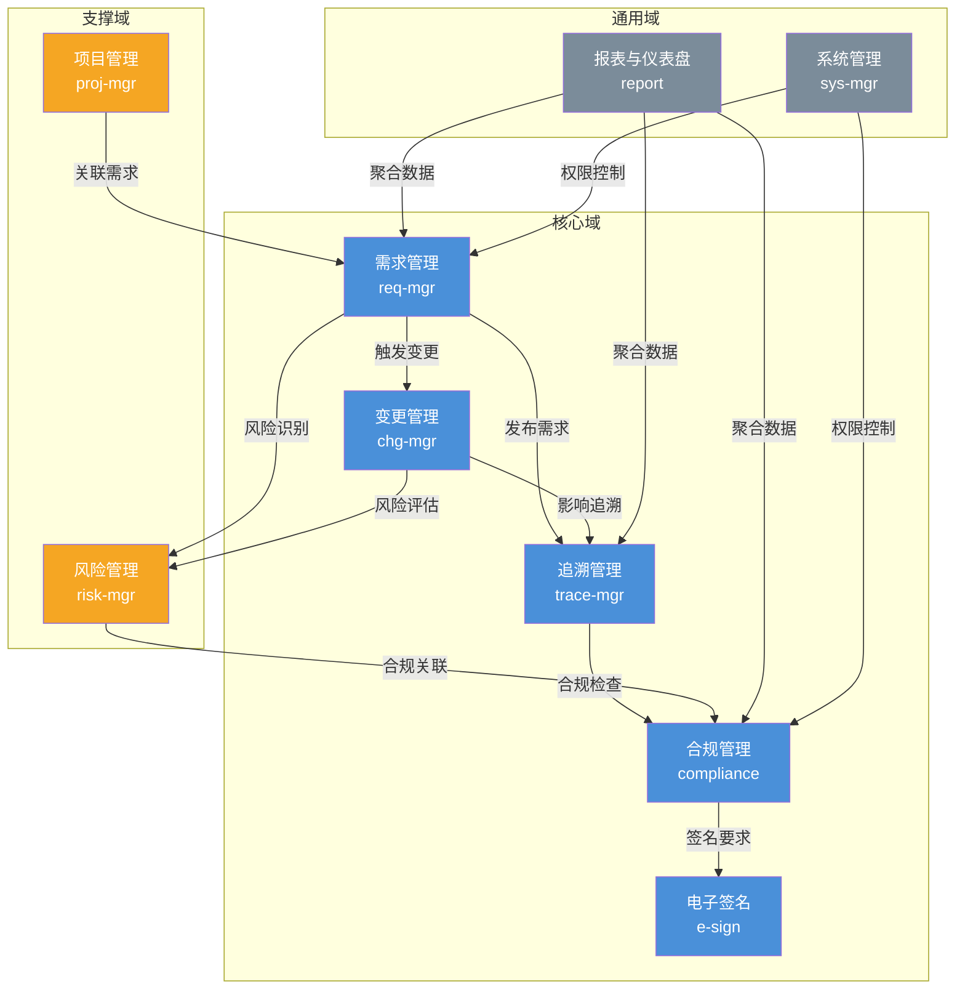
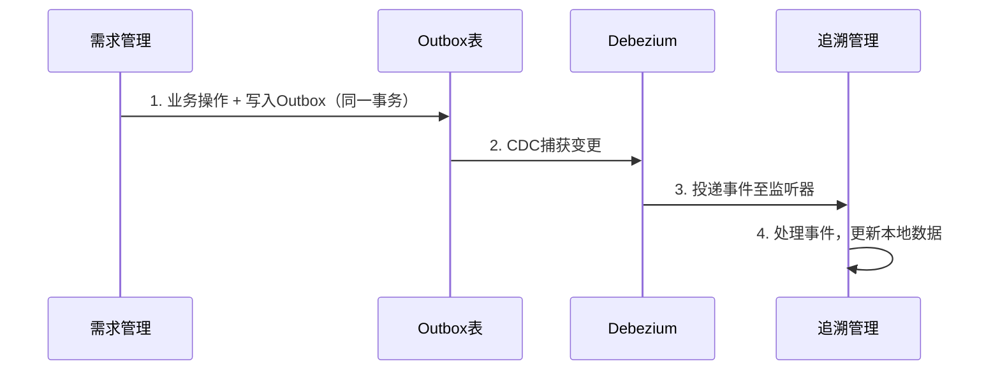

# Med-RMS 软件概要设计 — 业务模块划分

> 文档版本：v1.1 | 编制日期：2026-05-22 | 最后修订：2026-05-22 | 基线：PRD v2.1 + 系统架构 v1.1

---

## 1. 模块总览

Med-RMS 采用 **领域驱动设计（DDD）** 划分 9 个限界上下文，以 **模块化单体（Modular Monolith）** 架构落地，每个上下文对应一个独立的 Spring Modulith 模块，拥有独立数据库 Schema，未来可拆分为微服务。

```
┌─────────────────────────────────────────────────────────────────────┐
│                        Med-RMS 模块化单体                            │
│                                                                     │
│  ┌──────────┐ ┌──────────┐ ┌──────────┐ ┌──────────┐ ┌──────────┐  │
│  │ 需求管理  │ │ 追溯管理  │ │ 变更管理  │ │ 合规管理  │ │ 电子签名  │  │
│  │ req-mgr  │ │ trace-mgr│ │ chg-mgr  │ │ compliance│ │ e-sign   │  │
│  └────┬─────┘ └────┬─────┘ └────┬─────┘ └────┬─────┘ └────┬─────┘  │
│       │            │            │            │            │         │
│  ┌────┴────────────┴────────────┴────────────┴────────────┘         │
│  │                     领域事件总线 (Outbox + CDC)                    │
│  └────┬────────────┬────────────┬────────────┬────────────┐         │
│       │            │            │            │            │         │
│  ┌────┴─────┐ ┌────┴─────┐ ┌────┴─────┐ ┌────┴─────┐               │
│  │ 风险管理  │ │ 项目管理  │ │ 报表仪表盘│ │ 系统管理  │               │
│  │ risk-mgr │ │ proj-mgr │ │ report   │ │ sys-mgr  │               │
│  └──────────┘ └──────────┘ └──────────┘ └──────────┘               │
│                                                                     │
│  ┌─────────────────────────────────────────────────────────────┐    │
│  │              基础设施层 (Infra)                               │    │
│  │  PostgreSQL 16 | Redis 7 | MinIO | Debezium | 泛微OA        │    │
│  └─────────────────────────────────────────────────────────────┘    │
└─────────────────────────────────────────────────────────────────────┘
```

---

## 2. 模块结构图（Mermaid）



---

## 3. 模块详细说明

### 3.1 需求管理（req-mgr）— 核心域

| 维度 | 说明 |
|------|------|
| **限界上下文** | Requirement Management |
| **职责** | 管理医疗器械软件需求的完整生命周期，从创建、评审、批准到退役，支持四层需求模型（URS→PRS→SRS→DRS） |
| **聚合根** | Requirement（需求） |
| **数据库 Schema** | `req_schema` |
| **核心实体** | Requirement、RequirementVersion、ReviewRecord、RequirementClosure |
| **核心领域事件** | `RequirementCreated`、`RequirementSubmitted`、`RequirementApproved`、`RequirementRejected`、`RequirementRetired`、`RequirementLinked` |
| **二级模块** | 见下方 |

**二级模块拆分：**

| 二级模块 | 职责 | 关键能力 |
|----------|------|----------|
| req-hierarchy | 需求层级架构 | URS/PRS/SRS/DRS 四层模型管理，闭包表+分层子表（CTI）存储，父子关系维护 |
| req-lifecycle | 需求生命周期 | 状态机流转（Draft→Submitted→Approved→PendingDecompose→Decomposed→Implemented→PendingVerify→Verified→Baseline→Changed→Closed/Retired），DCP 门控校验 |
| req-review | 需求评审 | 评审发起、评审人分配、评审意见收集、评审结论判定、评审轮次管理 |
| req-decompose | 需求拆解工作台 | PRS/SRS拆解为下级需求的工作台界面，批量创建下级需求+追溯链接，拆解进度跟踪，拆解完成自动更新状态 |
| req-trace-init | 追溯关系发起 | 需求间追溯关系创建（满足/被满足/验证/被验证），追溯矩阵触发 |
| req-import | 需求导入 | Excel/Word 批量导入，模板校验，导入预览与确认 |

### 3.2 追溯管理（trace-mgr）— 核心域

| 维度 | 说明 |
|------|------|
| **限界上下文** | Traceability Management |
| **职责** | 管理需求→设计→实现→验证的全链路追溯关系，生成追溯矩阵和覆盖率报告 |
| **聚合根** | TraceLink（追溯链接） |
| **数据库 Schema** | `trace_schema` |
| **核心实体** | TraceLink、TraceMatrix、CoverageReport |
| **核心领域事件** | `TraceLinkCreated`、`TraceLinkRemoved`、`CoverageCalculated`、`GapDetected` |

**二级模块拆分：**

| 二级模块 | 职责 | 关键能力 |
|----------|------|----------|
| trace-link | 追溯链接管理 | 创建/删除追溯关系，支持同一需求模型内跨层追溯和跨模型追溯 |
| trace-matrix | 追溯矩阵 | 自动生成追溯矩阵，行列式展示，覆盖率计算 |
| trace-gap | 追溯缺口检测 | 识别无下游/无上游的孤立需求，缺口告警 |
| trace-report | 追溯报告 | 覆盖率报告生成，导出 PDF/Excel，合规审查支持 |

### 3.3 变更管理（chg-mgr）— 核心域

| 维度 | 说明 |
|------|------|
| **限界上下文** | Change Management |
| **职责** | 管理需求变更的全流程，包括变更申请、影响分析、审批、执行、验证 |
| **聚合根** | ChangeRequest（变更请求） |
| **数据库 Schema** | `chg_schema` |
| **核心实体** | ChangeRequest、ImpactAnalysis、ChangeApproval、ChangeExecution |
| **核心领域事件** | `ChangeRequested`、`ImpactAnalyzed`、`ChangeApproved`、`ChangeExecuted`、`ChangeVerified` |

**二级模块拆分：**

| 二级模块 | 职责 | 关键能力 |
|----------|------|----------|
| chg-request | 变更申请 | 创建变更请求，关联原始需求，描述变更原因与内容 |
| chg-impact | 影响分析 | 自动识别变更影响的下游需求和追溯链，suspect标记（**P0优先级**，对应FR-0.10），人工确认影响范围 |
| chg-approval | 变更审批 | 审批流程（含泛微OA同步），审批条件校验，电子签名触发 |
| chg-execution | 变更执行 | 需求版本创建，关联需求状态变更，验证闭环 |
| chg-history | 变更历史 | 变更时间线，基线对比，变更轨迹查询 |

### 3.4 合规管理（compliance）— 核心域

| 维度 | 说明 |
|------|------|
| **限界上下文** | Compliance Management |
| **职责** | 确保系统符合 IEC 62304、ISO 13485、21 CFR Part 11、NMPA eRPS 等法规要求，管理审计日志、SOUP、软件安全分类 |
| **聚合根** | AuditLog（审计日志） |
| **数据库 Schema** | `compliance_schema` |
| **核心实体** | AuditLog、SoupRecord、SafetyClassification、RegulatoryMapping |
| **核心领域事件** | `AuditEntryCreated`、`SoupRegistered`、`SafetyClassified`、`ComplianceChecked` |

**二级模块拆分：**

| 二级模块 | 职责 | 关键能力 |
|----------|------|----------|
| compliance-audit | 审计日志 | 追加只写日志，哈希链校验（prev_hash/current_hash），数据库触发器阻止 UPDATE/DELETE |
| compliance-soup | SOUP 管理 | 第三方/开源组件登记，安全影响评估，异常审查跟踪 |
| compliance-safety | 安全分类 | Class A/B/C 分类，差异化文档和活动要求管理 |
| compliance-regulation | 法规映射 | 法规条款与系统功能的映射关系，合规检查清单 |
| compliance-baseline | 基线管理 | 需求基线创建、锁定（双人签名）、版本对比（SHA-256），基线关联审计记录 |
| compliance-problem | 问题报告管理 | 问题报告创建/跟踪/关闭，纠正与预防措施（CAPA），根因分析，问题关联需求/SOUP |
| compliance-iec62304 | IEC 62304合规检查 | 合规检查清单管理，条款-功能映射，合规状态评估，缺口跟踪 |

### 3.5 电子签名（e-sign）— 核心域

| 维度 | 说明 |
|------|------|
| **限界上下文** | Electronic Signature |
| **职责** | 提供 21 CFR Part 11 合规的电子签名能力，独立于 JWT 认证体系，签名密码+OTP 二次认证 |
| **聚合根** | SignatureRecord（签名记录） |
| **数据库 Schema** | `esign_schema` |
| **核心实体** | SignatureRecord、SignatureIntent、OtpChallenge |
| **核心领域事件** | `SignatureRequested`、`SignatureCompleted`、`SignatureVerified`、`SignatureInvalidated` |

**二级模块拆分：**

| 二级模块 | 职责 | 关键能力 |
|----------|------|----------|
| esign-auth | 签名认证 | 签名密码校验 + OTP 动态码校验，与 JWT 认证完全独立 |
| esign-record | 签名记录 | 签名值计算（SHA-256 绑定文档哈希），签名意图记录，签名元数据存储 |
| esign-verify | 签名验证 | 签名完整性校验，文档篡改检测，签名历史查询 |
| esign-reason | 签名意图 | 签名原因（审批/确认/审核等），签名含义标注 |

### 3.6 风险管理（risk-mgr）— 支撑域

| 维度 | 说明 |
|------|------|
| **限界上下文** | Risk Management |
| **职责** | 管理医疗器械软件风险管理活动，符合 ISO 14971，包括风险识别、分析、评价、控制、监控 |
| **聚合根** | RiskItem（风险项） |
| **数据库 Schema** | `risk_schema` |
| **核心实体** | RiskItem、RiskAnalysis、RiskControl、RiskMonitor |
| **核心领域事件** | `RiskIdentified`、`RiskAnalyzed`、`RiskControlled`、`RiskAccepted`、`RiskClosed` |

**二级模块拆分：**

| 二级模块 | 职责 | 关键能力 |
|----------|------|----------|
| risk-identify | 风险识别 | 风险项创建，关联需求/变更，危害场景描述 |
| risk-analyze | 风险分析 | 严重度/概率/可检测性评估，RPN 计算，风险矩阵 |
| risk-control | 风险控制 | 控制措施定义，控制措施关联需求，剩余风险评价 |
| risk-monitor | 风险监控 | 风险状态跟踪，风险回顾计划，风险趋势分析 |

### 3.7 项目管理（proj-mgr）— 支撑域

| 维度 | 说明 |
|------|------|
| **限界上下文** | Project Management |
| **职责** | 管理项目/产品的组织结构，关联需求与项目，跟踪 IPD 阶段门（DCP）进度 |
| **聚合根** | Project（项目） |
| **数据库 Schema** | `proj_schema` |
| **核心实体** | Project、ProjectMember、IpdGate、Deliverable |
| **核心领域事件** | `ProjectCreated`、`GatePassed`、`GateRejected`、`DeliverableSubmitted` |

**二级模块拆分：**

| 二级模块 | 职责 | 关键能力 |
|----------|------|----------|
| proj-structure | 项目组织 | 项目创建/归档，团队成员与角色分配，项目层级结构 |
| proj-gate | IPD 阶段门 | DCP1-DCP5 门控管理，门控条件校验，门控评审 |
| proj-deliverable | 交付物管理 | 交付物登记，交付物与需求关联，交付物状态跟踪 |
| proj-progress | 进度跟踪 | 里程碑进度，需求完成率统计，项目看板 |

### 3.8 报表与仪表盘（report）— 通用域

| 维度 | 说明 |
|------|------|
| **限界上下文** | Reporting & Dashboard |
| **职责** | 聚合各模块数据，提供管理看板、统计报表和趋势分析，采用 CQRS Lite 模式（异步更新统计表） |
| **聚合根** | DashboardWidget（仪表盘组件） |
| **数据库 Schema** | `report_schema` |
| **核心实体** | DashboardConfig、StatisticsSnapshot、ReportTemplate |
| **核心领域事件** | — （消费其他模块事件，不发布领域事件） |

**二级模块拆分：**

| 二级模块 | 职责 | 关键能力 |
|----------|------|----------|
| report-dashboard | 仪表盘 | 可配置仪表盘，KPI 卡片，实时数据刷新（CQRS Lite 统计表） |
| report-statistics | 统计报表 | 需求统计、变更统计、风险统计、合规统计，按项目/时间维度 |
| report-export | 报表导出 | PDF/Excel 导出，报告模板管理，定时报告生成 |
| report-trend | 趋势分析 | 需求增长趋势、变更频率趋势、风险趋势、追溯覆盖率趋势 |

### 3.9 系统管理（sys-mgr）— 通用域

| 维度 | 说明 |
|------|------|
| **限界上下文** | System Administration |
| **职责** | 用户管理、角色权限（RBAC）、组织架构、系统配置、数据字典 |
| **聚合根** | User（用户） |
| **数据库 Schema** | `sys_schema` |
| **核心实体** | User、Role、Permission、Resource、Organization、DictType、DictEntry |
| **核心领域事件** | `UserCreated`、`RoleAssigned`、`OrgSynced` |

**二级模块拆分：**

| 二级模块 | 职责 | 关键能力 |
|----------|------|----------|
| sys-user | 用户管理 | 用户 CRUD，用户状态管理，密码策略，泛微 OA 组织架构同步 |
| sys-role | 角色权限 | RBAC 模型（User→Role→Permission→Resource），8 类角色定义，动态权限分配 |
| sys-org | 组织架构 | 部门/团队树形结构，泛微 OA 同步，人员归属 |
| sys-dict | 数据字典 | 字典类型与字典项管理，系统级/业务级字典，枚举值集中管理 |
| sys-config | 系统配置 | 参数配置，开关管理，邮件/通知模板，系统公告 |
| sys-log | 操作日志 | 用户操作日志，登录日志，系统异常日志 |

---

## 4. 模块依赖关系矩阵

> **规则**：模块间仅通过领域事件和防腐层（ACL）通信，禁止直接调用其他模块的 Repository。

| ↓ 依赖 \ 提供 → | req-mgr | trace-mgr | chg-mgr | compliance | e-sign | risk-mgr | proj-mgr | report | sys-mgr |
|------------------|---------|-----------|---------|------------|--------|----------|----------|--------|---------|
| **req-mgr**      | —       | 事件订阅  | 事件发布| —          | —      | 事件发布 | —        | —      | 权限校验|
| **trace-mgr**    | 事件订阅| —         | 事件订阅| —          | —      | —        | —        | —      | 权限校验|
| **chg-mgr**      | 事件订阅| 事件订阅  | —       | —          | 服务调用| 事件发布 | —        | —      | 权限校验|
| **compliance**   | 事件订阅| 事件订阅  | 事件订阅| —          | 服务调用| 事件订阅 | —        | —      | 权限校验|
| **e-sign**       | —       | —         | —       | 回调       | —      | —        | —        | —      | 用户查询|
| **risk-mgr**     | 事件订阅| —         | 事件订阅| —          | —      | —        | —        | —      | 权限校验|
| **proj-mgr**     | 事件订阅| —         | —       | —          | —      | —        | —        | —      | 权限校验|
| **report**       | 事件订阅| 事件订阅  | 事件订阅| 事件订阅   | —      | 事件订阅  | 事件订阅 | —      | —       |
| **sys-mgr**      | —       | —         | —       | —          | —      | —        | —        | —      | —       |

**依赖关系说明：**

| 依赖类型 | 通信方式 | 说明 |
|----------|----------|------|
| 事件发布/订阅 | Transactional Outbox + Debezium CDC | 异步解耦，最终一致性 |
| 服务调用 | 内部 REST/gRPC | 同步调用，仅限电子签名等强一致性场景 |
| 权限校验 | 共享库（Spring Security） | 所有业务模块依赖 sys-mgr 的权限模型 |
| 回调 | 领域事件 | e-sign 签名完成后回调业务模块 |

---

## 5. 模块间通信机制

### 5.1 领域事件通信（异步，主通道）



### 5.2 同步服务调用（受限使用）

仅以下场景允许同步调用：
- **电子签名认证**：chg-mgr / compliance → e-sign（签名结果需要即时返回）
- **用户信息查询**：各模块 → sys-mgr（获取用户基本信息）
- **权限校验**：各模块 → sys-mgr（通过 Spring Security 共享库间接调用）

### 5.3 防腐层（ACL）

每个模块通过防腐层与外部模块交互，隔离领域模型：

```
chg-mgr (内部) ──ACL──→ compliance (外部模型适配)
chg-mgr (内部) ──ACL──→ e-sign (外部模型适配)
```

---

## 6. 模块与数据库 Schema 映射

| 模块 | Schema | 说明 |
|------|--------|------|
| req-mgr | `req_schema` | 需求主表、版本表、评审表、闭包表 |
| trace-mgr | `trace_schema` | 追溯链接表、追溯矩阵视图 |
| chg-mgr | `chg_schema` | 变更请求表、影响分析表、审批表 |
| compliance | `compliance_schema` | 审计日志表、SOUP表、安全分类表、基线表 |
| e-sign | `esign_schema` | 签名记录表、OTP挑战表 |
| risk-mgr | `risk_schema` | 风险项表、风险分析表、控制措施表 |
| proj-mgr | `proj_schema` | 项目表、成员表、DCP门控表 |
| report | `report_schema` | 统计快照表、仪表盘配置表 |
| sys-mgr | `sys_schema` | 用户表、角色表、权限表、组织架构表、字典表 |

---

## 7. 模块与 IPD 阶段门对应关系

| DCP 阶段 | 主要负责模块 | 核心活动 |
|----------|-------------|----------|
| DCP1（概念） | proj-mgr, req-mgr | 项目立项，初始需求收集，可行性评估 |
| DCP2（计划） | req-mgr, risk-mgr | URS 定义，初步风险分析，追溯规划 |
| DCP3（开发） | req-mgr, trace-mgr, chg-mgr | PRS/SRS 细化，追溯链建立，变更控制启动 |
| DCP4（验证） | trace-mgr, compliance, e-sign | 追溯矩阵完整性，验证记录签名，合规审计 |
| DCP5（发布） | compliance, proj-mgr | 最终合规审查，发布签名确认，项目归档 |

---

## 8. 模块发布优先级

| 优先级 | 模块 | P0/P1/P2 | 说明 |
|--------|------|-----------|------|
| 1 | req-mgr | P0 | 核心中之核心，四层需求模型+生命周期 |
| 2 | trace-mgr | P0 | 追溯是合规基础 |
| 3 | sys-mgr | P0 | 用户/权限/字典，系统运行前提 |
| 4 | compliance | P0 | 审计日志+SOUP+安全分类，合规必须 |
| 5 | e-sign | P0 | 21 CFR Part 11 合规，评审/审批签名 |
| 6 | chg-mgr | P1 | 变更控制，P0之后第二优先 |
| 7 | risk-mgr | P1 | 风险管理，与变更协同 |
| 8 | proj-mgr | P1 | IPD 门控，项目管理 |
| 9 | report | P2 | 仪表盘报表，最后交付 |

---

## 9. QMS 变更记录

> 依据质量管理体系变更控制规范，本节记录文档所有修订历史。

| 版本 | 变更日期 | 变更内容 | 变更原因（评审项） | 修订人 |
|------|----------|----------|-------------------|--------|
| v1.0 | 2026-05-22 | 初始版本 | — | Diana |
| v1.1 | 2026-05-22 | chg-impact模块补充suspect标记为P0优先级（对应FR-0.10） | M-01：变更管理suspect标记优先级标注为P1，但FR-0.10是P0需求 | Qi |
| v1.1 | 2026-05-22 | 新增req-decompose（需求拆解工作台）二级模块 | S-02：补充拆解工作台相关子模块 | Qi |
| v1.1 | 2026-05-22 | 新增compliance-problem（问题报告管理）和compliance-iec62304（IEC62304合规检查）二级模块 | M-04/m-05：问题报告管理和IEC62304检查清单缺失 | Qi |
| v1.1 | 2026-05-22 | compliance-baseline补充双人签名和SHA-256对比说明 | M-05：基线管理缺少双人签名锁定流程和对比算法 | Qi |
| v1.1 | 2026-05-22 | req-lifecycle状态机流转补充PendingDecompose/Decomposed/PendingVerify/Baseline/Changed | C-03：状态机缺少层级特有状态 | Qi |
