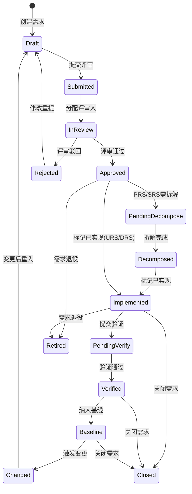
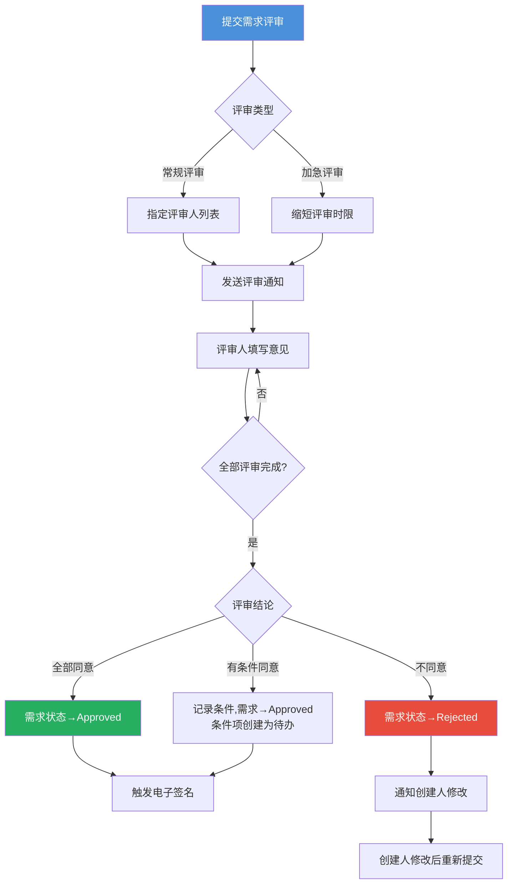
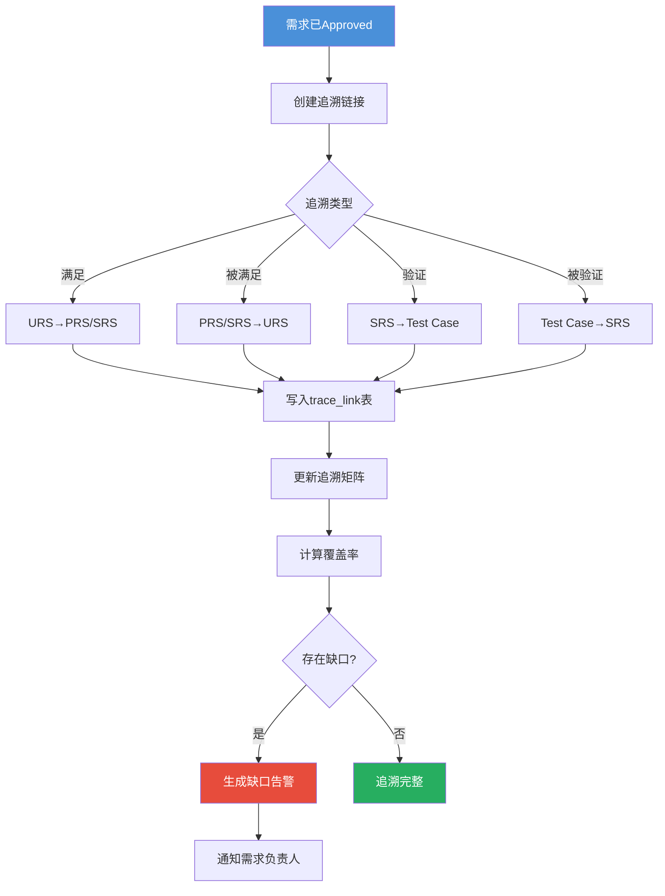
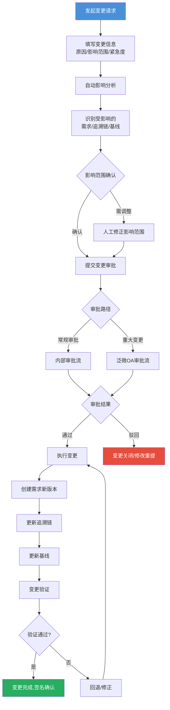
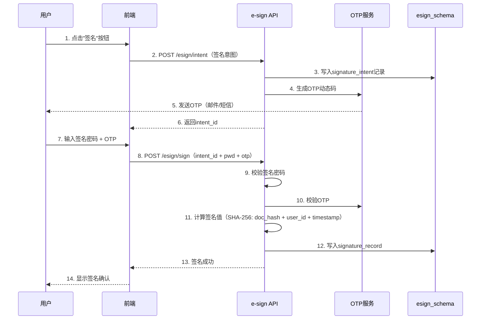
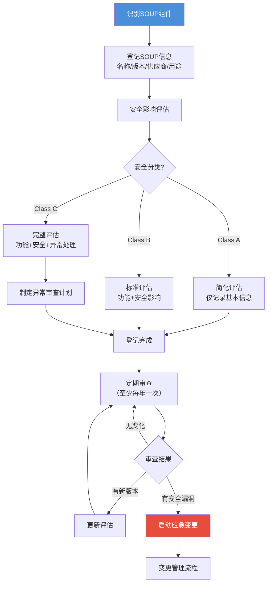
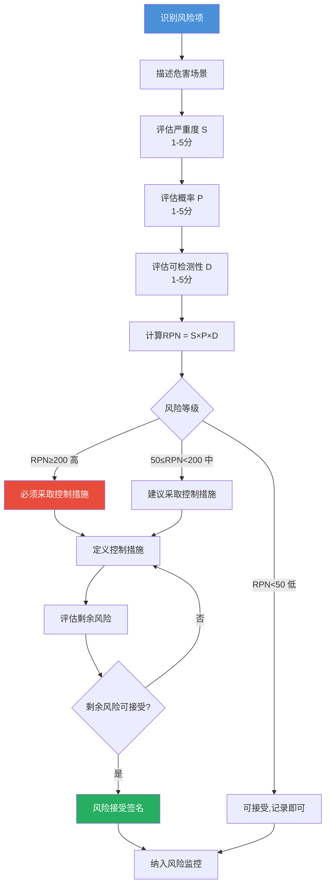
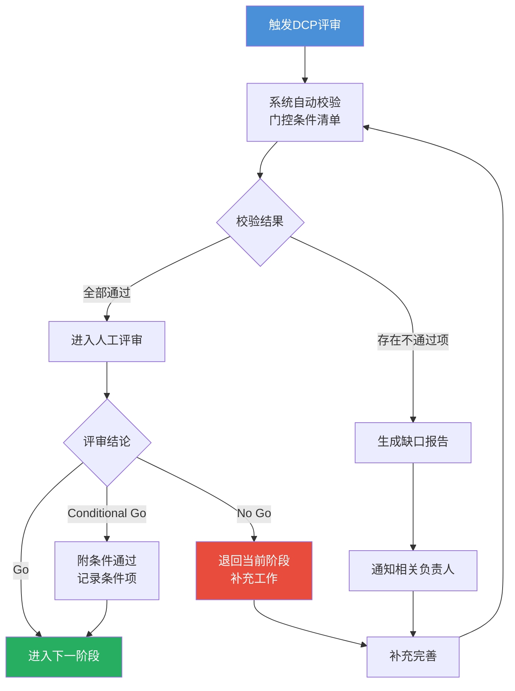
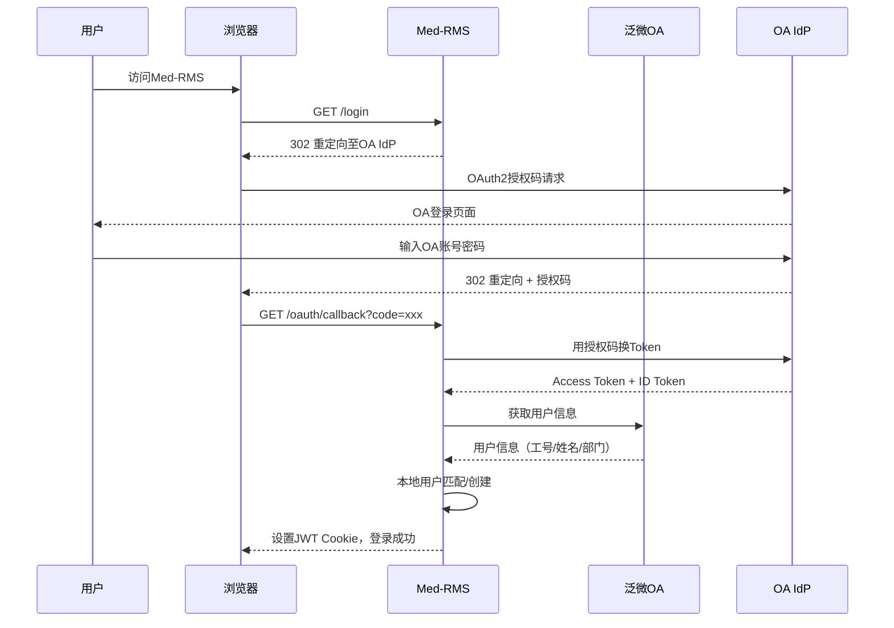
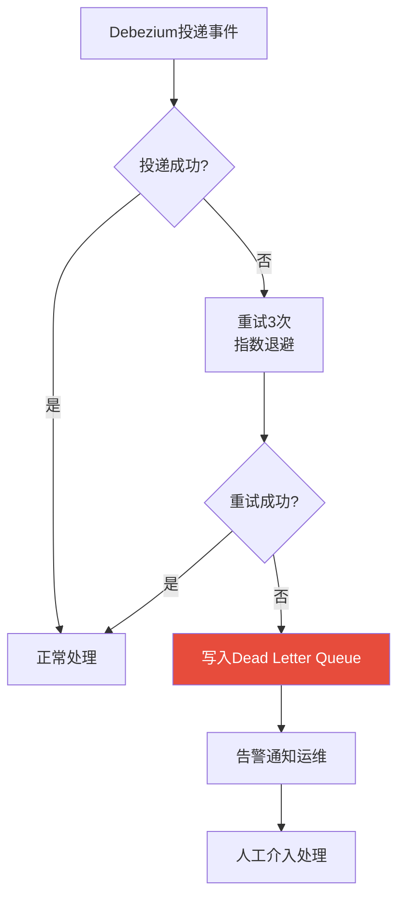

# Med-RMS 软件概要设计 — 核心业务流程设计

> 文档版本：v1.1 | 编制日期：2026-05-22 | 最后修订：2026-05-22 | 基线：PRD v2.1 + 系统架构 v1.1

---

## 1. 需求生命周期流程

### 1.1 需求状态机



> **层级特有状态说明**（C-03修订）：
> - **PendingDecompose（待拆解）**：仅PRS/SRS层级适用，表示需求需要拆解为下级子需求
> - **Decomposed（已拆解）**：仅PRS/SRS层级适用，表示已创建下级追溯链接
> - **PendingVerify（待验证）**：仅SRS/DRS层级适用，表示需要提交验证证据
> - **Baseline（已基线化）**：所有层级适用，表示需求已纳入已锁定基线
> - **Changed（已变更）**：所有层级适用，基线化后触发变更时进入

### 1.2 状态定义与触发条件

| 状态 | 含义 | 进入触发条件 | 退出条件 | 适用层级 | 可执行操作 |
|------|------|-------------|----------|----------|-----------|
| Draft | 草稿 | 创建需求 / 驳回后修改 | 提交评审 | 全部 | 编辑、删除、关联追溯 |
| Submitted | 已提交 | 提交评审 | 分配评审人 | 全部 | 等待（只读） |
| InReview | 评审中 | 分配评审人 | 全部评审完成 | 全部 | 评审人填写意见 |
| Approved | 已批准 | 评审通过且全部同意 | 拆解/标记实现/退役 | 全部 | 关联实现、创建追溯 |
| Rejected | 已驳回 | 评审不通过 | 修改后重提 | 全部 | 查看评审意见 |
| PendingDecompose | 待拆解 | PRS/SRS评审通过 | 完成下级拆解 | PRS/SRS | 创建下级需求、建立追溯 |
| Decomposed | 已拆解 | 下级需求全部创建 | 标记实现 | PRS/SRS | 编辑追溯、标记实现 |
| Implemented | 已实现 | 标记实现完成 | 提交验证/退役 | 全部 | 提交验证 |
| PendingVerify | 待验证 | 提交验证证据 | 验证通过 | SRS/DRS | 上传验证证据 |
| Verified | 已验证 | 验证通过 | 纳入基线/关闭 | 全部 | 签名确认 |
| Baseline | 已基线化 | 纳入已锁定基线 | 触发变更/关闭 | 全部 | 只读查看 |
| Changed | 已变更 | 基线化后触发变更 | 变更完成后回到Draft | 全部 | 查看变更进度 |
| Closed | 已关闭 | 关闭操作 | — | 全部 | 只读查看 |
| Retired | 已退役 | 退役操作 | — | 全部 | 只读查看 |

### 1.3 需求编号规则

> **编号格式**（C-02修订，对齐PRD定义）：`{层级前缀}-{项目编号}-{序号}`
> - URS层级：`URS-{项目编号}-{0001}`
> - PRS层级：`PRS-{项目编号}-{0001}`
> - SRS层级：`SRS-{项目编号}-{0001}`
> - DRS层级：`DRS-{项目编号}-{0001}`
>
> 序号按层级独立递增，项目编号从项目表获取。

### 1.4 DCP 门控校验规则

| 状态转换 | DCP 校验 | 校验内容 |
|----------|----------|----------|
| Draft → Submitted | DCP2 检查 | URS 是否已填写完整（标题+描述+优先级+来源+验收标准） |
| InReview → Approved | DCP3 检查 | PRS/SRS 是否已关联下游追溯；PRS是否已拆解为SRS；SRS追溯覆盖率≥80% |
| Approved → Implemented | DCP4 前置 | 实现说明是否填写；DRS是否已创建 |
| Implemented → PendingVerify | DCP4 检查 | 验证证据是否上传；验证方法是否指定 |
| Verified → Baseline | DCP5 前置 | 追溯链是否完整（无缺口），签名是否完成，基线锁定签名是否就位 |
| Baseline → Closed | DCP5 检查 | 追溯覆盖率≥95%，全部签名完成，审计日志完整 |

---

## 2. 需求评审流程

### 2.1 评审主流程



### 2.2 评审异常分支

| 异常场景 | 处理方式 | 状态影响 |
|----------|----------|----------|
| 评审人超时未响应 | 超过评审时限（默认3工作日）自动提醒，超时7天可由管理员跳过 | InReview 不变，记录超时 |
| 评审人无法评审 | 评审人主动退出，创建人重新分配 | InReview 不变 |
| 评审轮次超过3轮 | 强制升级至QA经理仲裁 | InReview → 仲裁中 |
| 评审期间需求被修改 | 评审作废，需重新发起 | InReview → Draft → 重新Submitted |
| 评审人意见冲突 | 需评审组长裁决 | InReview 等待裁决 |

---

## 3. 追溯管理流程

### 3.1 追溯链建立流程



### 3.2 追溯覆盖率计算规则

| 覆盖率类型 | 计算公式 | 合规阈值 |
|------------|----------|----------|
| 下游覆盖率 | `有下游链接的需求数 / 总需求数 × 100%` | ≥ 95%（Class B/C） |
| 上游覆盖率 | `有上游链接的需求数 / 总需求数 × 100%` | ≥ 95%（Class B/C） |
| 验证覆盖率 | `有验证链接的SRS数 / 总SRS数 × 100%` | 100%（Class C） |
| 端到端覆盖率 | `完整链路URS→SRS→TC的URS数 / 总URS数 × 100%` | ≥ 90%（Class B） |

---

## 4. 变更管理流程

### 4.1 变更请求主流程



### 4.2 影响分析自动化规则

| 规则 | 描述 |
|------|------|
| 下游传播 | 变更一个URS，自动标记所有关联的PRS/SRS/DRS为"受影响" |
| 追溯链标记 | 受影响需求关联的追溯链接标记为"待验证" |
| 基线影响 | 检查受影响需求是否属于已锁定基线，若是则需基线解锁审批 |
| 风险评估 | 根据受影响需求数量和安全分类，自动计算变更风险等级 |
| 测试影响 | 标记受影响的验证记录，提醒需重新验证 |

### 4.3 变更分类与审批路径

| 变更类型 | 定义 | 审批路径 | 电子签名 |
|----------|------|----------|----------|
| 重大变更 | 影响安全分类/合规要求/已发布基线 | 泛微OA审批 → QA经理 → 研发总监 | 需要（3人签名） |
| 一般变更 | 影响功能行为但不影响安全 | 内部审批 → 项目经理 → QA | 需要（2人签名） |
| 文档变更 | 仅文档措辞/格式修改 | 内部审批 → 评审人 | 可选（1人签名） |
| 紧急变更 | 生产环境紧急修复 | 先执行后补审批（24h内） | 必须（3人签名+事后评审） |

---

## 5. 电子签名流程

### 5.1 签名认证流程



### 5.2 签名值计算规则

> **统一规范**（m-03修订）：以下为全系统唯一签名值计算方式，所有签名场景必须遵循。

```
signature_value = SHA-256(
    entity_type       // 签名实体类型（如 Requirement/Baseline/ChangeRequest）
    + "|" + entity_id // 签名实体ID
    + "|" + entity_hash  // 签名实体内容SHA-256哈希（绑定文档内容）
    + "|" + meaning_code // 签名含义编码（approve/confirm/review/release）
    + "|" + signer_id // 签名人ID
    + "|" + timestamp // 签名时间戳（ISO 8601，精度秒）
)
```

> **关键约束**：
> - `entity_hash` 必须是被签名实体的完整内容哈希，确保签名与文档内容绑定
> - `meaning_code` 取自字典 SIGN_INTENT，签名含义不可扩展
> - 此计算方式与03-数据库概要设计 signature_record.document_hash / entity_hash 字段对齐

### 5.3 签名场景映射

| 业务场景 | 签名意图 | 签名人数 | 触发时机 |
|----------|----------|----------|----------|
| 需求评审通过 | review | 至少1位评审人 | 评审结论为"通过"时 |
| 需求批准 | approve | 项目经理/QA | 需求状态→Approved |
| 变更审批 | approve | 审批链各节点 | 变更审批流各环节 |
| 验证确认 | confirm | 验证人 | 需求状态→Verified |
| 基线锁定（第一签） | approve | QA经理 | 基线状态→Locked |
| 基线锁定（第二签） | confirm | 第二签名人（研发经理或更高权限） | 确认基线内容完整性 |
| 发布签署 | approve | 研发总监+QA经理 | DCP5发布门控 |

---

## 6. 合规审计流程

### 6.1 审计日志写入流程

```mermaid
flowchart LR
    A[业务操作] --> B[AOP切面拦截]
    B --> C[提取操作信息\nwho/what/when/why]
    C --> D[计算current_hash\n=SHA-256(prev_hash+payload)]
    D --> E[写入audit_log表\nAPPEND ONLY]
    E --> F[返回业务结果]
    
    style A fill:#4A90D9,color:#fff
    style E fill:#27AE60,color:#fff
```

### 6.2 哈希链校验规则

```
第1条记录: current_hash = SHA-256("GENESIS" + payload_1)
第N条记录: current_hash = SHA-256(prev_hash_N-1 + payload_N)

校验: 逐条计算 current_hash，与存储值比对
篡改检测: 任何一条记录被修改，后续所有记录的hash均不匹配
```

### 6.3 审计日志内容规范（21 CFR Part 11）

| 字段 | 说明 | 示例 |
|------|------|------|
| who | 操作人ID + 姓名 | user_id: U001, name: 张三 |
| what | 操作类型 + 操作对象 | UPDATE: Requirement#R-2026-001 |
| when | 操作时间（ISO 8601） | 2026-05-22T14:30:00+08:00 |
| why | 操作原因（必填） | 变更请求CR-2026-005触发 |
| old_value | 修改前值（JSON） | {"status": "Draft"} |
| new_value | 修改后值（JSON） | {"status": "Approved"} |
| source | 操作来源 | WEB / API / SYSTEM |

---

## 7. SOUP 管理流程

### 7.1 SOUP 登记与评估



---

## 8. 风险管理流程

### 8.1 风险分析主流程



### 8.2 风险矩阵

| | P1（罕见） | P2（不太可能） | P3（可能） | P4（很可能） | P5（频繁） |
|---|---|---|---|---|---|
| **S5（灾难性）** | 中 | 高 | 高 | 高 | 高 |
| **S4（严重）** | 中 | 中 | 高 | 高 | 高 |
| **S3（中度）** | 低 | 中 | 中 | 高 | 高 |
| **S2（轻微）** | 低 | 低 | 中 | 中 | 高 |
| **S1（可忽略）** | 低 | 低 | 低 | 中 | 中 |

---

## 9. IPD 阶段门流程

### 9.1 DCP 门控流程



### 9.2 DCP 门控条件清单

> **M-06修订**：以下门控条件已与PRD §7.1.7对齐，阈值和校验项以PRD为准。

| DCP | 自动校验项 | 人工评审项 |
|-----|-----------|-----------|
| DCP1 | 项目信息完整、团队成员已分配、安全分类已确定 | 可行性评估、市场分析 |
| DCP2 | URS全部Created且验收标准已填写、初始风险已识别、SOUP初始登记完成 | URS质量评审、预算确认 |
| DCP3 | URS→PRS追溯率≥90%、PRS→SRS追溯率≥80%、PRS已拆解、SRS已Approved | 设计评审、测试计划 |
| DCP4 | 追溯覆盖率≥95%、验证记录已签名、DRS已创建且Approved | 验证报告评审、临床评估 |
| DCP5 | 全部需求Closed/Retired、无高风险未关闭、审计日志完整、基线已锁定且双人签名、追溯端到端覆盖率≥90% | 发布审批、法规符合性 |

### 9.3 操作序列强制检查矩阵

> **m-09修订**：以下定义了各业务操作的强制前置条件，系统必须校验后方可执行。

| 操作序列 | 前置条件 | 不满足时行为 |
|----------|----------|-------------|
| 提交评审（Draft→Submitted） | 需求必填字段完整（标题+描述+优先级+来源） | 阻止提交，提示缺失字段 |
| 评审通过（InReview→Approved） | 全部评审人已提交意见 | 阻止通过，提示未完成评审 |
| 标记拆解（Approved→PendingDecompose） | PRS/SRS层级且有下游需求类型 | 阻止，提示不适用层级 |
| 拆解完成（PendingDecompose→Decomposed） | 至少1条下游追溯链接已建立 | 阻止，提示需创建下级需求 |
| 标记实现（Decomposed/Approved→Implemented） | 实现说明已填写 | 阻止，提示需填写实现说明 |
| 提交验证（Implemented→PendingVerify） | SRS/DRS层级 | 阻止，提示层级不适用 |
| 验证通过（PendingVerify→Verified） | 验证证据已上传 | 阻止，提示需上传验证证据 |
| 纳入基线（Verified→Baseline） | 基线已创建且状态为Draft | 阻止，提示需先创建基线 |
| 基线锁定 | 双人签名完成 | 阻止，提示需双人签名 |
| 触发变更（Baseline→Changed） | 变更请求已创建且Approved | 阻止，提示需先通过变更审批 |
| 关闭需求（Baseline→Closed） | 追溯完整、签名完成、无未关闭变更 | 阻止，提示未满足关闭条件 |

---

## 10. 泛微 OA 集成流程

### 10.1 SSO 登录流程



### 10.2 审批流同步

| 场景 | 方向 | 通信方式 | 说明 |
|------|------|----------|------|
| 发起审批 | Med-RMS → OA | REST API | 创建OA审批流程，传递变更/签名信息 |
| 审批状态回调 | OA → Med-RMS | Webhook | OA审批完成后回调Med-RMS |
| 审批进度查询 | Med-RMS → OA | REST API | 轮询审批状态（兜底机制） |
| 组织架构同步 | OA → Med-RMS | 定时任务 | 每日同步部门/人员变更 |

---

## 11. 异常与补偿流程

### 11.1 事件投递失败补偿



### 11.2 事务补偿策略

| 场景 | 补偿策略 |
|------|----------|
| 签名成功但状态更新失败 | 签名记录标记为"孤立"，定时任务清理 |
| Outbox写入失败 | 业务操作整体回滚（同一事务） |
| OA审批回调超时 | 定时轮询补偿（每5分钟，最多24小时） |
| 组织架构同步失败 | 记录失败，下次同步时增量补偿 |
| 基线锁定期间修改尝试 | 拦截并提示"基线已锁定，需先解锁" |

---

## 12. 全局状态变更汇总

| 实体 | 状态字段 | 状态值域 | 变更触发者 |
|------|----------|----------|-----------|
| Requirement | status | Draft/Submitted/InReview/Approved/Rejected/PendingDecompose/Decomposed/Implemented/PendingVerify/Verified/Baseline/Changed/Closed/Retired | req-mgr |
| ChangeRequest | status | Draft/Analyzing/PendingApproval/Approved/Rejected/Executing/Completed/Cancelled | chg-mgr |
| TraceLink | status | Active/Suspended/Deleted | trace-mgr |
| RiskItem | status | Identified/Analyzed/Controlled/Accepted/Closed | risk-mgr |
| AuditLog | — | APPEND ONLY（无状态，不可修改/删除） | compliance |
| SignatureRecord | status | Pending/Completed/Invalidated | e-sign |
| Baseline | status | Draft/Locked/Unlocked/Archived | compliance |
| Project | status | Active/OnHold/Completed/Archived | proj-mgr |
| IpdGate | status | Pending/Passed/Failed/ConditionalPass | proj-mgr |

---

## 13. QMS 变更记录

> 依据质量管理体系变更控制规范，本节记录文档所有修订历史。

| 版本 | 变更日期 | 变更内容 | 变更原因（评审项） | 修订人 |
|------|----------|----------|-------------------|--------|
| v1.0 | 2026-05-22 | 初始版本 | — | Diana |
| v1.1 | 2026-05-22 | 需求状态机补充5个层级特有状态（PendingDecompose/Decomposed/PendingVerify/Baseline/Changed） | C-03：状态机缺少层级特有状态 | Qi |
| v1.1 | 2026-05-22 | 新增§1.3需求编号规则，定义层级前缀编号格式 | C-02：编号格式与PRD不一致 | Qi |
| v1.1 | 2026-05-22 | DCP门控条件清单与PRD §7.1.7对齐，补充追溯率阈值和安全分类要求 | M-06：DCP门控条件与PRD不一致 | Qi |
| v1.1 | 2026-05-22 | 签名值计算规则统一为6字段SHA-256，绑定entity_hash和meaning_code | m-03：签名值计算方式三处定义不一致 | Qi |
| v1.1 | 2026-05-22 | 基线锁定签名场景拆分为双人签名（QA经理+第二签名人） | M-05：基线管理缺少双人签名锁定流程 | Qi |
| v1.1 | 2026-05-22 | 新增§9.3操作序列强制检查矩阵 | m-09：操作序列强制检查规则未体现 | Qi |
| v1.1 | 2026-05-22 | 全局状态变更汇总同步更新（Requirement状态值域） | C-03：配套状态同步 | Qi |
