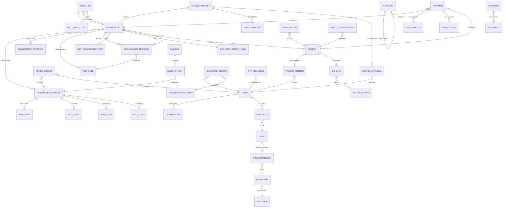

# Med-RMS 软件概要设计 — 数据库概要设计

> 文档版本：v1.2 | 编制日期：2026-05-22 | 最后修订：2026-05-22 | 基线：PRD v2.1 + 系统架构 v1.1

---

## 1. ER 关系总图



---

## 2. 表清单与用途

### 2.1 req_schema（需求管理）

| 表名 | 用途 | 预估行量级 | 核心字段 |
|------|------|-----------|----------|
| requirement | 需求主表（公共属性） | 万级 | id, project_id, req_code, title, type, level, status, priority, source, creator_id, created_at, updated_at |
| requirement_version | 需求版本公共主表（CTI基表） | 十万级 | id, requirement_id, version_no, level(URS/PRS/SRS/DRS), change_summary, created_at, updated_by, updated_at |
| req_v_urs | URS分层子表（用户需求规格） | 万级 | id, version_id, user_scenario, acceptance_criteria, stakeholder, business_context, created_at |
| req_v_prs | PRS分层子表（产品需求规格） | 万级 | id, version_id, functional_desc, performance_criteria, usability_requirements, interface_requirements, created_at |
| req_v_srs | SRS分层子表（软件需求规格） | 万级 | id, version_id, software_function, input_output_spec, data_requirements, constraint_spec, test_criteria, created_at |
| req_v_drs | DRS分层子表（设计需求规格） | 万级 | id, version_id, design_spec, technical_constraint, architecture_decision, implementation_note, created_at |
| requirement_ancestor | 闭包表（需求层级关系） | 十万级 | descendant_id, ancestor_id, depth |
| review_record | 评审记录表 | 十万级 | id, requirement_id, version_id, reviewer_id, round_no, result, comments, signed_at |
| test_case | 测试用例表 | 万级 | id, test_case_no, title, description, test_type, safety_class, pre_condition, test_steps, expected_result, status, project_id, created_by, created_at |
| requirement_testcase | 需求-测试用例关联表 | 万级 | id, requirement_id, test_case_id, trace_type, created_at |
| requirement_tag | 需求标签关联表 | 万级 | id, requirement_id, tag_id |

### 2.2 trace_schema（追溯管理）

| 表名 | 用途 | 预估行量级 | 核心字段 |
|------|------|-----------|----------|
| trace_link | 追溯链接表 | 十万级 | id, source_req_id, target_req_id, trace_type, status, creator_id, created_at |
| trace_matrix_snapshot | 追溯矩阵快照 | 千级 | id, project_id, matrix_data_json, coverage_rate, calculated_at |

### 2.3 chg_schema（变更管理）

| 表名 | 用途 | 预估行量级 | 核心字段 |
|------|------|-----------|----------|
| change_request | 变更请求表 | 千级 | id, project_id, cr_code, title, reason, urgency, change_type, status, initiator_id, created_at |
| impact_analysis | 影响分析表 | 千级 | id, change_request_id, affected_req_id, impact_level, impact_description, confirmed |
| change_approval | 变更审批表 | 千级 | id, change_request_id, approver_id, result, comments, oa_process_id, approved_at |
| change_execution | 变更执行记录 | 千级 | id, change_request_id, requirement_id, old_version_id, new_version_id, executed_at |

### 2.4 compliance_schema（合规管理）

| 表名 | 用途 | 预估行量级 | 核心字段 |
|------|------|-----------|----------|
| audit_log | 审计日志表（追加只写） | 百万级 | id, entity_type, entity_id, event_type, operator_id, operator_name, old_value_json, new_value_json, reason, prev_hash, current_hash, created_at |
| soup_record | SOUP 登记表 | 千级 | id, project_id, name, version, supplier, purpose, license, safety_class, status(active/deprecated/retired/anomaly_reviewed), related_req_ids, last_review_date, review_result, anomaly_review_record, created_at, updated_by, updated_at |
| safety_classification | 安全分类表 | 百级 | id, project_id, class_level(A/B/C), justification, classified_by, classified_at |
| baseline | 基线表 | 百级 | id, project_id, name, description, status(Draft/Locked/Unlocked/Archived), locked_by, locked_at, lock_signature_id, second_locker_id, second_lock_signature_id, comparison_algorithm(md5/sha256), created_at, updated_by, updated_at |
| baseline_item | 基线条目表 | 万级 | id, baseline_id, requirement_id, version_id, included_at |
| regulatory_mapping | 法规映射表 | 千级 | id, regulation_code, clause, system_function, compliance_status, remarks |
| problem_report | 问题报告表 | 千级 | id, project_id, pr_code, title, description, source(internal/external/regulatory), severity(CRITICAL/MAJOR/MINOR), status(Open/Analyzing/Correcting/Verifying/Closed), related_req_id, related_soup_id, root_cause, corrective_action, reporter_id, owner_id, reported_at, closed_at, created_at, updated_by, updated_at |
| pr_correction | 纠正措施表 | 千级 | id, problem_report_id, action_type(corrective/preventive), description, assignee_id, due_date, status(Pending/InProgress/Completed), completed_at, created_at |
| iec62304_checklist | IEC 62304合规检查清单 | 百级 | id, project_id, clause_no, clause_title, compliance_status(compliant/partial/non_compliant/not_applicable), evidence, gaps, assessor_id, assessed_at, created_at, updated_by, updated_at |

### 2.5 esign_schema（电子签名）

| 表名 | 用途 | 预估行量级 | 核心字段 |
|------|------|-----------|----------|
| signature_intent | 签名意图表 | 万级 | id, entity_type, entity_id, intent, requester_id, created_at, expires_at |
| signature_record | 签名记录表 | 万级 | id, signature_id, intent_id, signer_id, signer_name, meaning_code, signature_value, document_hash, entity_hash, auth_method(password/otp/both), ip_address, is_valid, intent_reason, signed_at, status |
| otp_challenge | OTP挑战表 | 万级 | id, user_id, challenge_code, channel(email/sms), expires_at, used, created_at |
| outbox | 事务性发件箱表 | 十万级 | id, aggregate_type, aggregate_id, event_type, payload_json, created_at, published, published_at |
| jwt_blacklist | JWT黑名单表 | 十万级 | id, jti, user_id, expires_at, revoked_at, reason, created_at |

### 2.6 risk_schema（风险管理）

| 表名 | 用途 | 预估行量级 | 核心字段 |
|------|------|-----------|----------|
| risk_item | 风险项表 | 千级 | id, project_id, req_id, title, hazard_scenario, status, created_by, created_at |
| risk_analysis | 风险分析表 | 千级 | id, risk_item_id, severity(S1-S5), probability(P1-P5), detectability(D1-D5), rpn, risk_level, analyzed_by, analyzed_at |
| risk_control | 风险控制措施表 | 千级 | id, risk_item_id, control_type, description, related_req_id, residual_rpn, effectiveness |
| risk_monitor | 风险监控记录 | 千级 | id, risk_item_id, monitor_date, status_change, remarks, monitored_by |

### 2.7 proj_schema（项目管理）

| 表名 | 用途 | 预估行量级 | 核心字段 |
|------|------|-----------|----------|
| project | 项目表 | 百级 | id, name, code, description, status, start_date, end_date, safety_class, created_by, created_at |
| project_member | 项目成员表 | 千级 | id, project_id, user_id, role_in_project, joined_at |
| ipd_gate | IPD阶段门表 | 百级 | id, project_id, dcp_stage(DCP1-5), status, review_date, review_result, reviewer_id |
| deliverable | 交付物表 | 千级 | id, project_id, gate_id, name, type, status, related_req_ids, submitted_at |

### 2.8 report_schema（报表仪表盘）

| 表名 | 用途 | 预估行量级 | 核心字段 |
|------|------|-----------|----------|
| dashboard_config | 仪表盘配置表 | 十级 | id, user_id, layout_json, widgets_json, updated_at |
| statistics_snapshot | 统计快照表（CQRS Lite） | 万级 | id, project_id, metric_type, metric_key, metric_value, dimension_json, calculated_at |
| report_template | 报告模板表 | 十级 | id, name, type, template_config_json, created_at |

### 2.9 sys_schema（系统管理）

| 表名 | 用途 | 预估行量级 | 核心字段 |
|------|------|-----------|----------|
| user | 用户表 | 千级 | id, username, real_name, email, phone, password_hash, esign_password_hash, status, oa_user_id, created_at |
| role | 角色表 | 十级 | id, role_code, role_name, description, built_in |
| permission | 权限表 | 百级 | id, perm_code, perm_name, perm_type(menu/button/api), parent_id |
| resource | 资源表 | 百级 | id, resource_code, resource_name, resource_type, path |
| user_role | 用户角色关联表 | 千级 | id, user_id, role_id, granted_by, granted_at |
| role_permission | 角色权限关联表 | 千级 | id, role_id, permission_id |
| organization | 组织架构表 | 百级 | id, parent_id, org_name, org_code, org_type(department/team), oa_org_id |
| dict_type | 字典类型表 | 百级 | id, dict_code, dict_name, category(system/business), status |
| dict_entry | 字典项表 | 千级 | id, dict_type_id, entry_code, entry_label, sort_order, status |
| sys_config | 系统配置表 | 百级 | id, config_key, config_value, config_type, description |
| operation_log | 操作日志表 | 十万级 | id, user_id, module, action, method, params, ip, duration, created_at |
| login_log | 登录日志表 | 十万级 | id, user_id, login_type, ip, location, browser, os, status, created_at |

---

## 3. 跨 Schema 关联关系

> **原则**：跨模块引用仅存储目标实体的 ID（弱引用），不建立外键约束。通过领域事件保证最终一致性。

| 源 Schema | 源表 | 目标 Schema | 目标表 | 关联方式 | 说明 |
|-----------|------|-------------|--------|----------|------|
| req_schema | requirement | proj_schema | project | project_id | 需求归属项目 |
| req_schema | test_case | proj_schema | project | project_id | 测试用例归属项目 |
| req_schema | requirement_testcase | req_schema | requirement | requirement_id | 需求-测试用例关联 |
| req_schema | review_record | sys_schema | user | reviewer_id | 评审人 |
| trace_schema | trace_link | req_schema | requirement | source/target_req_id | 追溯源/目标 |
| chg_schema | change_request | req_schema | requirement | affected_req_id | 变更影响需求 |
| chg_schema | impact_analysis | req_schema | requirement | affected_req_id | 影响分析 |
| chg_schema | change_approval | sys_schema | user | approver_id | 审批人 |
| compliance_schema | baseline_item | req_schema | requirement_version | version_id | 基线引用版本 |
| compliance_schema | soup_record | proj_schema | project | project_id | SOUP归属项目 |
| esign_schema | signature_record | sys_schema | user | signer_id | 签名人 |
| risk_schema | risk_item | req_schema | requirement | req_id | 风险关联需求 |
| risk_schema | risk_item | proj_schema | project | project_id | 风险归属项目 |
| proj_schema | project_member | sys_schema | user | user_id | 成员 |
| sys_schema | user | sys_schema | organization | org_id | 用户归属部门 |

---

## 4. 枚举与字典表设计

### 4.1 系统级字典（dict_type.category = 'system'）

| 字典编码 | 字典名称 | 字典项 |
|----------|----------|--------|
| REQ_TYPE | 需求类型 | URS, PRS, SRS, DRS |
| REQ_LEVEL | 需求层级 | L1-用户需求, L2-产品需求, L3-系统需求, L4-设计需求 |
| REQ_STATUS | 需求状态 | Draft, PendingDecompose, Decomposed, Submitted, InReview, Approved, Rejected, PendingVerify, Implemented, Verified, Baseline, Changed, Closed, Retired |
| REQ_PRIORITY | 需求优先级 | MUST-必须, SHOULD-应该, COULD-可以, WONT-暂不 |
| REQ_SOURCE | 需求来源 | 用户需求, 法规要求, 标准/指南, 风险控制, 市场反馈, 内部改进, 客户投诉, 临床评价, 审评意见 |
| TRACE_TYPE | 追溯类型 | satisfies, satisfied_by, verifies, verified_by |
| CHG_TYPE | 变更类型 | MAJOR-重大, NORMAL-一般, DOCUMENT-文档, EMERGENCY-紧急 |
| CHG_STATUS | 变更状态 | Draft, Analyzing, PendingApproval, Approved, Rejected, Executing, Completed, Cancelled |
| CHG_URGENCY | 变更紧急度 | HIGH, MEDIUM, LOW |
| RISK_LEVEL | 风险等级 | HIGH, MEDIUM, LOW |
| SAFETY_CLASS | 安全分类 | A, B, C |
| BASELINE_STATUS | 基线状态 | Draft, Locked, Unlocked, Archived |
| DCP_STAGE | DCP阶段 | DCP1, DCP2, DCP3, DCP4, DCP5 |
| SIGN_INTENT | 签名意图 | approve, confirm, review, release |
| IMPACT_LEVEL | 影响等级 | CRITICAL, MAJOR, MINOR, NONE |
| PROJECT_STATUS | 项目状态 | Active, OnHold, Completed, Archived |

### 4.2 业务级字典（dict_type.category = 'business'）

| 字典编码 | 字典名称 | 说明 |
|----------|----------|------|
| SOUP_LICENSE | SOUP许可证类型 | MIT, Apache-2.0, GPL, LGPL, BSD, Commercial, Other |
| REVIEW_RESULT | 评审结论 | APPROVED, CONDITIONAL, REJECTED |
| CONTROL_TYPE | 控制措施类型 | DESIGN-设计控制, PROCESS-过程控制, INFORMATION-信息控制 |
| REPORT_TYPE | 报告类型 | TRACEABILITY, CHANGE, RISK, COMPLIANCE, PROJECT |
| NOTIFY_CHANNEL | 通知渠道 | EMAIL, SMS, IN_APP, OA |

---

## 5. 索引策略

### 5.1 核心索引

| Schema | 表名 | 索引名 | 索引字段 | 类型 | 说明 |
|--------|------|--------|----------|------|------|
| req_schema | requirement | idx_req_project_status | project_id, status | B-tree | 项目下按状态筛选 |
| req_schema | requirement | idx_req_code | req_code | UNIQUE | 需求编号唯一 |
| req_schema | requirement | idx_req_creator | creator_id, created_at | B-tree | 我的创建+时间排序 |
| req_schema | requirement_version | idx_ver_req_level | requirement_id, level | B-tree | 需求下按层级查版本 |
| req_schema | req_v_urs | idx_urs_version | version_id | UNIQUE | URS子表版本唯一 |
| req_schema | req_v_prs | idx_prs_version | version_id | UNIQUE | PRS子表版本唯一 |
| req_schema | req_v_srs | idx_srs_version | version_id | UNIQUE | SRS子表版本唯一 |
| req_schema | req_v_drs | idx_drs_version | version_id | UNIQUE | DRS子表版本唯一 |
| req_schema | requirement_ancestor | idx_ancestor_desc_anc | descendant_id, ancestor_id | UNIQUE | 防止重复祖先-后代关系 |
| req_schema | requirement_ancestor | idx_ancestor_anc | ancestor_id | B-tree | 查子孙节点 |
| req_schema | requirement_ancestor | idx_ancestor_desc_depth | descendant_id, depth | B-tree | 查祖先节点（含深度） |
| req_schema | review_record | idx_review_req_round | requirement_id, round_no | B-tree | 评审轮次查询 |
| req_schema | test_case | idx_tc_no | test_case_no | UNIQUE | 测试用例编号唯一 |
| req_schema | test_case | idx_tc_project_status | project_id, status | B-tree | 项目下按状态筛选 |
| req_schema | requirement_testcase | idx_rtc_req | requirement_id | B-tree | 按需求查测试用例 |
| req_schema | requirement_testcase | idx_rtc_tc | test_case_id | B-tree | 按测试用例查需求 |
| trace_schema | trace_link | idx_trace_source | source_req_id | B-tree | 查下游追溯 |
| trace_schema | trace_link | idx_trace_target | target_req_id | B-tree | 查上游追溯 |
| trace_schema | trace_link | idx_trace_type_status | trace_type, status | B-tree | 按类型和状态筛选 |
| chg_schema | change_request | idx_chg_project | project_id, status | B-tree | 项目变更列表 |
| chg_schema | impact_analysis | idx_impact_chg | change_request_id | B-tree | 变更影响列表 |
| compliance_schema | audit_log | idx_audit_entity | entity_type, entity_id | B-tree | 按实体查审计日志 |
| compliance_schema | audit_log | idx_audit_operator | operator_id, created_at | B-tree | 操作人审计查询 |
| compliance_schema | audit_log | idx_audit_time | created_at | BRIN | 时间范围查询（BRIN更高效） |
| compliance_schema | audit_log | idx_audit_hash | current_hash | UNIQUE | 哈希链校验 |
| compliance_schema | baseline_item | idx_baseline_req | baseline_id, requirement_id | B-tree | 基线内查需求 |
| esign_schema | signature_record | idx_sign_entity | entity_type, entity_id | B-tree | 按实体查签名 |
| esign_schema | otp_challenge | idx_otp_user_expired | user_id, expires_at | B-tree | OTP校验查询 |
| risk_schema | risk_item | idx_risk_project | project_id, status | B-tree | 项目风险列表 |
| report_schema | statistics_snapshot | idx_stat_metric | project_id, metric_type, metric_key | B-tree | 统计指标查询 |
| sys_schema | user | idx_user_username | username | UNIQUE | 登录查询 |
| sys_schema | user | idx_user_email | email | UNIQUE | 邮箱查询 |
| sys_schema | user_role | idx_ur_user | user_id | B-tree | 用户角色查询 |
| sys_schema | role_permission | idx_rp_role | role_id | B-tree | 角色权限查询 |
| sys_schema | dict_entry | idx_dict_type | dict_type_id, sort_order | B-tree | 字典项查询 |
| sys_schema | operation_log | idx_oplog_user_time | user_id, created_at | B-tree | 操作日志查询 |

### 5.2 索引设计原则

| 原则 | 说明 |
|------|------|
| 审计日志时序索引 | audit_log 使用 BRIN 索引（Block Range Index），适合追加只写表的时序查询 |
| 闭包表索引 | requirement_ancestor 组合唯一键(ancestor_id, descendant_id)防重复，分别对 ancestor 和 descendant+depth 建索引，支持双向遍历 |
| 避免过度索引 | 仅对高频查询和列表筛选字段建索引，单表索引不超过6个 |
| 部分索引 | 对已删除/归档数据使用 PostgreSQL 部分索引（WHERE status != 'Deleted'） |

---

## 6. 数据库触发器

### 6.1 audit_log 保护触发器

```sql
-- 阻止 UPDATE
CREATE OR REPLACE FUNCTION compliance_schema.fn_prevent_audit_update()
RETURNS TRIGGER AS $$
BEGIN
    RAISE EXCEPTION 'Audit log records are immutable: UPDATE not allowed';
    RETURN NULL;
END;
$$ LANGUAGE plpgsql;

CREATE TRIGGER trg_prevent_audit_update
    BEFORE UPDATE ON compliance_schema.audit_log
    FOR EACH ROW EXECUTE FUNCTION compliance_schema.fn_prevent_audit_update();

-- 阻止 DELETE
CREATE OR REPLACE FUNCTION compliance_schema.fn_prevent_audit_delete()
RETURNS TRIGGER AS $$
BEGIN
    RAISE EXCEPTION 'Audit log records are immutable: DELETE not allowed';
    RETURN NULL;
END;
$$ LANGUAGE plpgsql;

CREATE TRIGGER trg_prevent_audit_delete
    BEFORE DELETE ON compliance_schema.audit_log
    FOR EACH ROW EXECUTE FUNCTION compliance_schema.fn_prevent_audit_delete();
```

### 6.2 需求编号自动生成触发器

> **编号格式**：`{层级前缀}-{项目编号}-{序号}`，与PRD定义一致。
> 层级前缀：URS→`URS`，PRS→`PRS`，SRS→`SRS`，DRS→`DRS`

```sql
CREATE OR REPLACE FUNCTION req_schema.fn_auto_req_code()
RETURNS TRIGGER AS $$
DECLARE
    v_prefix TEXT;
    v_project_code TEXT;
BEGIN
    IF NEW.req_code IS NULL THEN
        -- 根据level确定层级前缀
        CASE NEW.level
            WHEN 'URS' THEN v_prefix := 'URS';
            WHEN 'PRS' THEN v_prefix := 'PRS';
            WHEN 'SRS' THEN v_prefix := 'SRS';
            WHEN 'DRS' THEN v_prefix := 'DRS';
            ELSE v_prefix := 'REQ';
        END CASE;
        -- 获取项目编号
        SELECT code INTO v_project_code FROM proj_schema.project WHERE id = NEW.project_id;
        -- 生成编号：层级前缀-项目编号-序号
        NEW.req_code := v_prefix || '-' || COALESCE(v_project_code, 'TMP') || '-' ||
                        lpad(nextval('req_schema.seq_req_code')::text, 4, '0');
    END IF;
    RETURN NEW;
END;
$$ LANGUAGE plpgsql;
```

---

## 7. 分库分表策略

### 7.1 当前策略：Schema 隔离（单库多Schema）

```
PostgreSQL Instance
├── req_schema        -- 需求管理
├── trace_schema      -- 追溯管理
├── chg_schema        -- 变更管理
├── compliance_schema -- 合规管理
├── esign_schema      -- 电子签名
├── risk_schema       -- 风险管理
├── proj_schema       -- 项目管理
├── report_schema     -- 报表仪表盘
└── sys_schema        -- 系统管理
```

**优势**：同一数据库实例，跨Schema查询简单（需显式指定Schema），事务一致性容易保证。

### 7.2 演进路线：微服务拆分

当单实例性能不足时，按模块拆分为独立数据库实例：

| 阶段 | 拆分策略 | 说明 |
|------|----------|------|
| Phase 1（当前） | 单库多Schema | 模块间通过Schema隔离，开发阶段足够 |
| Phase 2 | 核心域独立实例 | req_schema, compliance_schema 独立部署 |
| Phase 3 | 全拆微服务 | 每个Schema独立数据库实例，跨库通过事件+API |

### 7.3 大表分区策略

| 表名 | 分区策略 | 分区键 | 说明 |
|------|----------|--------|------|
| audit_log | 按时间范围分区（月） | created_at | 百万级追加只写表，按月分区便于归档 |
| operation_log | 按时间范围分区（月） | created_at | 同上 |
| login_log | 按时间范围分区（月） | created_at | 同上 |
| statistics_snapshot | 按时间范围分区（季） | calculated_at | 历史快照按季度归档 |

---

## 8. 数据归档与保留策略

| 数据类别 | 在线保留 | 归档策略 | 删除策略 |
|----------|----------|----------|----------|
| 审计日志（audit_log） | 永久在线 | 不归档（法规要求永久保留） | 永不删除 |
| 签名记录（signature_record） | 永久在线 | 不归档（21 CFR Part 11） | 永不删除 |
| 需求数据 | 永久在线 | 项目归档后标记只读 | 永不删除 |
| 变更数据 | 永久在线 | 项目归档后标记只读 | 永不删除 |
| 追溯数据 | 永久在线 | 项目归档后标记只读 | 永不删除 |
| 统计快照 | 2年在线 | 超过2年归档至对象存储 | 超过5年可删除 |
| 操作日志 | 1年在线 | 超过1年归档 | 超过3年可删除 |
| 登录日志 | 6个月在线 | 超过6个月归档 | 超过1年可删除 |
| OTP挑战 | 7天在线 | 不归档 | 超过7天自动清理 |

---

## 9. Redis 缓存策略

| 缓存Key模式 | 数据类型 | TTL | 说明 |
|-------------|----------|-----|------|
| `dict:{dict_code}` | Hash | 24h | 数据字典缓存 |
| `user:perms:{user_id}` | Set | 30min | 用户权限集合 |
| `user:info:{user_id}` | Hash | 1h | 用户基本信息 |
| `org:tree` | String(JSON) | 1h | 组织架构树 |
| `req:status:{req_id}` | String | 5min | 需求状态（高频读取） |
| `esign:otp:{user_id}` | String | 5min | OTP动态码 |
| `report:snapshot:{project_id}:{metric}` | String(JSON) | 15min | 仪表盘统计快照 |
| `rate_limit:{user_id}:{api}` | String | 1min | API限流计数 |

---

## 10. QMS 变更记录

> 依据质量管理体系变更控制规范，本节记录文档所有修订历史。

| 版本 | 变更日期 | 变更内容 | 变更原因（评审项） | 修订人 |
|------|----------|----------|-------------------|--------|
| v1.0 | 2026-05-22 | 初始版本 | — | Diana |
| v1.1 | 2026-05-22 | ER图新增4张CTI分层子表（req_v_urs/prs/srs/drs） | C-01：requirement_version单表+content_json与系统架构CTI方案偏离 | Qi |
| v1.1 | 2026-05-22 | requirement_version拆分为公共主表+4张分层子表，删除content_json | C-01：需对齐系统架构§6.1的CTI分层子表方案 | Qi |
| v1.1 | 2026-05-22 | 需求编号触发器改为层级前缀格式（URS/PRS/SRS/DRS-{项目编号}-{序号}） | C-02：编号格式与PRD定义不一致 | Qi |
| v1.1 | 2026-05-22 | audit_log的action字段改名为event_type | m-04：审计日志字段命名不统一 | Qi |
| v1.1 | 2026-05-22 | signature_record新增signature_id/meaning_code/entity_hash/auth_method/ip_address/is_valid字段 | M-02：签名数据模型与架构定义不完整 | Qi |
| v1.1 | 2026-05-22 | soup_record新增status/related_req_ids/anomaly_review_record字段 | M-03：SOUP模型缺少关联需求和异常审查记录 | Qi |
| v1.1 | 2026-05-22 | 新增problem_report表和pr_correction表 | M-04：问题报告管理完全缺失 | Qi |
| v1.1 | 2026-05-22 | baseline表新增lock_signature_id/second_locker_id/second_lock_signature_id/comparison_algorithm字段 | M-05：基线管理缺少双人签名锁定和对比算法 | Qi |
| v1.1 | 2026-05-22 | 新增outbox表（事务性发件箱） | M-07：Outbox表定义缺失 | Qi |
| v1.1 | 2026-05-22 | 新增jwt_blacklist表 | M-08：JWT黑名单持久化表缺失 | Qi |
| v1.1 | 2026-05-22 | REQ_PRIORITY枚举从P0~P3改为MoSCoW（MUST/SHOULD/COULD/WONT） | m-02：优先级枚举应对齐PRD的MoSCoW模型 | Qi |
| v1.1 | 2026-05-22 | REQ_STATUS新增Baseline/Changed状态 | C-03：需求状态机缺少层级特有状态 | Qi |
| v1.1 | 2026-05-22 | REQ_SOURCE枚举扩展为9项（新增客户投诉/临床评价/审评意见） | m-08：需求来源枚举与PRD不一致 | Qi |
| v1.1 | 2026-05-22 | 新增iec62304_checklist表 | m-05：IEC 62304合规检查清单缺失 | Qi |
| v1.1 | 2026-05-22 | 新增4张CTI子表索引（idx_urs/prs/srs/drs_version） | C-01：配套索引策略 | Qi |
| v1.1 | 2026-05-22 | requirement_version新增updated_by/updated_at字段；soup_record新增updated_by/updated_at | S-05：核心表缺少审计字段 | Qi |
| v1.2 | 2026-05-22 | 新增test_case表（12字段）和requirement_testcase表（5字段），ER图补充关系，补充4条索引 | C-01遗留：系统架构§6.1.9/§6.1.10测试用例表定义缺失 | Qi |
| v1.2 | 2026-05-22 | requirement_closure改名为requirement_ancestor，删除id和path_length字段，字段改为(descendant_id, ancestor_id, depth)，索引对齐架构§6.1.6 | C-01遗留：闭包表命名和结构与系统架构偏离 | Qi |
| v1.2 | 2026-05-22 | REQ_STATUS枚举补充PendingDecompose/Decomposed/PendingVerify三个层级特有状态 | M-04遗留：状态机枚举与02-核心业务流程设计§1.2不一致 | Qi |
