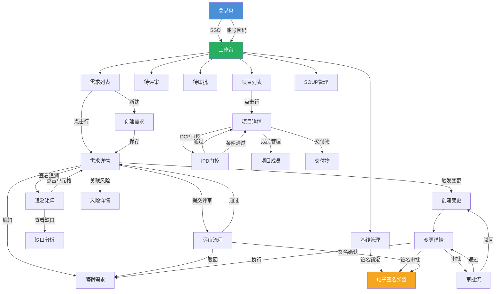

# Med-RMS 软件概要设计 — 页面与菜单结构设计

> 文档版本：v1.1 | 编制日期：2026-05-22 | 最后修订：2026-05-22 | 基线：PRD v2.1 + 系统架构 v1.1

---

## 1. 菜单层级总览

```
Med-RMS
├── 🏠 工作台 (/dashboard)
│
├── 📋 需求管理 (/requirements)
│   ├── 需求列表 (/requirements/list)
│   ├── 需求详情 (/requirements/:id)
│   ├── 创建需求 (/requirements/create)
│   ├── 评审管理 (/requirements/reviews)
│   ├── 需求导入 (/requirements/import)
│   └── 拆解工作台 (/requirements/decompose)
│
├── 🔗 追溯管理 (/traceability)
│   ├── 追溯矩阵 (/traceability/matrix)
│   ├── 追溯链接 (/traceability/links)
│   ├── 覆盖率报告 (/traceability/coverage)
│   └── 缺口分析 (/traceability/gaps)
│
├── 🔄 变更管理 (/changes)
│   ├── 变更请求列表 (/changes/list)
│   ├── 创建变更请求 (/changes/create)
│   ├── 变更详情 (/changes/:id)
│   └── 我的审批 (/changes/approvals)
│
├── ✅ 合规管理 (/compliance)
│   ├── 审计日志 (/compliance/audit-logs)
│   ├── SOUP管理 (/compliance/soup)
│   ├── 安全分类 (/compliance/safety)
│   ├── 基线管理 (/compliance/baselines)
│   ├── 法规映射 (/compliance/regulations)
│   ├── 签名记录 (/compliance/signatures)
│   ├── 问题报告 (/compliance/problem-reports)
│   └── IEC62304检查 (/compliance/iec62304)
│
├── ⚠️ 风险管理 (/risks)
│   ├── 风险登记册 (/risks/register)
│   ├── 风险分析 (/risks/analysis)
│   ├── 风险矩阵 (/risks/matrix)
│   └── 风险监控 (/risks/monitoring)
│
├── 📊 项目管理 (/projects)
│   ├── 项目列表 (/projects/list)
│   ├── 项目详情 (/projects/:id)
│   ├── IPD门控 (/projects/:id/gates)
│   ├── 项目成员 (/projects/:id/members)
│   └── 交付物管理 (/projects/:id/deliverables)
│
├── 📈 报表中心 (/reports)
│   ├── 需求报表 (/reports/requirements)
│   ├── 变更报表 (/reports/changes)
│   ├── 合规报表 (/reports/compliance)
│   ├── 风险报表 (/reports/risks)
│   └── 自定义报表 (/reports/custom)
│
└── ⚙️ 系统管理 (/system)
    ├── 用户管理 (/system/users)
    ├── 角色权限 (/system/roles)
    ├── 组织架构 (/system/organizations)
    ├── 数据字典 (/system/dicts)
    ├── 系统配置 (/system/configs)
    ├── 操作日志 (/system/operation-logs)
    ├── 登录日志 (/system/login-logs)
    └── 通知中心 (/system/notifications)
```

---

## 2. 路由规划

### 2.1 路由表

| 路由路径 | 组件 | 菜单层级 | 权限标识 | 缓存 | 说明 |
|----------|------|----------|----------|------|------|
| `/login` | LoginView | — | — | 否 | 登录页 |
| `/sso/callback` | SsoCallback | — | — | 否 | OA SSO回调 |
| `/dashboard` | DashboardView | 一级 | report:dashboard | 是 | 工作台 |
| `/requirements/list` | ReqListView | 二级 | req:list | 是 | 需求列表 |
| `/requirements/create` | ReqCreateView | 二级 | req:create | 否 | 创建需求 |
| `/requirements/:id` | ReqDetailView | 二级 | req:read | 否 | 需求详情 |
| `/requirements/:id/edit` | ReqEditView | 二级 | req:update | 否 | 编辑需求 |
| `/requirements/reviews` | ReviewListView | 二级 | req:review | 是 | 评审管理 |
| `/requirements/import` | ReqImportView | 二级 | req:import | 否 | 需求导入 |
| `/requirements/decompose` | DecomposeWorkbenchView | 二级 | req:update | 否 | 拆解工作台 |
| `/traceability/matrix` | TraceMatrixView | 二级 | trace:matrix | 否 | 追溯矩阵 |
| `/traceability/links` | TraceLinksView | 二级 | trace:list | 是 | 追溯链接 |
| `/traceability/coverage` | CoverageView | 二级 | trace:coverage | 否 | 覆盖率报告 |
| `/traceability/gaps` | GapAnalysisView | 二级 | trace:gaps | 否 | 缺口分析 |
| `/changes/list` | ChangeListView | 二级 | chg:list | 是 | 变更列表 |
| `/changes/create` | ChangeCreateView | 二级 | chg:create | 否 | 创建变更 |
| `/changes/:id` | ChangeDetailView | 二级 | chg:read | 否 | 变更详情 |
| `/changes/approvals` | MyApprovalsView | 二级 | chg:approve | 是 | 我的审批 |
| `/compliance/audit-logs` | AuditLogView | 二级 | audit:read | 否 | 审计日志 |
| `/compliance/soup` | SoupListView | 二级 | soup:list | 是 | SOUP管理 |
| `/compliance/safety` | SafetyView | 二级 | safety:read | 否 | 安全分类 |
| `/compliance/baselines` | BaselineListView | 二级 | baseline:list | 是 | 基线管理 |
| `/compliance/baselines/:id` | BaselineDetailView | 二级 | baseline:read | 否 | 基线详情 |
| `/compliance/regulations` | RegulationView | 二级 | regulation:read | 否 | 法规映射 |
| `/compliance/signatures` | SignatureListView | 二级 | esign:read | 是 | 签名记录 |
| `/compliance/problem-reports` | ProblemReportListView | 二级 | pr:list | 是 | 问题报告 |
| `/compliance/problem-reports/:id` | ProblemReportDetailView | 二级 | pr:read | 否 | 问题报告详情 |
| `/compliance/iec62304` | Iec62304ChecklistView | 二级 | compliance:iec62304 | 否 | IEC62304检查 |
| `/risks/register` | RiskListView | 二级 | risk:list | 是 | 风险登记册 |
| `/risks/analysis` | RiskAnalysisView | 二级 | risk:analyze | 否 | 风险分析 |
| `/risks/matrix` | RiskMatrixView | 二级 | risk:matrix | 否 | 风险矩阵 |
| `/risks/monitoring` | RiskMonitorView | 二级 | risk:read | 是 | 风险监控 |
| `/projects/list` | ProjectListView | 二级 | proj:list | 是 | 项目列表 |
| `/projects/create` | ProjectCreateView | 二级 | proj:create | 否 | 创建项目 |
| `/projects/:id` | ProjectDetailView | 二级 | proj:read | 否 | 项目详情 |
| `/projects/:id/gates` | GateView | 三级 | proj:gate | 否 | IPD门控 |
| `/projects/:id/members` | MemberView | 三级 | proj:member | 否 | 项目成员 |
| `/projects/:id/deliverables` | DeliverableView | 三级 | proj:read | 否 | 交付物 |
| `/reports/requirements` | ReqReportView | 二级 | report:stats | 否 | 需求报表 |
| `/reports/changes` | ChgReportView | 二级 | report:stats | 否 | 变更报表 |
| `/reports/compliance` | CompReportView | 二级 | report:stats | 否 | 合规报表 |
| `/reports/risks` | RiskReportView | 二级 | report:stats | 否 | 风险报表 |
| `/reports/custom` | CustomReportView | 二级 | report:export | 否 | 自定义报表 |
| `/system/users` | UserListView | 二级 | sys:user:list | 是 | 用户管理 |
| `/system/users/:id` | UserDetailView | 二级 | sys:user:read | 否 | 用户详情 |
| `/system/roles` | RoleListView | 二级 | sys:role:list | 是 | 角色权限 |
| `/system/organizations` | OrgTreeView | 二级 | sys:org:list | 是 | 组织架构 |
| `/system/dicts` | DictListView | 二级 | sys:dict:list | 是 | 数据字典 |
| `/system/configs` | ConfigListView | 二级 | sys:config:list | 是 | 系统配置 |
| `/system/operation-logs` | OpLogView | 二级 | sys:log | 否 | 操作日志 |
| `/system/login-logs` | LoginLogView | 二级 | sys:log | 否 | 登录日志 |
| `/system/notifications` | NotificationListView | 二级 | — | 否 | 通知中心 |

### 2.2 路由守卫规则

| 守卫类型 | 逻辑 | 说明 |
|----------|------|------|
| 全局前置守卫 | 检查JWT Token有效性 | 无Token跳转登录，Token过期尝试Refresh |
| 权限守卫 | 检查路由所需权限标识 | 从Vuex/Pinia获取用户权限集合，无权限跳转403 |
| 项目守卫 | 检查项目访问权限 | 访问项目级页面时校验当前用户是否为项目成员 |
| 基线守卫 | 检查基线锁定状态 | 基线锁定时，编辑类操作自动禁用/拦截 |

---

## 3. 页面跳转关系图



---

## 4. 核心页面布局设计

### 4.1 全局布局

```
┌─────────────────────────────────────────────────────────┐
│  Logo   🔍 全局搜索    通知🔔  签名🔐  用户头像▼      │ ← 顶部导航栏(h:56px)
├────────┬────────────────────────────────────────────────┤
│        │                                                │
│ 📋需求 │                                                │
│ 🔗追溯 │           主内容区域                            │
│ 🔄变更 │                                                │
│ ✅合规 │     ┌──────────────────────────────────┐       │
│ ⚠️风险 │     │  面包屑导航                       │       │
│ 📊项目 │     ├──────────────────────────────────┤       │
│ 📈报表 │     │  页面标题 + 操作按钮              │       │
│ ⚙️系统 │     ├──────────────────────────────────┤       │
│        │     │                                  │       │
│        │     │  页面内容                         │       │
│        │     │                                  │       │
│        │     └──────────────────────────────────┘       │
│        │                                                │
├────────┴────────────────────────────────────────────────┤
│  © 2026 Med-RMS  |  IEC 62304 Compliant                │ ← 底部信息栏(h:32px)
└─────────────────────────────────────────────────────────┘

左侧菜单: w=220px(展开) / 64px(折叠)
```

### 4.2 工作台页面布局

```
┌─────────────────────────────────────────────────────────┐
│  工作台                                    项目: [全部▼] │
├───────────┬───────────┬───────────┬─────────────────────┤
│ 需求总数   │ 待评审     │ 待审批     │ 追溯覆盖率          │
│   1,234   │    12     │    5      │    96.5%            │
│ ↑8 本周   │ ↓3 vs上周 │ →0 vs上周 │ ↑1.2% vs上周       │
├───────────┴───────────┴───────────┴─────────────────────┤
│                                                         │
│  ┌─────────────────────┐  ┌──────────────────────────┐ │
│  │ 需求状态分布          │  │ 变更趋势（近30天）        │ │
│  │ [饼图]               │  │ [折线图]                 │ │
│  │                      │  │                          │ │
│  └─────────────────────┘  └──────────────────────────┘ │
│                                                         │
│  ┌─────────────────────┐  ┌──────────────────────────┐ │
│  │ 我的待办              │  │ 风险TOP5                 │ │
│  │ • 需求R-001 待评审    │  │ 1. [高] 数据丢失风险     │ │
│  │ • 变更CR-003 待审批   │  │ 2. [中] 接口兼容性风险   │ │
│  │ • 基线BL-002 待签名   │  │ 3. [中] 性能瓶颈风险     │ │
│  └─────────────────────┘  └──────────────────────────┘ │
└─────────────────────────────────────────────────────────┘
```

### 4.3 需求详情页布局

```
┌─────────────────────────────────────────────────────────┐
│ ← 返回列表    REQ-2026-001    [编辑] [提交评审] [更多▼] │
├────────────────────────────────┬────────────────────────┤
│                                │                        │
│  基本信息                       │  状态流转               │
│  标题: xxxxxxx                  │  ● Draft ─○ Submitted  │
│  类型: URS    层级: L1          │  ○ InReview ─○ Approved│
│  优先级: P0   来源: 法规        │  ○ Implemented ─○ ...  │
│  项目: 心电图机V7              │                        │
│  创建人: 张三  创建时间: xxx    │  评审记录               │
│                                │  第1轮: 通过 (2/2)     │
│  需求描述                       │  评审人: 李四, 王五     │
│  ┌──────────────────────────┐  │                        │
│  │ 详细描述内容...           │  │  签名记录               │
│  │                          │  │  ✓ 李四 评审确认        │
│  │                          │  │  ✓ 王五 评审确认        │
│  └──────────────────────────┘  │                        │
│                                │  变更历史               │
│  追溯关系                       │  • CR-003 修改 05-20   │
│  上游: URS-002(被满足)          │  • CR-001 修改 05-15   │
│  下游: PRS-001(满足)           │                        │
│        PRS-002(满足)           │                        │
│                                │                        │
├────────────────────────────────┴────────────────────────┤
│  [子需求]  [版本历史]  [附件]  [审计日志]                 │ ← Tab 切换
├─────────────────────────────────────────────────────────┤
│  子需求列表                                              │
│  REQ-2026-002  PRS-001  系统功能需求  Approved  张三     │
│  REQ-2026-003  PRS-002  接口需求      Draft     张三     │
└─────────────────────────────────────────────────────────┘
```

---

## 5. 前端组件映射

### 5.1 业务组件清单

| 组件名 | 所属模块 | 用途 | 使用页面 |
|--------|----------|------|----------|
| ReqTreeSelect | req-mgr | 需求层级树选择器 | 创建/编辑需求、追溯链接 |
| ReqStatusTag | req-mgr | 需求状态标签 | 需求列表、详情 |
| ReviewDialog | req-mgr | 评审弹窗 | 需求详情 |
| TraceMatrixTable | trace-mgr | 追溯矩阵表格 | 追溯矩阵页 |
| TraceLinkEditor | trace-mgr | 追溯链接编辑器 | 追溯链接页 |
| ChangeImpactTree | chg-mgr | 变更影响树 | 变更详情 |
| ApprovalTimeline | chg-mgr | 审批时间线 | 变更详情 |
| ESignDialog | e-sign | 电子签名弹窗 | 所有需签名场景 |
| OtpInput | e-sign | OTP输入组件 | 电子签名弹窗 |
| AuditLogTable | compliance | 审计日志表格 | 审计日志页 |
| SoupForm | compliance | SOUP登记表单 | SOUP管理页 |
| BaselineDiffView | compliance | 基线差异对比视图 | 基线详情 |
| RiskMatrixChart | risk-mgr | 风险矩阵图表 | 风险分析页 |
| RiskRpnGauge | risk-mgr | RPN仪表盘 | 风险详情 |
| GateChecklist | proj-mgr | DCP门控检查清单 | IPD门控页 |
| ProjectKanban | proj-mgr | 项目看板 | 项目详情 |
| StatsCard | report | 统计卡片组件 | 工作台、报表页 |
| TrendChart | report | 趋势图表 | 报表页 |

### 5.2 通用组件清单

| 组件名 | 用途 | 基于Element Plus |
|--------|------|-----------------|
| PageHeader | 页面标题+操作栏 | — |
| SearchForm | 搜索表单 | ElForm + ElInput/ElSelect |
| DataTable | 数据表格 | ElTable + 分页 |
| DetailPanel | 详情侧滑面板 | ElDrawer |
| ConfirmDialog | 确认弹窗 | ElMessageBox |
| ImportDialog | 导入弹窗 | ElDialog + ElUpload |
| ExportButton | 导出按钮 | ElButton + ElDropdown |
| StatusTimeline | 状态时间线 | ElTimeline |
| UserSelect | 用户选择器 | ElSelect + 远程搜索 |
| ProjectSelect | 项目选择器 | ElSelect |
| DictSelect | 字典选择器 | ElSelect + 字典数据 |
| FileUploader | 文件上传 | ElUpload + MinIO |
| HashVerifyBadge | 哈希校验徽章 | — |

---

## 6. 菜单与角色权限映射

### 6.1 菜单可见性矩阵

| 菜单 | 系统管理员 | 项目经理 | 需求工程师 | QA工程师 | 研发工程师 | 评审人 | 签名人 | 只读用户 | 配置管理员 |
|------|-----------|---------|-----------|---------|-----------|--------|--------|---------|-----------|
| 工作台 | ✅ | ✅ | ✅ | ✅ | ✅ | ✅ | ✅ | ✅ | ✅ |
| 需求管理 | ✅ | ✅ | ✅ | ✅ | ✅(只读) | ✅ | ✅(只读) | ✅(只读) | ✅ |
| 追溯管理 | ✅ | ✅ | ✅ | ✅ | ✅(只读) | ✅(只读) | — | ✅(只读) | ✅ |
| 变更管理 | ✅ | ✅ | ✅(发起) | ✅ | ✅(发起) | — | ✅ | ✅(只读) | ✅ |
| 合规管理 | ✅ | ✅(部分) | — | ✅ | — | — | ✅(签名) | ✅(只读) | ✅ |
| 风险管理 | ✅ | ✅ | ✅(只读) | ✅ | ✅(只读) | — | — | ✅(只读) | ✅ |
| 项目管理 | ✅ | ✅ | ✅(成员) | ✅(成员) | ✅(成员) | — | — | — | ✅ |
| 报表中心 | ✅ | ✅ | ✅(部分) | ✅ | ✅(部分) | — | — | ✅(部分) | ✅ |
| 系统管理 | ✅ | — | — | — | — | — | — | — | — |

### 6.2 操作权限矩阵（需求管理示例）

| 操作 | 系统管理员 | 项目经理 | 需求工程师 | QA工程师 | 研发工程师 | 只读用户 |
|------|-----------|---------|-----------|---------|-----------|---------|
| 创建需求 | ✅ | ✅ | ✅ | ✅ | — | — |
| 编辑需求 | ✅ | ✅ | ✅(自己的) | ✅ | — | — |
| 删除需求 | ✅ | — | ✅(自己的Draft) | — | — | — |
| 提交评审 | ✅ | ✅ | ✅ | ✅ | — | — |
| 评审需求 | ✅ | ✅ | — | ✅ | — | — |
| 批准需求 | ✅ | ✅ | — | ✅ | — | — |
| 标记实现 | ✅ | ✅ | — | — | ✅ | — |
| 标记验证 | ✅ | ✅ | — | ✅ | — | — |
| 关闭需求 | ✅ | ✅ | — | ✅ | — | — |
| 触发变更 | ✅ | ✅ | ✅ | ✅ | ✅ | — |
| 导出需求 | ✅ | ✅ | ✅ | ✅ | ✅ | ✅ |
| 查看需求 | ✅ | ✅ | ✅ | ✅ | ✅ | ✅ |

---

## 7. 前端技术架构

### 7.1 技术栈

| 层次 | 技术 | 版本 | 说明 |
|------|------|------|------|
| 框架 | Vue 3 | 3.5.x | Composition API + `<script setup>` |
| UI库 | Element Plus | 2.9.x | 主UI组件库 |
| 状态管理 | Pinia | 2.x | 替代Vuex |
| 路由 | Vue Router | 4.x | History模式 |
| 构建工具 | Vite | 6.x | 开发/构建 |
| HTTP客户端 | Axios | 1.x | 请求拦截、统一错误处理 |
| 图表 | ECharts | 5.x | 报表图表 |
| Mermaid | mermaid.js | 10.x | 流程图/矩阵渲染 |
| CSS | Tailwind CSS | 3.x | 工具类样式 |
| 国际化 | vue-i18n | 9.x | 预留多语言能力 |

### 7.2 项目目录结构

```
src/
├── api/                    # API 请求模块
│   ├── req/               # 需求管理 API
│   ├── trace/             # 追溯管理 API
│   ├── chg/               # 变更管理 API
│   ├── compliance/        # 合规管理 API
│   ├── esign/             # 电子签名 API
│   ├── risk/              # 风险管理 API
│   ├── proj/              # 项目管理 API
│   ├── report/            # 报表 API
│   └── sys/               # 系统管理 API
├── components/            # 通用组件
│   ├── business/          # 业务组件
│   └── common/            # 通用组件
├── composables/           # 组合式函数
│   ├── usePermission.js   # 权限判断
│   ├── usePagination.js   # 分页逻辑
│   └── useEsign.js        # 电子签名
├── layouts/               # 布局组件
│   ├── MainLayout.vue     # 主布局
│   └── BlankLayout.vue    # 空白布局（登录）
├── router/                # 路由配置
│   ├── index.js
│   └── modules/           # 按模块拆分路由
├── stores/                # Pinia 状态
│   ├── user.js            # 用户状态
│   ├── permission.js      # 权限状态
│   └── app.js             # 应用状态
├── styles/                # 全局样式
├── utils/                 # 工具函数
├── views/                 # 页面组件
│   ├── dashboard/
│   ├── requirements/
│   ├── traceability/
│   ├── changes/
│   ├── compliance/
│   ├── risks/
│   ├── projects/
│   ├── reports/
│   └── system/
├── App.vue
└── main.js
```

---

## 8. 页面交互规范

### 8.1 列表页通用规范

| 规范项 | 说明 |
|--------|------|
| 筛选区 | 顶部搜索表单，支持常用条件筛选，高级筛选可展开 |
| 表格 | 斑马纹，固定表头，序号列，操作列右侧固定 |
| 分页 | 右下角分页器，默认20条/页 |
| 排序 | 点击列头排序，支持升序/降序 |
| 行操作 | 操作按钮放最后一列，超过3个收为"更多"下拉 |
| 批量操作 | 表格上方，勾选后激活 |
| 空状态 | 无数据时显示空状态插图+引导文案 |
| 加载态 | 表格骨架屏，按钮loading |

### 8.2 详情页通用规范

| 规范项 | 说明 |
|--------|------|
| 返回 | 左上角返回按钮+面包屑 |
| 操作栏 | 页面标题右侧，主操作按钮+更多下拉 |
| 信息区 | 基本信息卡片，标签式展示 |
| Tab区 | 关联信息用Tab切换，如子需求/版本/附件/审计日志 |
| 侧滑 | 部分关联信息用侧滑面板，不离开当前页 |

### 8.3 表单页通用规范

| 规范项 | 说明 |
|--------|------|
| 布局 | 单列或双列表单，标签宽度统一 |
| 必填 | 红色星号标记 |
| 校验 | 实时校验+提交时统一校验 |
| 保存 | 支持"保存草稿"和"提交"双按钮 |
| 离开确认 | 未保存时离开弹出确认 |
| 字数限制 | 长文本输入框右下角显示"已输入/最大字数" |

### 8.4 电子签名弹窗规范

| 规范项 | 说明 |
|--------|------|
| 触发 | 点击需签名的操作按钮时弹出 |
| 内容 | 签名意图说明 + 签名密码输入 + OTP输入 |
| OTP发送 | 点击"发送验证码"按钮，60秒倒计时 |
| 确认 | 密码+OTP均正确后，签名成功，弹窗关闭 |
| 取消 | 取消签名则操作不执行 |

---

## 9. QMS 变更记录

> 依据质量管理体系变更控制规范，本节记录文档所有修订历史。

| 版本 | 变更日期 | 变更内容 | 变更原因（评审项） | 修订人 |
|------|----------|----------|-------------------|--------|
| v1.0 | 2026-05-22 | 初始版本 | — | Diana |
| v1.1 | 2026-05-22 | 前端技术栈版本对齐：Vue 3.4→3.5, Element Plus 2.7→2.9, Vite 5→6 | m-01：前端版本与系统架构不一致 | Qi |
| v1.1 | 2026-05-22 | 新增拆解工作台菜单项和路由（/requirements/decompose） | S-02：补充拆解工作台页面 | Qi |
| v1.1 | 2026-05-22 | 新增问题报告菜单项和路由（/compliance/problem-reports） | M-04：问题报告管理完全缺失 | Qi |
| v1.1 | 2026-05-22 | 新增IEC62304检查清单菜单项和路由（/compliance/iec62304） | m-05：IEC62304检查清单缺失 | Qi |
| v1.1 | 2026-05-22 | 新增通知中心菜单项和路由（/system/notifications） | S-03：通知机制页面缺失 | Qi |
